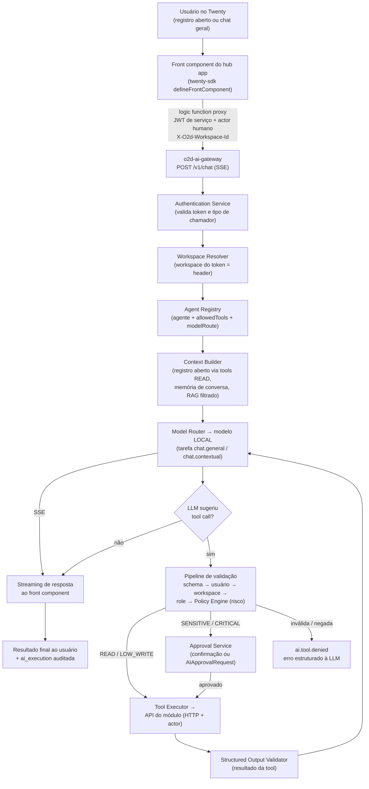

# 03 — Especificação Funcional (Fluxos de IA)

> Plataforma proprietária de IA da óDois (**o2d-ai-platform**) integrada ao Twenty CRM.
> Este documento descreve **arquitetura proposta, não implementada**. Onde um mecanismo já existe no repositório, o caminho real é citado como referência de padrão; onde não existe, isso é dito explicitamente.
> Componentes, contratos e invariantes seguem `04-target-architecture.md`; pipeline de validação, endpoints e riscos de tools seguem `05-ai-gateway-spec.md`; aprovação humana segue `15-human-approval.md`.

**Propósito.** Especificar os 40 fluxos funcionais da plataforma de IA — do chat no Twenty à administração de modelos — definindo para cada fluxo: ator, gatilho, pré-condições, etapas, permissões, ferramentas, modelo (sempre por tarefa/alias), contexto, validações, resultado, falhas, eventos `ai.*`, auditoria e necessidade de aprovação humana.

## 1. Convenções

| Termo | Definição |
|---|---|
| **Hub app** | `o2d-ai-hub-app`, Twenty App proprietário (`twenty-sdk`: `defineFrontComponent`, `defineLogicFunction` etc., `packages/twenty-sdk`). UI de IA no Twenty; sem regra de negócio crítica — tudo via gateway. |
| **Gateway** | `o2d-ai-gateway`, serviço externo proprietário. Único caminho para LLMs (locais ou externas). Endpoints `/v1/*` conforme `05-ai-gateway-spec.md`. |
| **Contracts** | `o2d-ai-contracts`, JSON Schema 2020-12 versionado (`<nome>@<semver>`), bindings zod/TS. |
| **MCP** | `o2d-ai-mcp`, servidor MCP do gateway (tools `o2d.*`, mesma authz do gateway, zero camada paralela). |
| **Worker** | Worker BullMQ/Redis do gateway (mesmo padrão do repo: `packages/twenty-server/src/engine/core-modules/message-queue/message-queue.constants.ts`). |
| **Tarefa** | Unidade de roteamento de modelo: `chat.general`, `chat.contextual`, `proposal.extract`, `proposal.write`, `meeting.summarize`, `document.analyze`, `requirements.extract`, `customer.summarize`, `semantic.search`. |
| **Alias** | Nome lógico de capacidade de modelo: `o2d-classification`, `o2d-extraction`, `o2d-writing`, `o2d-long-context`, `o2d-vision`, `o2d-embedding`, `o2d-reranker`. Consumidores **nunca** referenciam nome técnico de modelo. |
| **Risco de tool** | `READ` (auto-executável) · `LOW_WRITE` (auto + auditoria) · `SENSITIVE_WRITE` (confirmação do usuário na conversa) · `CRITICAL` (aprovação humana forte via `AIApprovalRequest`) · `FORBIDDEN` (jamais exposta ao modelo). |
| **On-behalf-of** | Toda execução carrega o ator humano iniciador; o gateway aplica as permissões **desse usuário**, nunca as do serviço. |

**Formato de cada fluxo:** **Ator · Gatilho · Pré-condições · Etapas · Permissões · Ferramentas · Modelo · Contexto · Validações · Resultado · Falhas · Eventos · Auditoria · Aprovação humana**.
Em "Modelo", indica-se sempre **tarefa → alias** resolvidos pelo Model Router; o nome técnico do modelo é detalhe interno do gateway (fluxo 40). Em "Auditoria", os registros são as tabelas do Postgres do gateway (`ai_execution`, `ai_tool_execution`, `ai_approval_request`, `ai_conversation`/`ai_message`, `ai_usage_record` — ver doc 16), sempre com `workspaceId`, `actor`, `correlationId`.

**Fases** (doc 23): fluxos sem marcação pertencem ao MVP (**F1–F2**). Os demais indicam a fase mínima: **(F3)** Tool Registry · **(F4)** aprovação humana · **(F5)** prompts/agentes · **(F6)** RAG/memória · **(F7)** MCP · **(F8)** produção avançada.

**Referência de UX existente no repositório:** o chat nativo do Twenty vive em `packages/twenty-server/src/engine/metadata-modules/ai/ai-chat/` (threads/streaming) e `packages/twenty-front/src/modules/ai/` (AgentChatProvider, AiChatTab, side panel). Ele serve **apenas como referência de UX**: pela regra 17 (não depender da IA experimental do Twenty), o hub app usa **front components próprios** que falam com o gateway via logic functions proxy — a IA nativa pode permanecer desabilitada.

## 2. Fluxo de chat — visão ponta a ponta

Invariantes do diagrama: a LLM **nunca** executa nada — apenas sugere; o Tool Executor é o único que chama módulos, sempre pela API HTTP do módulo com token de serviço + actor; `POST /v1/tools/{toolName}/execute` **nunca** é chamável pela LLM.

## 3. Fluxos de chat (1–4)

### Fluxo 01 — Chat geral dentro do Twenty

- **Ator:** usuário do workspace (qualquer role com permission flag de IA — padrão existente: `PermissionFlagType.AI` no RBAC do Twenty).
- **Gatilho:** usuário abre o painel de chat do hub app (front component próprio) e envia mensagem.
- **Pré-condições:** hub app instalado no workspace; gateway saudável (`GET /v1/health`); ao menos um modelo local ativo para a rota de chat.
- **Etapas:**
  1. Front component envia a mensagem à logic function proxy do hub app.
  2. Logic function chama `POST /v1/chat` (SSE) com JWT de serviço + actor humano + `X-O2d-Workspace-Id` + `X-Correlation-Id`.
  3. Gateway: Authentication → Workspace Resolver → Agent Registry (assistente geral) → Context Builder (memória de conversa) → Model Router.
  4. Resposta transmitida por streaming SSE ao front component; turnos persistidos em `ai_conversation`/`ai_message`.
- **Permissões:** as do usuário iniciador (on-behalf-of); catálogo de tools filtrado por agente+usuário+workspace.
- **Ferramentas:** catálogo do agente assistente geral (majoritariamente `READ`: `crm.company.search`, `crm.contact.search`, `memory.search`, `document.search`).
- **Modelo:** tarefa `chat.general` → alias `o2d-writing` (modelo local; nome técnico resolvido pelo router).
- **Contexto:** memória de conversa (janela + sumarização); sem contexto de registro.
- **Validações:** token/workspace; tamanho máximo de entrada; rate limit por usuário.
- **Resultado:** resposta em streaming; conversa persistida e retomável.
- **Falhas:** `MODEL_UNAVAILABLE` após cadeia de fallback (fluxos 16–19); timeout (fluxo 37); rate limit (fluxo 36).
- **Eventos:** `ai.execution.requested` → `ai.model.selected` → `ai.execution.started` → `ai.execution.completed` (ou `failed`).
- **Auditoria:** `ai_execution` (inputHash/outputHash, tokens, latência, custo, correlationId) + `ai_usage_record`.
- **Aprovação humana:** não (conversa pura); tool calls seguem os fluxos 10–12.

### Fluxo 02 — Chat contextual numa empresa

- **Ator:** usuário do workspace com acesso ao registro `company`.
- **Gatilho:** usuário abre o chat contextual do hub app no side panel de uma empresa (padrão de host API do sandbox de front components: `useRecordId`, `openSidePanelPage`).
- **Pré-condições:** Fluxo 01 + registro `company` existente e visível ao usuário.
- **Etapas:**
  1. Front component captura `recordId`/`objectName` e envia com a mensagem à logic function.
  2. `POST /v1/chat` com `context: {objectType: "company", recordId}`.
  3. Context Builder carrega o contexto imediato **via tools READ** (`crm.company.get`; opcionalmente `proposal.search`, `contract.search`, `finance.get_customer_balance` conforme permissões) — a LLM nunca acessa banco.
  4. Streaming da resposta; conversa vinculada ao registro.
- **Permissões:** on-behalf-of; se o usuário não vê o registro (RLS/objectPermission), o contexto não é montado (fluxo 23).
- **Ferramentas:** `READ` do domínio CRM + `memory.search`; `LOW_WRITE` (`note.create`, `task.create`) se o agente permitir.
- **Modelo:** tarefa `chat.contextual` → alias `o2d-writing`.
- **Contexto:** contexto imediato do registro + memória de conversa + memória do cliente (F6, fluxo 28).
- **Validações:** registro pertence ao workspace do token; permissões de objeto/campo do usuário aplicadas antes da montagem do contexto.
- **Resultado:** respostas fundamentadas nos dados reais da empresa, com origem rastreável (tool calls auditadas).
- **Falhas:** registro inexistente/inacessível ⇒ resposta degradada sem contexto + aviso; demais como Fluxo 01.
- **Eventos:** os do Fluxo 01 + `ai.tool.requested/validated/executed` para cada leitura de contexto.
- **Auditoria:** `ai_execution` + `ai_tool_execution` por leitura.
- **Aprovação humana:** não para leitura; escrita segue fluxos 11–12.

### Fluxo 03 — Chat contextual numa proposta

- **Ator:** usuário com acesso ao registro de proposta (objetos do App óDois de propostas — ver `docs/specs/proposal-module/`).
- **Gatilho:** chat contextual aberto num registro de proposta.
- **Pré-condições:** Fluxo 02; Serviço de Propostas acessível ao Tool Executor (S2S).
- **Etapas:** como Fluxo 02, com contexto imediato via `proposal.get` (+ `proposal.search` para histórico, `crm.company.get` para o cliente).
- **Permissões:** on-behalf-of; papéis do módulo de propostas respeitados pela API do Serviço de Propostas (o gateway propaga o actor; o serviço decide).
- **Ferramentas:** `proposal.get`, `proposal.search` (`READ`); `proposal.update_draft`, `proposal.generate_preview` (`LOW_WRITE`); `proposal.update_value`, `proposal.request_approval` (`SENSITIVE_WRITE`); `proposal.approve`/`proposal.send` (`CRITICAL`) apenas se o agente expõe.
- **Modelo:** tarefa `chat.contextual` → alias `o2d-writing`.
- **Contexto:** snapshot atual da proposta, versões, mensagens de origem (via API do Serviço de Propostas), memória de conversa.
- **Validações:** as do pipeline padrão; valores monetários normalizados (amountMicros+currencyCode).
- **Resultado:** assistência sobre a proposta (explicar, ajustar rascunho, gerar prévia) sem jamais transitar estados críticos sem gate.
- **Falhas:** Serviço de Propostas indisponível ⇒ `ai.tool.failed` + resposta degradada; demais como Fluxo 02.
- **Eventos:** como Fluxo 02; `ai.tool.approval_required` quando tocar risco `SENSITIVE_WRITE`/`CRITICAL`.
- **Auditoria:** `ai_execution` + `ai_tool_execution`; o Serviço de Propostas mantém sua própria trilha (`proposal_event`) — dupla auditoria intencional.
- **Aprovação humana:** conforme risco da tool sugerida; `proposal.approve`/`proposal.send` continuam sob o gate próprio do Serviço de Propostas mesmo após aprovação de IA (fluxo 12).

### Fluxo 04 — Chat contextual num projeto

- **Ator:** usuário com acesso ao registro de projeto.
- **Gatilho:** chat contextual aberto num registro de projeto.
- **Pré-condições:** Fluxo 02.
- **Etapas:** como Fluxo 02, contexto via `project.get`, `project.get_status`, `project.list_delays`.
- **Permissões:** on-behalf-of.
- **Ferramentas:** `project.get`, `project.get_status`, `project.list_delays` (`READ`); `project.generate_report`, `task.create` (`LOW_WRITE`).
- **Modelo:** tarefa `chat.contextual` → alias `o2d-writing`.
- **Contexto:** status, atrasos, tarefas do projeto + memória de conversa.
- **Validações:** pipeline padrão.
- **Resultado:** respostas sobre andamento, riscos e atrasos; relatórios sob demanda (`LOW_WRITE`, auto + auditoria).
- **Falhas:** como Fluxo 02.
- **Eventos:** como Fluxo 02.
- **Auditoria:** `ai_execution` + `ai_tool_execution`.
- **Aprovação humana:** não para leituras/relatórios (`LOW_WRITE`).

## 4. Fluxos de geração e extração (5–9)

### Fluxo 05 — Resumo de um cliente (`customer.summarize`) (F3)

- **Ator:** usuário do workspace; alternativamente módulo proprietário via S2S.
- **Gatilho:** ação "Resumir cliente" no registro `company` (front component/command menu item do hub app) ou `POST /v1/generate {task: "customer.summarize"}`.
- **Pré-condições:** tools `READ` de CRM registradas (F3); prompt `customer.summarize@x.y.z` `PUBLISHED` (registro completo em F5; até lá, versão inicial gerida pelo gateway — nunca string no código).
- **Etapas:**
  1. Gateway resolve prompt versionado + rota da tarefa.
  2. Context Builder coleta dados via `crm.company.get`, `proposal.search`, `contract.search`, `project.get_status`, `finance.get_customer_balance` (esta só com permissão financeira do usuário).
  3. LLM gera resumo; saída validada; resposta com citações internas `[fonte:id]`.
- **Permissões:** on-behalf-of — seções financeiras omitidas se o usuário não tem a permissão.
- **Ferramentas:** apenas `READ` listadas acima + `memory.search`.
- **Modelo:** tarefa `customer.summarize` → alias `o2d-writing` (ou `o2d-long-context` para históricos extensos, decisão do router).
- **Contexto:** dados do Twenty via tools + memória do cliente (F6) + documentos indexados (F6).
- **Validações:** structured output opcional (`customer-summary@1.0.0` em `o2d-ai-contracts`) quando consumido por máquina.
- **Resultado:** resumo com fontes rastreáveis, exibido no side panel ou retornado ao chamador S2S.
- **Falhas:** `MODEL_UNAVAILABLE`; tool de leitura falha ⇒ resumo parcial com aviso explícito das fontes ausentes.
- **Eventos:** `ai.execution.requested/started/completed` + `ai.tool.*` por leitura + `ai.structured_output.validated` quando aplicável.
- **Auditoria:** `ai_execution` com hash do prompt utilizado.
- **Aprovação humana:** não (somente leitura).

### Fluxo 06 — Extração estruturada de uma mensagem (`proposal.extract`/`requirements.extract`)

- **Ator:** sistema (Serviço de Propostas via token S2S) ou usuário via hub app.
- **Gatilho:** `POST /v1/extract {task, input, response_schema: "proposal-extraction@1.0.0"}` (contrato do doc 12).
- **Pré-condições:** schema de resposta registrado em `o2d-ai-contracts`; nota de compatibilidade: o doc `proposal-module/08-llm-spec.md` previa chamada direta ao Vercel AI SDK no worker de propostas — com a plataforma, essa chamada é **substituída** por esta chamada ao gateway.
- **Etapas:**
  1. Gateway valida o request contra o envelope de API; resolve prompt `proposal.extract@x.y.z` e rota.
  2. LLM local extrai; Structured Output Validator valida contra o JSON Schema versionado (+ zod).
  3. Normalização: datas ISO-8601, moedas amountMicros+currencyCode, decimais como string/micros, enums estritos.
- **Permissões:** token S2S com escopo de extração; actor propagado quando houver usuário iniciador.
- **Ferramentas:** nenhuma (tarefa pura de extração; entrada é dado hostil, jamais comando).
- **Modelo:** tarefa `proposal.extract`/`requirements.extract` → alias `o2d-extraction`.
- **Contexto:** apenas o input fornecido (mensagens agrupadas, anexos textificados pelo chamador).
- **Validações:** schema estrito; retry de correção 1x (fluxo 20); prompt injection no input não altera regras (cenário de teste 14).
- **Resultado:** JSON válido conforme `proposal-extraction@1.0.0` entregue ao módulo consumidor.
- **Falhas:** `STRUCTURED_OUTPUT_INVALID` após retry — **nunca** chega dado inválido ao módulo.
- **Eventos:** `ai.execution.*` + `ai.structured_output.validated` (ou `invalid` no retry/falha).
- **Auditoria:** `ai_execution` (inputHash/outputHash, hash do prompt, schema+versão usados).
- **Aprovação humana:** não (extração não executa ação; o uso do resultado é decisão do módulo consumidor).

### Fluxo 07 — Geração de rascunho de proposta (tool `proposal.create_draft`) (F3)

- **Ator:** usuário (via chat/ação) ou agente comercial; executor final é o **Serviço de Propostas** (`docs/specs/proposal-module/`).
- **Gatilho:** LLM sugere `proposal.create_draft` durante conversa, ou ação direta do hub app.
- **Pré-condições:** tool registrada no Tool Registry com schema in/out versionado; API do Serviço de Propostas acessível.
- **Etapas:**
  1. Sugestão da LLM passa pelo pipeline completo (schema → usuário → workspace → role → Policy Engine).
  2. Risco `LOW_WRITE` ⇒ auto-execução com auditoria.
  3. Tool Executor chama a API do Serviço de Propostas (HTTP, token de serviço + actor); o serviço cria a proposta em `DRAFT_GENERATED` conforme sua própria máquina de estados (`proposal-module/07-state-machine.md`).
  4. Resultado validado (Structured Output Validator) e devolvido à LLM/usuário.
- **Permissões:** usuário precisa poder criar propostas no módulo de propostas; o serviço reavalia com o actor propagado.
- **Ferramentas:** `proposal.create_draft` (`LOW_WRITE`); leituras auxiliares `crm.company.get`, `proposal.search`.
- **Modelo:** tarefa da conversa em curso (`chat.contextual` → `o2d-writing`); a redação interna do rascunho no serviço usa a tarefa `proposal.write` via gateway.
- **Contexto:** dados do cliente e catálogo de serviços obtidos pelo próprio Serviço de Propostas.
- **Validações:** parâmetros contra o schema da versão registrada da tool; idempotência via `Idempotency-Key`.
- **Resultado:** rascunho criado no módulo de propostas; jamais aprovado/enviado por este fluxo.
- **Falhas:** API do serviço indisponível ⇒ `ai.tool.failed` + retry controlado; parâmetros inválidos ⇒ fluxo 21.
- **Eventos:** `ai.tool.requested → validated → executed` (ou `failed`) dentro de `ai.execution.*`.
- **Auditoria:** `ai_tool_execution` no gateway + `proposal_event` no serviço.
- **Aprovação humana:** não para o rascunho (`LOW_WRITE`); aprovação/envio da proposta permanecem nos gates do módulo de propostas.

### Fluxo 08 — Revisão de texto (`proposal.write`)

- **Ator:** usuário (revisão de trecho de proposta/e-mail/nota) ou Serviço de Propostas (S2S).
- **Gatilho:** ação "Melhorar texto"/"Reescrever" no hub app ou `POST /v1/generate {task: "proposal.write"}`.
- **Pré-condições:** prompt `proposal.write@x.y.z` publicado; rota configurada.
- **Etapas:** request → prompt versionado → LLM local → resposta (streaming quando interativo); texto retornado como **sugestão editável**, nunca gravado automaticamente.
- **Permissões:** on-behalf-of; sem tools de escrita.
- **Ferramentas:** nenhuma (geração pura) ou `READ` para terminologia/contexto do registro.
- **Modelo:** tarefa `proposal.write` → alias `o2d-writing`.
- **Contexto:** texto original + instruções + contexto do registro (quando invocado de um registro).
- **Validações:** limites de tamanho; saída livre (texto) — sem structured output obrigatório.
- **Resultado:** texto revisado exibido para o humano aceitar/editar/descartar.
- **Falhas:** `MODEL_UNAVAILABLE`, timeout.
- **Eventos:** `ai.execution.requested/started/completed`.
- **Auditoria:** `ai_execution`.
- **Aprovação humana:** implícita — o humano decide aplicar ou não o texto; nada é persistido pela IA.

### Fluxo 09 — Comparação de versões (F3)

- **Ator:** usuário (contratos/propostas com múltiplas versões).
- **Gatilho:** ação "Comparar versões" no hub app; LLM pode sugerir `contract.compare_versions`.
- **Pré-condições:** tool `contract.compare_versions` registrada; versões acessíveis via API do módulo dono (contratos/propostas).
- **Etapas:**
  1. Tool Executor obtém as duas versões pela API do módulo (`contract.get`/`proposal.get`).
  2. LLM produz diff semântico comentado (cláusulas alteradas, impactos), com citações às versões.
- **Permissões:** on-behalf-of sobre os registros comparados.
- **Ferramentas:** `contract.compare_versions` (`LOW_WRITE` — gera artefato de comparação), `contract.get`, `proposal.get` (`READ`).
- **Modelo:** tarefa `document.analyze` → alias `o2d-long-context` (documentos extensos).
- **Contexto:** conteúdo integral das versões comparadas.
- **Validações:** ambas as versões do mesmo workspace e visíveis ao usuário.
- **Resultado:** relatório de diferenças como sugestão analítica — sem efeito jurídico; decisão é humana.
- **Falhas:** versão inacessível ⇒ `ai.tool.denied`; documento excede contexto ⇒ chunking ou erro controlado.
- **Eventos:** `ai.execution.*` + `ai.tool.*`.
- **Auditoria:** `ai_execution` + `ai_tool_execution`.
- **Aprovação humana:** não.

## 5. Fluxos de ferramentas por nível de risco (10–12)

### Fluxo 10 — Consulta a dados por ferramenta (`READ`) (F3)

- **Ator:** LLM (sugestão) em nome do usuário.
- **Gatilho:** durante execução, a LLM sugere tool call `READ` (ex.: `crm.company.search`, `finance.list_overdue`).
- **Pré-condições:** tool no catálogo filtrado do agente para aquele usuário+workspace.
- **Etapas:**
  1. `ai.tool.requested` — sugestão registrada.
  2. Tool Call Validator: parâmetros contra o schema da versão registrada.
  3. Authorization (usuário) → Workspace Resolver → role → Policy Engine (`READ` ⇒ auto-executável).
  4. Tool Executor chama a API do módulo com actor; resultado validado e devolvido à LLM.
- **Permissões:** on-behalf-of; `finance.*` exige permissão financeira do usuário.
- **Ferramentas:** qualquer `READ` do catálogo (doc 05).
- **Modelo:** o da execução em curso (a tool não escolhe modelo).
- **Contexto:** resultado da tool entra no contexto do turno seguinte.
- **Validações:** pipeline completo mesmo para leitura (sem atalhos).
- **Resultado:** dados reais e atualizados na resposta, com origem auditada.
- **Falhas:** schema inválido (fluxo 21); permissão negada (fluxo 23); módulo fora do ar ⇒ `ai.tool.failed`.
- **Eventos:** `ai.tool.requested → validated → executed` (ou `denied`/`failed`).
- **Auditoria:** `ai_tool_execution` (tool+versão, paramsHash, duração, status).
- **Aprovação humana:** não.

### Fluxo 11 — Criação de registro de baixo risco (`LOW_WRITE`) (F3)

- **Ator:** LLM (sugestão) em nome do usuário.
- **Gatilho:** sugestão de tool `LOW_WRITE` (ex.: `note.create`, `task.create`, `proposal.update_draft`).
- **Pré-condições:** como Fluxo 10.
- **Etapas:** pipeline idêntico ao Fluxo 10; Policy Engine classifica `LOW_WRITE` ⇒ auto-execução **com auditoria reforçada**; `Idempotency-Key` obrigatória (execução duplicada não duplica ação — cenário de teste 15).
- **Permissões:** usuário precisa da permissão de escrita correspondente no módulo destino.
- **Ferramentas:** `proposal.create_draft`, `proposal.update_draft`, `proposal.generate_preview`, `task.create`, `note.create`, `contract.generate_draft`, `contract.compare_versions`, `meeting.summarize`, `project.generate_report`, `finance.simulate_installments`.
- **Modelo:** o da execução em curso.
- **Contexto:** parâmetros derivados da conversa, sempre exibíveis ao usuário.
- **Validações:** schema estrito; políticas por workspace no Policy Engine (um workspace pode elevar `LOW_WRITE` a confirmação).
- **Resultado:** registro criado/atualizado no módulo dono; efeito reversível por natureza (rascunhos, notas, tarefas).
- **Falhas:** como Fluxo 10; conflito de idempotência ⇒ retorno do resultado original (no-op).
- **Eventos:** `ai.tool.requested → validated → executed`.
- **Auditoria:** `ai_tool_execution` + trilha do módulo dono.
- **Aprovação humana:** não (por padrão; configurável por workspace).

### Fluxo 12 — Solicitação de ação sensível (`SENSITIVE_WRITE`/`CRITICAL`) (F4)

- **Ator:** LLM (sugestão); humano (decisão).
- **Gatilho:** sugestão de tool `SENSITIVE_WRITE` (ex.: `proposal.update_value`, `finance.create_invoice`) ou `CRITICAL` (ex.: `proposal.approve`, `proposal.send`, `contract.sign`, `payment.register`).
- **Pré-condições:** Fluxo 10 + Approval Service ativo (F4).
- **Etapas:**
  1. Pipeline até o Policy Engine; risco identificado.
  2. `SENSITIVE_WRITE` ⇒ confirmação explícita do usuário **na conversa** (parâmetros exibidos por extenso); confirmado ⇒ executa.
  3. `CRITICAL` ⇒ Approval Service cria `AIApprovalRequest` (executionId, tool+versão, parâmetros, `paramsHash` sha256 do JSON canônico, risk, `expiresAt` default 24h) e **pausa a execução**; evento `ai.tool.approval_required`.
  4. Execução aguarda decisão (fluxos 13–15). A LLM recebe apenas "ação pendente de aprovação" — nunca executa.
  5. Mesmo aprovada, a execução final passa pelos gates do módulo dono (ex.: `proposal.approve`/`proposal.send` continuam sob o gate `canSendProposal` do Serviço de Propostas — a aprovação de IA **adiciona** camada, não substitui).
- **Permissões:** solicitante precisa da permissão da ação; aprovador precisa de role adequada; solicitante ≠ aprovador (configurável).
- **Ferramentas:** as `SENSITIVE_WRITE`/`CRITICAL` do catálogo. Tools `FORBIDDEN` **não chegam aqui** — nem existem no catálogo enviado ao modelo.
- **Modelo:** o da execução em curso.
- **Contexto:** parâmetros integralmente exibidos ao humano (sem resumo com perda).
- **Validações:** hash canônico dos parâmetros congelado no pedido de aprovação.
- **Resultado:** ação executada só após decisão humana positiva (e gates do módulo).
- **Falhas:** rejeição (fluxo 14), expiração (fluxo 15), invalidação por mudança de parâmetros.
- **Eventos:** `ai.tool.approval_required` + `ai.approval.requested`.
- **Auditoria:** `ai_approval_request` + `ai_tool_execution` (pendente) + notificação na fila de aprovações do hub app.
- **Aprovação humana:** **sim — obrigatória e bloqueante** para `CRITICAL`; confirmação em conversa para `SENSITIVE_WRITE`.

## 6. Fluxos de aprovação humana (13–15) — todos (F4)

### Fluxo 13 — Aprovação humana (F4)

- **Ator:** humano com role de aprovador.
- **Gatilho:** decisão na fila de aprovações do hub app (`GET /v1/approvals` → `POST /v1/approvals/{approvalId}/approve`) ou via MCP com identidade humana confirmada.
- **Pré-condições:** `AIApprovalRequest` em `PENDING`, não expirada; parâmetros atuais batem com o `paramsHash`.
- **Etapas:**
  1. UI exibe tool+versão, parâmetros completos, risco, solicitante, expiração.
  2. Aprovador aprova; Approval Service valida role, regra solicitante ≠ aprovador, hash e prazo.
  3. Status `PENDING → APPROVED`; execução pausada é retomada; Tool Executor executa **uma única vez** (replay bloqueado); status final `EXECUTED`.
- **Permissões:** role de aprovador para o domínio da tool; credencial de agente (não humana) ⇒ 403.
- **Ferramentas:** a tool aprovada, exatamente com os parâmetros congelados.
- **Modelo:** n/a (decisão humana); a execução retomada usa o contexto original.
- **Contexto:** parâmetros congelados no pedido.
- **Validações:** hash íntegro; janela de validade; unicidade de execução.
- **Resultado:** ação executada e marcada `EXECUTED`; resultado devolvido à execução de origem.
- **Falhas:** hash divergente ⇒ `INVALIDATED` (nova solicitação necessária); expirada ⇒ fluxo 15; tentativa de reexecução ⇒ bloqueada.
- **Eventos:** `ai.approval.approved` → `ai.tool.executed`.
- **Auditoria:** `ai_approval_request` (approvedBy, decididoEm, executadoEm) + `ai_tool_execution`.
- **Aprovação humana:** este fluxo **é** a aprovação.

### Fluxo 14 — Rejeição da ação (F4)

- **Ator:** humano aprovador.
- **Gatilho:** `POST /v1/approvals/{approvalId}/reject` (com justificativa).
- **Pré-condições:** `AIApprovalRequest` em `PENDING`.
- **Etapas:** rejeição registrada; status `REJECTED`; execução de origem recebe resultado "ação negada por humano" e prossegue/encerra sem executar a tool; a LLM pode formular alternativa, nunca reexecutar a mesma solicitação.
- **Permissões:** role de aprovador.
- **Ferramentas:** nenhuma executada.
- **Modelo:** n/a.
- **Contexto:** justificativa opcional anexada.
- **Validações:** status `PENDING` no momento da decisão.
- **Resultado:** ação nunca executada; usuário solicitante notificado com o motivo.
- **Falhas:** decisão concorrente (aprovado/expirado antes) ⇒ 409, estado vigente prevalece.
- **Eventos:** `ai.approval.rejected`.
- **Auditoria:** `ai_approval_request` (REJECTED, decisor, motivo).
- **Aprovação humana:** decisão humana negativa — desfecho válido e auditado.

### Fluxo 15 — Expiração de aprovação (F4)

- **Ator:** sistema (worker do gateway — job periódico de expiração).
- **Gatilho:** `expiresAt` atingido (default 24h) com status `PENDING`.
- **Etapas:** worker marca `EXPIRED`; execução de origem finalizada com "aprovação expirada"; qualquer tentativa posterior de aprovar/executar ⇒ recusada (cenário de teste 9); nova ação exige nova solicitação (novo hash, novo prazo).
- **Pré-condições:** worker ativo.
- **Permissões:** token interno de worker.
- **Ferramentas:** nenhuma executada.
- **Modelo:** n/a.
- **Contexto:** n/a.
- **Validações:** transição só de `PENDING` para `EXPIRED`.
- **Resultado:** aprovação inutilizável em definitivo; solicitante notificado.
- **Falhas:** corrida decisão × expiração ⇒ transação decide; primeiro estado gravado vence.
- **Eventos:** `ai.approval.expired`.
- **Auditoria:** `ai_approval_request` (EXPIRED, timestamp).
- **Aprovação humana:** n/a — a ausência de decisão no prazo é tratada como negação.

## 7. Fluxos de modelo, fallback e validação de saída (16–21)

### Fluxo 16 — Falha da LLM local

- **Ator:** sistema (Model Router + Fallback Service).
- **Gatilho:** provider local (Ollama/vLLM via adapter OpenAI-compatible) falha: conexão, 5xx, timeout, health check negativo.
- **Pré-condições:** execução em curso com modelo local selecionado.
- **Etapas:**
  1. Falha detectada; `ai.model.failed` emitido com causa.
  2. Fallback Service consulta a cadeia da rota da tarefa (fluxos 17–19).
  3. Health Check Service marca o provider; `ai.provider.offline` se indisponibilidade confirmada.
- **Permissões:** n/a (interno).
- **Ferramentas:** n/a.
- **Modelo:** o que falhou — identificado internamente; o consumidor só vê a tarefa.
- **Contexto:** preservado para reexecução no próximo modelo da cadeia.
- **Validações:** classificação da falha (transitória × permanente) para decidir retry × fallback.
- **Resultado:** transição transparente para o fluxo 17, 18 ou 19.
- **Falhas:** cadeia esgotada ⇒ `MODEL_UNAVAILABLE` (fluxo 19).
- **Eventos:** `ai.model.failed`; possivelmente `ai.provider.offline`.
- **Auditoria:** `ai_execution` registra a tentativa falha e a causa.
- **Aprovação humana:** não.

### Fluxo 17 — Fallback para outro modelo local

- **Ator:** sistema (Fallback Service).
- **Gatilho:** Fluxo 16 com modelo local secundário configurado na rota.
- **Pré-condições:** rota da tarefa define `local principal → local secundário`.
- **Etapas:** router seleciona o secundário; `ai.model.fallback_selected`; execução reprocessada com o mesmo contexto; resposta segue normalmente.
- **Permissões:** n/a.
- **Ferramentas:** as da execução original.
- **Modelo:** mesmo alias/tarefa — outro modelo local por baixo (invisível ao consumidor).
- **Contexto:** idêntico ao da tentativa original.
- **Validações:** mesmas da execução original (structured output revalidado).
- **Resultado:** resposta entregue com latência adicional; qualidade pode variar — registrado para análise.
- **Falhas:** secundário também falha ⇒ fluxo 18 ou 19.
- **Eventos:** `ai.model.fallback_selected` → `ai.execution.completed`.
- **Auditoria:** `ai_execution` marca a cadeia percorrida.
- **Aprovação humana:** não.

### Fluxo 18 — Fallback opcional para provedor externo (F8)

- **Ator:** sistema (Fallback Service + Policy Engine).
- **Gatilho:** modelos locais esgotados e fallback externo **habilitado** para o workspace **e** para a tarefa.
- **Pré-condições:** provider externo (OpenAI/Anthropic, opcionais) configurado com `secretRef` (segredo cifrado, nunca plaintext); opt-in explícito por workspace/tarefa; tarefa **não** marcada local-only.
- **Etapas:**
  1. Policy Engine verifica: fallback externo habilitado? tarefa permite? dados sensíveis? (`allowsSensitiveData` do provider × classificação da tarefa).
  2. Aprovado ⇒ router seleciona o modelo externo da rota; `ai.model.fallback_selected` (destino externo explícito no payload).
  3. Execução normal; custo real registrado em `ai_usage_record`.
- **Permissões:** política por workspace (admin do workspace controla o opt-in).
- **Ferramentas:** as da execução original — pipeline de tools inalterado (o executor continua sendo o gateway).
- **Modelo:** mesma tarefa — modelo externo resolvido pelo router; consumidor não muda nada.
- **Contexto:** mesmo contexto; dados sensíveis bloqueiam o desvio quando a tarefa é local-only.
- **Validações:** dupla checagem workspace+tarefa antes do envio (cenário de teste 12 no sentido inverso).
- **Resultado:** resposta entregue por provider externo, com marcação de origem na auditoria.
- **Falhas:** externo também falha ⇒ `MODEL_UNAVAILABLE`.
- **Eventos:** `ai.model.fallback_selected` (externo) → `ai.execution.completed`.
- **Auditoria:** `ai_execution` (provider externo identificado) + `ai_usage_record` (custo).
- **Aprovação humana:** não por execução; o opt-in é decisão administrativa prévia.

### Fluxo 19 — Execução sem fallback externo (desativado ⇒ erro controlado)

- **Ator:** sistema.
- **Gatilho:** modelos locais esgotados e fallback externo **desativado** (por workspace ou por tarefa) ou tarefa local-only.
- **Etapas:** Policy Engine bloqueia o desvio externo; execução encerra com `MODEL_UNAVAILABLE`; **nenhum byte** sai para provider externo (cenário de teste 12 — gate de release).
- **Pré-condições:** configuração de fallback do workspace/tarefa.
- **Permissões:** n/a.
- **Ferramentas:** n/a.
- **Modelo:** nenhum disponível — erro controlado, nunca silencioso.
- **Contexto:** descartado com a execução (não enfileirado para fora).
- **Validações:** verificação de política **antes** de qualquer chamada externa.
- **Resultado:** erro estruturado `MODEL_UNAVAILABLE` ao chamador; UI do hub exibe mensagem clara ("modelos locais indisponíveis; fallback externo desativado neste workspace").
- **Falhas:** este fluxo **é** o tratamento da falha.
- **Eventos:** `ai.model.failed` → `ai.execution.failed` (errorCode `MODEL_UNAVAILABLE`).
- **Auditoria:** `ai_execution` (falha, cadeia percorrida, política aplicada).
- **Aprovação humana:** não.

### Fluxo 20 — Structured output inválido (retry 1x ⇒ falha controlada)

- **Ator:** sistema (Structured Output Validator).
- **Gatilho:** resposta da LLM não valida contra o JSON Schema versionado do request (`response_schema`).
- **Pré-condições:** execução com structured output exigido (ex.: fluxo 06).
- **Etapas:**
  1. Validação falha; `ai.structured_output.invalid` (tentativa 1).
  2. Re-ask único: prompt de correção com os erros de validação anexados.
  3. Segunda resposta validada ⇒ `ai.structured_output.validated`, segue.
  4. Falha de novo ⇒ execução encerra com `STRUCTURED_OUTPUT_INVALID` — **nunca** chega dado inválido ao módulo consumidor (cenário de teste 13).
- **Permissões:** n/a.
- **Ferramentas:** n/a.
- **Modelo:** o mesmo da execução (retry não troca modelo).
- **Contexto:** original + erros de validação no re-ask.
- **Validações:** JSON Schema 2020-12 + zod; normalizações do doc 12.
- **Resultado:** dado válido ou falha limpa e estruturada.
- **Falhas:** este fluxo trata a falha; chamador decide reprocessar (fluxo 35) ou escalar a humano.
- **Eventos:** `ai.structured_output.invalid` (1–2x) e/ou `validated`; `ai.execution.failed` no esgotamento.
- **Auditoria:** `ai_execution` com ambas as tentativas e erros de schema.
- **Aprovação humana:** não; a falha persistente vira notificação para operação humana no módulo consumidor.

### Fluxo 21 — Tool call inválida (F3)

- **Ator:** sistema (Tool Call Validator).
- **Gatilho:** LLM sugere tool call com parâmetros que violam o schema da versão registrada (tipo errado, campo faltante, enum inexistente) ou tool desconhecida.
- **Etapas:**
  1. `ai.tool.requested` registrado; validação contra o schema falha.
  2. `ai.tool.denied` (motivo: schema); erro estruturado devolvido **à LLM** (não ao módulo — nada foi executado).
  3. LLM pode corrigir e sugerir novamente (limite de tentativas por execução); estouro ⇒ resposta ao usuário sem a ação.
- **Pré-condições:** Tool Registry ativo.
- **Permissões:** n/a — rejeição ocorre antes da autorização.
- **Ferramentas:** nenhuma executada.
- **Modelo:** o da execução.
- **Contexto:** erros de validação anexados ao turno seguinte.
- **Validações:** schema in da tool (cenário de teste 3).
- **Resultado:** nenhuma ação; sistema íntegro.
- **Falhas:** repetição além do limite ⇒ execução completa sem a tool + aviso ao usuário.
- **Eventos:** `ai.tool.requested` → `ai.tool.denied`.
- **Auditoria:** `ai_tool_execution` (status DENIED, motivo, parâmetros brutos com PII mascarada).
- **Aprovação humana:** não.

### Fluxo 22 — Ferramenta não autorizada (F3)

- **Ator:** sistema (Authorization + Policy Engine).
- **Gatilho:** LLM sugere tool que existe no registry mas **não** está no `allowedTools` do agente, ou excede o `maxRiskLevel` do agente, ou não é permitida à role do usuário.
- **Etapas:** validação de catálogo/risco falha ⇒ `ai.tool.denied` (motivo: não autorizada); erro estruturado à LLM. Observação: o caso normal **nem ocorre** — o catálogo enviado ao modelo já é filtrado por agente+usuário+workspace, e tools `FORBIDDEN` nunca aparecem em catálogo algum (cenário de teste 10); este fluxo é a defesa em profundidade para sugestões fora do catálogo (alucinação ou injection).
- **Pré-condições:** Agent Registry + Tool Registry.
- **Permissões:** allowedTools do agente ∩ permissões do usuário ∩ políticas do workspace.
- **Ferramentas:** nenhuma executada.
- **Modelo:** o da execução.
- **Contexto:** inalterado.
- **Validações:** dupla: filtro do catálogo (preventivo) + checagem no pipeline (obrigatória mesmo assim).
- **Resultado:** ação bloqueada; conversa continua.
- **Falhas:** tentativas repetidas ⇒ sinal de prompt injection ⇒ alerta de segurança na observabilidade.
- **Eventos:** `ai.tool.requested` → `ai.tool.denied`.
- **Auditoria:** `ai_tool_execution` (DENIED, motivo, agente, tool solicitada).
- **Aprovação humana:** não.

### Fluxo 23 — Usuário sem permissão (F3)

- **Ator:** sistema (Authorization Service).
- **Gatilho:** tool válida e catalogada, mas o usuário iniciador não tem a permissão correspondente no Twenty/módulo (ex.: `finance.get_customer_balance` sem permissão financeira).
- **Etapas:** Authorization consulta as permissões do actor (on-behalf-of) ⇒ negado ⇒ `ai.tool.denied` (motivo: permissão do usuário); a LLM recebe "sem permissão" e responde ao usuário sem os dados; o módulo dono **também** revalida quando chamado (defesa em profundidade — o Tool Executor propaga o actor).
- **Pré-condições:** mapeamento tool → permissão exigida no Tool Registry.
- **Permissões:** exatamente as do usuário — RBAC do Twenty (role→objectPermission→fieldPermission→RLS, incl. permission flag `AI`) e papéis dos módulos proprietários.
- **Ferramentas:** nenhuma executada.
- **Modelo:** o da execução.
- **Contexto:** dados negados jamais entram no contexto.
- **Validações:** cenário de teste 4 (gate de release).
- **Resultado:** resposta sem os dados restritos, com transparência ("sem permissão para dados financeiros").
- **Falhas:** n/a — a negação é o comportamento correto.
- **Eventos:** `ai.tool.denied`.
- **Auditoria:** `ai_tool_execution` (DENIED, permissão faltante).
- **Aprovação humana:** não.

### Fluxo 24 — Tentativa de acesso a outro workspace

- **Ator:** sistema (Workspace Resolver).
- **Gatilho:** qualquer request/tool call cujo alvo (recordId, conversationId, approvalId…) pertença a workspace diferente do token, ou header `X-O2d-Workspace-Id` divergente do token.
- **Etapas:** Workspace Resolver compara token × header × workspace do recurso ⇒ divergência ⇒ rejeição imediata (404/403 sem vazamento de existência); em tool call, `ai.tool.denied`; em RAG, o predicado obrigatório de `workspaceId` em toda query vetorial impede o retorno (cenários de teste 5 e 6).
- **Pré-condições:** todas as tabelas do gateway com `workspaceId` + índices compostos (doc 16).
- **Permissões:** isolamento é anterior a qualquer permissão.
- **Ferramentas:** nenhuma executada.
- **Modelo:** n/a.
- **Contexto:** jamais montado com dados de outro workspace.
- **Validações:** predicado de workspace em TODA query (SQL e vetorial), testado como gate de release.
- **Resultado:** bloqueio total, sem confirmação de existência do recurso alheio.
- **Falhas:** n/a — bloqueio é o resultado.
- **Eventos:** `ai.tool.denied` (quando via tool) e `ai.execution.failed` quando o request inteiro é inválido.
- **Auditoria:** `ai_execution`/`ai_tool_execution` com marcação de violação de isolamento + alerta de segurança.
- **Aprovação humana:** não.

## 8. Fluxos de contexto, RAG e memória (25–28)

### Fluxo 25 — RAG com documentos internos (F6)

- **Ator:** usuário (pergunta) + sistema (RAG Service); admin (ingestão).
- **Gatilho:** pergunta que aciona a base documental (`document.search` / `POST /v1/knowledge/search`), ou ingestão de novo documento.
- **Pré-condições:** pipeline de ingestão ativo: documento → chunking por tipo (~512–1024 tokens, overlap) → embeddings locais → pgvector no Postgres **do gateway** (nunca no Postgres do Twenty — zero migrations no core); arquivos originais em MinIO/S3; metadados obrigatórios `{workspaceId, sourceType, recordRefs, permissions, validUntil, version}`.
- **Etapas (consulta):**
  1. Query embedada (alias `o2d-embedding`).
  2. Busca vetorial com **filtro obrigatório** por `workspaceId` + permissões do usuário.
  3. Reranking (alias `o2d-reranker`); corte por score mínimo; docs expirados/obsoletos excluídos.
  4. Chunks entram no contexto com citações internas `[fonte:id]`; conteúdo de documento é **dado hostil** — instruções embutidas não alteram regras (cenário de teste 14).
- **Permissões:** chunk só retorna se as `permissions` dos metadados batem com o usuário.
- **Ferramentas:** `document.search` (`READ`).
- **Modelo:** tarefa `semantic.search` → aliases `o2d-embedding` + `o2d-reranker`; geração da resposta na tarefa da conversa.
- **Contexto:** chunks recuperados + conversa.
- **Validações:** score mínimo; validade (`validUntil`); versão do documento.
- **Resultado:** resposta fundamentada com citações verificáveis.
- **Falhas:** índice indisponível ⇒ resposta sem RAG + aviso; ingestão falha ⇒ `ai.knowledge.index_failed` + retry pelo worker.
- **Eventos:** consulta: `ai.tool.*`; ingestão: `ai.knowledge.indexed` / `ai.knowledge.index_failed`.
- **Auditoria:** `ai_knowledge_source`/`ai_knowledge_chunk` (ingestão) + `ai_tool_execution` (consultas).
- **Aprovação humana:** não na consulta; curadoria humana na ingestão de fontes organizacionais.

### Fluxo 26 — RAG com dados do Twenty (F6)

- **Ator:** usuário + sistema.
- **Gatilho:** pergunta que requer busca semântica sobre dados do CRM (notas, timeline, descrições longas).
- **Pré-condições:** indexação seletiva de conteúdo textual do Twenty (obtido via APIs, nunca acesso direto ao banco do Twenty) no pgvector do gateway, com `recordRefs` apontando aos registros de origem.
- **Etapas:** como Fluxo 25, com fonte `sourceType: twenty-record`; ao responder, o Context Builder pode revalidar o registro atual via tool `READ` (dado indexado pode estar defasado — a fonte de verdade continua sendo o Twenty).
- **Permissões:** filtro por `workspaceId` + permissões de objeto/registro do usuário (RLS refletida nos metadados de permissão do chunk).
- **Ferramentas:** `document.search`/`memory.search` (`READ`) + tool de revalidação (`crm.company.get` etc.).
- **Modelo:** tarefa `semantic.search` → `o2d-embedding` + `o2d-reranker`.
- **Contexto:** chunks + registro atual revalidado.
- **Validações:** contexto não mistura clientes (cenário de teste 6); staleness marcada.
- **Resultado:** busca semântica sobre o CRM sem violar RBAC.
- **Falhas:** como Fluxo 25; divergência índice × registro atual ⇒ prevalece o registro atual.
- **Eventos:** como Fluxo 25.
- **Auditoria:** idem.
- **Aprovação humana:** não.

### Fluxo 27 — Memória da conversa

- **Ator:** sistema (Memory Service).
- **Gatilho:** cada turno de conversa; retomada de conversa anterior.
- **Pré-condições:** `ai_conversation`/`ai_message` no Postgres do gateway. (No repo, o padrão análogo é a persistência de turnos do chat nativo em `engine/metadata-modules/ai/ai-agent-execution/` — referência, não dependência.)
- **Etapas:** turnos persistidos; contexto montado com janela deslizante das últimas mensagens; excedente sumarizado (tarefa `meeting.summarize`-like interna) e o resumo substitui os turnos antigos no contexto.
- **Permissões:** conversa pertence a usuário+workspace; outro usuário não a lê.
- **Ferramentas:** nenhuma (mecanismo interno).
- **Modelo:** sumarização pela rota interna de sumarização → alias `o2d-writing`.
- **Contexto:** janela + resumo acumulado.
- **Validações:** limite de tokens do contexto; isolamento por conversa.
- **Resultado:** continuidade da conversa sem estourar contexto.
- **Falhas:** sumarização falha ⇒ janela simples truncada (degradação graciosa).
- **Eventos:** nenhum específico (interno à execução); sumarizações registradas como `ai.execution.*` internas.
- **Auditoria:** `ai_conversation`/`ai_message`.
- **Aprovação humana:** não.

### Fluxo 28 — Memória do cliente (F6)

- **Ator:** sistema (Memory Service) + humano curador.
- **Gatilho:** fim de interações relevantes (proposta aceita, reunião resumida) gera candidatos a fatos; consulta via `memory.search`.
- **Pré-condições:** `ai_memory_fact` por `company` no gateway; política de curadoria definida (fatos consolidados são **curados**, não gravação automática irrestrita).
- **Etapas:**
  1. Candidato a fato extraído (tarefa de extração) e proposto.
  2. Curadoria (humana ou regra) aceita/edita/descarta.
  3. Fatos aceitos ficam pesquisáveis via `memory.search` e entram no Context Builder de conversas daquele cliente.
- **Permissões:** leitura conforme permissões sobre a `company`; escrita de fato = curadoria.
- **Ferramentas:** `memory.search` (`READ`).
- **Modelo:** extração de fatos: tarefa `requirements.extract` → `o2d-extraction`; busca: `semantic.search`.
- **Contexto:** fatos do cliente + contexto imediato.
- **Validações:** fato vinculado a `workspaceId` + `companyId`; sem PII desnecessária; validade/obsolescência.
- **Resultado:** continuidade entre conversas e usuários sobre o mesmo cliente ("preferem faturamento mensal").
- **Falhas:** fato conflitante ⇒ sinalizado para curadoria, nunca sobrescrito silenciosamente.
- **Eventos:** `ai.execution.*` na extração; consultas via `ai.tool.*`.
- **Auditoria:** `ai_memory_fact` (autor/curador, origem, versões).
- **Aprovação humana:** sim, na curadoria de fatos (leve, não bloqueia conversa).

## 9. Fluxos de agentes e MCP (29–32)

### Fluxo 29 — Execução de agente especializado (F5)

- **Ator:** usuário (ou módulo S2S).
- **Gatilho:** `POST /v1/agents/{agentId}/run` — ex.: agente de propostas, contratos, financeiro (catálogo do doc 10).
- **Pré-condições:** agente `active` no Agent Registry com: systemPrompt (ref ao Prompt Registry), modelRoute, `allowedTools` **explícitas** (nunca "todas"), contextSources, memoryPolicy, allowedRoles, allowedWorkspaces, `maxRiskLevel`, approvalPolicy.
- **Etapas:**
  1. Gateway valida: usuário ∈ allowedRoles? workspace ∈ allowedWorkspaces?
  2. Prompt resolvido por versão publicada; catálogo de tools = allowedTools ∩ permissões do usuário.
  3. Execução com o pipeline padrão (contexto, tools, aprovações conforme risco e approvalPolicy).
- **Permissões:** interseção agente × usuário × workspace — o agente nunca **amplia** permissões do usuário.
- **Ferramentas:** somente as `allowedTools` do agente, respeitando `maxRiskLevel`.
- **Modelo:** `modelRoute` do agente — sempre tarefa/alias (ex.: agente de propostas → `proposal.write`/`o2d-writing`).
- **Contexto:** `contextSources` declaradas (registro, RAG, memória do cliente).
- **Validações:** temperature/maxTokens/timeout do agente; versão do agente registrada na execução.
- **Resultado:** execução especializada, previsível e auditável por versão de agente+prompt.
- **Falhas:** agente inativo ⇒ 404 controlado; role não permitida ⇒ 403.
- **Eventos:** `ai.execution.*` (payload com agentId+versão) + `ai.tool.*`/`ai.approval.*` conforme o caso.
- **Auditoria:** `ai_execution` (agente+versão, hash do prompt).
- **Aprovação humana:** conforme risco das tools sugeridas (fluxos 11–15).

### Fluxo 30 — Uso do AI Gateway via MCP (F7)

- **Ator:** host MCP autorizado (Claude, Codex, outros) operando **em nome de um usuário vinculado**.
- **Gatilho:** host conecta ao `o2d-ai-mcp` e chama tools `o2d.*` (`o2d.crm.company.search/get`, `o2d.proposal.create_draft`, `o2d.proposal.generate_preview`, `o2d.project.get_status`, `o2d.contract.list_expiring`, `o2d.memory.search`, `o2d.ai.agent.run`).
- **Pré-condições:** OAuth 2.1 (mesmo padrão do MCP nativo do Twenty: `packages/twenty-server/src/engine/api/mcp/guards/mcp-auth.guard.ts`) ou API key por usuário; usuário vinculado com permissões no workspace.
- **Etapas:**
  1. `initialize`/`tools-list`: o MCP retorna **apenas** o catálogo filtrado para aquele usuário (annotations readOnly/destructive).
  2. `tools-call`: o MCP traduz a identidade e **delega ao pipeline padrão do gateway** — zero camada paralela de authz.
  3. Riscos idênticos ao Tool Registry: `READ` executa; `SENSITIVE`/`CRITICAL` exigem confirmação/aprovação (fluxos 12–13).
- **Permissões:** exatamente as do usuário vinculado (cenário de teste 16: MCP = mesmas permissões do gateway).
- **Ferramentas:** classes de risco idênticas às do Tool Registry.
- **Modelo:** quando a tool envolve LLM (`o2d.ai.agent.run`), a rota da tarefa do agente; tools de dados não usam modelo.
- **Contexto:** o do pipeline padrão.
- **Validações:** identidade humana confirmada para aprovar (credencial de agente ⇒ 403); isolamento de workspace idêntico.
- **Resultado:** hosts externos operam com os mesmos limites e trilhas de um usuário no Twenty.
- **Falhas:** token inválido ⇒ 401; tool fora do catálogo do usuário ⇒ não listada/negada.
- **Eventos:** os mesmos `ai.*` do pipeline (origem `mcp` no actor).
- **Auditoria:** idêntica à do gateway, com canal de origem MCP.
- **Aprovação humana:** conforme risco — nunca dispensada por ser MCP.

### Fluxo 31 — Uso por Claude (F7)

- **Ator:** Claude (host MCP) em nome de um usuário óDois.
- **Gatilho:** usuário conecta o `o2d-ai-mcp` no Claude (padrão análogo aos pacotes existentes `twenty-claude-skills` e ao MCP nativo do Twenty) e pede, por ex., "resuma a situação da empresa X e crie um rascunho de proposta".
- **Pré-condições:** Fluxo 30; escopos OAuth concedidos pelo usuário.
- **Etapas:** Claude chama `o2d.crm.company.get` + `o2d.memory.search` (executam — `READ`) e `o2d.proposal.create_draft` (`LOW_WRITE`, executa com auditoria; confirmação exibida pelo host conforme annotations); qualquer sugestão `SENSITIVE`/`CRITICAL` cai nos fluxos 12–13 — Claude **não** aprova (não é identidade humana aprovadora no ato da chamada de agente).
- **Permissões:** as do usuário vinculado; nada além.
- **Ferramentas:** subconjunto `o2d.*` autorizado ao usuário.
- **Modelo:** n/a nas tools de dados; rota da tarefa quando `o2d.ai.agent.run`.
- **Contexto:** o retornado pelas tools; Claude não recebe dados fora do catálogo/permissões.
- **Validações:** todas as do pipeline; annotations `destructiveHint` respeitadas pelo host.
- **Resultado:** produtividade externa (Claude) com governança interna intacta.
- **Falhas:** como Fluxo 30.
- **Eventos:** `ai.tool.*` (actor: usuário, canal: mcp/claude).
- **Auditoria:** completa, indistinguível em rigor da auditoria interna.
- **Aprovação humana:** conforme risco; aprovações acontecem na fila do hub app (ou via MCP com identidade humana confirmada).

### Fluxo 32 — Uso por Codex (F7)

- **Ator:** Codex (host MCP) em nome de um desenvolvedor/usuário óDois.
- **Gatilho:** configuração `.mcp.json` apontando ao `o2d-ai-mcp` (padrão existente no repo: `packages/twenty-codex-plugin` com `.mcp.json` → MCP do Twenty); uso típico: consultar status de projetos/contratos durante desenvolvimento.
- **Pré-condições:** Fluxo 30; API key por usuário ou OAuth.
- **Etapas:** como Fluxo 31; perfil de uso tende a `READ` (`o2d.project.get_status`, `o2d.contract.list_expiring`).
- **Permissões:** as do usuário vinculado.
- **Ferramentas:** subconjunto `o2d.*` autorizado.
- **Modelo:** n/a (tools de dados) ou rota do agente invocado.
- **Contexto:** o das tools.
- **Validações:** idênticas ao Fluxo 30.
- **Resultado:** dados operacionais no fluxo de trabalho do desenvolvedor, sem credenciais amplas.
- **Falhas:** como Fluxo 30.
- **Eventos:** `ai.tool.*` (canal mcp/codex).
- **Auditoria:** completa.
- **Aprovação humana:** conforme risco.

## 10. Fluxos de execução operacional (33–37)

### Fluxo 33 — Processamento assíncrono

- **Ator:** chamador (hub app ou módulo S2S) + worker do gateway.
- **Gatilho:** tarefa longa (extração de documento grande, indexação, relatório) submetida com modo assíncrono.
- **Pré-condições:** worker BullMQ/Redis ativo (mesmo padrão do repo — filas como `aiQueue`/`aiStreamQueue` em `message-queue.constants.ts` são a referência de infra; as filas do gateway são próprias).
- **Etapas:**
  1. `POST /v1/...` retorna `202` com `executionId`; job enfileirado.
  2. Worker processa com o pipeline padrão completo (mesmas validações do síncrono).
  3. Estado consultável em `GET /v1/executions/{executionId}`; conclusão publicada como evento (outbox → BullMQ) para o chamador reagir.
- **Permissões:** as do actor congeladas na submissão (on-behalf-of persiste no job).
- **Ferramentas:** conforme a tarefa.
- **Modelo:** rota da tarefa submetida.
- **Contexto:** serializado com o job.
- **Validações:** idempotência por `Idempotency-Key`; TTL de jobs.
- **Resultado:** execução completa fora do request; resultado disponível por polling ou evento.
- **Falhas:** job falho ⇒ `ai.execution.failed` + política de retry (fluxo 35).
- **Eventos:** `ai.execution.requested` (na aceitação) → `started` → `completed`/`failed` (no worker).
- **Auditoria:** `ai_execution` com fases e fila.
- **Aprovação humana:** conforme tools sugeridas durante o job (aprovação pausa o job — fluxo 12).

### Fluxo 34 — Cancelamento de execução

- **Ator:** usuário iniciador (ou admin do workspace).
- **Gatilho:** `POST /v1/executions/{executionId}/cancel` (botão "Parar" no chat do hub app ou na lista de execuções).
- **Pré-condições:** execução em andamento (streaming ou job) pertencente ao workspace/usuário.
- **Etapas:**
  1. Gateway valida propriedade (workspace + actor ou role admin).
  2. Sinal de cancelamento ao provider (contrato `cancel` do ProviderAdapter) e/ou ao job BullMQ; stream SSE encerrado.
  3. Tool call **em execução no módulo destino não é abortada no meio** — completa ou falha atomicamente; tools ainda não iniciadas são descartadas; aprovações pendentes da execução são marcadas `INVALIDATED`.
- **Permissões:** iniciador ou admin.
- **Ferramentas:** nenhuma nova.
- **Modelo:** o da execução (interrompido).
- **Contexto:** preservado na conversa até o ponto do corte.
- **Validações:** estado cancelável; cancelamento de execução concluída ⇒ 409.
- **Resultado:** execução em estado terminal `CANCELED`; tokens consumidos até o corte registrados.
- **Falhas:** provider não responde ao cancel ⇒ abandono do stream + timeout interno.
- **Eventos:** `ai.execution.canceled` (+ `ai.approval.invalidated` se havia pendências).
- **Auditoria:** `ai_execution` (quem cancelou, quando, ponto do corte).
- **Aprovação humana:** não.

### Fluxo 35 — Retry

- **Ator:** usuário (retry manual) ou sistema (retry automático de falhas transitórias).
- **Gatilho:** `POST /v1/executions/{executionId}/retry` ou política automática do worker (backoff exponencial, máx. de tentativas).
- **Pré-condições:** execução em estado terminal de falha; causa classificada como re-tentável (`MODEL_UNAVAILABLE` transitório, timeout — **não** `STRUCTURED_OUTPUT_INVALID` persistente nem negações de permissão).
- **Etapas:**
  1. Nova execução criada com `causationId` apontando à original (nunca reexecução in-place).
  2. Idempotência: tools de escrita já executadas na tentativa anterior **não** re-executam (chave de idempotência preservada — cenário de teste 15).
  3. Pipeline completo do zero (validações não são puladas por ser retry).
- **Permissões:** as do actor original; retry manual exige o iniciador ou admin.
- **Ferramentas:** as da execução original, com dedupe de efeitos.
- **Modelo:** rota da tarefa reavaliada no momento do retry (pode cair em modelo diferente da mesma rota).
- **Contexto:** o original, reconstituído.
- **Validações:** limite de tentativas; janela de retry.
- **Resultado:** execução bem-sucedida ou falha definitiva com causa consolidada.
- **Falhas:** estouro de tentativas ⇒ falha final + notificação.
- **Eventos:** nova cadeia `ai.execution.requested/started/...` com `causationId` da original.
- **Auditoria:** `ai_execution` encadeadas por `correlationId`/`causationId`.
- **Aprovação humana:** aprovações não são herdadas: ação `CRITICAL` na nova execução gera **nova** `AIApprovalRequest` (hash novo).

### Fluxo 36 — Rate limiting (F8)

- **Ator:** sistema (Rate Limit Service + Usage Service).
- **Gatilho:** request excede limite configurado (por usuário, role, workspace, agente, tarefa, modelo, período).
- **Pré-condições:** limites configurados (doc 20). No repo existe apenas rate limiting genérico (grupo `RATE_LIMITING` de config) — rate limiting específico de IA **não existe**; é capacidade nova do gateway.
- **Etapas:** contadores consultados **antes** do roteamento ⇒ excedido ⇒ resposta `429` com `Retry-After` + evento; nenhum token de modelo é consumido.
- **Permissões:** n/a.
- **Ferramentas:** nenhuma.
- **Modelo:** nenhum selecionado (bloqueio anterior ao router).
- **Contexto:** não montado.
- **Validações:** hierarquia de limites (o mais restritivo vence).
- **Resultado:** proteção de custo/capacidade; UI do hub mostra aviso e prazo.
- **Falhas:** este fluxo é o tratamento.
- **Eventos:** `ai.execution.requested` → `ai.execution.failed` (errorCode `RATE_LIMITED`).
- **Auditoria:** `ai_usage_record` (bloqueios contabilizados por dimensão).
- **Aprovação humana:** não; ajuste de limites é ação administrativa auditada.

### Fluxo 37 — Timeout

- **Ator:** sistema.
- **Gatilho:** execução excede timeout da tarefa/agente (ou do contrato `timeout` do ProviderAdapter).
- **Pré-condições:** timeouts configurados por camada (provider, tool, execução total).
- **Etapas:**
  1. Timeout de provider ⇒ tratado como falha de modelo ⇒ cadeia de fallback (fluxos 16–19).
  2. Timeout de tool ⇒ `ai.tool.failed` (módulo destino pode ter concluído — reconciliar por idempotência antes de qualquer retry).
  3. Timeout de execução total ⇒ encerramento controlado com parcial descartado ou entregue marcado como incompleto (streaming).
- **Permissões:** n/a.
- **Ferramentas:** afetadas conforme o caso.
- **Modelo:** o da execução; fallback pode trocar dentro da mesma rota.
- **Contexto:** preservado para retry.
- **Validações:** nenhum resultado pós-timeout é aceito de volta (resposta tardia do provider é descartada).
- **Resultado:** falha limpa e classificada (re-tentável).
- **Falhas:** este fluxo é o tratamento.
- **Eventos:** `ai.model.failed` (timeout de modelo) e/ou `ai.tool.failed`; `ai.execution.failed` (errorCode `TIMEOUT`) no encerramento.
- **Auditoria:** `ai_execution` (fase que estourou, latências por span — OTel, doc 20).
- **Aprovação humana:** não.

## 11. Auditoria e administração (38–40)

### Fluxo 38 — Auditoria da execução

- **Ator:** admin/auditor do workspace; Audit Service.
- **Gatilho:** consulta na tela de execuções do hub app (`GET /v1/executions/{executionId}`) ou exportação para auditoria.
- **Pré-condições:** toda execução gera trilha completa por construção (cenário de teste 18 — gate de release).
- **Etapas:**
  1. Auditor localiza a execução por `correlationId`/usuário/período.
  2. Visualiza: actor, workspace, agente+versão, hash do prompt, modelo efetivamente usado (aqui sim o nome técnico aparece — só na auditoria), cadeia de fallback, inputHash/outputHash, tokens, latência, custo, cada tool call (parâmetros, risco, decisão), aprovações e decisões humanas.
  3. Correlação ponta a ponta via `correlationId`/`causationId` (inclusive com a trilha do módulo consumidor, ex.: `proposal_event`).
- **Permissões:** role de auditoria/admin; usuário comum vê apenas as próprias execuções.
- **Ferramentas:** n/a.
- **Modelo:** n/a.
- **Contexto:** n/a. Segredos e PII **mascarados** em logs (cenário de teste 17); hashes permitem verificar integridade sem expor conteúdo.
- **Validações:** trilha imutável (append-only); retenção configurável.
- **Resultado:** reconstrução completa de qualquer decisão de IA: quem pediu, o que o modelo sugeriu, o que foi validado, quem aprovou, o que executou.
- **Falhas:** execução sem trilha completa = bug de release (gate).
- **Eventos:** n/a (a consulta não gera eventos `ai.*`; o Audit Service consome todos).
- **Auditoria:** `ai_execution`, `ai_tool_execution`, `ai_approval_request`, `ai_usage_record` — Postgres do gateway como fonte da verdade (doc 16); logs estruturados Loki + traces OTel como camadas de observabilidade (doc 20).
- **Aprovação humana:** n/a.

### Fluxo 39 — Desativação de um modelo

- **Ator:** admin da plataforma (via painel do hub app → API administrativa do gateway).
- **Gatilho:** decisão administrativa (custo, qualidade, deprecação) ou automática (health check reprovando persistentemente).
- **Pré-condições:** modelo registrado em `ai_model`; rotas que o referenciam conhecidas.
- **Etapas:**
  1. Admin marca o modelo como inativo no Model Registry.
  2. Gateway valida impacto: rotas que ficariam **sem nenhum modelo** exigem confirmação explícita (ou bloqueiam a desativação).
  3. Router para de selecioná-lo imediatamente; execuções em andamento concluem; novas execuções usam o próximo da rota (fluxo 17) ou falham controladamente (fluxo 19).
- **Permissões:** role administrativa da plataforma; ação por workspace quando o modelo é de escopo de workspace.
- **Ferramentas:** n/a.
- **Modelo:** afetado identificado por nome técnico **apenas** no painel administrativo — consumidores continuam vendo só tarefas/aliases.
- **Contexto:** n/a.
- **Validações:** impacto por rota; aviso de rotas degradadas.
- **Resultado:** modelo fora de uso sem downtime para consumidores.
- **Falhas:** desativar o último modelo de uma rota sem confirmação ⇒ bloqueado.
- **Eventos:** `ai.provider.offline` quando a desativação decorre de health check; execuções subsequentes emitem `ai.model.selected` para o substituto.
- **Auditoria:** registro administrativo no gateway (quem, quando, motivo) — mudanças de registry são auditadas como qualquer mutação.
- **Aprovação humana:** a própria ação é humana e administrativa; sem `AIApprovalRequest` (não é tool call de LLM).

### Fluxo 40 — Alteração de rota de modelo sem alterar o módulo consumidor

- **Ator:** admin da plataforma.
- **Gatilho:** troca do modelo que atende uma tarefa/alias (ex.: `proposal.extract` passa de um modelo local para outro; ou `o2d-writing` passa de Ollama a vLLM).
- **Pré-condições:** novo modelo registrado e saudável; rota em `ai_model_route`.
- **Etapas:**
  1. Admin edita a rota no Model Registry/Router (`GET /v1/model-routes` para inspeção).
  2. Opcional: validação prévia com test cases dos prompts afetados (Prompt Registry, F5).
  3. Nova rota vale para execuções novas; **nenhum consumidor muda** — hub app, Serviço de Propostas e MCP continuam chamando por tarefa/alias (invariante central: roteamento por TAREFA, não por nome de modelo).
- **Permissões:** role administrativa; escopo por workspace quando aplicável.
- **Ferramentas:** n/a.
- **Modelo:** a mudança é exatamente esta — invisível aos consumidores.
- **Contexto:** n/a.
- **Validações:** compatibilidade de capacidades (structured output, tool calling, contexto mínimo) entre modelo antigo e novo; `allowsSensitiveData` do provider × tarefas local-only.
- **Resultado:** evolução de infraestrutura de modelos com zero mudança de código nos consumidores.
- **Falhas:** modelo novo sem capacidade exigida pela tarefa ⇒ alteração rejeitada na validação.
- **Eventos:** execuções seguintes emitem `ai.model.selected` com o novo destino; sem evento administrativo próprio.
- **Auditoria:** histórico de versões da rota no gateway (quem alterou, de→para, quando).
- **Aprovação humana:** ação administrativa humana; sem `AIApprovalRequest`.

## 12. Regras transversais (aplicam-se a TODOS os fluxos)

1. **A LLM só sugere.** Nenhum modelo acessa banco de dados, executa ação ou chama endpoint de execução. `POST /v1/tools/{toolName}/execute` jamais é alcançável pela LLM — o único executor é o Tool Executor do gateway, após o pipeline completo (schema → usuário → workspace → role → risco → aprovação → executor), e o efeito final é sempre imposto pela API do módulo dono.
2. **Catálogo filtrado.** O modelo recebe apenas as tools permitidas para a interseção agente × usuário × workspace. Tools `FORBIDDEN` (`record.delete_permanently`, `permission.grant_admin`, `audit.delete`, `minimum_margin.update`, `secret.read`) não existem em catálogo algum e nunca são expostas — nem para negar.
3. **Resposta não confiável até validação.** Toda saída da LLM é dado não confiável: structured output validado contra JSON Schema versionado + zod (retry único, depois `STRUCTURED_OUTPUT_INVALID`); tool calls validadas contra o schema da versão registrada; conteúdo de documentos/mensagens é dado hostil e nunca vira comando (prompt injection não altera regras — cenário de teste 14).
4. **Isolamento de workspace.** `workspaceId` em toda tabela, índice e query (SQL e vetorial) do gateway; token carrega o workspace e é validado contra `X-O2d-Workspace-Id` e contra o workspace de cada recurso alvo; RAG com predicado obrigatório de workspace + permissões; vazamento entre workspaces é gate de release (cenários 5 e 6).
5. **Permissões on-behalf-of.** Toda execução carrega o ator humano iniciador e opera com **as permissões dele** — nunca as do serviço, do agente ou do host MCP. O módulo destino revalida com o actor propagado (defesa em profundidade). Aprovações exigem identidade humana com role adequada (solicitante ≠ aprovador configurável); credencial de agente jamais aprova.

---

**Cross-refs:** arquitetura e componentes — `04-target-architecture.md` · pipeline, endpoints e riscos — `05-ai-gateway-spec.md` · aprovação humana — `15-human-approval.md` · módulo de propostas (consumidor e executor de tools `proposal.*`) — `docs/specs/proposal-module/`.
