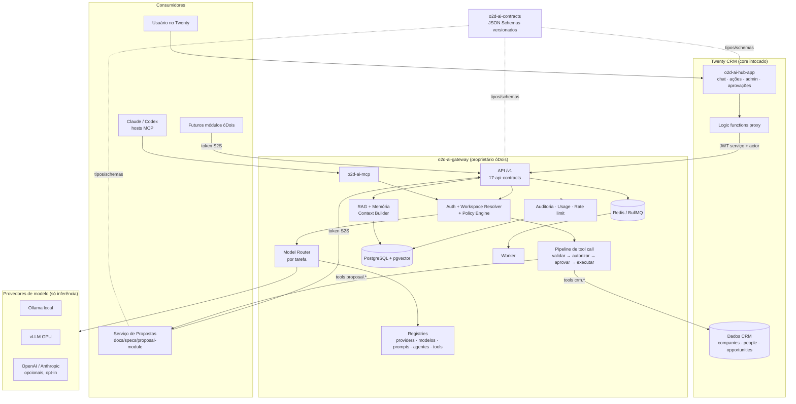
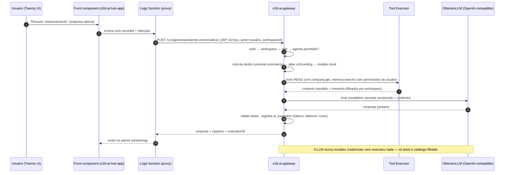
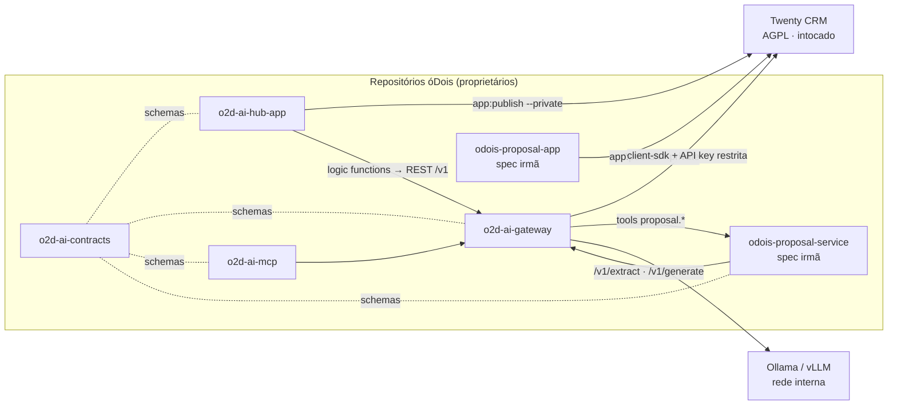

# 04 — Arquitetura Alvo (o2d-ai-platform)

> **Arquitetura proposta** (não implementada). Estado atual: `01-current-architecture.md`. Impacto: `02-impact-map.md`.

## 1. Princípio arquitetural central

```
Módulo proprietário ──▶ o2d-ai-gateway ──▶ Provedor de modelo
Twenty ──▶ o2d-ai-hub-app ──▶ o2d-ai-gateway ──▶ LLM local ou externa
```

Nenhum consumidor (Twenty, hub app, Serviço de Propostas, futuros módulos, MCP) conhece provedores concretos. O gateway abstrai providers e roteia por **tarefa** — trocar modelo/engine de inferência não altera consumidores (fluxo 40, `03-functional-spec.md`).

## 2. Decisões estruturantes

| # | Decisão | Justificativa (evidência) |
|---|---|---|
| D1 | **Sem fork; core do Twenty intocado.** Hub = Twenty App; inteligência = serviços externos óDois | Plataforma de Apps cobre UI/objetos/ações (`packages/twenty-sdk/`); AGPL (`LICENSE`); análise de fork rejeitada em `06-twenty-app-spec.md` |
| D2 | **Não depender da IA experimental do Twenty** (regra 17) | Subsistema `engine/metadata-modules/ai/` é funcional mas em evolução rápida e por instância; a plataforma opera mesmo com ele desabilitado |
| D3 | **Gateway em NestJS/TypeScript** (recomendação; FastAPI como alternativa documentada) | Repo 100% TS; AI SDK v6 já cobre openai-compatible/streaming/tools/structured output (`sdk-provider-factory.service.ts` como prova de viabilidade); contratos em JSON Schema mantêm neutralidade de linguagem — decisão final em `24-open-questions.md` |
| D4 | **LLM local primeiro**: Ollama (dev/prod pequena), vLLM (prod GPU), via OpenAI-compatible; externos **opt-in** por workspace e por tarefa | Regras 9–11; flag `allowsSensitiveData` por provider; tarefas sensíveis local-only |
| D5 | **Postgres próprio do gateway com pgvector** | Zero migrations no Twenty; pgvector inexistente no repo (`00` §3) |
| D6 | **BullMQ/Redis** no gateway (sem Celery/Kafka/n8n — inexistentes no repo) | Paridade com o padrão do Twenty (`message-queue/`) |
| D7 | **Pipeline sugerir→validar→aprovar→executar** como único caminho de ação | Regras 1–8; especificado em `05-ai-gateway-spec.md` |
| D8 | **Contratos versionados** (`o2d-ai-contracts`, JSON Schema 2020-12 + bindings zod) | Regra "use contratos versionados"; ponte para eventual consumidor Python |
| D9 | **Isolamento multi-workspace por construção** | workspaceId no token e em toda tabela/query (incl. vetorial); espelha o modelo do Twenty (`workspace-auth.guard.ts`) |
| D10 | **MCP da plataforma no gateway** (`o2d-ai-mcp`), mesma authz, zero camada paralela | Etapa 19 do enunciado; MCP nativo do Twenty permanece para CRUD genérico |
| D11 | Módulo de propostas (spec irmã) passa a consumir o gateway | Nota de compatibilidade em `02-impact-map.md` §5 e `23-implementation-roadmap.md` |

## 3. Arquitetura geral



## 4. Fluxo Twenty → LLM local (caminho canônico)



## 5. Responsabilidades por componente

### 5.1 Twenty CRM (inalterado)
Usuários, workspaces, clientes, contatos, oportunidades, propostas (objetos do módulo de propostas), contratos/projetos (futuros), dados operacionais, permissões (RBAC), experiência administrativa geral. Não roteia modelos, não guarda segredos de provider, não executa inferência.

### 5.2 o2d-ai-hub-app (detalhe em `06-twenty-app-spec.md`)
Chat contextual (side panel), ações de IA nos registros (command menu/page layout), administração visual (providers, modelos, rotas, prompts, agentes, tools), execuções, fila de aprovações, métricas resumidas, status dos serviços. Tudo por chamadas ao gateway via logic functions (actor humano propagado); nenhum segredo no app; nenhuma regra crítica no app.

### 5.3 o2d-ai-gateway (detalhe em `05-ai-gateway-spec.md`)
Autentica; resolve usuário/workspace; autoriza; seleciona modelo por tarefa; monta prompts (registry); busca contexto (tools READ + RAG + memória); executa inferência; valida structured output; interpreta e valida tool calls; solicita aprovação; executa ferramentas aprovadas; audita; mede custos/latência; aplica limites; retries e fallback; impede vazamento entre workspaces.

### 5.4 Provedores de modelo (detalhe em `07`/`08`)
Somente inferência: geração, classificação, extração, embeddings, rerank, visão, áudio (quando suportado). Não conhecem regras de negócio, não recebem credenciais de módulos, não são alcançáveis por nada além do gateway (rede — `21-infrastructure.md`).

### 5.5 Módulos proprietários (ex.: Serviço de Propostas)
Expõem ferramentas controladas (endpoints por trás do Tool Registry); validam regras de negócio próprias (os gates do módulo de propostas continuam valendo — dupla barreira); aplicam permissões; executam operações; retornam resultados estruturados; geram seus próprios eventos.

### 5.6 o2d-ai-contracts
JSON Schemas versionados (`<nome>@<semver>`): tools (input/output), respostas estruturadas, contratos de agentes, eventos `ai.*`, envelopes de API; bindings gerados (zod/TS; Pydantic opcional); validações compartilhadas; changelog e política de compatibilidade (major = breaking).

### 5.7 o2d-ai-mcp (detalhe em `19-mcp-spec.md`)
Tools/resources para Claude, Codex e hosts autorizados — traduz identidade e **delega ao pipeline do gateway** (mesma authz, mesmos limites, mesmas aprovações).

## 6. Integração dos módulos (visão de dependências)



Sentidos permitidos: consumidores → gateway; gateway → Twenty/módulos/providers. Proibidos: qualquer seta direta consumidor → provider; provider → qualquer coisa; LLM → banco.

## 7. Regras obrigatórias → mecanismo (rastreabilidade)

| Regra (enunciado) | Mecanismo | Doc |
|---|---|---|
| 1 LLM nunca acessa banco | Sem credenciais no contexto do modelo; rede segregada | 05, 14, 21 |
| 2 LLM nunca executa ação | Só o Tool Executor chama módulos | 05, 09 |
| 3 LLM só sugere tool call | Tool calls são dados; pipeline decide | 05 |
| 4 Gateway valida toda tool call | Tool Call Validator (schema da versão) | 05, 09 |
| 5 Schema de entrada e saída por tool | `ai_tool` + o2d-ai-contracts | 09, 16 |
| 6 Nível de risco por tool | READ/LOW_WRITE/SENSITIVE_WRITE/CRITICAL/FORBIDDEN | 09 |
| 7 Sensível exige aprovação humana | Approval Service + AIApprovalRequest | 15 |
| 8 Irreversível indisponível para IA | Classe FORBIDDEN nunca registrada no catálogo executável | 09 |
| 9 Funciona com LLM local | Ollama/vLLM como rota default | 07, 08, 21 |
| 10 Externos opcionais | opt-in por workspace/tarefa; default off | 08 |
| 11 OpenAI-compatible | OpenAICompatibleProvider como adapter principal | 07 |
| 12 Prompts versionados | Prompt Registry (estados DRAFT→…→ARCHIVED) | 11 |
| 13 Execuções auditáveis | ai_execution + eventos + correlation | 16, 18, 20 |
| 14 Multi-workspace sem vazamento | workspaceId em token/tabela/query; testes | 14, 22 |
| 15 Permissões do usuário iniciador | on-behalf-of em toda tool | 05, 14 |
| 16 Segredos nunca em texto puro | secretRef + cifra; mascaramento em logs | 14, 16 |
| 17 Não depender da IA alpha do Twenty | D2; hub usa front components próprios | 02, 06 |
| 18 Lógica crítica sob controle óDois | Gateway/contracts/mcp proprietários | 02, 04 |

## 8. Requisitos não-funcionais (alvos MVP)

| Requisito | Alvo |
|---|---|
| Latência de chat (primeiro token, modelo local) | p95 < 3 s (dependente de hardware — validar na F1) |
| Latência de tool READ | p95 < 800 ms |
| Disponibilidade do gateway | 99,5% (fila absorve indisponibilidade de providers) |
| Isolamento | 0 incidentes de cruzamento de workspace (testes bloqueantes) |
| Auditoria | 100% das execuções com `ai_execution` + eventos correlacionados |
| Custo | registro de 100% dos tokens/tempo GPU; limites ativos por workspace |
