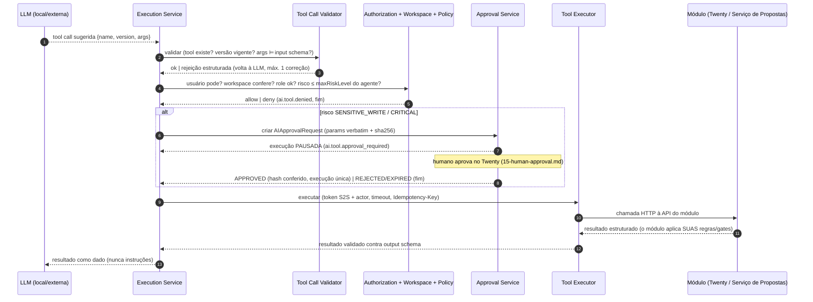
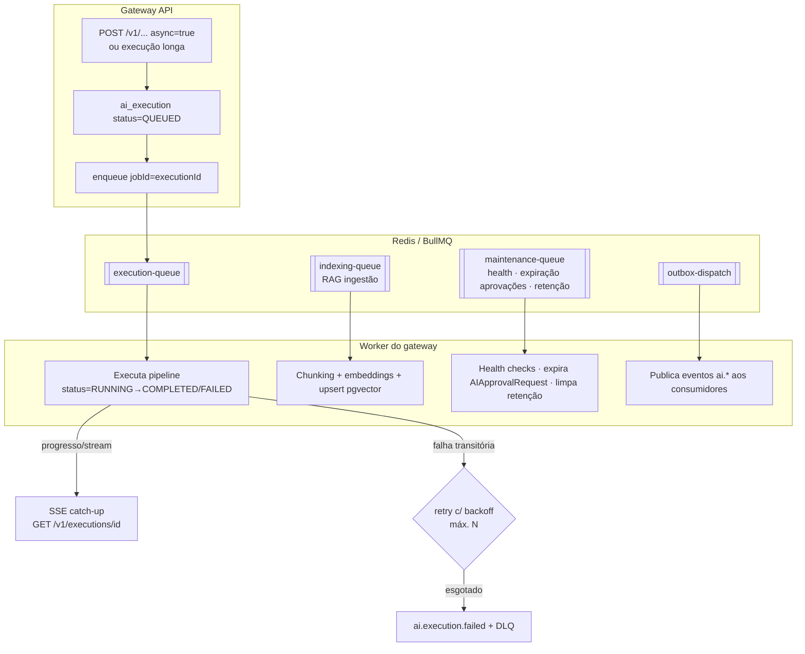

# 05 — Especificação do o2d-ai-gateway

> **Arquitetura proposta** (não implementada). Serviço proprietário óDois; recomendação de stack: NestJS/TypeScript (decisão registrada em `24-open-questions.md`). API em `17-api-contracts.md`; dados em `16-data-model.md`.

## 1. Visão de módulos internos

O gateway é um serviço stateless (estado em Postgres/Redis) composto pelos componentes abaixo. Convenção: cada componente é um módulo NestJS com serviço injetável; nomes de tabela em `16-data-model.md`.

### 1.1 Tabela de componentes

Colunas: Responsabilidade · Entradas → Saídas · Dependências · Persistência · Falha (critério e comportamento) · Observabilidade (métricas/spans próprios).

| Componente | Responsabilidade | Entradas → Saídas | Dependências | Persistência | Falha | Observabilidade |
|---|---|---|---|---|---|---|
| **Authentication Service** | Validar credencial de cada chamador (JWT de serviço com `actor`, token S2S de módulo, token MCP, token interno de worker); emitir contexto autenticado | request → `AuthContext {callerType, actorUserId?, workspaceId, scopes}` | chaves/segredos (secretRef) | não (stateless; cache de chaves) | credencial inválida ⇒ 401; nunca degrada para anônimo | `o2d_ai_auth_failures_total`; span `auth` |
| **Authorization Service** | RBAC/ABAC: mapear actor→roles (`ai-user/ai-approver/ai-admin` + roles Twenty relevantes) e decidir ação | AuthContext + ação/recurso → allow/deny(motivo) | Twenty (client-sdk, cache de roles), Policy Engine | cache Redis TTL curto | deny ⇒ 403 + evento `ai.tool.denied` quando tool | `o2d_ai_authz_denied_total{reason}` |
| **Workspace Resolver** | Resolver e fixar o workspace da execução; injetar `workspaceId` em TODO acesso a dados; recusar divergência token×header | AuthContext + `X-O2d-Workspace-Id` → workspace validado | Authentication | não | divergência ⇒ 403 `WORKSPACE_MISMATCH` | contador de mismatches (alerta de segurança) |
| **Provider Registry** | CRUD e resolução de provedores (`ai_provider`); instanciar ProviderAdapter certo; health state | config admin → adapters prontos | Health Check, secrets | `ai_provider` | provider inativo/off ⇒ excluído da seleção | `ai.provider.online/offline`; gauge por provider |
| **Model Registry** | Catálogo de modelos (`ai_model`) com capacidades/limites/aliases | admin → modelos resolvíveis | Provider Registry | `ai_model` | modelo inativo ⇒ fora de rotas; rota sem modelo ⇒ erro de config sinalizado | gauge modelos ativos |
| **Model Router** | Selecionar modelo por **tarefa** (critérios em `08-model-routing-and-fallback.md`); acionar Fallback Service | task + requisitos → modelo escolhido | Model/Provider Registry, Usage, Health | `ai_model_route` | nenhum candidato ⇒ `MODEL_UNAVAILABLE` (erro controlado) | `ai.model.selected`; histograma decisão |
| **Prompt Registry** | Prompts versionados `chave@semver` com estados (11-prompt-registry.md); resolução em runtime + hash | key@version → template+config | Contracts (schemas) | `ai_prompt` | prompt não-PUBLISHED em produção ⇒ erro de config | versão usada etiquetada em métricas |
| **Agent Registry** | Agentes versionados com allowlist de tools, rota, política (10-agent-registry.md) | agentId → definição resolvida | Prompt/Tool Registry | `ai_agent` | agente inativo/na̋o permitido p/ workspace ⇒ 404/403 | execuções por agente |
| **Tool Registry** | Catálogo de tools com schemas, risco, permissões, endpoint (09-tool-registry.md); gerar catálogo **filtrado** por agente+usuário+workspace | contexto → catálogo filtrado (sem FORBIDDEN, sem tools acima do maxRiskLevel) | Authorization, Contracts | `ai_tool` | tool desconhecida/versão divergente ⇒ rejeição | `o2d_ai_tool_catalog_size`; `ai.tool.denied` |
| **Context Builder** | Montar contexto: registro aberto (tools READ), memória de conversa, memória do cliente, RAG — dentro do orçamento de tokens do modelo | pedido+conversationId → blocos de contexto com origem/citações | Tool Executor, RAG, Memory | não (usa fontes) | fonte indisponível ⇒ degrada com aviso no contexto (nunca inventa) | tokens de contexto por origem |
| **RAG Service** | Busca vetorial com filtro obrigatório workspace+permissões antes do ranking; reranking; score mínimo; citações (13-context-rag-and-memory.md) | query → passagens citáveis | pgvector, embeddings (via Router), Authorization | `ai_knowledge_source`, `ai_knowledge_chunk` | índice vazio ⇒ resposta sem RAG (sinalizado) | `o2d_ai_rag_hits`, latência |
| **Memory Service** | Memória de conversa (janela+sumarização) e fatos de cliente (curados) | conversationId/companyRef → memórias filtradas | Postgres, Authorization | `ai_conversation`, `ai_message`, `ai_memory_fact` | — | volume de fatos, taxa de uso |
| **Structured Output Validator** | Validar TODA saída estruturada contra schema versionado; normalizar; retry 1x com erros anexados; falha controlada (12-structured-output.md) | output bruto + schemaRef → objeto validado \| `STRUCTURED_OUTPUT_INVALID` | Contracts | não | inválido pós-retry ⇒ erro ao chamador; **nunca** repassa não validado | `ai.structured_output.invalid/validated`; taxa por schema/modelo |
| **Tool Call Validator** | Validar tool call sugerida: tool existe, versão vigente, args conformes ao input schema, idempotencyKey presente p/ writes | tool call → validada \| rejeitada | Tool Registry, Contracts | não | inválida ⇒ devolvida à LLM como erro estruturado (1 retry) ou abortada | `ai.tool.requested/validated` |
| **Tool Executor** | **Único** componente que chama módulos/Twenty; injeta token S2S + actor; aplica timeout/idempotência; registra execução | tool validada+aprovada → resultado estruturado | Approval, HTTP client (com guard SSRF, padrão `secure-http-client` do Twenty como referência) | `ai_tool_execution` | erro do módulo ⇒ `ai.tool.failed` + resultado de erro à LLM (sem stack) | latência/erro por tool |
| **Approval Service** | Criar/gerir `AIApprovalRequest` (hash de parâmetros, expiração, execução única, invalidação) — `15-human-approval.md` | tool SENSITIVE/CRITICAL → aprovação pendente; decisão → retomada | Authorization (aprovador humano), Events | `ai_approval_request` | expiração ⇒ `ai.approval.expired`; replay ⇒ bloqueado | fila de pendências (gauge), tempo até decisão |
| **Policy Engine** | Regras declarativas por workspace: risco máximo, fallback externo on/off por tarefa, local-only p/ dados sensíveis, janelas de uso | contexto de decisão → veredicto | config em `ai_model_route`/policies | tabela de políticas (jsonb versionado) | política ausente ⇒ default restritivo (deny externo, menor risco) | decisões negadas por política |
| **Execution Service** | Orquestrar o ciclo de vida da execução (`ai_execution`): sync/async, streaming, cancelamento, retry; laço LLM⇄tools com limite de iterações | request → executionId + resultado/stream | Router, Prompt/Agent, Validators, Executor, Queue | `ai_execution` | limite de iterações/timeout ⇒ `ai.execution.failed` controlado | `ai.execution.*`; duração por tarefa |
| **Audit Service** | Trilha append-only: execuções, tool calls, aprovações, decisões de política, com correlation/causation; export | eventos → registros imutáveis | Events/outbox | `ai_execution`, `ai_tool_execution`, outbox | escrita de auditoria falhou ⇒ a operação falha (auditoria é obrigatória, não best-effort) | lag do outbox |
| **Usage Service** | Medir tokens in/out, tempo GPU (métricas vLLM), duração, custo estimado; agregações por usuário/workspace/tarefa/modelo | execução → `ai_usage_record` | Metrics, Registry (custos) | `ai_usage_record` | — | custo/tokens por dimensão |
| **Rate Limit Service** | Limites por usuário/role/workspace/agente/tarefa/modelo/período; 429 com retry-after | chave composta → allow/throttle | Redis (janela deslizante) | contadores Redis | acima do limite ⇒ 429 + evento | `o2d_ai_rate_limited_total{dim}` |
| **Fallback Service** | Cadeia local→local→externo(opt-in)→erro; circuit breaker por provider; retries com backoff antes de trocar | falha de modelo → próximo candidato | Router, Policy Engine, Health | estado de breaker em Redis | cadeia esgotada ⇒ `MODEL_UNAVAILABLE` | `ai.model.fallback_selected`; taxa de fallback |
| **Health Check Service** | Sondas por provider/modelo (latência, disponibilidade); alimentar Router; expor `/v1/health` | cron → estados | Provider Registry, worker | cache + histórico curto | provider off ⇒ evento + exclusão da seleção | uptime por provider |

### 1.2 Interfaces (resumo)
- Norte (consumidores): REST `/v1/*` (`17-api-contracts.md`), SSE para streaming; MCP via `o2d-ai-mcp`.
- Sul (providers): ProviderAdapter (`07-provider-and-model-registry.md`).
- Leste (módulos/Twenty): HTTP S2S do Tool Executor; twenty-client-sdk para `crm.*`.
- Interno: BullMQ (jobs), outbox de eventos (`18-event-contracts.md`).

## 2. Pipeline de tool call (fluxo obrigatório)

A LLM **sugere**; o gateway decide e executa. Diagrama canônico (regras 1–8):

Garantias de construção:
- A LLM não possui credenciais, URLs de módulos, nem acesso de rede além do retorno do gateway (rede segregada — `21-infrastructure.md`).
- `POST /v1/tools/{name}/execute` não é alcançável pela LLM: tool calls só entram no pipeline via Execution Service; o endpoint exige credencial de serviço autorizada e passa pelo mesmo pipeline.
- Tools `FORBIDDEN` não existem no catálogo executável — não há o que validar/aprovar (regra 8).
- Resultado de tool volta à LLM **como dado** com envelope demarcado; instruções contidas em dados são ignoradas por política de prompt (`14-security-and-permissions.md`).

## 3. Processamento assíncrono

Convenções (espelhando o Twenty — `message-queue/`): `jobId` determinístico = `executionId` (idempotência de enfileiramento); retries com backoff exponencial; DLQ com reprocesso manual; cancelamento coopera via flag checada entre etapas (`POST /v1/executions/{id}/cancel`); streaming com catch-up de chunks (padrão análogo ao `stream-agent-chat.job.ts` do Twenty, reimplementado).

## 4. Ciclo de vida da execução

Estados de `ai_execution`: `QUEUED → RUNNING → COMPLETED | FAILED | CANCELED`; sub-estado `WAITING_APPROVAL` (execução pausada com contexto persistido; retomada após decisão). Toda transição emite evento `ai.execution.*` com correlationId (propagado desde o consumidor) e causationId (evento anterior).

## 5. Tratamento de erros (taxonomia)

| Código | Situação | Comportamento |
|---|---|---|
| `MODEL_UNAVAILABLE` | cadeia de fallback esgotada | erro controlado; nunca fila infinita |
| `STRUCTURED_OUTPUT_INVALID` | pós-retry de correção | erro ao chamador; output nunca repassado |
| `TOOL_CALL_INVALID` | args fora do schema após 1 correção | abortar tool; LLM informada; execução pode concluir sem a tool |
| `TOOL_DENIED` | authz/política | evento `ai.tool.denied`; auditado |
| `APPROVAL_REQUIRED/EXPIRED/INVALIDATED` | ciclo de aprovação | `15-human-approval.md` |
| `WORKSPACE_MISMATCH` | isolamento | 403 + alerta de segurança |
| `RATE_LIMITED` | limites | 429 + retry-after |
| `TIMEOUT` | inferência/tool | cancelamento cooperativo + retry/fallback conforme política |

## 6. Requisitos de implementação (não-funcionais)

- Stateless horizontal (sessões/streams com catch-up via Redis); worker separado (mesmo repo, processo distinto — padrão `src/queue-worker/` do Twenty).
- Config por classe tipada com grupos e validação (padrão `config-variables.ts` do Twenty como referência).
- Logs estruturados com correlationId/causationId; mascaramento de segredos/PII (`20-observability-and-costs.md`).
- Migrations versionadas com `up`/`down` no repositório do gateway (Postgres próprio; **zero** migrations no Twenty).
- Testes: `22-test-strategy.md` (os 18 cenários canônicos são gate de release).
