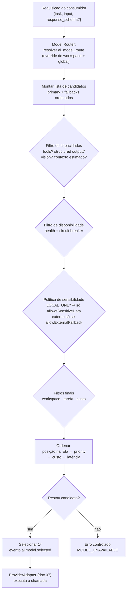
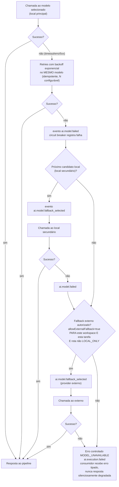

# 08 — Model Router e Fallback

> Plataforma o2d-ai-platform · componente: **o2d-ai-gateway** (Model Router + Fallback Service + Policy Engine, apoiados pelo Health Check Service do doc 07).
> Status: **[PROPOSTO]** — nada implementado. Referências ao repositório real marcadas **[ATUAL]**. Dúvidas → doc 24.

## 1. Princípio: roteamento por TAREFA, nunca por modelo

O consumidor (hub app, Serviço de Propostas, MCP, worker) informa **apenas a tarefa**:

`proposal.extract` · `proposal.write` · `meeting.summarize` · `document.analyze` · `requirements.extract` · `customer.summarize` · `semantic.search` · `chat.general` · `chat.contextual` (família `chat.*`)

O consumidor **NUNCA** informa modelo técnico, provider ou adapter. Trocar modelo/provider é operação administrativa do gateway e não altera uma linha de código nos consumidores (invariante central do canon).

> [ATUAL] Contraste: no Twenty nativo o consumidor escolhe `modelId` diretamente (`ai-agent/agent.entity.ts`, defaults `AI_MODELS_DEFAULT_FAST/SMART/RECOMMENDED` em `core-modules/twenty-config/config-variables.ts`). A plataforma inverte isso: a indireção tarefa→modelo é obrigatória.

## 2. Tabela `ai_model_route` [PROPOSTO]

Fonte da verdade do roteamento (Postgres do gateway, doc 16):

| Campo | Tipo | Descrição |
|---|---|---|
| `id` | uuid | — |
| `task` | text | Tarefa (ex.: `proposal.extract`). Única por `(task, workspaceId)` |
| `primaryModelAlias` | text fk | Alias principal (→ `ai_model.alias`, doc 07) |
| `fallbackModelAliases` | text[] | Fallbacks **ordenados** (locais primeiro; externos por último, se houver) |
| `allowExternalFallback` | boolean | **Default `false`**. Configurável por workspace e por tarefa |
| `policy` | jsonb | Política da rota: `sensitivity` (`LOCAL_ONLY` \| `EXTERNAL_ALLOWED`), `maxCostMicrosPerCall`, `maxLatencyMs`, `minContextTokens` |
| `workspaceId` | uuid null | `null` = rota global; preenchido = **override por workspace** (vence a global) |
| `active` | boolean | — |

Rotas iniciais (exemplo; aliases do doc 07):

| Task | Principal | Fallbacks | `allowExternalFallback` | Sensibilidade |
|---|---|---|---|---|
| `proposal.extract` | `o2d-extraction` | `[o2d-long-context]` | false | LOCAL_ONLY |
| `proposal.write` | `o2d-writing` | `[o2d-extraction]` | false (opt-in por workspace) | EXTERNAL_ALLOWED |
| `meeting.summarize` | `o2d-writing` | `[o2d-long-context]` | false | LOCAL_ONLY |
| `document.analyze` | `o2d-long-context` | `[o2d-extraction]` | false | LOCAL_ONLY |
| `requirements.extract` | `o2d-extraction` | `[o2d-long-context]` | false | LOCAL_ONLY |
| `customer.summarize` | `o2d-writing` | `[o2d-extraction]` | false | LOCAL_ONLY |
| `semantic.search` | `o2d-embedding` (+ `o2d-reranker`) | `[]` | false | LOCAL_ONLY |
| `chat.general` | `o2d-writing` | `[o2d-extraction]` | false (opt-in) | EXTERNAL_ALLOWED |
| `chat.contextual` | `o2d-writing` | `[o2d-extraction]` | false | LOCAL_ONLY |

## 3. Critérios de seleção [PROPOSTO]

Todos os critérios do enunciado, aplicados pelo Model Router a cada requisição:

| # | Critério | Fonte |
|---|---|---|
| 1 | Capacidade requerida (chat/tools/structured output/embeddings/vision/audio/streaming) | Flags do `ai_model` × necessidade da requisição (ex.: `response_schema` presente ⇒ exige `supportsStructuredOutput`) |
| 2 | Disponibilidade | Health status (doc 07) + circuit breaker |
| 3 | Latência | Métricas recentes por modelo (p95 móvel) × `policy.maxLatencyMs` |
| 4 | Contexto necessário | **Estimado por contagem de tokens do input** (prompt + contexto RAG + histórico) × `maxContextTokens` |
| 5 | Structured output exigido | Idem critério 1 |
| 6 | Tool calling exigido | Idem critério 1 (agente com `allowedTools` não vazio ⇒ exige `supportsTools`) |
| 7 | Visão / áudio | Idem critério 1 |
| 8 | Sensibilidade dos dados | `policy.sensitivity=LOCAL_ONLY` ⇒ **exclui** todo provider com `allowsSensitiveData=false` (na prática, todos os externos) |
| 9 | Limite de custo | `estimatedCostPer1kTokensMicros` × tokens estimados × `policy.maxCostMicrosPerCall` + limites do Usage/Rate Limit Service (doc 20) |
| 10 | Prioridade | `ai_model.priority` |
| 11 | Carga atual | Fila/uso por provider (métricas vLLM, contadores Redis) |
| 12 | Workspace | `allowedWorkspaceIds` do modelo + rota override do workspace |
| 13 | Classificação da tarefa | `allowedTasks` do modelo + rota da tarefa |

### 3.1 Algoritmo determinístico

```
1. Resolver rota: ai_model_route[task, workspaceId] ?? ai_model_route[task, global]
   (sem rota ativa ⇒ MODEL_UNAVAILABLE imediato)
2. Candidatos = [primary] + fallbacks (ordem preservada)
3. FILTRAR por capacidades requeridas (critérios 1, 5, 6, 7)
4. EXCLUIR indisponíveis (health OFFLINE/DEGRADED, circuit breaker aberto)
5. APLICAR política de sensibilidade (LOCAL_ONLY ⇒ remover allowsSensitiveData=false;
   allowExternalFallback=false ⇒ remover externos SEMPRE)
6. EXCLUIR por contexto insuficiente, workspace não permitido, tarefa não permitida,
   custo acima do limite
7. ORDENAR o restante por: posição na rota → priority → custo estimado → latência p95
8. SELECIONAR o primeiro ⇒ evento ai.model.selected
   Lista vazia ⇒ MODEL_UNAVAILABLE (erro controlado, nunca resposta degradada silenciosa)
```

Determinístico por construção: mesma entrada (rota, saúde, política, métricas congeladas) ⇒ mesmo modelo. Sem sorteio, sem "auto" opaco.

## 4. Diagrama — roteamento



## 5. Diagrama — fallback em execução



## 6. Regras de fallback e resiliência [PROPOSTO]

1. **Ordem fixa**: local principal → local secundário → externo autorizado → `MODEL_UNAVAILABLE`. Nunca pula direto para externo.
2. **Fallback externo é duplamente opt-in**: exige `allowExternalFallback=true` na rota efetiva **do workspace** e **da tarefa** (default `false`). Cenário de teste 12 do doc 22: com a flag desativada, o fallback externo comprovadamente **não** ocorre.
3. **Tarefas sensíveis são local-only**: `policy.sensitivity=LOCAL_ONLY` prevalece sobre `allowExternalFallback` — mesmo `true`, externo é excluído (defesa em dupla camada; cenário 11 cobre o caminho permitido).
4. **Retries antes de fallback**: N tentativas com backoff exponencial + jitter no mesmo modelo (apenas erros transitórios: timeout, 429, 5xx). Erro de validação de entrada não é retentado.
5. **Circuit breaker por provider**: X falhas em janela Y ⇒ circuito aberto, provider sai do pool sem esperar o health check periódico; half-open após cooldown. Estados alimentam `ai.provider.offline`/`online` (doc 07).
6. **Eventos**: `ai.model.selected`, `ai.model.failed`, `ai.model.fallback_selected` (envelope doc 18) — todos com `correlationId` da execução; a `ai_execution` registra o modelo efetivamente usado e a cadeia de fallback.
7. **Troca de rota é administrativa e auditada**: alterar `primaryModelAlias`/fallbacks é feito via hub app (fluxo 40 do doc 03 — "trocar modelo de uma tarefa sem tocar nos consumidores"), gera trilha de auditoria e **não requer deploy nem mudança em consumidor algum**.
8. **Custo/limite estourado não faz fallback para modelo mais caro**: limite do Usage/Rate Limit Service (doc 20) ⇒ `429` + evento, não roteamento alternativo.
