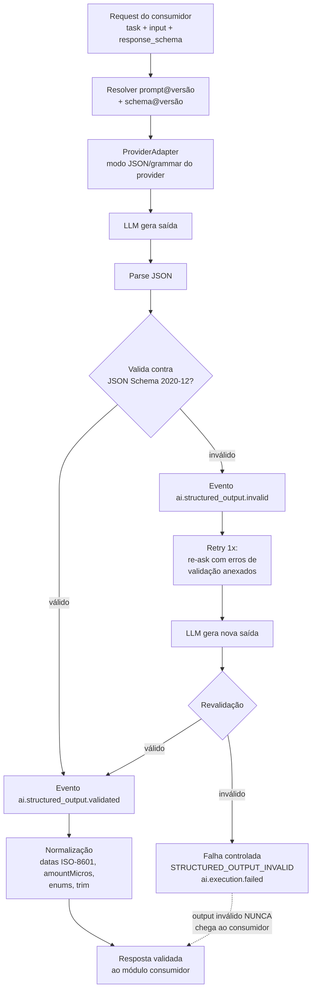

# 12 — Structured Output (Saída Estruturada Validada)

> Plataforma o2d-ai-platform — especificação proprietária da óDois.
> Status: **[PROPOSTO]** — nada deste documento está implementado. Referências **[ATUAL]** apontam para o estado real do repositório Twenty.

## 1. Princípio

**Toda resposta de LLM é não confiável até ser validada.** Nenhum texto ou JSON produzido por modelo é repassado a um módulo consumidor (Serviço de Propostas, hub app, workers) sem passar pelo **Structured Output Validator** do o2d-ai-gateway. Output inválido **nunca** chega ao módulo consumidor — cenários de teste 13 e 14 do doc 22 são gates de release.

## 2. Padrão de schemas

- **Fonte da verdade: JSON Schema 2020-12**, versionado no pacote `o2d-ai-contracts` como `<nome>@<semver>` (ex.: `proposal-extraction@1.0.0`).
- **Bindings gerados**: zod/TypeScript (gateway e consumidores TS) e, opcionalmente, Pydantic (se algum consumidor Python existir — decisão de stack no doc 24). Os bindings são gerados a partir do JSON Schema, nunca escritos à mão — o contrato é language-neutral.
- **Registro versionado de response schemas** no gateway: cada schema publicado é imutável; mudanças geram nova versão semver. Prompts (`outputSchema`, doc 11), tools (input/output, doc 05) e requests de extração referenciam sempre `nome@versão` exata.

## 3. Contrato de request/response

Request de extração estruturada (via `POST /v1/extract`, doc 17):

```json
{
  "task": "proposal.extract",
  "input": {
    "message": "Crie uma proposta para a Bluefit..."
  },
  "response_schema": "proposal-extraction@1.0.0"
}
```

Resposta validada e normalizada (exemplo):

```json
{
  "intent": "create_proposal",
  "customer": { "name": "Bluefit", "matchedCompanyId": "uuid-ou-null" },
  "proposal": {
    "title": "Proposta Bluefit",
    "validUntil": "2026-09-04",
    "currencyCode": "BRL"
  },
  "items": [
    {
      "description": "Implantação",
      "quantity": "1",
      "unitPrice": { "amountMicros": "125000000000", "currencyCode": "BRL" }
    }
  ],
  "missing_fields": ["proposal.validUntil.confirmed"],
  "warnings": ["Cliente 'Bluefit' possui 2 registros similares no CRM"],
  "confidence": 0.93
}
```

Campos padrão do envelope estruturado: `missing_fields` (o que o modelo não conseguiu extrair — o consumidor decide perguntar ao usuário), `warnings` (ambiguidades detectadas) e `confidence` (0–1). O gateway anexa ainda metadados de execução fora do payload (`executionId`, `schema`, `promptHash` — doc 16/17).

## 4. Normalização (após validação)

O validador normaliza antes de entregar ao consumidor:

| Regra | Padrão |
|---|---|
| Datas | ISO-8601 (`YYYY-MM-DD` ou timestamp com offset). "4 de setembro" ⇒ `2026-09-04`. |
| Moedas | `{ amountMicros, currencyCode }` — **paridade com o composite `CURRENCY` do Twenty** (`packages/twenty-shared/src/types/composite-types/currency.composite-type.ts` **[ATUAL]**), que armazena `amountMicros` + `currencyCode`. R$ 125.000,00 ⇒ `amountMicros: "125000000000"`, `currencyCode: "BRL"`. |
| Decimais | **Nunca float**: strings decimais ou micros (inteiros como string). Evita erro de ponto flutuante em valores financeiros. |
| Enums | Estritos — valor fora do enum do schema ⇒ inválido (sem coerção "fuzzy"). |
| Campos obrigatórios | `required` do JSON Schema aplicado sem exceções; ausência ⇒ inválido (o modelo deve usar `missing_fields`, não omitir chaves obrigatórias). |
| Strings | Aparadas (trim), sem caracteres de controle; normalização unicode NFC. |

## 5. Mecanismos por provider

A obtenção de JSON conforme schema varia por provider e é **abstraída pelo `ProviderAdapter`** (doc 07) — consumidores só conhecem `response_schema`:

| Provider | Mecanismo |
|---|---|
| Ollama (OpenAI-compatible / nativa) | `format` com JSON Schema (modo JSON/grammar). |
| vLLM | Guided decoding (`guided_json` / structured outputs OpenAI-compatible). |
| llama.cpp server | Grammar (GBNF) derivada do schema. |
| OpenAI / Anthropic (opcionais) | Structured outputs nativos / **tool-based extraction** (schema como tool única forçada). |

Independentemente do mecanismo do provider, a validação do gateway **sempre** roda — o modo JSON do provider aumenta a taxa de acerto, mas não substitui a validação (o provider pode garantir sintaxe, não semântica/normalização).

## 6. Fluxo de validação



Regras do fluxo:

1. **Retry único**: em falha de validação, o gateway re-envia ao modelo o output anterior + os erros de validação (caminho JSON Pointer + mensagem) e pede correção. **Uma** tentativa (evita loop de custo).
2. Falha na revalidação ⇒ erro controlado `STRUCTURED_OUTPUT_INVALID` no envelope de erro padrão da API (doc 17), com `executionId` para diagnóstico. O consumidor recebe o **erro**, jamais o payload inválido.
3. Eventos `ai.structured_output.invalid` e `ai.structured_output.validated` (doc 18) publicados em cada avaliação; a taxa de inválidos é métrica de observabilidade por modelo/tarefa/prompt (doc 20) e insumo do CI de prompts (doc 11).
4. O mesmo validador roda sobre **outputs de tools** antes de retornarem à LLM (pipeline do doc 05) — a não-confiança é simétrica.

## 7. Relação com os cenários de teste (doc 22)

- **Cenário 13**: forçar saída inválida (schema violado após retry) ⇒ consumidor recebe `STRUCTURED_OUTPUT_INVALID`, nunca o JSON malformado.
- **Cenário 14**: prompt injection embutida em documento/input não pode alterar as regras — a saída continua obrigada a validar contra o schema registrado; instruções injetadas que tentem mudar formato/campos resultam em invalidação ou em conteúdo confinado aos campos do schema.

## 8. Questões em aberto (→ doc 24)

- Suporte a `additionalProperties: false` estrito vs. tolerância com descarte (proposta: estrito no schema, descarte silencioso proibido).
- Threshold mínimo de `confidence` por tarefa (decisão do consumidor ou política central do gateway).
