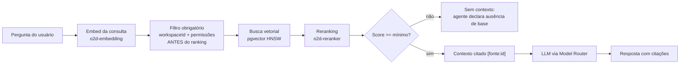
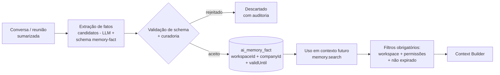

# 13 — Contexto, RAG e Memória

> Plataforma o2d-ai-platform — especificação proprietária da óDois.
> Status: **[PROPOSTO]** — nada deste documento está implementado. Referências **[ATUAL]** apontam para o estado real do repositório Twenty.

## 1. [ATUAL] Estado do repositório: tudo é novo

Verificado por busca no repositório (evidências no canon):

- **pgvector**: zero ocorrências. **Embeddings**: zero (único hit de "embedding" é falso positivo em `render-apollo-playground.util.ts`). **RAG**: inexistente. **`AgentMemory`**: inexistente.
- O Twenty persiste conversas de agente (`engine/metadata-modules/ai/ai-agent-execution/`, `ai-chat/`), mas **não há** memória de longo prazo, base vetorial nem recuperação semântica.

Conclusão: **todas as capacidades deste documento vivem no o2d-ai-gateway** (Context Builder, RAG Service, Memory Service — doc 04), com pgvector no **Postgres do gateway** — zero migrations no core do Twenty (decisão canônica 5).

## 2. Camadas de contexto

Cinco camadas, com separação clara de origem, ciclo de vida e controle de acesso:

| Camada | Conteúdo | Origem / armazenamento | Obtenção |
|---|---|---|---|
| **Contexto imediato** | O registro aberto no Twenty: empresa, contato, proposta, projeto, contrato, oportunidade | Twenty (fonte da verdade CRM) | Tools READ (`crm.company.get`, `proposal.get`, `project.get`, `contract.get`, `crm.opportunity.get`...) executadas **com as permissões do usuário iniciador** (on-behalf-of, regra 14) — nunca acesso direto a banco (regra 1) |
| **Memória de conversa** | Turnos da conversa atual e recente | `ai_conversation` / `ai_message` (Postgres do gateway) | Janela deslizante de N turnos + **sumarização** dos turnos antigos (o resumo entra no contexto no lugar do histórico integral) |
| **Memória do cliente** | Fatos consolidados por company: decisões, reuniões, contratos, preferências | `ai_memory_fact` (Postgres do gateway), chaveados por `companyId` + `workspaceId` | `memory.search` (tool READ); fatos passam por **curadoria** (§6) e possuem **expiração** (`validUntil`) |
| **Base documental** | Atas, propostas, contratos, documentos de visão, requisitos, manuais, políticas, templates | Originais em MinIO/S3; chunks + embeddings em `ai_knowledge_source` / `ai_knowledge_chunk` (pgvector) | `document.search` → pipeline RAG (§4) |
| **Memória organizacional óDois** | Documentos internos da óDois (metodologia, padrões de proposta/contrato, políticas comerciais) | Mesmo pipeline da base documental, `sourceType: org` | RAG com escopo organizacional (visível conforme permissões; nunca mistura com dados de cliente de outro workspace) |

O **Context Builder** (endpoint `POST /v1/context/build`, doc 17) monta o contexto final de uma execução combinando as camadas habilitadas em `contextSources` do agente (doc 10), respeitando limite de tokens por camada e registrando quais fontes foram incluídas (auditoria).

## 3. Fontes de verdade

| Fonte | Papel |
|---|---|
| **Twenty** | Dados CRM (companies, people, opportunities, notas, tasks). Sempre lidos via API/tools, nunca replicados como verdade no gateway. |
| **Postgres + pgvector do gateway** | Chunks, embeddings, memória (`ai_memory_fact`), conversas, fontes de conhecimento. Fonte da verdade dos índices — não dos documentos. |
| **MinIO/S3** | Arquivos originais (PDFs, atas, contratos). O chunk referencia o original (`sourceUri` + versão). |
| **Serviços proprietários** | Ex.: Serviço de Propostas (specs em `docs/specs/proposal-module/`) — dados de propostas via tools `proposal.*`. |
| **GitLab** | **Questão aberta (→ doc 24)**: não existe integração GitLab no repositório (zero ocorrências). Só entra como fonte documental **se e quando** a óDois confirmar que o usa; não é premissa da arquitetura. |

## 4. Pipeline RAG

Fluxo completo, do documento à resposta citada:

1. **Ingestão** — registro em `ai_knowledge_source` (origem, `workspaceId`, tipo, versão, permissões, `validUntil`); upload do original para MinIO/S3; processamento assíncrono no worker do gateway (BullMQ). Eventos `ai.knowledge.indexed` / `ai.knowledge.index_failed` (doc 18).
2. **Extração de texto** — por formato (PDF, DOCX, Markdown, HTML), preservando estrutura (títulos, tabelas) quando possível.
3. **Chunking por tipo de documento** (valores sugeridos, ajustáveis por avaliação):

   | Tipo | Estratégia | Tamanho alvo | Overlap |
   |---|---|---|---|
   | Contratos / políticas | Por cláusula/seção | ~512 tokens | 64 tokens |
   | Atas / reuniões | Por tópico/decisão | ~512 tokens | 64 tokens |
   | Propostas / templates | Por seção comercial | ~768 tokens | 96 tokens |
   | Manuais / visão / requisitos | Por heading hierárquico | ~1024 tokens | 128 tokens |

4. **Embeddings** — rota `o2d-embedding` (modelo **local**, doc 06); dimensão fixa por versão de índice.
5. **Metadados obrigatórios por chunk** — `{ workspaceId, sourceType, recordRefs, permissions, validUntil, version }`. Chunk sem esses metadados **não é indexado** (validação no worker).
6. **Indexação** — `ai_knowledge_chunk` com índice **pgvector HNSW** (+ índices compostos por `workspaceId`).
7. **Busca** — **FILTRO OBRIGATÓRIO por `workspaceId` + permissões do usuário iniciador aplicado ANTES do ranking vetorial** (predicado SQL na query, nunca pós-filtro em memória). Decisão canônica 6: predicado presente em TODA query vetorial, coberto por teste.
8. **Reranking** — top-K da busca vetorial reordenado pela rota `o2d-reranker`.
9. **Score mínimo** — resultados abaixo do threshold são descartados; sem resultados ⇒ o agente responde que não encontrou base (nunca inventa).
10. **Citações internas** — todo trecho usado entra no contexto com marcador `[fonte:id]`; a resposta final referencia as fontes, permitindo à UI do hub app exibir/expandir o documento original.
11. **Atualização / exclusão / versionamento / retenção** — reindexação por versão de documento (chunks antigos removidos ou marcados como versão anterior); exclusão da fonte remove chunks e embeddings; documentos com `validUntil` vencido são **excluídos do retrieval ou entregues com indicação explícita de expirados** (nunca como vigentes); política de retenção por workspace.

## 5. Proibições com enforcement

| Proibição | Enforcement | Teste (doc 22) |
|---|---|---|
| Busca retornar conteúdo de outro workspace | Predicado `workspaceId` obrigatório em toda query vetorial; `X-O2d-Workspace-Id` validado contra o token (doc 17) | Cenário 5 |
| Retornar documento que o usuário não tem permissão de ver | Filtro de `permissions` do chunk contra as permissões resolvidas do actor, antes do ranking | Cenário 4 |
| Misturar contexto entre clientes (companies) | `recordRefs` no metadado do chunk + filtro por company quando o contexto é de um cliente específico | Cenário 6 |
| Expor dados financeiros a usuário sem acesso financeiro | Tools `finance.*` exigem permissão financeira (doc 05); chunks financeiros carregam `permissions` correspondentes | Cenário 4 |
| Usar documento expirado sem indicação | `validUntil` no predicado de busca: excluído por default, ou incluído com flag `expired: true` visível na citação | — (teste próprio do RAG Service) |

Todos os enforcement são do **gateway** (RAG Service) — nunca delegados ao prompt. Instrução de prompt é mitigação adicional, não controle (alinhado ao cenário 14: prompt injection em documento não altera regras).

## 6. Memória de fatos (Memory Service)

Fatos de cliente **não** são gravados automaticamente a partir de qualquer conversa. Pipeline:

1. Durante/após uma conversa ou sumarização de reunião, o agente pode propor **fatos candidatos** (ex.: "Bluefit prefere faturamento mensal", "decidido em reunião de 2026-08-01: escopo fase 2 aprovado").
2. Candidatos passam por **validação e curadoria**: validação estrutural (schema `memory-fact@1.0.0` de `o2d-ai-contracts` — structured output, doc 12) + política de curadoria por workspace (auto-aceite para fatos de baixa sensibilidade; revisão humana no hub app para os demais).
3. Fato aceito vira `ai_memory_fact` com `{ workspaceId, companyId, factType, content, sourceRef, validUntil, curatedBy }`.
4. Uso futuro: `memory.search` aplica os **mesmos filtros** de workspace + permissões do retrieval documental; fatos expirados saem do retrieval.
5. Expiração/revisão: fatos têm `validUntil` (ou revisão periódica); contradições (fato novo contradiz antigo) marcam o antigo como superseded na curadoria.

## 7. Fases e questões em aberto

- Entrega: **Fase F6** do roadmap (doc 23) — pgvector, fontes, memórias, filtros de permissão, reranking.
- Questões (→ doc 24): GitLab como fonte documental (não existe no repo — confirmar uso real na óDois); parâmetros definitivos de chunking/threshold por avaliação; política default de curadoria (auto-aceite vs. revisão) por tipo de fato; retenção/anonimização de `ai_conversation`/`ai_message`.
