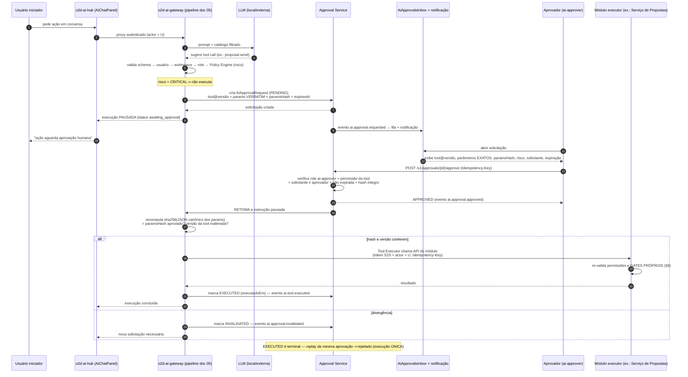
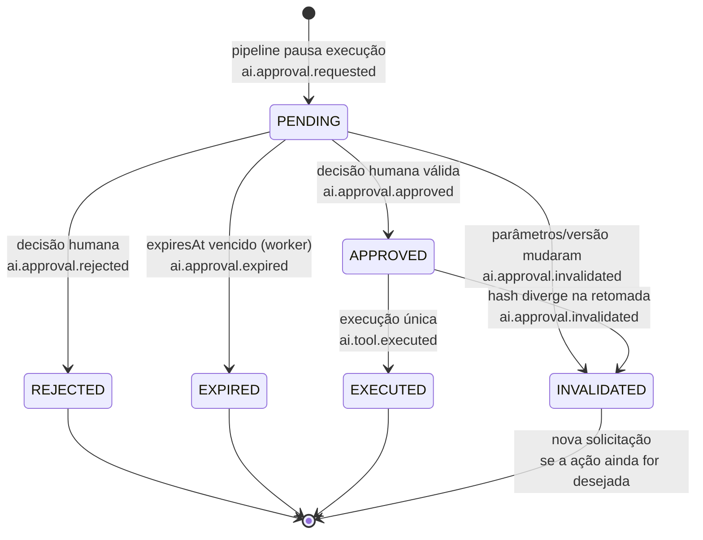

# 15 — Aprovação Humana (AIApprovalRequest)

> Arquitetura **proposta** (não implementada). O Approval Service vive no **o2d-ai-gateway**; a UI de aprovação vive no app `o2d-ai-hub` (doc 06, `AiApprovalsInbox`).
> Convenção: **[ATUAL]** = existe no repositório (caminho real); **[PROPOSTO]** = a construir.
> [ATUAL] O Twenty **não** possui aprovação humana de tool call — apenas confirmação de UI no command menu (`openCommandConfirmationModal`, `packages/twenty-sdk/src/sdk/front-component/functions/openCommandConfirmationModal.ts`). Todo este documento é [PROPOSTO].

## 1. Modelo canônico (fluxo do enunciado)

**LLM sugere ação → Gateway classifica risco → cria `AIApprovalRequest` → Twenty exibe (AiApprovalsInbox do hub app + notificação) → usuário revisa os parâmetros EXATOS → aprova/rejeita → Gateway executa ou cancela.**

A aprovação é sempre sobre **parâmetros concretos e congelados**, nunca sobre uma intenção genérica ("a IA quer enviar uma proposta") — o aprovador vê a tool, a versão, os parâmetros verbatim e o hash.

## 2. Quando uma aprovação é exigida

| Nível de risco da tool (canon) | Comportamento |
|---|---|
| READ | auto-executável (dentro das permissões do usuário) |
| LOW_WRITE | auto-executável + auditoria |
| SENSITIVE_WRITE | confirmação do usuário na conversa **ou** `AIApprovalRequest`, conforme `approvalPolicy` do agente (doc 10) e política do workspace |
| CRITICAL | **sempre** `AIApprovalRequest` (aprovação humana forte); ex.: `proposal.approve`, `proposal.send`, `contract.sign`, `payment.register` |
| FORBIDDEN | nunca chega aqui — não existe no catálogo (doc 14 §9.15) |

**Quem pode solicitar:** qualquer execução (chat do hub, agente, módulo S2S, MCP) cujo pipeline encontre uma tool SENSITIVE/CRITICAL validada. A "solicitação" não é uma ação do usuário — é o próprio pipeline (doc 05) pausando a execução.

## 3. Dados da solicitação (doc 16, tabela `ai_approval_request`)

| Campo | Especificação |
|---|---|
| `executionId` | execução pausada que originou a solicitação |
| `toolName` + `toolVersion` | **versão da ferramenta congelada** na solicitação — a execução pós-aprovação usa exatamente esta versão; se a tool for atualizada/despublicada nesse meio-tempo ⇒ `INVALIDATED` |
| `params` | parâmetros aprovados armazenados **VERBATIM** (JSON como será executado) |
| `paramsHash` | **sha256 do JSON canônico** dos parâmetros (serialização canônica: chaves ordenadas, sem espaços, UTF-8 — mesmo padrão do snapshot hash do doc irmão `proposal-module/09` §1.3) |
| `risk` | nível de risco no momento da solicitação |
| `requestedFor` | actor iniciador (on-behalf-of — regra 15) |
| `status` | `PENDING` / `APPROVED` / `REJECTED` / `EXPIRED` / `INVALIDATED` / `EXECUTED` |
| `expiresAt` | **default 24 h**, configurável **por tool** (tools de maior risco podem ter janela menor) |
| `approvedBy`, `decidedAt` | decisor humano + instante da decisão |
| `decisionContext` | IP, user-agent, canal (hub app / MCP), contexto de autenticação — auditoria §7 |
| `executedAt` | instante da **execução única** |
| `workspaceId` | isolamento (doc 14 §4) |

## 4. Quem pode aprovar

- Role **`ai-approver`** (gateway; mapeada no hub app — doc 06 §8) **e** a permissão da **tool subjacente**: quem não pode executar `proposal.send` manualmente não pode aprová-la para a IA.
- **Solicitante ≠ aprovador**: configurável por workspace/tool (default: exigido para CRITICAL; opcional para SENSITIVE_WRITE).
- Identidade **humana** obrigatória (ver §9 para MCP).
- Decisão via `POST /v1/approvals/{id}/approve` ou `/reject` (doc 17), com `Idempotency-Key`.

## 5. Sequência completa

## 6. Invalidação e execução única

- **Qualquer mudança de parâmetros** entre a criação e a execução (re-geração pelo modelo, edição, mudança de contexto) ⇒ o hash recomputado diverge do `paramsHash` aprovado ⇒ solicitação vira `INVALIDATED` e uma **nova** solicitação é criada com os novos parâmetros. Nunca se "reaproveita" aprovação (teste 8 do doc 22).
- **Execução única**: `APPROVED → EXECUTED` é transição atômica (lock transacional no Postgres do gateway); segunda tentativa com a mesma aprovação ⇒ rejeitada + evento de auditoria. `Idempotency-Key` na chamada ao módulo garante que retry de rede não duplique a ação (teste 15).
- **Expiração**: worker do gateway (BullMQ — padrão [ATUAL] do repo, `engine/core-modules/message-queue/`) varre `PENDING` vencidas ⇒ `EXPIRED` + evento; aprovação expirada é inutilizável (teste 9).
- **Prevenção de replay**: decisão e execução exigem token válido + `jti`/`Idempotency-Key`; o estado terminal `EXECUTED` bloqueia replay lógico; callbacks assinados com timestamp+nonce (doc 14 §6).

## 7. Auditoria

Cada transição grava: quem (actor humano), quando, IP/user-agent, canal, contexto de autenticação (tipo de token), hash dos parâmetros, versão da tool, correlationId da execução. Trilha completa em `ai_approval_request` + eventos `ai.approval.*` + `ai_execution` (teste 18). Referência [ATUAL] de trilha de auditoria: `engine/core-modules/audit/` + `timelineActivity`.

## 8. Máquina de estados

Eventos canônicos (doc 18): `ai.approval.requested` · `ai.approval.approved` · `ai.approval.rejected` · `ai.approval.expired` · `ai.approval.invalidated` (+ `ai.tool.approval_required` / `ai.tool.executed` na execução). Envelope padrão com `workspaceId`, `actor`, `correlationId`, `causationId`; publicação via outbox → BullMQ; consumidores idempotentes.

## 9. Relação com o gate do módulo de propostas — dupla barreira

A aprovação de IA no gateway **NÃO substitui** o gate humano do Serviço de Propostas (`docs/specs/proposal-module/09-approval-and-security.md` §1: aprovação obrigatória, snapshot hash, gate `canSendProposal`). Para `proposal.approve`/`proposal.send`:

1. **Barreira 1 (gateway)**: `AIApprovalRequest` — um humano autoriza a IA a *tentar* a ação, com aqueles parâmetros exatos.
2. **Barreira 2 (módulo)**: o Tool Executor chama a API do Serviço de Propostas, que re-aplica **integralmente** seus próprios gates (papel de aprovador, versão aprovada + `snapshotHash`, estado da máquina do doc `proposal-module/07`). Se o gate do módulo negar, a execução falha de forma controlada — a aprovação de IA não "força" nada.

**Ambos se aplicam, sempre.** O mesmo vale para qualquer módulo executor com gates próprios (`contract.sign`, `payment.register`). A aprovação de IA responde "a IA pode executar isto?"; o gate do módulo responde "esta ação é válida no domínio?".

## 10. Aprovação via MCP

Decidir uma aprovação pelo `o2d-ai-mcp` (doc 19) **exige identidade humana confirmada** — OAuth 2.1 do usuário (padrão [ATUAL] espelhado: `engine/api/mcp/guards/mcp-auth.guard.ts`) ou API key pessoal. Credencial de agente/automação (token S2S, token de worker, sessão de agente sem humano vinculado) ⇒ **403** + evento de auditoria. Assistentes (Claude/Codex) podem *listar* e *apresentar* solicitações ao usuário, mas a decisão é sempre do humano autenticado, com as mesmas verificações do §4.

## 11. UI no Twenty (resumo — detalhes no doc 06)

- `AiApprovalsInbox` (front component do hub): fila `PENDING` com parâmetros verbatim + `paramsHash` exibidos, contagem regressiva de expiração, decisão com `openCommandConfirmationModal`.
- Notificação: e-mail disparado pelo Approval Service + objeto leve opcional `aiApprovalNotification` para timeline (doc 06 §7) — o Twenty [ATUAL] não tem centro de notificações in-app persistente.
- A UI é conveniência: a autoridade é o gateway; qualquer decisão fora da UI (API/MCP) passa pelas mesmas verificações.
