# 16 — Modelo de Dados

> **Arquitetura proposta** (não implementada). Fonte da verdade: **PostgreSQL do o2d-ai-gateway** (com pgvector) para TODAS as entidades da plataforma; o Twenty **não** recebe espelhos de dados do gateway (a UI do hub app lê via API). Única exceção opcional: objeto leve de notificação de aprovação (ver §4). **Zero migrations no Twenty.**

## 1. Diagrama ER

```mermaid
erDiagram
    AI_PROVIDER ||--o{ AI_MODEL : "modelos"
    AI_MODEL ||--o{ AI_MODEL_ROUTE : "principal/fallback"
    AI_MODEL_ROUTE o|--o{ AI_AGENT : "rota do agente"
    AI_PROMPT o|--o{ AI_AGENT : "system prompt"
    AI_AGENT ||--o{ AI_EXECUTION : "execuções"
    AI_PROMPT o|--o{ AI_EXECUTION : "prompt usado"
    AI_MODEL o|--o{ AI_EXECUTION : "modelo usado"
    AI_EXECUTION ||--o{ AI_TOOL_EXECUTION : "tool calls"
    AI_TOOL ||--o{ AI_TOOL_EXECUTION : "ferramenta"
    AI_TOOL_EXECUTION o|--o| AI_APPROVAL_REQUEST : "aprovação"
    AI_CONVERSATION ||--o{ AI_MESSAGE : "mensagens"
    AI_CONVERSATION o|--o{ AI_EXECUTION : "origem"
    AI_KNOWLEDGE_SOURCE ||--o{ AI_KNOWLEDGE_CHUNK : "chunks"
    AI_EXECUTION ||--o{ AI_USAGE_RECORD : "uso"

    AI_PROVIDER {
        uuid id PK
        string name UK
        enum type "OPENAI_COMPATIBLE|OLLAMA|VLLM|LLAMACPP|OPENAI|ANTHROPIC"
        string baseUrl
        string secretRef "referência a segredo; NUNCA plaintext"
        boolean active
        boolean allowsSensitiveData "externo default false"
        enum status "ONLINE|OFFLINE|DEGRADED"
        timestamptz lastHealthCheckAt
    }
    AI_MODEL {
        uuid id PK
        string alias UK "o2d-extraction, o2d-writing..."
        uuid providerId FK
        string modelIdentifier "nome real no provider"
        enum kind "CHAT|EMBEDDING|RERANK"
        int contextWindow
        boolean supportsChat
        boolean supportsTools
        boolean supportsStructuredOutput
        boolean supportsEmbeddings
        boolean supportsVision
        boolean supportsAudio
        boolean supportsStreaming
        int priority
        int timeoutMs
        jsonb estimatedCost "por 1M tokens / hora GPU"
        boolean active
        jsonb allowedWorkspaceIds "null = todos"
        jsonb allowedTasks "null = todas"
    }
    AI_MODEL_ROUTE {
        uuid id PK
        string task UK "com workspaceId (override)"
        uuid workspaceId "null = default global"
        uuid primaryModelId FK
        jsonb fallbackModelIds "ordenados"
        boolean allowExternalFallback "default false"
        jsonb policy "local-only, custo máx..."
        boolean active
    }
    AI_AGENT {
        uuid id PK
        string key UK "com versão"
        string name
        text description
        string version "semver"
        string systemPromptRef "chave@versão do Prompt Registry"
        string modelRouteTask
        jsonb allowedTools "allowlist explícita"
        jsonb contextSources
        jsonb memoryPolicy
        jsonb allowedRoles
        jsonb allowedWorkspaceIds
        enum maxRiskLevel "READ|LOW_WRITE|SENSITIVE_WRITE|CRITICAL"
        jsonb approvalPolicy
        numeric temperature
        int maxTokens
        int timeoutMs
        boolean active
    }
    AI_TOOL {
        uuid id PK
        string name "com versão UK"
        string version "semver; schema congelado"
        string module "twenty-crm|proposal-service|..."
        text description
        string inputSchemaRef "o2d-ai-contracts"
        string outputSchemaRef
        enum riskLevel "READ|LOW_WRITE|SENSITIVE_WRITE|CRITICAL"
        jsonb confirmationPolicy
        jsonb requiredPermissions
        int timeoutMs
        boolean idempotent "writes exigem Idempotency-Key"
        string endpoint "URL do módulo + auth S2S ref"
        enum status "ACTIVE|DEPRECATED|DISABLED"
        jsonb allowedWorkspaceIds
        text documentation
    }
    AI_PROMPT {
        uuid id PK
        string key "UK com versão"
        string version "semver"
        enum status "DRAFT|TESTING|PUBLISHED|DEPRECATED|ARCHIVED"
        text content "template"
        jsonb variables
        string inputSchemaRef
        string outputSchemaRef
        string modelRouteTask
        numeric temperature
        int maxTokens
        string author
        timestamptz publishedAt
        timestamptz deprecatedAt
        jsonb testCases
        text changelog
        string contentHash "sha256"
    }
    AI_EXECUTION {
        uuid id PK
        uuid workspaceId "NOT NULL, indexado"
        string userId "usuário Twenty iniciador (on-behalf-of)"
        uuid agentId FK "nullable (tarefa direta)"
        string task
        string promptRef "chave@versão + hash"
        uuid modelId FK
        uuid providerId
        enum status "QUEUED|RUNNING|WAITING_APPROVAL|COMPLETED|FAILED|CANCELED"
        string inputHash "sha256"
        string outputHash
        int tokensIn
        int tokensOut
        int latencyMs
        numeric estimatedCost
        jsonb toolCallsSummary
        jsonb error
        uuid correlationId "indexado"
        uuid causationId
        timestamptz startedAt
        timestamptz finishedAt
    }
    AI_TOOL_EXECUTION {
        uuid id PK
        uuid executionId FK
        string toolName
        string toolVersion
        jsonb parameters "verbatim"
        jsonb result
        enum status "VALIDATED|DENIED|WAITING_APPROVAL|EXECUTED|FAILED"
        uuid approvalRequestId FK "nullable"
        int durationMs
        jsonb error
        string idempotencyKey
    }
    AI_APPROVAL_REQUEST {
        uuid id PK
        uuid workspaceId
        uuid executionId FK
        string toolName
        string toolVersion "congelada"
        jsonb parameters "exibidos ao usuário, verbatim"
        string paramsHash "sha256 JSON canônico"
        enum riskLevel
        enum status "PENDING|APPROVED|REJECTED|EXPIRED|INVALIDATED|EXECUTED"
        timestamptz expiresAt "default +24h"
        string requestedByUserId
        string approvedByUserId "humano; role ai-approver"
        timestamptz decidedAt
        timestamptz executedAt "execução ÚNICA"
        jsonb authContext "IP, tipo de sessão"
    }
    AI_CONVERSATION {
        uuid id PK
        uuid workspaceId
        string userId
        enum contextType "GLOBAL|COMPANY|PROPOSAL|PROJECT|CONTRACT|OPPORTUNITY"
        string relatedRecordId "id no Twenty/módulo"
        uuid agentId FK
        enum status "ACTIVE|ARCHIVED"
        jsonb summary "sumarização incremental"
    }
    AI_MESSAGE {
        uuid id PK
        uuid conversationId FK
        enum role "USER|ASSISTANT|TOOL|SYSTEM"
        text content
        jsonb toolCalls
        jsonb tokenUsage
        timestamptz createdAt
    }
    AI_KNOWLEDGE_SOURCE {
        uuid id PK
        uuid workspaceId
        enum type "DOCUMENT|TWENTY_OBJECT|MODULE_DATA|ORG_KNOWLEDGE"
        jsonb origin "storageKey/URL/objeto"
        jsonb permissions "roles/usuários com acesso"
        enum status "PENDING|INDEXED|FAILED|STALE|EXPIRED"
        timestamptz lastIndexedAt
        string version
        timestamptz validUntil
    }
    AI_KNOWLEDGE_CHUNK {
        uuid id PK
        uuid sourceId FK
        uuid workspaceId "denormalizado p/ filtro obrigatório"
        text content
        vector embedding "pgvector HNSW"
        jsonb metadata "recordRefs, seção, página"
        int chunkIndex
    }
    AI_USAGE_RECORD {
        bigint id PK
        uuid workspaceId
        string userId
        string task
        uuid modelId
        int tokensIn
        int tokensOut
        int durationMs
        int gpuTimeMs "quando disponível (vLLM)"
        numeric estimatedCost
        boolean usedExternalFallback
        timestamptz recordedAt "particionado por mês"
    }
```

Tabelas auxiliares (fora do diagrama): `ai_policy` (políticas por workspace, jsonb versionado), `ai_memory_fact` (fatos curados por cliente — `13-context-rag-and-memory.md`), `idempotency_key` (scope+key únicos, TTL), `event_outbox` (publicação transacional — `18-event-contracts.md`), `secret_ref` opcional (mapeamento p/ secret manager; segredos em si **nunca** no banco em claro — cifra AES-GCM quando inevitável armazenar).

## 2. Constraints e índices essenciais

| Tabela | Regra |
|---|---|
| Todas com dados de execução/conhecimento | `workspaceId NOT NULL` + índice composto iniciando por `workspaceId` (isolamento por construção — teste 5/6 do doc 22) |
| `ai_model_route` | UK `(task, workspaceId)` (workspaceId null = default global; override por workspace) |
| `ai_tool` | UK `(name, version)`; versões publicadas imutáveis (trigger de proteção) |
| `ai_prompt` | UK `(key, version)`; `PUBLISHED` imutável; `contentHash` NOT NULL |
| `ai_execution` | IDX `(workspaceId, startedAt)`, `(correlationId)`, `(userId, startedAt)`; particionamento por mês a partir de volume |
| `ai_approval_request` | `paramsHash` NOT NULL; UK parcial: uma `PENDING` por `(executionId, toolName)`; `executedAt` única gravação (execução única) |
| `ai_knowledge_chunk` | índice HNSW no `embedding`; **toda query vetorial obrigatoriamente com predicado `workspaceId =`** (encapsulado no repositório de dados; acesso direto proibido por revisão/lint) |
| `ai_usage_record`, `ai_message`, `event_outbox` | append-only (sem UPDATE/DELETE em operação normal; retenção por job) |
| `ai_provider.secretRef` | referência (env/secret manager); coluna de valor não existe |

## 3. Fonte da verdade por entidade (normativo)

| Entidade | Fonte da verdade | Twenty (hub app) |
|---|---|---|
| Providers, modelos, rotas | Gateway (`ai_provider`, `ai_model`, `ai_model_route`) | UI de administração lê/escreve via API `/v1` |
| Agentes, prompts, tools | Gateway | idem |
| Execuções, tool executions, uso | Gateway (append-only) | listadas via API (AiExecutionsList) |
| Aprovações | Gateway (`ai_approval_request`) | fila exibida via API; opcional objeto de notificação (§4) |
| Conversas/mensagens | Gateway | painel de chat lê via API/SSE |
| Conhecimento/chunks/memória | Gateway (pgvector) | administração de fontes via API |
| Usuários, workspaces, roles | **Twenty** | gateway resolve/cacheia via client-sdk; nunca duplica cadastro |
| Dados de CRM (companies, people, opportunities) | **Twenty** | acessados só por tools READ com permissões do usuário |
| Dados de propostas | **Serviço de Propostas** (spec irmã) | via tools `proposal.*` |

## 4. Objeto opcional no Twenty (única exceção)

`aiApprovalNotification` (objeto do hub app, opcional na F4): registro leve criado pelo gateway quando surge aprovação pendente — apenas para acionar notificação/visibilidade nativa (timeline, views, futuros workflows). Campos: `approvalRequestId`, `toolName`, `riskLevel`, `status` (espelho, `syncedAt`), `link`. A decisão de aprovar/rejeitar **nunca** ocorre nesse objeto — sempre via API do gateway (que valida identidade humana + hash). Se a experiência de notificação for suficiente sem ele (e-mail + painel), não criar (decisão na F4 — `24-open-questions.md`).

## 5. Retenção e LGPD (resumo; detalhes em `14-security-and-permissions.md`)

- `ai_message`/`ai_execution` (payloads): retenção configurável (sugerido 12 meses; agregados de uso mantidos).
- `ai_knowledge_*`: expurgo junto com a fonte; `validUntil` marca obsolescência.
- Anonimização por titular: mascara conteúdo preservando métricas e trilha de decisão.
- Logs de LLM (prompts/outputs): mascaramento de PII opcional antes de persistir; nunca contêm segredos.
