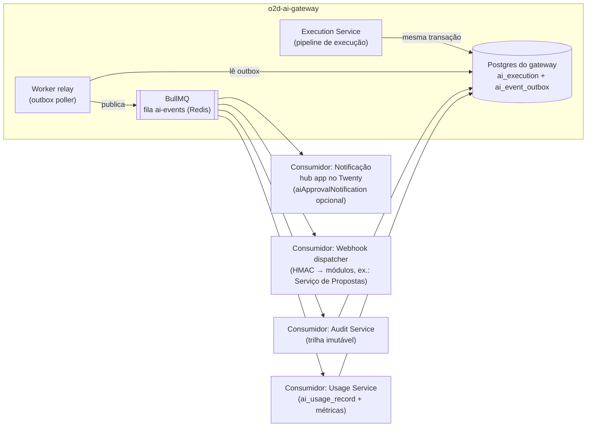

# 18 — Contratos de Eventos

> Plataforma o2d-ai-platform · componente: **o2d-ai-gateway** (Audit/Usage/Execution Services + outbox) · schemas em **o2d-ai-contracts**.
> Status: especificação — **nada aqui está implementado**. Marcações: **[ATUAL]** = existe no repositório Twenty (caminhos reais); **[PROPOSTO]** = arquitetura da plataforma óDois.
> Dúvidas em aberto → doc 24. Canon: `CANON-AI`.

## 1. Estado atual do Twenty [ATUAL]

Padrões do repositório que a plataforma **espelha em infraestrutura própria** (sem reutilizar código AGPL):

| Padrão | Caminho real | Reuso conceitual |
|---|---|---|
| Webhooks de saída com HMAC | `packages/twenty-server/src/engine/metadata-modules/webhook/jobs/call-webhook.job.ts` | Entrega de eventos `ai.*` a módulos proprietários via webhook assinado |
| Filas BullMQ (17 filas, incl. `aiQueue`/`aiStreamQueue`) | `packages/twenty-server/src/engine/core-modules/message-queue/message-queue.constants.ts` | Worker do gateway usa BullMQ/Redis próprios, mesmo padrão |
| Auditoria de eventos | `packages/twenty-server/src/engine/core-modules/event-logs/` (sink ClickHouse) + `timelineActivity` | O gateway persiste auditoria no **seu** Postgres (`ai_execution`, `ai_tool_execution`, doc 16) |

O Twenty **não possui** outbox transacional nem eventos `ai.*` — tudo abaixo é [PROPOSTO].

## 2. Envelope canônico [PROPOSTO]

Todo evento `ai.*` usa o mesmo envelope (schema `ai-event-envelope@1.0.0` em `o2d-ai-contracts/schemas/events/`):

```json
{
  "id": "01J8Z3K9Q2W4E6R8T0Y1U3I5O7",
  "type": "ai.execution.completed",
  "version": "1.0",
  "occurredAt": "2026-08-05T14:32:11.482Z",
  "workspaceId": "20202020-1c25-4d02-bf25-6aeccf7ea419",
  "actor": { "kind": "user", "userId": "…", "onBehalfOf": null },
  "correlationId": "corr_…",
  "causationId": "evt_…",
  "payload": { }
}
```

| Campo | Regra |
|---|---|
| `id` | ULID único do evento — **chave de deduplicação** de todo consumidor |
| `type` | Nome canônico (§4); nunca renomeado — evento novo = tipo novo |
| `version` | Versão do **schema do payload** (`major.minor`); ver §5 |
| `occurredAt` | ISO-8601 UTC do fato (não da publicação) |
| `workspaceId` | Obrigatório em todo evento (isolamento multi-workspace, decisão 6 do canon) |
| `actor` | `{kind: user\|service\|agent\|system, …}` — mesmo modelo on-behalf-of dos endpoints (doc 17) |
| `correlationId` | Propagado da requisição de origem (header `X-Correlation-Id`); une execução inteira |
| `causationId` | `id` do evento que causou este (cadeia causal); `null` na raiz |
| `payload` | Específico por tipo (§4); validado contra o schema versionado antes de publicar |

Segredos e PII **nunca** entram em payload (regra 16 do enunciado; mascaramento no doc 20). Conteúdo de prompt/resposta não trafega em eventos — apenas `inputHash`/`outputHash` e referências (`executionId`).

## 3. Publicação: outbox transacional → BullMQ [PROPOSTO]

1. O serviço produtor grava o efeito de negócio **e** a linha na tabela `ai_event_outbox` na **mesma transação** do Postgres do gateway (nunca "publica e depois grava").
2. O worker do gateway (relay) lê a outbox em ordem (`FOR UPDATE SKIP LOCKED`), publica no BullMQ (fila `ai-events`) e marca `publishedAt`. Falha de publicação ⇒ linha permanece e é retentada — garantia **at-least-once**.
3. Consumidores (fan-out por grupo: auditoria, usage, notificação, webhooks) processam de forma **idempotente**: deduplicação por `event.id` (tabela `processed_event` por consumidor ou `SETNX` no Redis com TTL) + handlers idempotentes por chave natural (`executionId`, `approvalId`).



## 4. Catálogo completo de eventos [PROPOSTO]

Legenda de consumidores: **A** = Audit Service · **U** = Usage/metrics · **H** = hub app (UI execuções/aprovações) · **N** = notificação no Twenty · **W** = webhook para módulos proprietários.

### 4.1 `ai.execution.*` — produtor: Execution Service

| Evento | Schema (o2d-ai-contracts) | Consumidores | Payload típico (campos-chave) |
|---|---|---|---|
| `ai.execution.requested` | `ai.execution.requested@1.0.0` | A, H | `executionId`, `task`, `agentId?`, `inputHash`, `idempotencyKey` |
| `ai.execution.started` | `ai.execution.started@1.0.0` | A, H | `executionId`, `modelId`, `providerId`, `promptKey@version`, `promptHash` |
| `ai.execution.completed` | `ai.execution.completed@1.0.0` | A, U, H, W | `executionId`, `outputHash`, `tokensIn/Out`, `durationMs`, `estimatedCostMicros` |
| `ai.execution.failed` | `ai.execution.failed@1.0.0` | A, U, H, N, W | `executionId`, `errorCode` (`MODEL_UNAVAILABLE`, `STRUCTURED_OUTPUT_INVALID`, …), `failedStep`, `retryable` |
| `ai.execution.canceled` | `ai.execution.canceled@1.0.0` | A, H | `executionId`, `canceledBy` (actor), `reason` |

### 4.2 `ai.model.*` — produtor: Model Router / Fallback Service

| Evento | Schema | Consumidores | Payload típico |
|---|---|---|---|
| `ai.model.selected` | `ai.model.selected@1.0.0` | A, U | `executionId`, `task`, `alias` (ex.: `o2d-extraction`), `modelId`, `providerId`, `local` |
| `ai.model.failed` | `ai.model.failed@1.0.0` | A, U, N | `executionId`, `modelId`, `providerId`, `errorClass` (timeout/5xx/overload), `attempt` |
| `ai.model.fallback_selected` | `ai.model.fallback_selected@1.0.0` | A, U, N | `executionId`, `fromModelId`, `toModelId`, `external` (bool), `reason`; **nunca emitido** se fallback externo desativado no workspace/tarefa (cenário 12, doc 22) |

### 4.3 `ai.structured_output.*` — produtor: Structured Output Validator

| Evento | Schema | Consumidores | Payload típico |
|---|---|---|---|
| `ai.structured_output.validated` | `ai.structured_output.validated@1.0.0` | A | `executionId`, `responseSchema` (`proposal-extraction@1.0.0`), `retriesUsed` |
| `ai.structured_output.invalid` | `ai.structured_output.invalid@1.0.0` | A, U, N | `executionId`, `responseSchema`, `validationErrors[]` (paths, sem valores), `finalFailure` (bool) |

### 4.4 `ai.tool.*` — produtores: Tool Call Validator, Policy Engine, Tool Executor

| Evento | Schema | Consumidores | Payload típico |
|---|---|---|---|
| `ai.tool.requested` | `ai.tool.requested@1.0.0` | A | `executionId`, `toolName@version`, `paramsHash`, `risk` |
| `ai.tool.validated` | `ai.tool.validated@1.0.0` | A | `executionId`, `toolCallId`, `toolName@version`, `risk` |
| `ai.tool.denied` | `ai.tool.denied@1.0.0` | A, U, N | `executionId`, `toolName`, `deniedBy` (schema/user/workspace/role/policy), `reason` |
| `ai.tool.approval_required` | `ai.tool.approval_required@1.0.0` | A, H, N | `executionId`, `approvalId`, `toolName@version`, `risk`, `paramsHash`, `expiresAt` |
| `ai.tool.executed` | `ai.tool.executed@1.0.0` | A, U, W | `executionId`, `toolCallId`, `toolName@version`, `durationMs`, `resultHash`, `approvalId?` |
| `ai.tool.failed` | `ai.tool.failed@1.0.0` | A, U, N, W | `executionId`, `toolCallId`, `toolName@version`, `errorCode`, `retryable` |

### 4.5 `ai.approval.*` — produtor: Approval Service

| Evento | Schema | Consumidores | Payload típico |
|---|---|---|---|
| `ai.approval.requested` | `ai.approval.requested@1.0.0` | A, H, N, W | `approvalId`, `executionId`, `toolName@version`, `paramsPreview` (campos exibíveis), `paramsHash`, `risk`, `expiresAt` |
| `ai.approval.approved` | `ai.approval.approved@1.0.0` | A, H, N, W | `approvalId`, `approvedBy` (humano; nunca agente), `decidedAt` |
| `ai.approval.rejected` | `ai.approval.rejected@1.0.0` | A, H, N, W | `approvalId`, `rejectedBy`, `reason?`, `decidedAt` |
| `ai.approval.expired` | `ai.approval.expired@1.0.0` | A, H, N | `approvalId`, `expiresAt` (worker de expiração) |
| `ai.approval.invalidated` | `ai.approval.invalidated@1.0.0` | A, H, N | `approvalId`, `previousParamsHash`, `newParamsHash`, `newApprovalId?` (hash divergiu, doc 15) |

### 4.6 `ai.knowledge.*` — produtor: worker de indexação (RAG Service)

| Evento | Schema | Consumidores | Payload típico |
|---|---|---|---|
| `ai.knowledge.indexed` | `ai.knowledge.indexed@1.0.0` | A, H | `knowledgeSourceId`, `chunksCount`, `embeddingModel`, `version` |
| `ai.knowledge.index_failed` | `ai.knowledge.index_failed@1.0.0` | A, H, N | `knowledgeSourceId`, `stage` (ingest/chunk/embed/store), `errorCode` |

### 4.7 `ai.provider.*` — produtor: Health Check Service

| Evento | Schema | Consumidores | Payload típico |
|---|---|---|---|
| `ai.provider.online` | `ai.provider.online@1.0.0` | A, H, N | `providerId`, `sinceMs` (tempo offline), `checkedAt` |
| `ai.provider.offline` | `ai.provider.offline@1.0.0` | A, H, N | `providerId`, `errorClass`, `consecutiveFailures`; dispara alerta (doc 20) |

## 5. Versionamento dos schemas [PROPOSTO]

- Fonte da verdade: JSON Schema 2020-12 em `o2d-ai-contracts/schemas/events/<type>@<semver>.json`; bindings zod/TS gerados.
- **Minor** (1.0 → 1.1): apenas campos opcionais adicionados — consumidores antigos continuam válidos (`additionalProperties` tolerado na leitura, estrito na escrita).
- **Major** (1.x → 2.0): mudança incompatível ⇒ o produtor publica **as duas versões em paralelo** durante a janela de migração; consumidores declaram a versão que aceitam; remoção da versão antiga só após todos os consumidores migrarem (verificação no CI do `o2d-ai-contracts` — breaking change quebra o build).
- O campo `version` do envelope reflete o semver do payload; o envelope em si tem schema próprio (`ai-event-envelope@1.0.0`).

## 6. Retry e idempotência por classe de consumidor [PROPOSTO]

| Consumidor | Entrega | Retry | Idempotência |
|---|---|---|---|
| Audit Service | BullMQ, in-process no worker | 5 tentativas, backoff exponencial (1s·2ⁿ), depois DLQ `ai-events-dlq` | Insert-only com unique por `event.id`; conflito ⇒ no-op |
| Usage Service | BullMQ | Idem auditoria | Upsert de `ai_usage_record` por `executionId`; contadores derivados recalculáveis |
| Notificação (hub app/Twenty) | BullMQ → API do hub app (logic function) | 3 tentativas, backoff; falha final só loga (notificação é melhor-esforço, nunca bloqueia pipeline) | Dedupe por `event.id`; `aiApprovalNotification` (opcional, doc 16) com unique por `approvalId+type` |
| Webhook para módulos | HTTP POST assinado (HMAC + timestamp, padrão `call-webhook.job.ts` [ATUAL] reimplementado) | 5 tentativas, backoff exponencial + jitter; endpoint com falha persistente é desabilitado e alertado | Receptor deduplica por `event.id` (contrato de assinatura exige); reenvio manual auditado a partir da DLQ |

Regras gerais: DLQ com reprocessamento manual auditado; ordem garantida apenas **por `correlationId` dentro da outbox** (publicação sequencial), consumidores não devem assumir ordem global; relógio dos consumidores nunca reinterpreta `occurredAt`.
