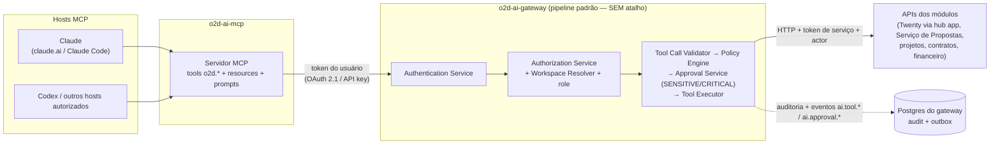

# 19 — Especificação MCP (o2d-ai-mcp)

> Plataforma o2d-ai-platform · componente: **o2d-ai-mcp** (servidor MCP do gateway — mesma authz, zero camada paralela).
> Status: especificação — **nada aqui está implementado**. Marcações: **[ATUAL]** = existe no repositório Twenty (caminhos reais); **[PROPOSTO]** = arquitetura da plataforma óDois.
> Dúvidas em aberto → doc 24. Canon: `CANON-AI`.

## 1. Estado atual do Twenty [ATUAL]

O Twenty já expõe um **servidor MCP nativo** que continua servindo **CRUD genérico do CRM** — a plataforma óDois não o substitui nem o altera:

| O que existe | Caminho real | Observação |
|---|---|---|
| Controller MCP | `packages/twenty-server/src/engine/api/mcp/mcp-core.controller.ts` (`@Controller('mcp')`) | Endpoint MCP nativo |
| Auth OAuth 2.1 | `packages/twenty-server/src/engine/api/mcp/guards/mcp-auth.guard.ts` + discovery `.well-known` em `engine/core-modules/application-oauth/oauth-discovery.controller.ts` | Padrão de referência para o o2d-ai-mcp |
| Protocolo | `packages/twenty-server/src/engine/api/mcp/mcp-protocol.service.ts` | `initialize` / `tools/list` / `tools/call` |
| Tools do ToolRegistry | `packages/twenty-server/src/engine/core-modules/tool-provider/` (descoberta progressiva `learn-tools`/`get-tool-catalog`/`execute-tool`/`load-skill`) | Categorias em `packages/twenty-shared/src/ai/constants/tool-category.const.ts` |
| Annotations | `packages/twenty-server/src/engine/api/mcp/**/mcp-*-annotations.const.ts` | `readOnly`/`destructive` |
| Exclusões | `packages/twenty-server/src/engine/api/mcp/**/mcp-excluded-tool-names.const.ts` | `code_interpreter` e `http_request` fora do MCP |
| Plugins de host | `packages/twenty-codex-plugin/` (skills create/develop/manage/publish-app + use-twenty-mcp; `.mcp.json` → `https://docs.twenty.com/mcp`) e `packages/twenty-claude-skills/` (1 skill) | Claude/Codex já se conectam ao MCP nativo |

Divisão de responsabilidade (decisão 3 do canon): **MCP nativo do Twenty = CRUD genérico do CRM**; **tools `o2d.*` = o2d-ai-mcp**, porque exigem o pipeline de risco/aprovação do gateway.

## 2. o2d-ai-mcp: princípio de arquitetura [PROPOSTO]

O o2d-ai-mcp é uma **fachada MCP do gateway**. Ele não implementa autorização, validação nem execução próprias — **ZERO camada paralela**:

1. Traduz a credencial MCP (OAuth 2.1 / API key por usuário) para a **identidade de usuário do gateway** (actor humano vinculado + workspace).
2. Delega toda chamada ao **pipeline padrão** do gateway (doc 05): schema → usuário → workspace → role → risco → aprovação → executor.
3. Devolve o resultado no formato MCP.

Consequência: Claude, Codex ou qualquer host MCP tem **exatamente as permissões do usuário vinculado** — nada mais (cenário 16 do doc 22).

Não existe rota do host MCP para módulos, banco ou LLM que não passe pelo pipeline — o diagrama não tem aresta que contorne `GW`.

## 3. Tools canônicas `o2d.*` [PROPOSTO]

Classes de risco **idênticas** às do Tool Registry (canon): READ · LOW_WRITE · SENSITIVE_WRITE · CRITICAL · FORBIDDEN (estas últimas **não existem** no catálogo MCP — jamais listadas).

| Tool | Classe de risco | Parâmetros (entrada) | Retorno |
|---|---|---|---|
| `o2d.crm.company.search` | READ | `{ query, limit?, filters? }` | Lista resumida `{ id, name, domain, … }` filtrada pelas permissões do usuário |
| `o2d.crm.company.get` | READ | `{ companyId }` | Registro completo **visível ao usuário** (field permissions respeitadas) |
| `o2d.proposal.create_draft` | LOW_WRITE | `{ companyId, items?, notes? }` | `{ proposalId, status: "DRAFT", url }` — rascunho no Serviço de Propostas; gates de aprovação/envio do módulo permanecem intactos |
| `o2d.proposal.generate_preview` | LOW_WRITE | `{ proposalId }` | `{ artifactId, previewUrl (assinada), watermark: true }` |
| `o2d.project.get_status` | READ | `{ projectId }` | `{ status, milestones[], delays[] }` |
| `o2d.contract.list_expiring` | READ | `{ withinDays }` | Lista `{ contractId, title, expiresAt }` do workspace do usuário |
| `o2d.memory.search` | READ | `{ query, companyId?, topK? }` | Chunks com citações `[fonte:id]` — filtro obrigatório por `workspaceId` + permissões (doc 13) |
| `o2d.ai.agent.run` | Herda o **maxRiskLevel do agente** (doc 10); tool calls SENSITIVE/CRITICAL geradas pelo agente seguem elicitation/aprovação normalmente | `{ agentId, input, conversationId? }` | `{ executionId, output, toolCalls[] }` |

Todas com annotations MCP corretas (`readOnlyHint` para READ; `destructiveHint: false` — tools destrutivas são FORBIDDEN e não existem). Schemas de entrada/saída versionados em `o2d-ai-contracts/schemas/tools/`.

## 4. Resources e prompts MCP [PROPOSTO]

**Resources** (somente leitura, mesma authz — o gateway filtra por usuário/workspace):

| Resource URI | Conteúdo |
|---|---|
| `o2d://models` | Aliases/rotas de modelo disponíveis (nunca segredos de provider) |
| `o2d://executions/{executionId}` | Estado + auditoria resumida de uma execução do próprio usuário |
| `o2d://approvals/pending` | Aprovações pendentes **atribuíveis ao usuário** (leitura; decidir exige §6) |
| `o2d://prompts/{key}` | Metadados de prompt PUBLISHED (key, versão, variáveis — não o conteúdo se marcado interno) |

**Prompts MCP**: templates publicados do Prompt Registry expostos como prompts MCP (ex.: `o2d.customer.summarize`, `o2d.meeting.prepare`) — sempre a versão PUBLISHED (doc 11), nunca strings locais do host.

## 5. Autenticação e identidade [PROPOSTO]

| Aspecto | Regra |
|---|---|
| Padrão recomendado | **OAuth 2.1** com discovery `.well-known` — mesmo desenho do MCP nativo do Twenty (`mcp-auth.guard.ts` [ATUAL] como referência de padrão) |
| Alternativa | **API key por usuário** emitida pelo gateway (escopo MCP, revogável, com expiração) |
| Transporte | Bearer token em toda requisição; TLS obrigatório |
| Proibido | **NUNCA** credencial de workspace inteiro, token de serviço S2S ou chave compartilhada entre usuários — todo token MCP resolve para **um** usuário humano + workspace |
| Roles/workspaces | O token carrega o workspace; `Workspace Resolver` valida; Claude/Codex operam com **as permissões do usuário vinculado** (roles do Twenty respeitadas via Authorization Service) |

## 6. Confirmação, aprovação e revalidação [PROPOSTO]

- Tool SENSITIVE_WRITE ⇒ o o2d-ai-mcp solicita **confirmação/elicitation** ao host (MCP elicitation); o texto exibe tool, parâmetros e efeito.
- Tool CRITICAL ⇒ `AIApprovalRequest` no gateway (doc 15): a chamada MCP retorna `approval_required` + `approvalId`; a decisão acontece na UI do hub app **ou** via MCP.
- **Revalidação no backend, sempre**: a confirmação do host é UX, não segurança — o gateway revalida risco/aprovação independentemente do que o host afirmou.
- Aprovar/rejeitar via MCP exige **identidade humana confirmada**; credencial de agente (ou token sem vínculo humano) ⇒ **403** (canon, doc 15).
- Hash de parâmetros (`paramsHash`) confere na execução pós-aprovação; divergência ⇒ `INVALIDATED` + nova solicitação.

## 7. Auditoria, logs e rate limiting [PROPOSTO]

- Toda chamada MCP gera a **mesma auditoria** do pipeline padrão (`ai_execution`/`ai_tool_execution` + eventos `ai.tool.*`, docs 16/18), com `actor.kind = "user"` e origem `mcp:{host}`.
- Logs estruturados com `correlationId` propagado do host quando fornecido; segredos/PII mascarados (doc 20).
- **Rate limiting por host e por usuário** (Rate Limit Service, doc 20 §6): limites distintos para `mcp:claude`, `mcp:codex`, etc.; excedente ⇒ 429 + evento.
- Catálogo `tools/list` é **filtrado por usuário+workspace** antes de responder — tool que o usuário não pode usar não aparece (mesma regra do catálogo enviado à LLM, doc 05); FORBIDDEN nunca existe na resposta.
