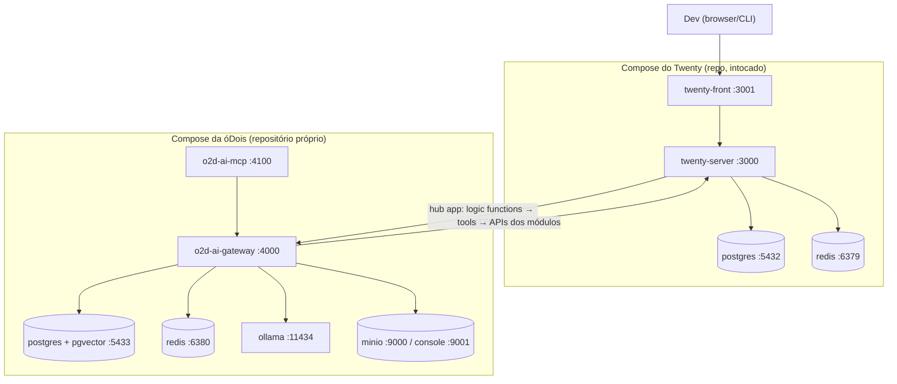
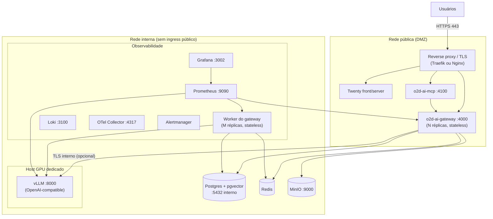

# 21 — Infraestrutura e Deploy

> Plataforma o2d-ai-platform · infraestrutura própria da óDois (docker compose em repositório próprio).
> Status: especificação — **nada aqui está implementado**. Marcações: **[ATUAL]** = existe no repositório Twenty (caminhos reais); **[PROPOSTO]** = arquitetura da plataforma óDois.
> **Regra absoluta**: `packages/twenty-docker/` do repo Twenty **nunca é alterado** — serve apenas como referência ([ATUAL]: `docker-compose.yml`, `otel-collector/`, `grafana/`). O compose da plataforma vive em repositório próprio da óDois (ex.: `o2d-ai-gateway/deploy/`).
> Dúvidas em aberto → doc 24. Canon: `CANON-AI`.

## 1. Três ambientes [PROPOSTO]

| Ambiente | Composição exata | Inferência |
|---|---|---|
| **Dev** | Twenty (compose do repo, intocado) + o2d-ai-gateway + **Ollama** + PostgreSQL/pgvector (do gateway) + Redis (do gateway) + MinIO | Ollama, modelos quantizados pequenos |
| **Produção pequena** | Dev + **worker do gateway** + observabilidade (Prometheus, Grafana, Loki, OTel Collector, Alertmanager) | **Ollama ou vLLM** (CPU forte ou GPU modesta) |
| **Produção GPU** | Produção pequena com **vLLM em host GPU dedicado** + redes segregadas + Prometheus/Grafana/OTel completos | vLLM, GPU dedicada |

O Postgres/Redis do gateway são **separados** dos do Twenty (decisão 5 do canon: pgvector no Postgres do gateway; zero migrations no core).

## 2. Deploy de desenvolvimento [PROPOSTO]

Portas sugeridas (todas configuráveis): gateway `4000`, o2d-ai-mcp `4100`, Ollama `11434`, Postgres do gateway `5433`, Redis do gateway `6380`, MinIO `9000/9001`. Em dev tudo em uma rede Docker local; **mesmo em dev**, Ollama só é alcançável pelo gateway (sem port-mapping público desnecessário).

## 3. Deploy de produção com GPU [PROPOSTO]

**Invariante de rede**: o LLM (vLLM/Ollama) **NUNCA é exposto publicamente** — vive na rede interna e o **gateway é seu único cliente** (worker incluso). Cenário 1 do doc 22 verifica isso por rede e credenciais.

## 4. Definições operacionais [PROPOSTO]

| Tema | Definição |
|---|---|
| **Rede** | Duas redes Docker/VPC: `o2d-public` (proxy, Twenty, gateway, mcp) e `o2d-internal` (Postgres, Redis, MinIO, vLLM, worker, observabilidade). Gateway e worker participam das duas; LLM e bancos só da interna |
| **Portas** | Externas: só `443` (proxy). Internas sugeridas: gateway `4000`, mcp `4100`, vLLM `8000`, Ollama `11434`, Postgres `5432` (interno), Redis `6379` (interno), MinIO `9000`, Prometheus `9090`, Grafana `3002`, Loki `3100`, OTel `4317` |
| **TLS** | Terminação no reverse proxy (certificados automatizados). **TLS interno opcional** por fase: recomendado gateway→vLLM e gateway→Postgres quando atravessarem hosts distintos (mTLS ou tunel WireGuard entre hosts) |
| **Secrets** | Sempre via env/secret manager (Docker secrets, Vault, SOPS) — **nunca em imagem, nunca em repositório**. No banco, apenas `secretRef` + cifra AES-GCM com chave de aplicação (decisão 7 do canon; padrão análogo a `APP_SECRET`/`ENCRYPTION_KEY` do Twenty [ATUAL]) |
| **Volumes** | `o2d-models` (pesos de modelo — Ollama `/root/.ollama`, vLLM cache HF), `o2d-pgdata` (Postgres do gateway), `o2d-minio` (objetos), `o2d-prom`/`o2d-loki` (retenção de telemetria) |
| **GPU** | Drivers NVIDIA + `nvidia-container-toolkit` no host; `--gpus` no serviço vLLM; pin de versão de driver/CUDA compatível com a versão do vLLM |
| **Health checks** | Todos os containers com `healthcheck` (gateway `GET /v1/health`, vLLM `GET /health`, Ollama `GET /api/tags`, Postgres `pg_isready`, Redis `PING`, MinIO `/minio/health/live`); orquestrador só roteia para containers healthy |
| **Backup** | Postgres do gateway: base + **WAL archiving** (PITR), testes de restore periódicos. MinIO: **versioning** habilitado + replicação/snapshot para storage secundário. Pesos de modelo não precisam de backup (re-baixáveis), apenas o manifesto de versões |
| **Escalabilidade** | Gateway e worker são **stateless** ⇒ escala **horizontal** (N réplicas atrás do proxy; worker escala por profundidade de fila). vLLM escala **vertical por GPU** (mais VRAM/GPU maior; múltiplas GPUs por tensor parallelism); segunda instância vLLM só como réplica por modelo |
| **Alta disponibilidade** | Opcional por fase (F8, doc 23): Postgres com réplica + failover, Redis Sentinel, ≥2 réplicas de gateway/worker, segunda GPU como contingência. Prod pequena aceita HA parcial (restore por backup) |
| **Isolamento** | Containers com usuário **não-root**, `read_only` onde possível, `no-new-privileges`, capabilities mínimas; segredos montados, não em env quando o runtime permitir |

## 5. Sizing de VRAM (estimativas) [PROPOSTO]

Valores **exemplificativos para planejamento** — não são compromissos; o sizing real é medido no piloto (doc 24):

| Modelo (classe) | Quantização | VRAM aproximada | Ambiente típico |
|---|---|---|---|
| 7–8B instruct | Q4 (GGUF/Ollama) | 6–8 GB | Dev, prod pequena |
| 7–8B instruct | FP16 (vLLM) + KV cache | 18–24 GB | Prod GPU (1× 24 GB) |
| 14B instruct | Q4 | 10–14 GB | Prod pequena com GPU |
| 32B instruct | Q4 / AWQ (vLLM) | 20–28 GB | Prod GPU (1× 24–48 GB) |
| 70B instruct | Q4 / AWQ | 40–48 GB | Prod GPU (2× 24 GB ou 1× 48 GB) |
| Embedding (o2d-embedding) | — | 1–2 GB | Todos |
| Reranker (o2d-reranker) | — | 2–4 GB | F6+ |

Regra prática do vLLM: reservar ~20–30% da VRAM além dos pesos para KV cache conforme contexto/concorrência (`gpu_memory_utilization`).

## 6. O que fica fora do repo Twenty

- Compose, Dockerfiles, configs de Prometheus/Grafana/Loki/OTel, scripts de backup: **repositório próprio da óDois** (sugerido: `o2d-ai-gateway/deploy/` + `o2d-ai-infra/` se crescer).
- `packages/twenty-docker/` permanece intocado; o Twenty roda com o compose oficial dele, lado a lado.
- O hub app é instalado no Twenty como app (`twenty dev` / `app:publish --private` [ATUAL]: docs em `twenty-docs/developers/extend/apps/**`), sem exigência de infra adicional no lado do Twenty.
