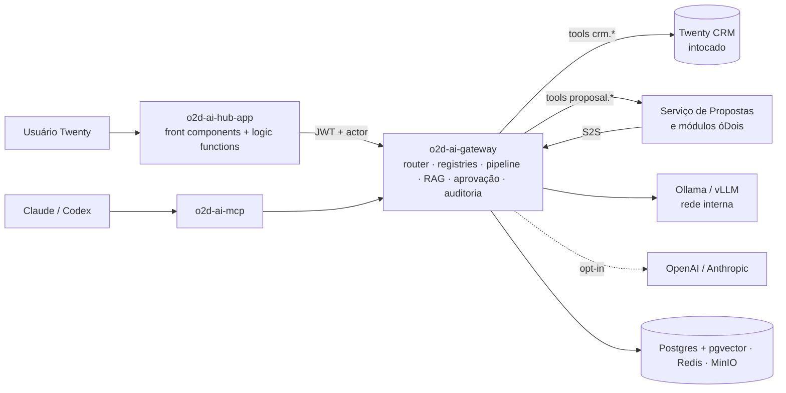

# o2d-ai-platform — Plataforma Central de IA da óDois integrada ao Twenty CRM

> Especificação funcional e técnica de uma camada central de inteligência artificial **proprietária da óDois**, conectando o Twenty CRM e os módulos proprietários (ex.: módulo de propostas — spec irmã em `docs/specs/proposal-module/`) a LLMs **locais** (Ollama/vLLM) e, opcionalmente, externas.
> **Somente documentação** — nenhum código funcional, dependência, migration, serviço ou endpoint foi implementado; nenhum arquivo existente do Twenty foi alterado.

## Visão geral

Quatro componentes:

| Componente | Papel |
|---|---|
| **o2d-ai-hub-app** | Twenty App: chat contextual, ações de IA nos registros, administração (providers, modelos, prompts, agentes, tools), execuções, aprovações pendentes, métricas |
| **o2d-ai-gateway** | Serviço externo: único caminho para LLMs — auth, roteamento por tarefa, prompts, structured output, tool calling validado, RAG, memória, aprovação humana, auditoria, limites, fallback |
| **o2d-ai-contracts** | JSON Schemas versionados (+bindings zod; Pydantic opcional): tools, respostas estruturadas, agentes, eventos |
| **o2d-ai-mcp** | Servidor MCP para Claude/Codex/hosts autorizados — mesma autorização do gateway, sem camada paralela |

**Princípio central:**

```
Módulo proprietário → o2d-ai-gateway → Provedor de modelo
Twenty → o2d-ai-hub-app → o2d-ai-gateway → LLM local ou externa
```

Nenhum consumidor conhece provedores; trocar modelo/engine não altera módulos (roteamento por tarefa: `proposal.extract`, `customer.summarize`, ...).

## Problema

Cada módulo integrando LLM por conta própria geraria: acoplamento a provedores, prompts espalhados, ausência de controle de risco (IA executando ações), impossibilidade de trocar modelo, zero rastreabilidade e risco de vazamento entre workspaces/clientes.

## Objetivo

Uma camada única que dá aos módulos capacidade de IA (chat, extração, geração, RAG, agentes) com: LLM **local primeiro**, externos opt-in, ferramentas com nível de risco e aprovação humana, prompts e contratos versionados, auditoria completa, isolamento multi-workspace por construção e lógica crítica sob controle da óDois.

## Escopo

Gateway com abstração de providers (OpenAI-compatible como denominador comum), roteamento por tarefa e fallback; registries de providers/modelos/prompts/agentes/tools; pipeline sugerir→validar→aprovar→executar; structured output validado; RAG (pgvector) e memória com filtros de permissão; aprovação humana com hash de parâmetros; hub app no Twenty; MCP; observabilidade e custos; 8 fases de implementação.

## Fora do escopo

- Alterações no core do Twenty ou fork (avaliado e rejeitado — `06-twenty-app-spec.md`).
- Dependência da IA experimental nativa do Twenty (regra 17 — ela permanece disponível, mas a plataforma opera sem ela).
- Treinamento/fine-tuning de modelos; autonomia da IA sobre ações críticas (sempre aprovação humana); acesso direto da LLM a banco ou módulos.

## Princípios arquiteturais

1. LLM nunca acessa banco nem executa ações — **só sugere**; o gateway valida, autoriza, aprova e executa (regras 1–8).
2. LLM local primeiro; externos opcionais e desativáveis por workspace/tarefa (regras 9–11).
3. Prompts e contratos versionados; execução 100% auditável (regras 12–13).
4. Multi-workspace sem vazamento; permissões do usuário iniciador (on-behalf-of) (regras 14–15).
5. Segredos nunca em texto puro (regra 16); lógica crítica proprietária óDois (regras 17–18).

## Arquitetura resumida



## Principais decisões

1. **Sem fork; core intocado** — hub via plataforma oficial de Apps; inteligência em serviços externos (AGPL sob controle).
2. **Gateway em NestJS/TypeScript** (recomendação; repo é 100% TS — FastAPI documentado como alternativa, decisão pendente T1).
3. **OpenAI-compatible como denominador comum** de providers — o Twenty já prova a viabilidade (`sdk-provider-factory.service.ts` usa `@ai-sdk/openai-compatible`).
4. **Roteamento por tarefa** com aliases (`o2d-extraction`, `o2d-writing`, ...) e fallback local→local→externo(opt-in)→erro controlado.
5. **Tool Registry com 5 classes de risco** (READ → CRITICAL; FORBIDDEN inexistente no catálogo executável); aprovação humana com hash de parâmetros, expiração e execução única.
6. **Fonte da verdade no Postgres do gateway** (pgvector incluído); Twenty sem espelhos de dados de IA.
7. **MCP delega ao pipeline do gateway** — mesmas permissões, zero autorização paralela.

## Riscos principais

| Risco | Mitigação |
|---|---|
| Qualidade/latência de LLM local em pt-BR | piloto F1 com métricas; roteamento por tarefa permite modelos dedicados; fallback controlado |
| Vazamento entre workspaces via RAG/memória | workspaceId em todo token/tabela/query vetorial; testes bloqueantes 5/6/14 |
| IA executando ação indevida | pipeline com risco/aprovação; FORBIDDEN fora do catálogo; testes 1–4, 7–10 |
| Evolução rápida do SDK de apps / IA nativa do Twenty | versão fixada; workspace de homologação; regra 17 |
| Complexidade operacional (GPU/vLLM/observabilidade) | faseamento F1→F8; F1 roda em uma máquina com Ollama |
| Licenças (AGPL, modelos locais) | revisão jurídica J1–J3 (`24-open-questions.md`) |

## Fases

**F1** Gateway mínimo (OpenAI-compatible→Ollama/vLLM, chat, structured output, auth, logs) · **F2** Twenty App (painel, chat contextual, admin, execuções) · **F3** Tool Registry (schemas, tools CRM/propostas, permissões, auditoria) · **F4** Aprovação humana · **F5** Prompt e Agent Registry · **F6** RAG e memória (pgvector) · **F7** MCP (Claude/Codex) · **F8** Produção avançada (GPU, escala, custos, observabilidade completa). Detalhes: `23-implementation-roadmap.md`.

## Índice dos documentos

| Doc | Conteúdo |
|---|---|
| [00-project-analysis.md](./00-project-analysis.md) | Análise do repositório (recorte IA) com evidências e lacunas |
| [01-current-architecture.md](./01-current-architecture.md) | Subsistema de IA nativo do Twenty e fundamentos a espelhar |
| [02-impact-map.md](./02-impact-map.md) | Reutilizar/espelhar/criar; fork rejeitado; riscos mapeados |
| [03-functional-spec.md](./03-functional-spec.md) | 40 fluxos funcionais detalhados |
| [04-target-architecture.md](./04-target-architecture.md) | Arquitetura alvo, decisões, rastreabilidade das 18 regras |
| [05-ai-gateway-spec.md](./05-ai-gateway-spec.md) | 23 componentes internos; pipeline de tool call; assíncrono |
| [06-twenty-app-spec.md](./06-twenty-app-spec.md) | o2d-ai-hub-app: front components, ações, admin, análise de fork |
| [07-provider-and-model-registry.md](./07-provider-and-model-registry.md) | ProviderAdapter, adapters, registro de modelos e aliases |
| [08-model-routing-and-fallback.md](./08-model-routing-and-fallback.md) | Roteamento por tarefa, critérios, fallback, circuit breaker |
| [09-tool-registry.md](./09-tool-registry.md) | Registro de tools, 5 classes de risco, catálogo filtrado |
| [10-agent-registry.md](./10-agent-registry.md) | Catálogo de 9 agentes com allowlists explícitas |
| [11-prompt-registry.md](./11-prompt-registry.md) | Prompts versionados, estados, goldens, canary |
| [12-structured-output.md](./12-structured-output.md) | Validação/normalização; retry; falha controlada |
| [13-context-rag-and-memory.md](./13-context-rag-and-memory.md) | Camadas de contexto, RAG com filtros obrigatórios, memória |
| [14-security-and-permissions.md](./14-security-and-permissions.md) | AuthN/AuthZ, isolamento, LGPD, tabela de ameaças |
| [15-human-approval.md](./15-human-approval.md) | AIApprovalRequest: hash, expiração, execução única |
| [16-data-model.md](./16-data-model.md) | ER completo no Postgres do gateway; fontes da verdade |
| [17-api-contracts.md](./17-api-contracts.md) | Endpoints /v1 com auth, erros, eventos |
| [18-event-contracts.md](./18-event-contracts.md) | Eventos ai.* com envelope, outbox, consumidores |
| [19-mcp-spec.md](./19-mcp-spec.md) | o2d-ai-mcp: tools o2d.*, mesma authz do gateway |
| [20-observability-and-costs.md](./20-observability-and-costs.md) | OTel/Prometheus/Grafana/Loki; custos e limites |
| [21-infrastructure.md](./21-infrastructure.md) | Ambientes dev/prod/prod-GPU; rede, secrets, backup |
| [22-test-strategy.md](./22-test-strategy.md) | Estratégia de testes + 18 cenários bloqueantes |
| [23-implementation-roadmap.md](./23-implementation-roadmap.md) | 8 fases com entregáveis e critérios de aceite |
| [24-open-questions.md](./24-open-questions.md) | Decisões pendentes (técnicas, negócio, jurídicas) |
