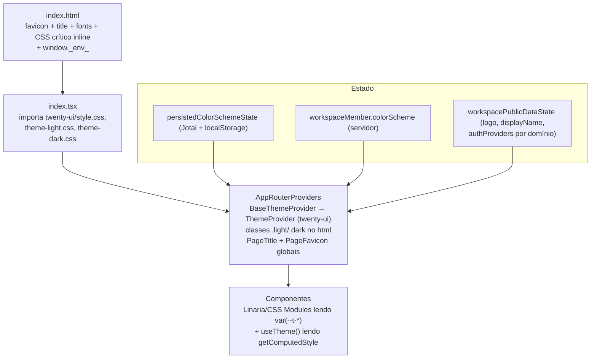

# 01 — Arquitetura Visual Atual do Twenty (estado real, com evidências)

> **Status:** inventário factual do repositório em 2026-08-05. Nada aqui é proposta; é o estado do código.

## 1. Visão geral

O sistema visual do Twenty instalado tem **quatro camadas**:

O tema **não é mais Emotion-first**: `twenty-ui` migrou para variáveis CSS (`--t-*`) + Linaria; o objeto de tema JS é computado lendo as variáveis resolvidas via `getComputedStyle`.

## 2. Sistema de temas e tokens

| Item | Evidência |
|---|---|
| Definição dos tokens (fonte da verdade) | `packages/twenty-ui/src/theme-constants/theme-light.css` (1011 linhas) e `theme-dark.css` (1007 linhas), sob classes `.light` / `.dark` |
| Espelho TS dos tokens | `packages/twenty-ui/src/theme-constants/themeCssVariables.ts` (`background.primary → var(--t-background-primary)`), mantido em sincronia por teste de paridade (`src/theme-constants/__tests__`) |
| Provider real | `packages/twenty-ui/src/theme-constants/ThemeProvider.tsx:107-174` — alterna `.light`/`.dark` no `<html>` (`applyColorSchemeClass`, linhas 94-100), resolve tema via `computeThemeFromCss` (56-92), e **suporta `overrides?: ThemeOverrides` escopados** (wrapper `display: contents`, linhas 159-173) |
| Provider do app | `packages/twenty-front/src/modules/ui/theme/components/BaseThemeProvider.tsx:17-36` — resolve esquema persistido vs. sistema; montado em `packages/twenty-front/src/modules/app/components/AppRouterProviders.tsx:46` |
| Sincronização com preferência do usuário | `packages/twenty-front/src/modules/ui/theme/components/UserThemeProviderEffect.tsx` (montado em `AppRouterProviders.tsx:60`) empurra `workspaceMember.colorScheme` para o provider |
| Persistência do esquema | `packages/twenty-front/src/modules/ui/theme/states/persistedColorSchemeState.ts` — átomo Jotai com `useLocalStorage: true`, default `'System'`; fonte da verdade logada: `currentWorkspaceMember?.colorScheme` em `packages/twenty-front/src/modules/ui/theme/hooks/useColorScheme.ts:15-78` (grava localStorage + otimista + `updateWorkspaceMemberSettings`) |
| Detecção de preferência do SO | `packages/twenty-front/src/modules/ui/theme/hooks/useSystemColorScheme.ts` — `matchMedia('(prefers-color-scheme: dark)')` |
| UI de escolha de tema | `packages/twenty-front/src/pages/settings/profile/appearance/components/SettingsExperience.tsx`; também no dropdown de workspace (`MultiWorkspaceDropdownThemesComponents.tsx`) |
| Objetos legados `THEME_LIGHT`/`THEME_DARK` | `packages/twenty-ui/src/theme/constants/ThemeLight.ts` / `ThemeDark.ts` — ainda exportados (`theme/index.ts:52-53`); único consumidor no front: `packages/twenty-front/src/modules/settings/billing/hooks/useStripeAppearance.ts:30` |
| Anti-flash parcial existente | `packages/twenty-front/index.html:2` (`<html class="light">`), 67-88 — CSS inline com `--theme-dark-background-tertiary: #1d1d1d` / `--theme-light-background-tertiary: #f1f1f1` + `@media (prefers-color-scheme)` apenas para o background do body |

Detalhe dos grupos de tokens reais: ver doc 09 §1.

## 3. Identidade "Twenty" hardcoded (pontos que o Branding Engine precisa cobrir)

| Superfície | Evidência | Mecanismo atual |
|---|---|---|
| Título estático | `packages/twenty-front/index.html:40` — `<title>Twenty</title>` | HTML estático |
| Título dinâmico | `packages/twenty-front/src/utils/title-utils.ts:61-63` — fallback `return 'Twenty'`; `packages/twenty-front/src/modules/ui/utilities/page-title/components/PageTitle.tsx` via `@dr.pogodin/react-helmet`; global em `AppRouterProviders.tsx:41-42,72`; `NotFound.tsx:49` (`Page Not Found \| Twenty`) | fork do react-helmet |
| Favicon estático | `index.html:6-11` — `android-launchericon-48-48.png` com `data-rh="true"` (gerenciável pelo Helmet) | HTML estático |
| Favicon dinâmico | `packages/twenty-front/src/modules/ui/utilities/page-favicon/components/PageFavicon.tsx:8-26` — **já troca o favicon em runtime** para `workspacePublicData.logo`, com fallback `DEFAULT_WORKSPACE_LOGO`; montado em `AppRouterProviders.tsx:73` | Helmet |
| Logo default do app | `packages/twenty-front/src/modules/auth/components/Logo.tsx:62` — `${window.location.origin}/images/icons/android/android-launchericon-192-192.png` | hardcoded |
| Logo default de workspace | `packages/twenty-front/src/modules/ui/navigation/navigation-drawer/constants/DefaultWorkspaceLogo.ts` — `https://twentyhq.github.io/placeholder-images/workspaces/twenty-logo.png` (duplicado em `packages/twenty-emails/src/constants/DefaultWorkspaceLogo.ts`) | constante |
| Nome default de workspace | `.../constants/DefaultWorkspaceName.ts` — `'Twenty'` | constante |
| Manifesto PWA | `packages/twenty-front/public/manifest.json` — `"name"/"short_name": "Twenty"`, `theme_color: #000000`, ~90 ícones em `public/images/icons/{android,ios,windows11}` | estático, sem geração |
| Metadados sociais | `index.html:16-30` — og:title/description/image e twitter:* apontando para `twentyhq/twenty` no GitHub | HTML estático |
| Fontes | `index.html:31-38` — Google Fonts `Inter` e `DM Mono`; `packages/twenty-ui/src/theme/constants/FontCommon.ts` — `family: 'Inter, sans-serif'` | CDN externo |
| Ícones de marca no UI kit | `packages/twenty-ui/src/assets/icons/twenty-star.svg`, `twenty-star-filled.svg` + componentes `IconTwentyStar.tsx` | SVG importado |
| Config de runtime | `index.html:41-47` — `window._env_` reescrito no start do container por `packages/twenty-front/scripts/inject-runtime-env.sh` (referenciado pelo entrypoint em `packages/twenty-docker/twenty/`) | injeção em runtime |

Não existe nenhum arquivo `twenty-logo.svg` standalone no front/ui: o "logo do app" é o PNG do launcher.

## 4. Login (sign-in) — estado atual

- Páginas: `packages/twenty-front/src/pages/auth/SignInUp.tsx:90-240` (v1, layout `StandardContent` em 52-88) e `SignInUpV2.tsx:57-216` (v2, com `SignInUpV2StandardContent.tsx:20-53`).
- Logo no login: `packages/twenty-front/src/modules/auth/components/Logo.tsx:54-109` — logo primário = ícone Twenty; `secondaryLogo` = logo do workspace como badge; sem logo → `Avatar` com inicial do `displayName`.
- Título de boas-vindas: `SignInUp.tsx:116-156` — `Welcome, ${workspaceName}.` a partir de `workspacePublicData.displayName`, fallback `Welcome to Twenty`.
- Estado público pré-auth: `packages/twenty-front/src/modules/auth/states/workspacePublicDataState.ts` (id, logo, displayName, workspaceUrls, authProviders).

**Já existe, portanto, um mecanismo primário de "branding por domínio antes do login"** — limitado a logo/nome/providers, sem cores, sem tema.

## 5. Sidebar / navegação — estado atual

- Drawer: `packages/twenty-front/src/modules/ui/navigation/navigation-drawer/components/NavigationDrawer.tsx:74+` — largura via CSS var `--navigation-drawer-width` (`navigationDrawerWidthState.ts:4-9`, aplicada por `NavigationDrawerWidthEffect.tsx:10-17`), colapsada por constante `NAVIGATION_DRAWER_COLLAPSED_WIDTH = 40` (`NavigationDrawerCollapsedWidth.ts`); limites `{min: 180, max: 350, default: 220}` em `NavigationDrawerConstraints.ts`.
- Header do drawer: `NavigationDrawerHeader.tsx:73-104` → `MultiWorkspaceDropdownButton`; logo+nome do workspace em `MultiWorkspaceDropdownClickableComponent.tsx:34-46` (`Avatar` com `currentWorkspace.logo ?? DEFAULT_WORKSPACE_LOGO`).
- Itens: `NavigationDrawerItem.tsx`, `NavigationDrawerSection.tsx`, `NavigationDrawerSubItem.tsx` etc. (mesmo diretório) — todos consumindo tokens `--t-*`.

## 6. Resolução por domínio/workspace — estado atual

- **Servidor**: `packages/twenty-server/src/engine/core-modules/workspace/workspace.resolver.ts:379-425` — query pública `getPublicWorkspaceDataByDomain` (guards `PublicEndpointGuard`, `NoPermissionGuard`; `@OriginHeader()`); DTO `public-workspace-data.dto.ts:59-77` (`id, authProviders, logo, displayName, workspaceUrls`). Resolução: `packages/twenty-server/src/engine/core-modules/domain/workspace-domains/services/workspace-domains.service.ts` (`buildWorkspaceURL` prefere `customUrl ?? subdomainUrl`; `getWorkspaceByOriginOrDefaultWorkspace`).
- Entidade: `packages/twenty-server/src/engine/core-modules/workspace/workspace.entity.ts` — `logo` (l.79), `logoFileId`/`logoFile` (83-90), `subdomain` (236), `customDomain` (240).
- Domínio customizado: `packages/twenty-server/src/engine/core-modules/domain/custom-domain-manager/services/custom-domain-manager.service.ts` (`setCustomDomain`, `checkCustomDomainValidRecords`) sobre `dns-manager` com driver Cloudflare (`.../dns-manager/drivers/cloudflare/services/dns-cloudflare.service.ts`); cron de validação DNS em `.../workspace/crons/jobs/check-custom-domain-valid-records.cron.job.ts`; subdomínios reservados em `packages/twenty-shared/src/constants/ReservedSubdomains.ts`.
- **Frontend**: query `packages/twenty-front/src/modules/auth/graphql/queries/getPublicWorkspaceDataByDomain.ts`; hook `packages/twenty-front/src/modules/domain-manager/hooks/useGetPublicWorkspaceDataByDomain.ts:17-88` (popula estados públicos; `NOT_FOUND` → `redirectToDefaultDomain()`); utilitários em `modules/domain-manager/hooks/*` (`useOrigin`, `useIsCurrentLocationOnDefaultDomain`, `useBuildWorkspaceUrl`, …).
- Upload de logo: `packages/twenty-front/src/modules/settings/workspace/components/WorkspaceLogoUploader.tsx` (Settings → General, `SettingsGeneral.tsx:14,62`); URL final via `packages/twenty-shared/src/utils/image/getImageAbsoluteURI.ts` (prefixo `/files`); assinatura server-side em `workspace.resolver.ts:416-420` (`fileUrlService.signFileByIdUrl`).

## 7. Storybook e regressão visual — estado atual

- Storybook em `packages/twenty-front/.storybook/` e `packages/twenty-ui/.storybook/` (+ `twenty-front-component-renderer/.storybook/`). Front: escopos `pages|modules|performance|ui-docs` (`main.ts:3-29`); decorator global com `ThemeProvider colorScheme="light"` e espera das fontes Inter antes de screenshot (`preview.tsx:101-127`). UI: `@storybook/addon-a11y` com `a11y: { test: 'error' }` (`preview.tsx:8-10`) e import dos dois CSS de tema.
- Execução: **Vitest browser mode (Playwright/chromium)** via `storybookTest` — `packages/twenty-front/vitest.config.ts:26-60`, `packages/twenty-ui/vitest.config.ts:21-43`.
- **Regressão visual: Argos CI** — `@argos-ci/storybook` (front `package.json:155`, ui `package.json:32`), plugin em `vitest.config.ts` com `ARGOS_TOKEN/ARGOS_BRANCH/...`; CI: `.github/workflows/ci-front.yaml:120-130` (shards + artefatos `argos-screenshots-*`), `ci-ui.yaml`, `visual-regression-dispatch.yaml` (workflow_run → projeto Argos). Não há Chromatic/Percy/Loki.
- E2E: `packages/twenty-e2e-testing` (Playwright) tira screenshot pós-teste (`lib/fixtures/screenshot.ts:6-30`) **sem comparação de baseline** (nenhum `toHaveScreenshot()`).

## 8. Consequências para o Branding Engine

1. **A superfície de override certa já existe**: variáveis `--t-*` + `ThemeProvider` com `overrides`. Injetar um bloco de variáveis por workspace cobre cores, raios, sombras, tipografia e espaçamentos sem tocar componentes (doc 05, 08).
2. **Metade do "branding por domínio" já existe**: `getPublicWorkspaceDataByDomain` + `PageFavicon` + `Logo secondaryLogo` — o Branding Engine estende esse canal em vez de criar outro (doc 12).
3. **Os pontos hardcoded são poucos e enumeráveis** (§3): título fallback, logo default, manifest, og-tags, fontes CDN, `DefaultWorkspaceLogo/Name`. São os alvos dos patches finos (doc 22).
4. **Argos + Storybook + Playwright já formam a fundação dos testes visuais** exigidos pelo upstream bridge (docs 21, 23).
