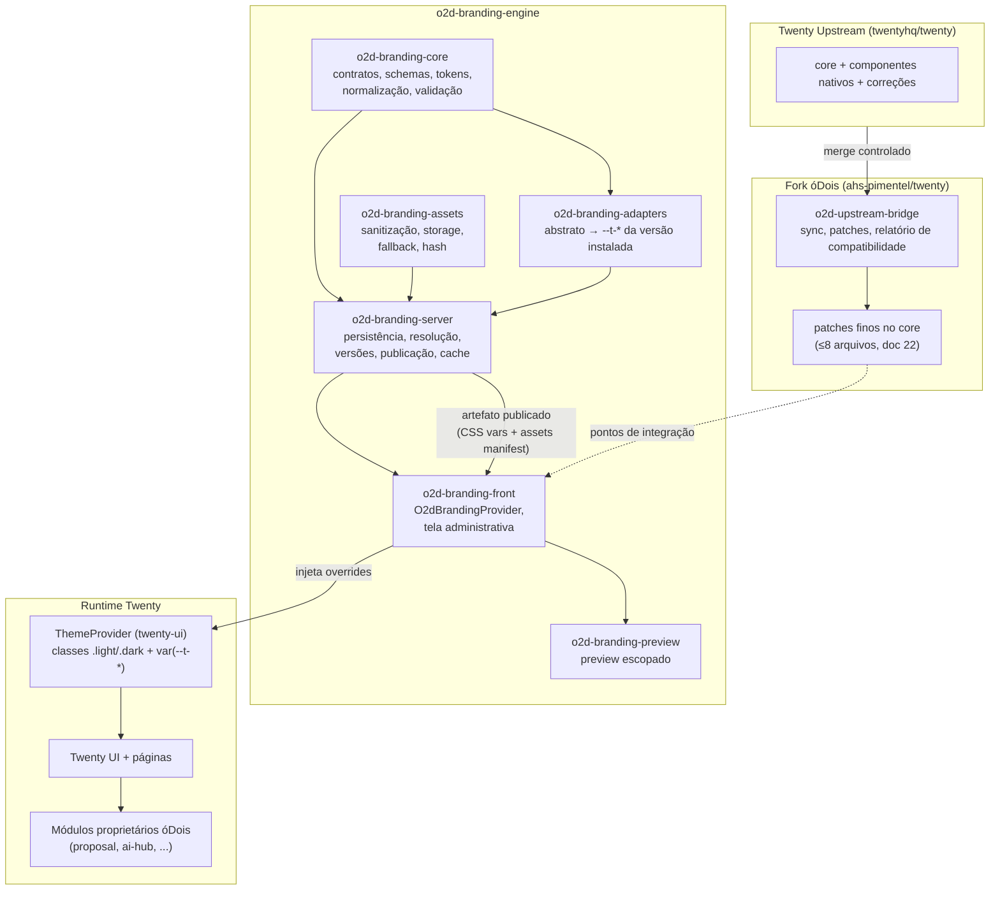

# 05 — Arquitetura Alvo

> **Status:** proposta — nada implementado.

## 1. Princípio central

```text
Configuração → Schema validado → Normalização → Adapter da versão do Twenty
→ Tokens e overrides → ThemeProvider → Interface
```

O engine **não** altera componentes; ele produz um artefato de tokens que a superfície de override já existente do Twenty (`--t-*` + `ThemeProvider.overrides`, doc 01 §2) consome. O padrão é: fork fino + motor central de tokens + providers globais + assets dinâmicos + adapters por versão + patches isolados + regressão visual.

## 2. Diagrama geral



## 3. Responsabilidades por camada

### Twenty Upstream
Core, funcionalidades originais, atualizações, correções, componentes nativos. **Nunca recebe alteração óDois diretamente.**

### Fork óDois
Somente pontos de integração: os patches do doc 22 (`AppRouterProviders`, `index.html`, `title-utils`, constantes default, `FileFolder`+1, e — em fases futuras — `PublicWorkspaceDataDTO` e `BaseEmail`). Tudo o mais em pacotes novos.

### `o2d-branding-core` (pacote TS puro, sem dependência de React/Nest)
- Contratos e tipos (`O2DBrandingTokens`, `O2DBrandingAssets`, `O2DBrandingConfig`).
- JSON Schemas versionados (`o2d.branding.config/1-0-0`).
- Catálogo abstrato de tokens, presets, defaults (doc 09).
- Normalização (aplicar preset → defaults → derivação de tokens calculados).
- Validações (schema, limites, contraste — doc 06).
- Geração de overrides: entrada normalizada + adapter ⇒ blocos CSS light/dark.

### `o2d-branding-server` (módulo NestJS no twenty-server, tabelas próprias)
Persistência, resolução workspace/domínio, versionamento, publicação, rollback, permissões, auditoria, orquestração de assets, endpoint de configuração ao frontend, cache Redis e invalidação (docs 07, 12, 15, 18, 19).

### `o2d-branding-front` (pacote/módulo React)
`O2dBrandingProvider` global, carregamento e aplicação de tokens e assets, título/favicon, integração com login e sidebar, tela administrativa (docs 08, 13).

### `o2d-branding-assets`
Validação de formato/dimensão, sanitização (SVG), armazenamento via `FileStorageService` existente, versionamento por hash, cache/CDN, fallback (doc 11).

### `o2d-branding-adapters`
Tradução de tokens abstratos para os `--t-*` reais da versão instalada; detecção de incompatibilidades; isolamento de diferenças entre versões (doc 10).

### `o2d-branding-preview`
Preview com provider escopado (`ThemeProvider` com `applyToRoot={false}` + `overrides` — capacidade já existente no twenty-ui), cenários reais com dados fictícios (doc 14).

### `o2d-upstream-bridge`
Acompanhamento do upstream, sync controlado, reaplicação de patches, validação de adapters, regressão visual, relatório de conflitos (docs 21, 22, 23).

## 4. Fluxo de dados canônico

1. Admin edita rascunho (front → API).
2. Core normaliza e valida; server persiste versão.
3. Publicação: core+adapter geram artefato (CSS vars light/dark + manifest de assets + hash), server armazena e invalida cache.
4. Bootstrap do cliente: HTML inicial traz tokens críticos inline; provider busca artefato completo (cacheado por hash) e aplica antes da renderização; assets carregam com fallback.
5. Upstream muda → bridge sincroniza → adapter revalidado → regressão visual → nova versão da distribuição.

## 5. Decisões arquiteturais (com justificativa)

| # | Decisão (proposta) | Justificativa |
|---|---|---|
| D1 | Override por **cascata CSS** (stylesheet dinâmico + inline crítico), não edição dos CSS do upstream | Zero conflito de merge; a superfície `--t-*` já é o contrato do próprio Twenty |
| D2 | Tabelas **próprias** (`o2dBranding*`) no schema `core`, nenhuma coluna adicionada às tabelas do Twenty | Migrations aditivas isoladas; upgrade do Twenty não colide |
| D3 | Tela admin via **Twenty App** quando as capacidades da plataforma bastarem, patch de rota só como fallback | Apps já contribuem navigation items, page layouts e front-components (doc 00 §2); menos divergência |
| D4 | Artefato de publicação **pré-compilado** (CSS pronto por versão) | Cliente não computa nada; cache trivial por hash; anti-flash viável |
| D5 | Adapter **por versão instalada**, selecionado em build da distribuição | O fork sabe exatamente qual Twenty embarca; runtime não adivinha |
| D6 | Assets nunca importados em componentes; sempre via provider | Requisito da missão; permite troca sem rebuild |
| D7 | Sem custom CSS de cliente (doc 04 §6) | Segurança, suporte e compatibilidade |

## 6. Anti-padrões explicitamente rejeitados

Cores hardcoded; logos importados diretamente; CSS espalhado; componentes duplicados; modificações em todas as telas; alterações sem versionamento; fork profundamente divergente.
