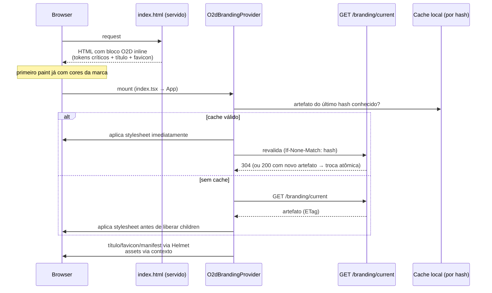

# 08 — `o2d-branding-front` (provider global, bootstrap, anti-flash)

> **Status:** proposta — nada implementado.

## 1. Responsabilidades

Provider global de branding; carregamento do tema; aplicação de tokens e assets; título; favicon; login; sidebar; componentes globais; tela administrativa (doc 13); integração com o sistema de temas do Twenty.

## 2. `O2dBrandingProvider` (Etapa 6 da missão)

Único componente novo montado na raiz — o wrapper entra por patch fino em `packages/twenty-front/src/modules/app/components/AppRouterProviders.tsx` (hoje monta `BaseThemeProvider` na linha 46; o provider de branding envolve **por fora** dele, ver doc 22 P1).

Resolve, nesta ordem: domínio → workspace → configuração publicada → esquema de cores → tokens → assets → fallback → versão (hash).

```text
Aplicação inicia
  → lê tokens críticos inline do HTML (já presentes — §4.1)
  → resolve domínio (window.location.origin, mesmo insumo do
     useGetPublicWorkspaceDataByDomain existente)
  → resolve workspace (pós-auth: currentWorkspace)
  → busca branding publicado (GET /branding/current, ETag=hash)
  → aplica tokens antes da renderização (stylesheet dinâmico)
  → carrega assets (manifest com URLs por hash)
  → renderiza aplicação
```

Integração com o tema existente (sem substituí-lo):
- O esquema claro/escuro continua sendo decidido por `BaseThemeProvider`/`useColorScheme` (preferência do membro — evidência doc 01 §2). O branding fornece **os dois blocos** (light/dark); a classe `.light`/`.dark` do `<html>` seleciona qual vale.
- Mecânica de aplicação: o provider injeta `<style id="o2d-branding" data-hash="...">` contendo `html.light { --t-...: ... } html.dark { --t-...: ... }` **após** os stylesheets do twenty-ui (vence por ordem de cascata com igual especificidade). Nenhum componente é tocado.
- `ThemeProvider.overrides` (twenty-ui) fica reservado para **escopos** (preview, doc 14) — não para o tema global, para não colar estilo inline na árvore inteira.

## 3. Fluxo de carregamento inicial



## 4. Anti-flash (problema: `tema padrão aparece → requisição termina → tema personalizado aparece`)

Estratégias combinadas, em ordem de defesa:

1. **Branding no HTML inicial (primária).** O `index.html` já é reescrito no boot do container (`packages/twenty-front/scripts/inject-runtime-env.sh` injeta `window._env_` — evidência doc 00 §2). Mesmo mecanismo adiciona bloco delimitado com: variáveis críticas inline (`brand.primary`, backgrounds, texto — sob `.light`/`.dark`, coerente com o CSS crítico que o upstream já mantém em `index.html:67-88`), `<title>`, favicon e manifest da distribuição. Cobre 100% do caso single-tenant/identidade óDois.
2. **Cache local versionado.** Artefato completo persistido (localStorage/IndexedDB) com hash; aplicado sincronamente no mount; revalidação em background (§3). Cobre retornos ao app multi-tenant.
3. **Bootstrap bloqueante curto (somente 1ª visita multi-tenant sem cache).** O provider segura a renderização até o artefato chegar, com timeout (proposta: 800ms). Timeout ⇒ renderiza com o inline do passo 1 e aplica o completo ao chegar. A tela de splash/skeleton usa os tokens críticos inline — sem marca errada visível.
4. **Configuração carregada no servidor por domínio (evolução, Fase 5+).** Reescrita do bloco inline **por request** conforme `Host` exige servir o `index.html` por um processo dinâmico (hoje é estático); registrado como OQ-08-1 — alternativa: manter inline apenas da distribuição e aceitar transição distribuição→workspace (mesma família visual) na 1ª visita.
5. **Fallback seguro.** Falha total da API ⇒ tokens da distribuição (inline) permanecem; nunca a marca Twenty crua, nunca tela sem tema.

Critério de aceite (doc 25 §metas): zero flash perceptível (medido por teste visual no primeiro frame — cenário 18, doc 23).

## 5. Superfícies aplicadas pelo provider

| Superfície | Como | Evidência do ponto atual |
|---|---|---|
| Tokens | stylesheet `#o2d-branding` | doc 01 §2 |
| Título | fallback de `getPageTitleFromPath` lê `brand.productName` (patch P3) + `PageTitle` inalterado | `title-utils.ts:61-63` |
| Favicon | `PageFavicon` prioriza asset `favicon` do branding (patch P4); comportamento atual (logo do workspace) vira fallback | `PageFavicon.tsx:8-26` |
| Logo do app/login | `auth/components/Logo.tsx` lê do contexto de assets (patch P5); `secondaryLogo` (workspace) preservado | `Logo.tsx:62` |
| Defaults | `DefaultWorkspaceLogo/Name` passam a apontar para fallback da distribuição (patch P6) | constantes doc 01 §3 |
| Sidebar | só tokens (nenhum patch) | doc 03 §2.7 |
| Manifest PWA | `<link rel="manifest">` aponta para manifest gerado (bloco inline / endpoint) | `index.html:13` |
| Componentes globais | nenhum tocado — consomem `--t-*` | — |

## 6. Estados e contexto

- Átomos Jotai (padrão do app): `o2dBrandingArtifactState`, `o2dBrandingStatusState (inline-only | cached | fresh | fallback)`, `o2dBrandingAssetsState`.
- Hook público: `useO2dBranding()` → `{ productName, assets, status, hash }` para os poucos componentes integrados (Logo, título, admin UI).
- A tela administrativa (doc 13) consome a API GraphQL autenticada; o runtime público usa somente o endpoint REST cacheável.

## 7. O que o front NÃO faz

Não computa tokens (artefato vem pronto); não interpola CSS de strings de configuração (anti-injeção — o artefato é gerado e assinado por hash no server); não aplica branding de um workspace em outro (chave por workspace + testes de isolamento); não altera lógica de autenticação/rotas.
