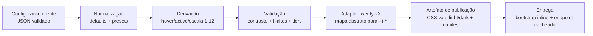

# 09 — Sistema de Tokens (`o2d-branding-core`)

> **Status:** especificação proposta — nenhum código implementado.
> **Base de evidência:** tokens reais confirmados no repositório em 2026-08-05 (branch `main`, commit `538b1808` + merges de specs). Caminhos citados são reais.

## 1. Estado atual do sistema de tokens do Twenty (evidência)

O Twenty instalado usa **duas camadas de tokens**, ambas no pacote `twenty-ui`:

### 1.1 Camada TypeScript (objetos de tema Emotion)

- `packages/twenty-ui/src/theme/constants/ThemeLight.ts` — compõe `THEME_LIGHT` a partir de `ACCENT_LIGHT`, `BACKGROUND_LIGHT`, `BLUR_LIGHT`, `BORDER_LIGHT`, `BOX_SHADOW_LIGHT`, `CODE_LIGHT`, `FONT_LIGHT`, `SNACK_BAR_LIGHT`, `TAG_LIGHT`, `ILLUSTRATION_ICON_LIGHT`, `GRAY_SCALE_LIGHT`, `COLOR_LIGHT` e `THEME_COMMON`.
- `packages/twenty-ui/src/theme/constants/ThemeDark.ts` — equivalente escuro.
- `packages/twenty-ui/src/theme/constants/ThemeCommon.ts` — `spacingMultiplicator: 4`, função `spacing()`, `sidePanelWidth: '500px'`, `table.*`, `modal`, `icon`, `text`, `animation`.

Grupos reais confirmados (nomes exatos do código):

| Grupo | Arquivo | Chaves reais (amostra) |
|---|---|---|
| `background` | `BackgroundLight.ts` / `BackgroundDark.ts` | `primary`, `secondary`, `tertiary`, `quaternary`, `invertedPrimary`, `danger`, `transparent.{primary…danger}`, `overlayPrimary`, `radialGradient` |
| `font` | `FontLight.ts` / `FontDark.ts` + `FontCommon.ts` | `color.{primary,secondary,tertiary,light,extraLight,inverted,danger}`, `size.{xxs,xs,sm,md,lg,xl,xxl}`, `weight.{regular:400,medium:500,semiBold:600}`, `family: 'Inter, sans-serif'` |
| `border` | `BorderLight.ts` / `BorderDark.ts` + `BorderCommon.ts` | `radius.{xs:2px,sm:4px,md:8px,xl:20px,xxl:40px,pill:999px,rounded:100%}`, `color.*` |
| `boxShadow` | `BoxShadowLight.ts` / `BoxShadowDark.ts` | `color`, `light`, `strong`, `underline`, `superHeavy` |
| `accent` | `AccentLight.ts` / `AccentDark.ts` | `primary`, `secondary`, `tertiary`, `quaternary`, `accent1…accent12` (escala Radix `indigoP3`) |
| `color` | `ColorsLight.ts` / `ColorsDark.ts` + `MainColorsLight.ts` | 24 cores nomeadas (`red`, `blue` = `indigoP3.indigo9`, `green`, …) com escalas |
| `grayScale` | `GrayScaleLight.ts` (+ `Alpha`) | `gray0…gray12` (Radix) |
| `tag`, `snackBar`, `code`, `IllustrationIcon`, `blur` | arquivos homônimos | escalas por componente |

Observações críticas:
- A cor de marca do Twenty **não é um token único**: `accent.*` deriva da escala Radix `indigoP3` e `MAIN_COLORS_LIGHT.blue = RadixColors.indigoP3.indigo9`. Trocar a cor primária exige substituir uma **escala** (1–12), não um hex isolado.
- Sombras (`BOX_SHADOW_LIGHT`) interpolam valores de `GRAY_SCALE_LIGHT_ALPHA` em strings compostas — override exige recompor a string completa.

### 1.2 Camada CSS variables (`--t-*`) — a superfície de override real

- `packages/twenty-ui/src/theme-constants/theme-light.css` (1011 linhas) e `theme-dark.css` (1007 linhas): definem **todas** as variáveis `--t-*` sob as classes `.light` e `.dark` aplicadas ao `<html>`.
- `packages/twenty-ui/src/theme-constants/themeCssVariables.ts`: espelho TS token-a-token (`background.primary → var(--t-background-primary)` etc.), com comentário: *"Kept in sync by the theme parity test (src/theme-constants/__tests__)"*.
- `packages/twenty-ui/src/theme-constants/ThemeProvider.tsx`: provider que (a) alterna classes `.light`/`.dark` na raiz (`applyColorSchemeClass`), (b) resolve o objeto de tema lendo `getComputedStyle` (`computeThemeFromCss`), e (c) **aceita `overrides?: ThemeOverrides`** (`Record<string, string | number>`) aplicados como estilo inline em um wrapper com `display: contents` — ou seja, **override escopado de variáveis CSS já é suportado nativamente**.
- Consumo global: `packages/twenty-front/src/index.tsx:7-9` importa `twenty-ui/style.css`, `twenty-ui/theme-light.css`, `twenty-ui/theme-dark.css`.
- Cadeia de providers no front: `packages/twenty-front/src/modules/ui/theme/components/BaseThemeProvider.tsx` (resolve `persistedColorSchemeState` + `useSystemColorScheme`) → `ThemeProvider` do `twenty-ui`.

**Conclusão estrutural:** o ponto de aplicação do Branding Engine é a camada `--t-*`. Redefinir variáveis CSS **após** os stylesheets do Twenty (ordem de cascata) ou via `overrides` do `ThemeProvider` altera o tema inteiro sem tocar em nenhum componente. Este é o fundamento do princípio "fork fino".

## 2. Modelo abstrato de tokens do Branding Engine (proposta)

O `o2d-branding-core` define um **modelo abstrato** desacoplado dos nomes do Twenty. A tradução para `--t-*` é responsabilidade exclusiva dos adapters (doc 10). Nenhum componente ou configuração cliente referencia `--t-*` diretamente.

### 2.1 Convenção

- Nome: `categoria.grupo.variante` em camelCase por segmento (`brand.primary`, `sidebar.itemActiveBackground`).
- Todo token tem: `type` (color | dimension | shadow | fontFamily | fontWeight | number | duration), `modes` (`light`/`dark` quando aplicável), `tier` (ver §2.3) e `constraints` (validações, doc 14).
- Serialização canônica: JSON (schema versionado `o2d.branding.tokens/1-0-0`), inspirada no formato W3C Design Tokens, sem dependência dele.

### 2.2 Catálogo abstrato

Cores:

```text
brand.primary            brand.primaryHover        brand.primaryActive
brand.onPrimary          brand.scale.1 … brand.scale.12   # derivada (ver §2.4)

background.primary       background.secondary      background.tertiary
surface.primary          surface.secondary         surface.elevated
text.primary             text.secondary            text.muted        text.inverse
border.default           border.strong             border.focus
status.success           status.warning            status.error      status.info
```

Tipografia:

```text
font.family.body         font.family.heading       # heading = body por default
font.size.xs … font.size.xl
font.weight.regular      font.weight.medium        font.weight.semibold   font.weight.bold
font.lineHeight
```

Espaçamento / densidade:

```text
spacing.unit             # default 4 (mapeia --t-spacing-multiplicator)
layout.density           # comfortable | compact — deriva spacing.unit e alturas
```

Raios:

```text
radius.sm   radius.md   radius.lg   radius.xl   radius.pill
```

Sombras:

```text
shadow.sm   shadow.md   shadow.lg   shadow.overlay
```

Layout:

```text
layout.sidebar.width           layout.sidebar.collapsedWidth
layout.header.height           layout.content.maxWidth
```

Componentes (aliases semânticos — resolvem para tokens base, nunca para CSS livre):

```text
button.primary.background      button.primary.foreground     button.primary.radius
card.background                card.border                   card.radius
input.background               input.border                  input.focus
table.headerBackground         table.rowHover
sidebar.background             sidebar.foreground
sidebar.itemActiveBackground   sidebar.itemActiveForeground
```

### 2.3 Classificação (tiers)

| Tier | Tokens | Regra |
|---|---|---|
| **Obrigatórios** | `brand.primary`, `brand.onPrimary`, `background.primary`, `surface.primary`, `text.primary`, `text.secondary` | Toda configuração publicável deve defini-los (ou herdar do preset). Ausência = `VALIDATION_FAILED`. |
| **Opcionais** | demais cores, `radius.*`, `shadow.*`, `layout.*`, `font.family.body` | Ausentes ⇒ herdam do preset da distribuição ⇒ default Twenty. |
| **Derivados** | `brand.primaryHover`, `brand.primaryActive`, `status.*` (variações), `surface.elevated` | Calculados a partir do token pai por função determinística (ajuste de luminosidade OKLCH); editáveis apenas no Nível 2 (doc 04 §níveis). |
| **Calculados** | `brand.scale.1…12`, `text.inverse`, sombras compostas | Sempre gerados pelo core (geração de escala tipo Radix a partir de `brand.primary`); nunca editáveis diretamente. |
| **Restritos** | `layout.density`, `font.family.*`, tokens de componente | Editáveis somente no Nível 2 (admin técnico) com validação reforçada. |
| **Somente leitura** | `spacing.unit` (MVP), z-index, animação, tokens estruturais (`--t-modal-*`, `--t-lastLayerZIndex`) | Expostos para inspeção/preview; qualquer tentativa de override é rejeitada na validação. Motivo: risco funcional (sobreposição de modais, quebra de layout). |

### 2.4 Geração de escala de marca (calculado)

O Twenty consome `accent1…accent12` (escala Radix indigo). O core deve gerar, a partir de `brand.primary` (1 hex por modo), uma escala 1–12 perceptualmente equivalente (OKLCH, curvas separadas para light/dark), pois um único hex não é suficiente para substituir a cor de marca no Twenty real. A função de geração:
- é determinística (mesma entrada ⇒ mesma saída; hash da saída entra no snapshot da versão);
- valida contraste dos degraus críticos (9 = sólido, 11 = texto sobre fundo claro) — falha bloqueia publicação (doc 14);
- pode ser sobrescrita degrau-a-degrau apenas no Nível 3 (mantenedores óDois).

### 2.5 O que o modelo abstrato NÃO cobre

- Tokens estruturais do Twenty sem valor de branding (`--t-modal-size-*`, `--t-icon-stroke-*`, z-index, animação): ficam fora do schema editável; o adapter os preserva intactos.
- CSS livre: não é token (ver doc 04, Etapa 16 — decisão sobre custom CSS).
- Assets: modelados à parte (doc 11), referenciados por ID, nunca por URL embutida em token.

## 3. Pipeline de resolução



- O artefato final por versão publicada é um **par de blocos de variáveis CSS** (light/dark) + manifest de assets + metadados (hash, adapter, versão Twenty). Nenhuma resolução acontece em runtime no cliente além de aplicar o bloco.
- Tokens não mapeáveis pelo adapter instalado geram `CompatibilityResult` com severidade (doc 10 §comportamentos).

## 4. Presets

- `preset.twenty-default` — valores atuais do upstream (extraídos de `theme-light.css`/`theme-dark.css` na versão instalada; regenerado pelo upstream bridge a cada sync).
- `preset.odois` — identidade óDois (Nível 3, assets proprietários; ver doc 24 sobre propriedade).
- Presets de cliente — derivados de `preset.odois` ou `preset.twenty-default`; um preset nunca é editado in-place: alterações geram nova versão (doc 15).

## 5. Perguntas em aberto (ver doc 27)

- OQ-09-1: gerar escala 1–12 própria vs. permitir só trocar `accent` pelos 24 `MAIN_COLORS` já existentes no Twenty (menor risco, menor flexibilidade).
- OQ-09-2: expor `spacing.unit` no Nível 2 ou mantê-lo somente leitura até haver testes visuais de densidade.
- OQ-09-3: `font.family.heading` separado de `body` — o Twenty usa uma única família (`Inter`); separar exige verificação de que nenhum componente assume métricas de Inter.
