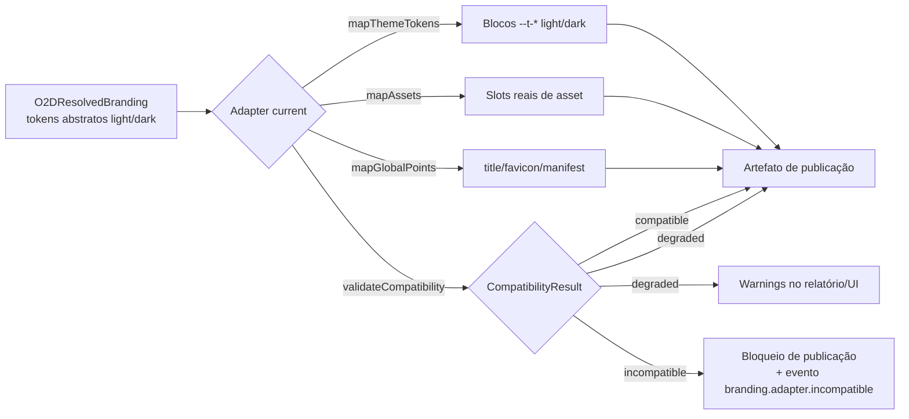

# 10 — Adapters por Versão do Twenty (`o2d-branding-adapters`)

> **Status:** proposta — nada implementado. O código de exemplo é contrato conceitual, não implementação.

## 1. Papel

Traduzir tokens abstratos (doc 09) para os tokens e pontos reais da **versão instalada** do Twenty; detectar incompatibilidades; isolar diferenças entre versões. O adapter é a única camada que conhece nomes `--t-*`.

Identificação de versão (evidência doc 00 §1): não há versão npm no front/server; a versão real = **commit base do upstream** (hoje `538b1808`) + `APP_VERSION` de runtime. Cada adapter declara o intervalo de commits que suporta.

## 2. Estrutura

```text
o2d-branding-adapters/
├── current/                      # symlink/alias para o adapter da versão embarcada
├── twenty-538b1808.adapter.ts    # adapter da base atual (nome = commit base)
├── twenty-<próxima-base>.adapter.ts
└── compatibility.ts              # tipos + runner de verificação
```

Seleção: **em build da distribuição** (D5, doc 05) — o fork embarca exatamente um Twenty, logo um adapter `current`. Adapters antigos permanecem no repositório para rollback de distribuição e para o relatório do bridge.

## 3. Contrato

```typescript
interface TwentyBrandingAdapter {
  version: string;                       // ex.: 'o2d-adapter/538b1808@1'
  supportedRange: { baseCommit: string; appVersionRange?: string };
  mapThemeTokens(input: O2DBrandingTokens): ThemeOverrides;   // → blocos --t-* light/dark
  mapAssets(input: O2DBrandingAssets): TwentyAssets;          // → slots reais (favicon, logo login, manifest…)
  mapGlobalPoints(): GlobalPointMap;     // pontos de integração: title fallback, favicon link, manifest URL
  mapComponents(): ComponentTokenMap;    // aliases de componente → tokens base reais
  validateCompatibility(): CompatibilityResult;               // roda contra o código instalado
}
```

Cada adapter carrega: versão suportada; intervalo de commits; mapa de tokens; mapa de assets; mapa de pontos globais; mapa de componentes; validações; fallbacks; deprecações; testes de compatibilidade.

## 4. Mapa de tokens (exemplos com nomes reais confirmados)

| Abstrato | Real (base `538b1808`) |
|---|---|
| `background.primary` | `--t-background-primary` (fonte: `GRAY_SCALE_LIGHT.gray1` — `BackgroundLight.ts:9`) |
| `text.primary` / `text.secondary` / `text.muted` | `--t-font-color-primary` / `--t-font-color-secondary` / `--t-font-color-tertiary` (`FontLight.ts:6-14`) |
| `radius.sm/md/xl/pill` | `--t-border-radius-{sm,md,xl,pill}` (`BorderCommon.ts`) |
| `font.family.body` | `--t-font-family` (`FontCommon.ts:16`) |
| `shadow.sm/md/lg` | `--t-box-shadow-{light,strong,super-heavy}` (`BoxShadowLight.ts`) — strings compostas: o adapter recompõe a sombra completa com a cor derivada |
| `brand.primary` + escala | famílias `--t-accent-*` e `--t-color-blue*` (escala `indigoP3`, `AccentLight.ts`/`MainColorsLight.ts:27`) — recebem a escala 1–12 gerada (doc 09 §2.4) |
| `layout.sidebar.width` | não é `--t-*`: constante `NavigationDrawerConstraints` + var `--navigation-drawer-width` — mapeado como ponto global, Futura |

O mapa completo é **gerado e verificado por teste** contra `theme-light.css`/`theme-dark.css` (parse das ~1000 linhas), nunca mantido só à mão — o teste de paridade do próprio twenty-ui (`theme-constants/__tests__`) é o precedente.

## 5. Comportamento diante de mudanças do upstream (Etapa 8 da missão)

| Situação | Detecção | Comportamento |
|---|---|---|
| Token deixa de existir | parse dos CSS no bridge: variável sumiu | `CompatibilityIssue{kind: missing}`; se tier obrigatório → `blocking` (publicação bloqueada até novo adapter); se opcional → `warning`, override omitido |
| Token muda de nome | heurística de renome (valor igual, nome novo) + revisão humana no relatório | novo adapter mapeia o nome novo; o antigo entra em `deprecations` com data |
| Componente deixa de usar token (passa a hardcoded) | regressão visual (Argos) acusa que o override não afeta mais o componente + varredura de hardcoded (doc 23 §estratégia) | issue `hardcoded` `warning`; decisão: patch pontual no fork ou aceitar perda — registrada no relatório |
| Token passa a ser hardcoded | idem | idem |
| Provider muda de assinatura (`ThemeProvider`, `AppRouterProviders`) | falha de build/patch no bridge | conflito de patch (doc 22 §conflitos); bridge bloqueia release até resolução manual |
| Asset muda de caminho (ex.: favicon do `index.html`) | teste de pontos globais do adapter | novo adapter atualiza `mapAssets`/`mapGlobalPoints` |
| Componente removido | build + visual | remover mapeamento; se havia customização de cliente dependente, alerta de migração aos workspaces afetados |
| Nova versão sem adapter compatível | `validateCompatibility()` no build da distribuição | **build da distribuição falha** — regra dura: não se embarca Twenty sem adapter validado; em runtime (defesa extra) engine degrada para tema padrão + alerta (doc 06 §4) |

## 6. Fluxo do adapter



## 7. Testes de compatibilidade (por adapter)

1. Paridade: todo token abstrato tier obrigatório/opcional tem alvo existente nos CSS reais (parse).
2. Round-trip visual: aplicar `preset.twenty-default` via adapter ⇒ diff visual zero contra o Twenty puro (Argos) — prova que o adapter é neutro.
3. Pontos globais: title fallback, favicon link, manifest URL existem nos caminhos esperados (asserções estáticas sobre o código instalado).
4. Deprecações: tokens deprecados não são emitidos.

Executados: no CI do fork a cada PR que toque adapter/patches e em toda sincronização do bridge (doc 21).
