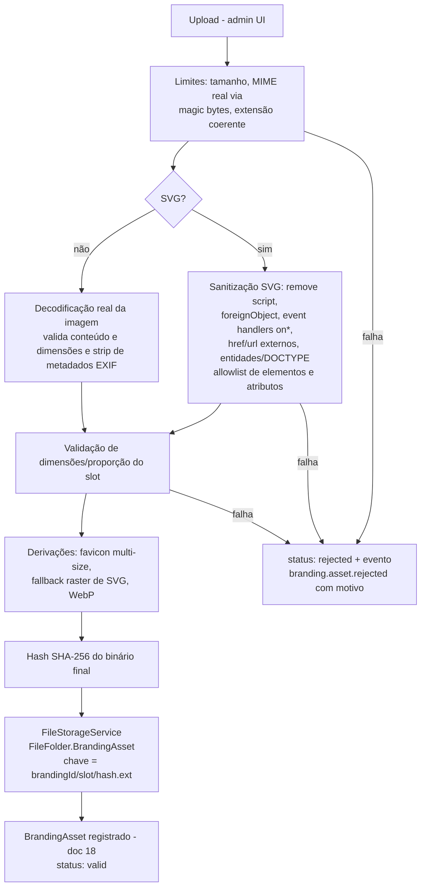

# 11 — Asset Manager (`o2d-branding-assets`)

> **Status:** proposta — nada implementado.

## 1. Princípio

Assets configuráveis **nunca são importados em componentes**. Fluxo: `BrandingProvider → BrandingAssets (contexto) → componentes`. A infraestrutura reutiliza o storage existente do Twenty (drivers local/S3 via `FileStorageService`, URLs por `FileUrlService` — evidências doc 00 §5), acrescentando pipeline de validação/sanitização e um `FileFolder.BrandingAsset` (mudança aditiva).

## 2. Tipos de asset (slots)

| Slot | Formatos | Dimensões/proporção | Obrigatório? |
|---|---|---|---|
| `logo.light` / `logo.dark` | SVG (sanitizado), PNG, WebP | 3:1 a 1:1; mín. 128px lado menor; máx. 2048px | distribuição sim; workspace opcional |
| `logo.compact` | SVG, PNG, WebP | 1:1; 64–512px | opcional (deriva de `logo.*` por fallback) |
| `favicon` | ICO, PNG, SVG | 1:1; 16–512px (PNG multi-size gerado) | distribuição sim |
| `login.image` / `login.background` | PNG, WebP, AVIF* | máx. 4096×4096 | opcional |
| `email.logo` | PNG (compatibilidade de clientes de e-mail) | 1:1 a 4:1; máx. 600px largura | Fase 7 |
| `document.header` / `document.watermark` | PNG, SVG | conforme template | Fase 7 |
| `icons.custom.*` | SVG | 1:1; viewBox obrigatório | Nível 3 |

*AVIF aceito apenas se a matriz de suporte de navegadores da distribuição permitir; sempre com fallback WebP/PNG gerado.

Limites (propostos, configuráveis pela distribuição): 2 MB por SVG/ICO, 5 MB por bitmap; dimensões acima → rejeição (nunca redimensionamento silencioso de logo; variantes de favicon são a exceção documentada).

## 3. Pipeline de ingestão



Regras de segurança (detalhes doc 17): sanitização SVG por allowlist (não blocklist); rejeição de qualquer `script`, handler `on*`, `foreignObject`, referência externa (`href`, `url()` para fora do próprio documento); nenhum SVG é servido como `image/svg+xml` sem ter passado pelo pipeline; proteção contra path traversal (chave de storage é gerada, nunca derivada do nome do arquivo do usuário); rate limiting de upload.

## 4. Armazenamento, URLs e cache

- **Storage**: mesmo backend do Twenty (`STORAGE_TYPE` local/S3 — compatível com MinIO por ser S3-compatible; presigned URLs já suportadas pela fábrica existente).
- **Imutabilidade por conteúdo**: chave inclui hash ⇒ URL pública `.../file/branding-asset/{id}-{hash}.{ext}` é imutável ⇒ `Cache-Control: public, max-age=31536000, immutable`; CDN opcional na frente sem lógica de invalidação (nova versão = nova URL).
- **Acesso**: assets publicados são públicos (aparecem no login pré-auth), padrão `PublicAsset`/`ignoreExpirationToken` já existente; assets de rascunho exigem sessão autenticada do workspace (URL assinada de curta duração, padrão `signFileByIdUrl` existente).
- **Versionamento**: `BrandingAsset` guarda versão e hash; o manifest da versão publicada referencia hashes exatos — rollback de versão ⇒ manifest antigo ⇒ URLs antigas ainda válidas (assets nunca são apagados enquanto referenciados por qualquer versão não-arquivada).
- **Exclusão**: apenas assets sem referência (garbage collection agendada), com retenção mínima (proposta: 90 dias) e trilha de auditoria.

## 5. Fallback em cadeia (runtime)

```text
asset do branding publicado (hash)
  → asset equivalente do preset da distribuição (óDois)
  → default seguro embarcado no build (neutro, sem marca de cliente)
```

- A cadeia é resolvida no manifest (o server já entrega a URL efetiva + a de fallback); o front só troca `src` em erro de carregamento (`onerror`), com métrica (doc 25).
- Slots com derivação (ex.: `logo.compact` ausente) resolvem no momento da publicação, não em runtime.
- Falha de asset **nunca** quebra layout: dimensões reservadas vêm do slot, não do arquivo (cenário 12, doc 23).

## 6. Auditoria

Upload, rejeição (com motivo), substituição, exclusão e GC geram `BrandingAuditEvent` (doc 18) e eventos do doc 20 (`branding.asset.uploaded` / `branding.asset.rejected`).

## 7. Estado atual reutilizado (evidências)

- Upload de logo existente como referência de UX e permissão: `WorkspaceLogoUploader.tsx` + mutation `uploadWorkspaceLogo` (`file-core-picture.resolver.ts:36-56`, guard `SettingsPermissionGuard(PermissionFlagType.WORKSPACE)`).
- Config por pasta (`ignoreExpirationToken`) em `file-folder.interface.ts:14-69`.
- Construção de URL no cliente: `getImageAbsoluteURI` (`twenty-shared/src/utils/image/getImageAbsoluteURI.ts`) — mantida; assets de branding chegam com URL absoluta pronta no manifest.
