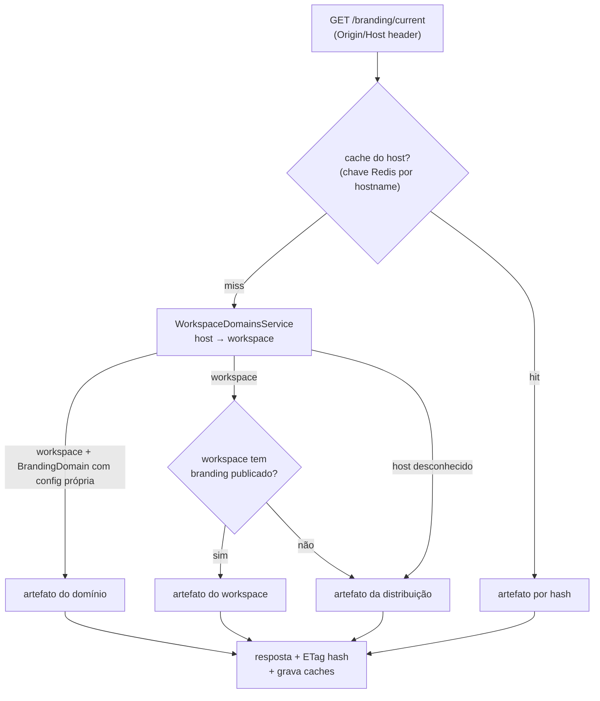
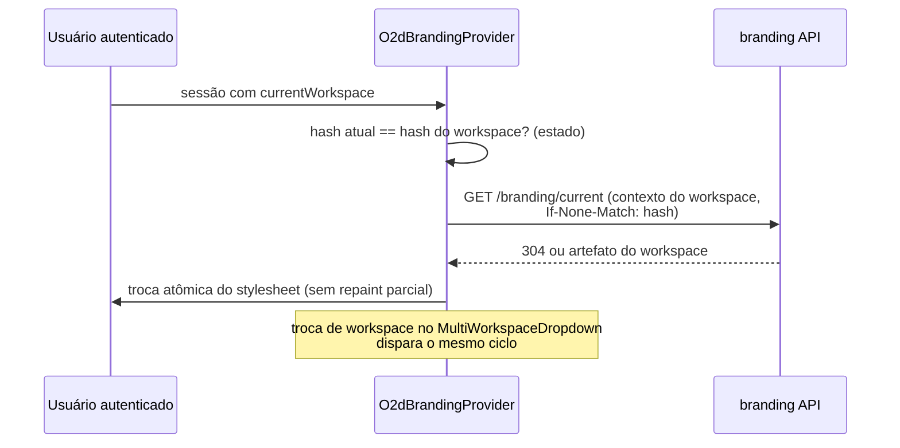
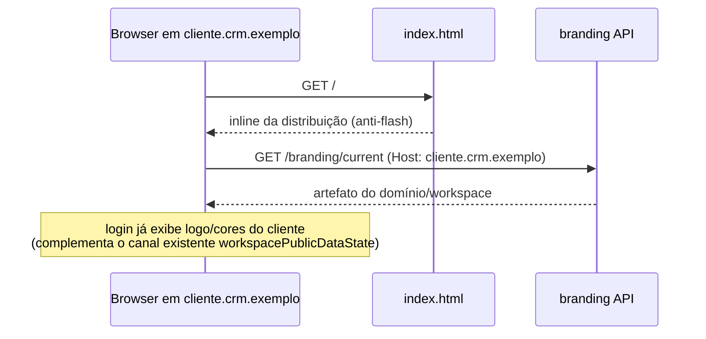

# 12 — Resolução por Workspace e Domínio

> **Status:** proposta — nada implementado. Reutiliza a infraestrutura de domínios existente (evidências doc 00 §5, doc 01 §6).

## 1. Infraestrutura existente reutilizada

- Host → workspace: `WorkspaceDomainsService.getWorkspaceByOriginOrDefaultWorkspace(origin)` (consulta `subdomain` único, `customDomain` único e registro `PublicDomainEntity`).
- Query pública atual: `getPublicWorkspaceDataByDomain` (`workspace.resolver.ts:380-441`) — hoje entrega logo/displayName/authProviders; permanece intacta no MVP.
- Domínio custom: `custom-domain-manager.service.ts` (Cloudflare via `dns-manager`; unicidade global; eventos `CUSTOM_DOMAIN_ACTIVATED/DEACTIVATED`; **gated por entitlement de billing `CUSTOM_DOMAIN` e código `/* @license Enterprise */`** — implicação comercial no doc 24 §5).
- Front: `useGetPublicWorkspaceDataByDomain` popula `workspacePublicDataState`; `NOT_FOUND` → redirect ao domínio default.

## 2. Cadeia de prioridade

```text
1. Branding do domínio        (BrandingDomain: host → configuração específica)
2. Branding do workspace      (configuração publicada do workspace resolvido)
3. Branding padrão da distribuição (preset.odois publicado da instância)
4. Branding padrão seguro     (embarcado no build; sempre disponível offline)
```

A resolução retorna o **primeiro artefato publicado** na cadeia; níveis nunca são mesclados entre si em runtime (mesclagem acontece na normalização, em tempo de publicação — doc 06 §3). Racional: mesclar em runtime tornaria o resultado dependente de ordem/cache e impossível de versionar por hash.

## 3. Fluxo de resolução (servidor)



## 4. Fluxo por workspace (pós-login)



## 5. Fluxo por domínio (pré-login)



## 6. Casos de borda (comportamento definido)

| Caso | Comportamento |
|---|---|
| Múltiplos domínios por workspace | cada `BrandingDomain` pode apontar para uma configuração distinta ou herdar a do workspace; unicidade de host garantida (padrão já existente para `customDomain`) |
| Domínio sem workspace | nível 3 da cadeia (distribuição); sem redirect forçado no endpoint de branding (o redirect continua responsabilidade do fluxo de auth existente) |
| Workspace sem configuração | nível 3 |
| Configuração em rascunho | **nunca** servida pelo endpoint público; apenas preview autenticado (doc 14) |
| Workspace desativado/suspenso | artefato da distribuição (evita vazar marca de cliente em tela de suspensão) |
| Alteração de domínio (custom domain ativado/desativado) | listeners dos eventos existentes invalidam `o2d:branding:host:*` do host afetado |
| Migração de domínio (host A → host B) | `BrandingDomain` atualizado transacionalmente; caches dos dois hosts invalidados; URLs de asset não mudam (hash-based) |
| Cache | chaves/TTLs e regra "invalidação antes do evento" no doc 07 §5 |
| Isolamento | chave sempre inclui workspaceId/host; cenários de teste 3 e 16 (doc 23) provam que nenhuma resposta cruza workspaces |

## 7. Evolução opcional (OQ-12-1)

Acrescentar `brandingHash` (ou objeto `branding` mínimo) à `PublicWorkspaceDataDTO` para o login reutilizar uma única round-trip. Custo: patch pequeno em DTO/resolver do core (arquivo AGPL, conflito baixo). Alternativa sem patch: manter endpoint REST próprio (2ª chamada, cacheada por ETag). MVP adota a alternativa sem patch; decisão final na Fase 5.
