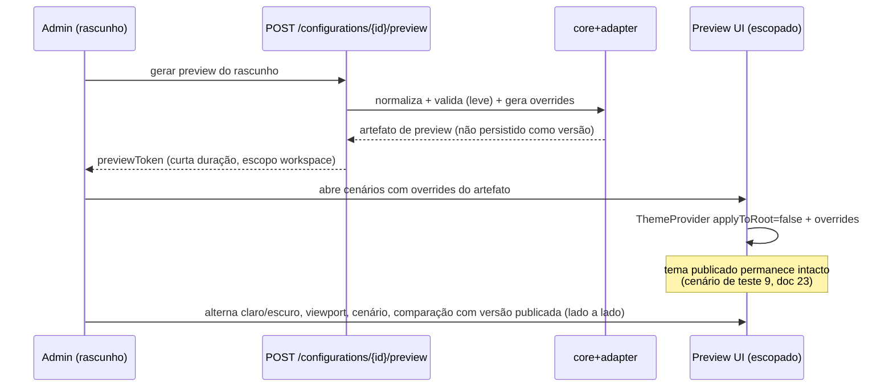
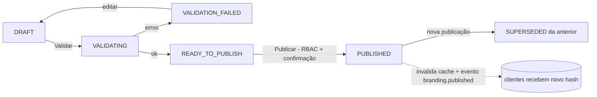

# 14 — Preview e Publicação (`o2d-branding-preview`)

> **Status:** proposta — nada implementado.

## 1. Fundamento técnico do preview

O `ThemeProvider` do twenty-ui **já suporta temas escopados**: `applyToRoot={false}` + `overrides` aplicam variáveis num wrapper `display: contents` e resolvem o tema via `getComputedStyle` do próprio wrapper (`ThemeProvider.tsx:120-173`, evidência doc 01 §2). O preview usa exatamente esse mecanismo — **componentes reais do Twenty, tokens de rascunho, zero efeito no tema global**.

- **Provider escopado é o padrão; iframe somente se necessário** — casos que exigem isolamento de documento (preview do manifest/favicon/título, media queries de viewport com fidelidade total) usam iframe apontando para rota de preview autenticada.
- Dados: **fixtures fictícias seguras** (sem dados reais do workspace), reutilizando os mocks/decorators do Storybook existente onde couber (`twenty-front/.storybook/preview.tsx` já monta `ThemeProvider` + MSW — precedente direto).

## 2. Cenários de visualização

`Login · Dashboard · Lista de registros · Detalhe de registro · Formulário · Tabela · Kanban · Modal · Dropdown · Notificação · Sidebar expandida · Sidebar recolhida · Estados de erro · Estados de sucesso` — cada um em desktop/tablet/mobile × claro/escuro. Os mesmos cenários alimentam os testes visuais (doc 23) — uma única biblioteca de cenários para preview humano e regressão automatizada.

## 3. Fluxo de preview

Regras: preview expira (proposta: 1h); `previewToken` é single-workspace e auditado; preview de rascunho **nunca** é servido pelo endpoint público (doc 12 §6); comparação entre versões = dois providers escopados lado a lado com artefatos de versões distintas.

## 4. Publicação

Estados e versionamento completos no doc 15. Fluxo:

Passos server-side da publicação (transacionais — doc 07 §4): validação completa → geração do artefato (adapter) → snapshot imutável (`BrandingVersion`) → registro (`BrandingPublication` com resultado da validação) → troca do ponteiro publicado → auditoria → invalidação de cache → evento.

Ações da UI: `Salvar rascunho · Visualizar · Validar · Publicar · Restaurar versão · Descartar alterações` (doc 04 §4).

## 5. Garantias

1. Preview não altera o tema publicado nem o rascunho de outrem (escopo + token).
2. Publicação é atômica: nenhum cliente observa artefato parcial (ponteiro + hash).
3. Todo artefato publicado é reprodutível: snapshot + adapterVersion + twentyVersion + hash (doc 15 §registro).
4. Falha em qualquer passo deixa a versão anterior publicada intacta (`branding.publication.failed`).
