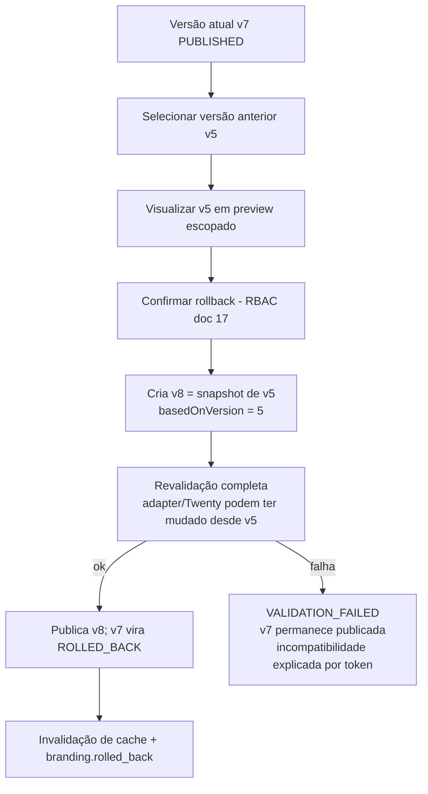

# 15 — Versionamento e Rollback

> **Status:** proposta — nada implementado.

## 1. Estados

```text
DRAFT → VALIDATING → (VALIDATION_FAILED → DRAFT) | READY_TO_PUBLISH → PUBLISHED
PUBLISHED → SUPERSEDED (nova versão publicada) | ROLLED_BACK (marcada como origem de rollback)
qualquer terminal → ARCHIVED (retenção)
```

| Estado | Significado | Transições permitidas |
|---|---|---|
| `DRAFT` | rascunho editável | → VALIDATING |
| `VALIDATING` | validação completa em execução (job assíncrono) | → VALIDATION_FAILED \| READY_TO_PUBLISH |
| `VALIDATION_FAILED` | erros bloqueantes listados | → DRAFT (edição) |
| `READY_TO_PUBLISH` | validada; qualquer edição posterior retorna a DRAFT | → PUBLISHED \| DRAFT |
| `PUBLISHED` | artefato ativo (no máx. 1 por configuração) | → SUPERSEDED \| ROLLED_BACK |
| `SUPERSEDED` | substituída por versão mais nova | → ARCHIVED |
| `ROLLED_BACK` | estava publicada e foi revertida (mantém histórico do incidente) | → ARCHIVED |
| `ARCHIVED` | imutável, fora de listagens padrão; nunca deletada silenciosamente | — |

Invariantes: só `DRAFT` é mutável; `READY_TO_PUBLISH` invalida-se em qualquer edição; snapshots de estados ≥ `PUBLISHED` são imutáveis e verificáveis por hash.

## 2. Registro por versão (campos — modelo completo no doc 18)

Número sequencial por configuração; workspace; snapshot completo da configuração normalizada; manifest de assets (hashes); `schemaVersion`; `adapterVersion`; `twentyVersion` (commit base + APP_VERSION); hash SHA-256 do artefato; autor; data; changelog (texto do autor + diff automático de tokens); resultado da validação (persistido, não recalculado).

## 3. Fluxo de edição → publicação

```text
Editar → Salvar rascunho → Visualizar (preview, doc 14) → Validar → Publicar
```

Publicação incrementa `number`, marca a anterior como `SUPERSEDED`, troca o ponteiro `publishedVersionId` transacionalmente e dispara invalidação/eventos (doc 07 §4).

## 4. Rollback



Regras:
- **Nunca sobrescrever versões antigas**: rollback é sempre uma **nova versão baseada na anterior** — trilha completa preservada (`v8 basedOn v5`).
- Revalidação obrigatória: uma versão antiga pode referenciar tokens/assets que o adapter atual não suporta; nesse caso o rollback é bloqueado com relatório, e a saída é editar o snapshot restaurado como rascunho.
- Assets referenciados por qualquer versão não-`ARCHIVED` não são coletados pelo GC (doc 11 §4).
- Rollback é auditado com `fromVersion`/`toVersion` e motivo (campo obrigatório na confirmação).

## 5. Retenção

Versões `SUPERSEDED`/`ROLLED_BACK` mantidas por período configurável da distribuição (proposta: mínimo 12 meses ou 50 versões, o que for maior) antes de `ARCHIVED`; `ARCHIVED` só é expurgada por rotina explícita da distribuição com auditoria (alinhado à LGPD — doc 17 §retenção: configurações de branding não contêm dados pessoais além de autoria, que é minimizada no expurgo).
