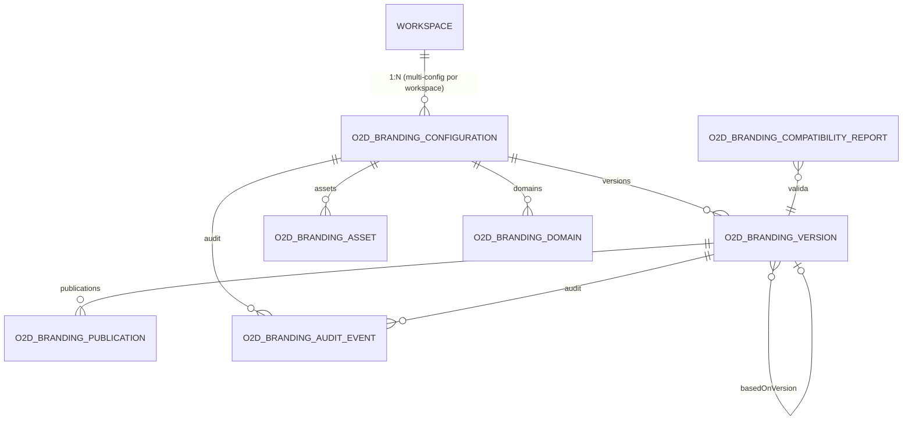

# 18 — Modelo de Dados

> **Status:** proposta — nada implementado; nenhuma migration é criada nesta etapa.

## 1. Localização

**Banco do Twenty, schema `core`, tabelas próprias com prefixo `o2dBranding`** — mesmo Postgres, zero alteração em tabelas existentes (workspace, featureFlag etc. permanecem intactas; relações por FK a `core.workspace.id`). Racional: transações com o ciclo de vida do workspace, reuso de infraestrutura (TypeORM, migrations por instance command), backup unificado. Estrutura própria fora do Postgres: somente os **binários de assets** (storage de arquivos existente) e o **cache** (Redis).

| Reside no banco do Twenty (schema core) | Reside fora |
|---|---|
| configurações, versões, publicações, domínios de branding, metadados de assets, auditoria, relatórios de compatibilidade | binários de assets (S3/local via FileStorage), artefatos CSS publicados (armazenados como coluna `jsonb/text` na versão E replicados no storage para servir com CDN), cache de resolução (Redis) |

## 2. Diagrama

## 3. Entidades

### `o2dBrandingConfiguration`
| Campo | Tipo | Notas |
|---|---|---|
| id | uuid PK | |
| workspaceId | uuid FK → core.workspace | `ON DELETE CASCADE` |
| name | text | ex.: "Padrão", "Campanha X" |
| status | enum | `active · archived` (estado de versão fica na versão) |
| publishedVersionId | uuid FK nullable → version | ponteiro atômico do publicado |
| draftConfig | jsonb | rascunho corrente (esparso, doc 06 §2) |
| draftUpdatedAt / draftUpdatedBy | timestamptz / uuid | lock otimista |
| schemaVersion | text | do rascunho |
| createdBy / createdAt | uuid / timestamptz | |

Índices/constraints: `UNIQUE(workspaceId, name)`; índice em `workspaceId`; no máximo 1 `publishedVersionId` não-nulo por par workspace+domínio é garantido pela resolução (ver BrandingDomain).

### `o2dBrandingVersion`
| Campo | Tipo | Notas |
|---|---|---|
| id | uuid PK | |
| configurationId | uuid FK | |
| number | int | sequencial por configuração — `UNIQUE(configurationId, number)` |
| status | enum | máquina do doc 15 (`DRAFT…ARCHIVED`) |
| snapshot | jsonb | configuração **normalizada** completa (imutável) |
| assetManifest | jsonb | slot → {assetId, hash, url} |
| artifact | jsonb | `{cssLight, cssDark, meta}` gerado |
| schemaVersion / adapterVersion / twentyVersion | text | `twentyVersion = {baseCommit, appVersion}` |
| hash | text | SHA-256 do (snapshot+manifest+artifact) — `UNIQUE` |
| basedOnVersionId | uuid FK nullable | rollback/derivação |
| changelog | text | autor + diff automático |
| validationResult | jsonb | persistido (erros/avisos, medições) |
| createdBy / createdAt | uuid / timestamptz | |

Constraint de imutabilidade: aplicação nunca faz `UPDATE` em snapshot/artifact/hash após sair de `DRAFT` (enforce por serviço + trigger opcional).

### `o2dBrandingAsset`
| Campo | Tipo | Notas |
|---|---|---|
| id | uuid PK | |
| configurationId | uuid FK | |
| type (slot) | enum | doc 11 §2 |
| name | text | nome exibido |
| format | text | `svg · png · webp · ico · avif` |
| sizeBytes / width / height | int | |
| hash | text | SHA-256 do binário sanitizado — `UNIQUE(configurationId, type, hash)` |
| storageKey | text | chave no FileStorage (gerada) |
| url | text | URL pública imutável (para publicados) |
| version | int | sequencial por slot |
| status | enum | `processing · valid · rejected · archived` |
| rejectionReason | text nullable | |
| createdBy / createdAt | uuid / timestamptz | |

### `o2dBrandingDomain`
| Campo | Tipo | Notas |
|---|---|---|
| id | uuid PK | |
| workspaceId | uuid FK | |
| hostname | citext | `UNIQUE` global (espelha regra de `customDomain` existente) |
| configurationId | uuid FK nullable | null ⇒ herda a configuração padrão do workspace |
| isVerified | bool | acompanha verificação DNS existente |
| isPrimary | bool | 1 por workspace (índice parcial único) |
| status | enum | `active · pending · disabled` |

Sincronizada com `workspace.customDomain`/subdomain por listeners (não substitui os campos do core — referencia-os).

### `o2dBrandingPublication`
| Campo | Tipo |
|---|---|
| id uuid PK · configurationId FK · versionId FK · environment (`production · preview`) · status (`succeeded · failed`) · publishedBy · publishedAt · validationResult jsonb · failureReason text nullable |

Índice `(configurationId, publishedAt DESC)`.

### `o2dBrandingAuditEvent` (append-only)
| Campo | Tipo |
|---|---|
| id uuid PK · configurationId FK nullable · versionId FK nullable · eventType text (catálogo doc 20) · actorType/actorId · payload jsonb (mínimo) · correlationId uuid · createdAt |

Índices: `(configurationId, createdAt DESC)`, `(correlationId)`. Sem UPDATE/DELETE pela aplicação.

### `o2dBrandingCompatibilityReport`
| Campo | Tipo |
|---|---|
| id uuid PK · twentyVersion jsonb ({baseCommit, appVersion}) · adapterVersion text · status (`compatible · degraded · incompatible`) · conflicts jsonb · warnings jsonb · testsSummary jsonb (paridade, round-trip visual) · generatedAt · syncRunId text nullable (amarra ao bridge) |

Escrito pelo CI do upstream bridge via API de serviço (doc 20 §3, doc 21).

## 4. Migrations

Todas as tabelas nascem em **um instance command `fast`** (padrão do repositório: `database:migrate:generate --name o2d-branding-init --type fast`), com `up` (create) e `down` (drop) completos. Nenhuma coluna/tabela existente é alterada. Nenhuma migration é executada nesta etapa (regra da missão).
