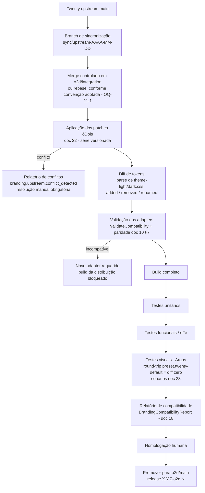

# 21 — Upstream Bridge (`o2d-upstream-bridge`)

> **Status:** proposta — nada implementado. Nenhuma das branches abaixo existe hoje (verificado: apenas `main` e a branch de specs — doc 00 §1); são referência conceitual a instaurar.

## 1. Papel

Acompanhar o upstream `twentyhq/twenty`; sincronizar o fork; identificar mudanças em tokens, componentes e pontos globais; reaplicar patches isolados; validar adapters; executar regressão visual; gerar relatório de conflitos/compatibilidade. É **processo + automação de CI**, não serviço de runtime.

## 2. Modelo de branches (proposto)

```text
upstream/main          # espelho read-only do twentyhq/twenty (remote a configurar)
o2d/main               # main da distribuição (hoje: main)
o2d/integration        # onde o sync + patches são validados antes de promover
o2d/release-<versão>   # branches de release da distribuição
```

Pré-requisito operacional: adicionar o remote `upstream` ao fork (hoje só existe `origin` — evidência doc 00 §1) e registrar o commit base atual (`538b1808`) como marco inicial em arquivo versionado (`o2d/base-commit`, proposto).

## 3. Versionamento da distribuição

```text
Twenty:            X.Y.Z        (APP_VERSION de runtime; sem versão npm — doc 00 §1)
Distribuição óDois: X.Y.Z-o2d.N (N = iteração óDois sobre a mesma base Twenty)
```

`X.Y.Z` espelha o `APP_VERSION` da base sincronizada; `N` incrementa a cada release do fork sem mudança de base. O par `{baseCommit, appVersion}` é o `twentyVersion` registrado em versões de branding e relatórios (docs 15/18).

## 4. Fluxo de sincronização



Automação: workflow de CI agendado (semanal, proposto) executa até o passo K sem intervenção; passos L–M são manuais. A infraestrutura de testes já existe no repositório (Argos + Storybook/Vitest + Playwright e2e; workflows `ci-front.yaml`, `ci-ui.yaml`, `visual-regression-dispatch.yaml`, `ci-e2e-main.yaml`, e `ci-cross-version-upgrade.yaml` como precedente de teste entre versões — evidências doc 00 §7).

## 5. Diff de tokens (o coração do bridge)

Fonte: `packages/twenty-ui/src/theme-constants/theme-light.css` / `theme-dark.css` (contrato real, ~1000 linhas cada). O bridge:

1. Faz parse das variáveis `--t-*` da base antiga e da nova.
2. Classifica: `added` (novo token — candidato a exposição no catálogo abstrato), `removed` (aciona a matriz do doc 10 §5), `renamed` (heurística valor-igual/nome-novo, confirmada por humano), `valueChanged` (default do upstream mudou — atualizar `preset.twenty-default`, doc 06 §5).
3. Verifica também os pontos globais mapeados pelo adapter (`mapGlobalPoints`): existência de `title-utils.ts` fallback, `PageFavicon`, `AppRouterProviders`, assinatura do `ThemeProvider` (mudanças estruturais detectadas por asserção estática + falha de patch).
4. Regenera `preset.twenty-default` a partir dos novos CSS.

## 6. Relatório de compatibilidade

Persistido como `BrandingCompatibilityReport` (doc 18) e publicado como artefato de CI legível:

```text
Base: 538b1808 → <novo-commit>   APP_VERSION: X.Y.Z → X'.Y'.Z'
Tokens: +12 added · 3 removed (2 warning, 1 BLOCKING: --t-accent-…)
Renames sugeridos: 4 (confirmar)
Patches: 7/8 aplicados limpos · 1 conflito (AppRouterProviders.tsx)
Adapter: INCOMPATÍVEL até novo mapa (ação: gerar twenty-<novo>.adapter)
Visual: 214 cenários · 3 diffs (2 esperados pelo changelog upstream, 1 investigar)
Decisão exigida: sim
```

## 7. Gatilhos de eventos

O bridge emite `branding.upstream.sync_started / sync_completed / conflict_detected` via API de serviço (doc 20 §3), amarrados por `syncRunId`, permitindo que a instância exiba na admin UI (Visão geral) o estado de compatibilidade da distribuição instalada.

## 8. Regras

1. Nenhum release da distribuição sem relatório de compatibilidade verde ou com exceções homologadas por humano.
2. Patches nunca são resolvidos "no merge" silenciosamente: conflito ⇒ atualizar o patch na série (doc 22), com revisão.
3. A cada sync, o commit base registrado e o `preset.twenty-default` são atualizados **no mesmo PR** — nunca divergem.
4. Sync não pula versões maiores sem passar pelos testes de upgrade (`ci-cross-version-upgrade.yaml` como base).
