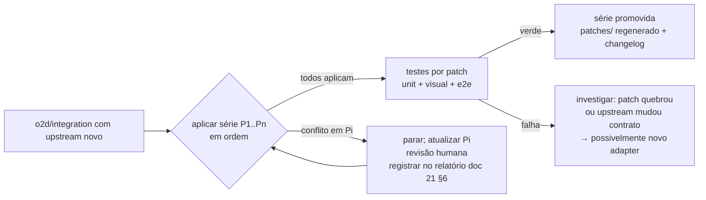

# 22 — Estratégia de Patches

> **Status:** proposta — nada implementado.

## 1. Viabilidade e forma

O fork tem hoje divergência **zero** em código (doc 02) — condição ideal para disciplina de patches. Forma recomendada: **série de commits nomeados sobre a base upstream** (rebase da série a cada sync), com espelho opcional em arquivos `.patch` gerados automaticamente para documentação/auditoria (`patches/` no repositório). O que importa é a **disciplina de isolamento e teste por patch**, não o formato de arquivo.

Critério de escolha do mecanismo por necessidade:

| Necessidade | Mecanismo correto |
|---|---|
| Código novo isolado | **pacote interno** (`o2d-*`) — nunca patch |
| Envolver a árvore React global | **provider** (1 patch de montagem) |
| Trocar comportamento de função pequena do core | **patch mínimo** no arquivo |
| Compor UI ao redor de componente existente | **composição/wrapper** em pacote próprio |
| Substituir implementação inteira | **override** — último recurso, exige justificativa no doc 27 |
| Ajuste que o upstream aceitaria | **contribuir upstream** primeiro (reduz a série) |
| Alteração direta espalhada | **proibido** |

## 2. Série de patches proposta (MVP → Fase 7)

| ID | Patch | Objetivo | Arquivos afetados | Risco | Dependência | Teste associado | Comportamento em conflito |
|---|---|---|---|---|---|---|---|
| P1 | `branding-provider.patch` | montar `O2dBrandingProvider` na raiz | `packages/twenty-front/src/modules/app/components/AppRouterProviders.tsx` (1 import + 1 wrapper) | médio (arquivo ativo no upstream) | pacote front | mount test + e2e boot | reaplicar manualmente; wrapper deve continuar por fora de `BaseThemeProvider` |
| P2 | `index-html-branding.patch` | bloco delimitado `O2D Branding` (tokens críticos inline, título, favicon, manifest) + extensão do `inject-runtime-env.sh` | `packages/twenty-front/index.html`, `packages/twenty-front/scripts/inject-runtime-env.sh` | baixo (blocos delimitados) | — | teste do script (bash) + cenário 18 (flash) | regenerar bloco; nunca editar fora dos delimitadores |
| P3 | `title-fallback.patch` | fallback `'Twenty'` → `brand.productName` | `packages/twenty-front/src/utils/title-utils.ts` (+ `NotFound.tsx:49`) | baixo | P1 | unit `title-utils` (o teste atual em `__tests__/title-utils.test.ts:52-53` espera `'Twenty'` — patch inclui ajuste do teste) | função pequena; reaplicação trivial |
| P4 | `favicon-priority.patch` | `PageFavicon` prioriza asset `favicon` do branding | `packages/twenty-front/src/modules/ui/utilities/page-favicon/components/PageFavicon.tsx` | baixo | P1 | unit + cenário 17 | idem |
| P5 | `login-logo.patch` | `Logo.tsx` lê logo do contexto de branding (default atual como fallback) | `packages/twenty-front/src/modules/auth/components/Logo.tsx` | médio (área de auth evolui) | P1 | stories do Logo + visual login-light/dark | revisar layout de auth a cada sync |
| P6 | `default-brand-constants.patch` | constantes default lidas do fallback da distribuição | `DefaultWorkspaceLogo.ts` (front), `DefaultWorkspaceName.ts`, `twenty-emails/src/constants/DefaultWorkspaceLogo.ts` | baixo | — | unit | trivial |
| P7 | `branding-settings-route.patch` (**condicional** — só se App não cobrir, OQ-13-1) | registrar rota/página de settings | arquivo de rotas de settings do front | médio | P1 | e2e navegação | reaplicar |
| P8 | `file-folder-branding.patch` | `FileFolder.BrandingAsset` + config de pasta | `packages/twenty-shared/src/types/FileFolder.ts`, `packages/twenty-server/src/engine/core-modules/file/interfaces/file-folder.interface.ts` | baixo (aditivo) | módulo server | unit server | enum aditivo raramente conflita |
| P9 | `public-workspace-branding.patch` (**Fase 5**, OQ-12-1) | `brandingHash` na `PublicWorkspaceDataDTO` | `public-workspace-data.dto.ts`, `workspace.resolver.ts` | médio | módulo server | integração resolver | reavaliar contra mudanças do resolver |
| P10 | `email-branding.patch` (**Fase 7**) | `BaseEmail`/`Logo`/`Footer` parametrizados com default atual | `packages/twenty-emails/src/components/{BaseEmail,Logo,Footer}.tsx` + call-sites que passam branding | médio | resolução server | render dos 12 templates + snapshot | manter props opcionais = default upstream |

Módulo server (`src/o2d/branding/**`), pacotes `o2d-branding-*` e migrations próprias **não são patches** — são adições em diretórios que o upstream não toca.

## 3. Fluxo de aplicação (a cada sync do bridge)

## 4. Regras

1. Cada patch: um objetivo, mínimo diff, teste próprio, dono claro.
2. Ordem estável e documentada; dependências explícitas (P3–P5 dependem de P1).
3. Meta de tamanho: série ≤ 10 patches e ≤ ~300 linhas somadas; crescer além disso é sinal de que algo deveria virar pacote/contribuição upstream.
4. Nunca editar arquivos de tema do twenty-ui (`theme-*.css`) por patch — mudança de token se resolve no adapter.
5. Todo patch novo passa por: justificativa no PR + avaliação "dá para fazer sem patch?" (tabela §1).
6. Patches carregam marcador `O2D-PATCH: <id>` em comentário no ponto tocado, para rastreabilidade e detecção de perda em merge.
