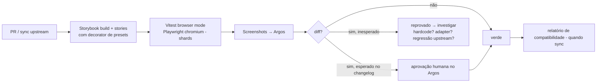

# 23 — Estratégia de Testes Visuais e Catálogo

> **Status:** proposta — nada implementado. Constrói sobre a infraestrutura existente (evidências doc 00 §7): Storybook em 3 pacotes, testes de stories via Vitest browser mode (Playwright/chromium), **Argos CI** para regressão visual (`ci-front.yaml`, `ci-ui.yaml`, `visual-regression-dispatch.yaml`), Playwright e2e sem baseline própria.

## 1. Storybook como catálogo (Etapa 18 da missão)

- **Catalogar**: stories dos componentes de branding (admin UI, Logo integrado, preview) nos padrões do repositório; o catálogo de componentes do Twenty já existe (`twenty-ui` stories + escopos do front).
- **Testar tokens**: decorator `withO2dBranding(presetOrOverrides)` que envolve stories com `ThemeProvider` escopado + overrides — permite renderizar qualquer story existente sob `preset.odois`, `preset.twenty-default` e presets extremos (stress: contraste mínimo, raios máximos, densidade compacta).
- **Claro/escuro**: matriz de render por story (o preview do twenty-ui já importa os dois CSS de tema — `packages/twenty-ui/.storybook/preview.tsx:2-3`); acessibilidade automática já é `error` no twenty-ui (`preview.tsx:8-10`) — estender o mesmo rigor às stories de branding.
- **Estados**: `storybook-addon-pseudo-states` (já instalado no front) para hover/focus/disabled sob tokens customizados.

## 2. Detecção de componentes hardcoded (estratégia dedicada)

Objetivo: encontrar componentes que **não respondem** ao Branding Engine.

1. **Teste do preset invertido**: aplicar um preset sentinela (cores absurdas e únicas, ex.: magenta #FF00FF em `background.primary`) via decorator e capturar screenshots de todo o catálogo; pixels com as cores default do Twenty (amostradas de `theme-light.css`) acima de um limiar ⇒ componente suspeito de hardcode. Executado como job dedicado, gera lista de arquivos suspeitos.
2. **Varredura estática**: lint/scan por literais de cor (`#hex`, `rgb(`, `oklch(`) em `packages/twenty-front/src` e `twenty-ui/src` fora dos diretórios de tema — baseline registrada e monitorada a cada sync (novos hits aparecem no relatório do bridge).
3. **Round-trip neutro** (doc 10 §7): `preset.twenty-default` via engine ⇒ diff zero — qualquer diff aponta mapeamento errado do adapter.

Saída: lista priorizada → decisão por item (aceitar limitação / patch pontual / issue upstream) registrada no relatório de compatibilidade.

## 3. Matriz de screenshots de regressão

Cenários (uma biblioteca única compartilhada com o preview — doc 14 §2):

```text
login-light · login-dark · dashboard-light · dashboard-dark
sidebar-expanded · sidebar-collapsed · records-table · record-page
kanban · form · modal · dropdown · settings · mobile · tablet
```

Cada cenário × presets {twenty-default, odois, cliente-exemplo} × modo {light, dark} (viewports fixos: 1440, 1024, 390 — reduzidos a combinações relevantes por cenário para conter o volume).

## 4. Processo de baseline e revisão

| Aspecto | Definição |
|---|---|
| Baseline | Argos por branch de referência (mecanismo já em uso: `ARGOS_REFERENCE_COMMIT` no `vitest.config.ts`) |
| Tolerância | zero-diff por padrão; anti-flakiness pela espera de fontes já existente (`waitForInterFontLoadedBeforeScreenshot`, `preview.tsx:101-109`) e dados mockados determinísticos |
| Revisão/aprovação | diffs exigem aprovação humana no Argos antes do merge; aprovação em duas chaves para diffs em cenários de login/estados críticos |
| Diferenças esperadas | mudanças intencionais de branding chegam com changelog da versão; o PR referencia os cenários que devem mudar — diffs fora da lista reprovam |
| Atualização de snapshots | somente via aprovação no Argos (nunca commit manual de imagem) |
| Execução por PR | todo PR que toque `o2d-*`, patches ou adapter roda a matriz completa; PRs comuns rodam o subconjunto padrão atual |
| Execução pós-sync upstream | obrigatória e completa (gate do bridge — doc 21 §4, cenário 14) |

## 5. Fluxo



## 6. Cenários obrigatórios de teste (Etapa 30 da missão — mapeamento)

Os 20 cenários exigidos e onde cada um é provado:

| # | Cenário | Tipo/local |
|---|---|---|
| 1 | workspace sem branding usa fallback | integração server (resolução) |
| 2 | domínio com branding usa configuração correta | integração server + e2e |
| 3 | workspace não recebe branding de outro | integração (cache/chaves) + e2e |
| 4 | tema inválido não publica | unit core + integração publicação |
| 5 | asset malicioso rejeitado | unit pipeline (corpus) |
| 6 | SVG com script rejeitado | unit sanitizador (corpus dedicado) |
| 7 | usuário sem permissão não publica | integração RBAC |
| 8 | rascunho não afeta publicado | integração + e2e |
| 9 | preview não altera tema real | e2e (hash do artefato público inalterado durante preview) |
| 10 | rollback restaura versão funcional | integração + visual |
| 11 | adapter incompatível bloqueia publicação | unit adapter + integração |
| 12 | falha de asset usa fallback | unit front (onerror) + e2e com asset 404 |
| 13 | claro/escuro mantêm contraste | unit validação (A1–A7) sobre presets |
| 14 | atualização upstream executa regressão visual | gate de CI do bridge |
| 15 | tokens ausentes → erro controlado | unit core (normalização/validação) |
| 16 | configuração de outro workspace não pode ser lida | integração API (404) |
| 17 | favicon e título atualizados corretamente | e2e (asserção de `document.title` e link rel=icon) |
| 18 | sem flash perceptível do tema padrão | e2e com captura do primeiro frame (throttling de rede) |
| 19 | CSS custom não oculta funções críticas | garantido por construção (sem CSS de cliente — doc 04 §6) + teste de que tokens somente leitura são rejeitados |
| 20 | branding não quebra funcionalidades | suite e2e existente executada sob `preset.odois` |

Estratégia completa de testes não-visuais: doc 26 §testes por fase e docs específicos (06, 10, 11, 17).
