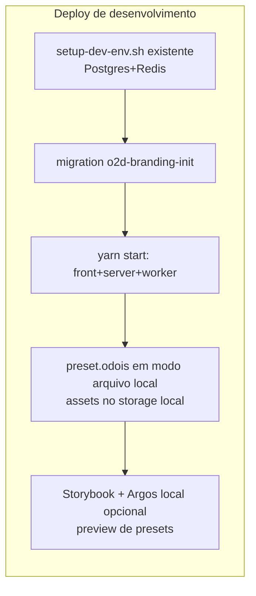
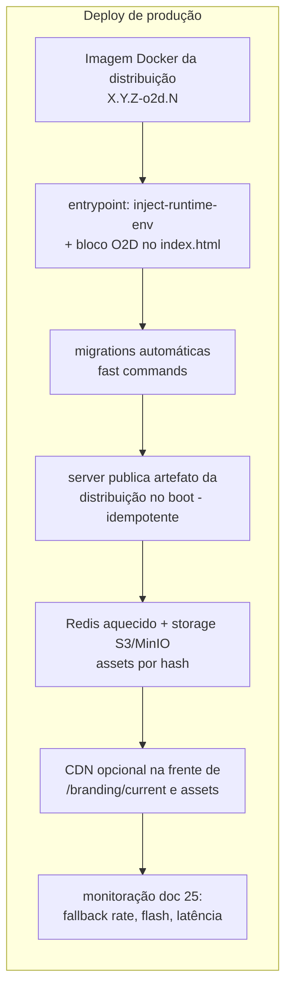

# 26 — Roadmap de Implementação

> **Status:** proposta — nada implementado. Cada fase só inicia com os critérios da anterior aceitos. Estimativas de arquivos referem-se à projeção dos docs 03/22.

## Fase 1 — Inventário e fundação

- **Objetivo**: consolidar o contrato técnico antes de qualquer pixel.
- **Entregáveis**: catálogo abstrato de tokens (doc 09) congelado v1; JSON Schemas (`o2d.branding.config/1-0-0`); pacote `o2d-branding-core` (normalização/validação/derivação com golden tests); adapter inicial `twenty-538b1808` gerado por parse dos CSS reais + teste de paridade; `preset.twenty-default` extraído; remote `upstream` configurado + arquivo de base-commit; scan SPDX de licenças no CI.
- **Dependências**: decisões OQ-09-1/2/3, JUR-1 encaminhada.
- **Riscos**: catálogo abstrato mal dimensionado (mitigação: começar mínimo, só tiers obrigatório/opcional).
- **Critérios de aceite**: round-trip neutro provado (preset default via adapter ⇒ diff visual zero no Argos); hash determinístico em CI.
- **Arquivos afetados**: somente pacotes novos. **Migrations**: nenhuma. **Deploy**: nenhum. **Upstream**: instaura o processo do bridge (manual).

## Fase 2 — Branding global estático (identidade óDois)

- **Objetivo**: a distribuição sobe com a cara da óDois, sem configuração por workspace.
- **Entregáveis**: `preset.odois` (tokens claro/escuro + assets, propriedade óDois — doc 24); patches P1–P6 (provider, index.html/inject-runtime-env, título, favicon, logo login, constantes default); artefato da distribuição embarcado no build; manifest PWA gerado; fontes auto-hospedadas.
- **Dependências**: Fase 1; assets óDois aprovados; JUR-4 (marca).
- **Riscos**: flash de tema (mitigado pelo inline P2); conflito futuro em P1/P5.
- **Critérios de aceite**: cenários 17 e 18 verdes; suite e2e existente verde sob `preset.odois` (cenário 20); zero menção visual a "Twenty" nas superfícies cobertas.
- **Arquivos afetados**: ≤ 8 do core (patches) + pacotes o2d. **Migrations**: nenhuma. **Deploy**: extensão do entrypoint Docker (bloco O2D). **Upstream**: primeira reaplicação da série de patches em sync de teste.

## Fase 3 — Configuração administrativa

- **Objetivo**: editar e publicar branding via UI, por workspace (ainda sem domínio).
- **Entregáveis**: módulo `o2d-branding-server` (entidades doc 18, API doc 19, RBAC doc 17, auditoria doc 20); migration `o2d-branding-init` (fast, up/down); admin UI (App preferencial — OQ-13-1 resolvida) com seções Marca/Cores/Interface/Temas/Publicação; pipeline de assets (doc 11) com sanitização SVG; validação completa (doc 06 §4).
- **Riscos**: limitações da plataforma de Apps para settings (fallback P7); sanitização SVG (usar corpus de testes desde o 1º dia).
- **Critérios de aceite**: cenários 1, 4, 5, 6, 7, 8, 15, 16 verdes.
- **Migrations**: 1 (tabelas novas). **Deploy**: sem mudança de topologia. **Upstream**: patches inalterados (módulo é adição).

## Fase 4 — Preview e versionamento

- **Entregáveis**: preview escopado com biblioteca de cenários (doc 14); comparação entre versões; máquina de estados completa + rollback (doc 15); decorator de presets no Storybook + matriz visual no Argos (doc 23 §1-3).
- **Critérios de aceite**: cenários 9, 10, 13 verdes; biblioteca de cenários compartilhada preview/testes.
- **Migrations**: nenhuma nova. **Upstream**: matriz visual passa a ser gate.

## Fase 5 — Multi-workspace e domínio

- **Entregáveis**: resolução por domínio (doc 12) + `BrandingDomain`; cache Redis + invalidação por eventos de domínio; cache local versionado no cliente; bootstrap por domínio (decisões OQ-08-1, OQ-12-1); telemetria de flash.
- **Dependências**: **JUR-2 resolvida** (arquivos Enterprise de custom domain — doc 24 §4) — pode restringir a subdomínios.
- **Critérios de aceite**: cenários 2, 3, 12 verdes; metas de desempenho do doc 25 §2 medidas.
- **Migrations**: possível ajuste em `BrandingDomain`. **Deploy**: avaliação de CDN.

## Fase 6 — Upstream Bridge automatizado

- **Entregáveis**: workflow CI de sync (doc 21 §4) até o relatório; diff de tokens automatizado; regeneração de `preset.twenty-default`; `BrandingCompatibilityReport` persistido; primeira sincronização real com versão nova do Twenty ponta a ponta.
- **Critérios de aceite**: cenários 11 e 14 verdes; um sync real homologado com relatório.
- **Upstream**: processo vira rotina versionada (`X.Y.Z-o2d.N`).

## Fase 7 — White-label avançado

- **Entregáveis**: e-mails com branding (patch P10 + injeção server-side); documentos gerados; manifest/og-tags por domínio; login avançado (imagem/disposição/legal); configurações técnicas Nível 2 completas (tipografia/densidade); presets por cliente.
- **Dependências**: JUR-5/6.
- **Critérios de aceite**: render dos 12 templates de e-mail com e sem branding idêntico ao esperado (snapshots); auditoria completa de acessibilidade nos cenários.

## Deploys

## Matriz resumo

| Fase | Migrations | Patches novos | Gate de aceite principal |
|---|---|---|---|
| 1 | 0 | 0 | round-trip neutro (diff zero) |
| 2 | 0 | P1–P6 | e2e verde sob preset.odois, sem flash |
| 3 | 1 | (P7?) P8 | cenários de segurança/isolamento |
| 4 | 0 | 0 | preview/rollback provados |
| 5 | ≤1 | (P9?) | multi-domínio + desempenho |
| 6 | 0 | 0 | sync real homologado |
| 7 | 0 | P10 | e-mails/documentos + a11y |
