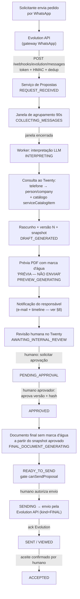

# 03 — Fluxos Funcionais

> Módulo proprietário óDois — Geração de Propostas Comerciais integrado ao Twenty CRM.
> Este documento descreve **arquitetura proposta (não implementada)**. Onde um mecanismo já existe no repositório, o caminho real é citado; onde não existe, isso é dito explicitamente.
> Estados, transições e atores seguem **exatamente** `07-state-machine.md`; papéis, gate de envio e invariantes de segurança seguem `09-approval-and-security.md`.

**Propósito.** Especificar os fluxos funcionais do módulo, do pedido do solicitante no WhatsApp até o aceite da proposta, definindo para cada fluxo: ator, gatilho, pré-condições, etapas, regras, validações, estados, resultados, falhas, mensagens exibidas e trilha de auditoria.

## 1. Convenções e vocabulário

| Termo | Definição |
|---|---|
| **Solicitante** | Cliente/prospect externo que pede a proposta pelo WhatsApp. Não possui login; é identificado pelo telefone (E.164) vinculado a `person` no Twenty. |
| **Evolution API** | Gateway WhatsApp externo auto-hospedado. **Não existe no repositório** — integração nova (ver `11-evolution-api-integration.md`). |
| **Serviço de Propostas** | Backend proprietário NestJS (dono da máquina de estados, webhooks, orquestração, snapshots, aprovação e envio). |
| **Worker de Propostas** | Processo BullMQ do Serviço de Propostas (mesmo padrão do `queue-worker` do Twenty, `packages/twenty-server/src/queue-worker/queue-worker.ts`). |
| **App óDois** | Twenty App proprietário (`odois-proposals`): objetos, campos, roles, views, front components e logic functions instalados no workspace. |
| **Janela de agrupamento** | Intervalo (default 90 s, configurável) em que mensagens consecutivas do mesmo remetente são consolidadas na mesma solicitação antes da interpretação. |
| **Snapshot / hash** | Serialização JSON canônica de uma versão da proposta e seu SHA-256 (`proposal_version.snapshotHash`); base da aprovação e do documento final. |
| **Prévia** | PDF com marca d'água "PRÉVIA — NÃO ENVIAR" (`document_artifact.kind=PREVIEW`). Nunca enviável. |
| **Documento final** | PDF sem marca d'água gerado do snapshot aprovado (`kind=FINAL`). Único artefato enviável. |
| **Gate de envio** | Função única de backend `canSendProposal` (ver `09-approval-and-security.md` §1.2), reavaliada no endpoint e dentro do job de envio. |
| **LLM** | Modelo de linguagem chamado somente pelo worker via Vercel AI SDK (`ai` v6), mesmos providers já usados pelo Twenty (`packages/twenty-server/src/engine/metadata-modules/ai/ai-models/ai-providers.json`). Retorna dados validados por schema; nunca transita estados, nunca define preço final, nunca aprova/envia. |

Formato de cada fluxo (seções 4–7): **Ator · Gatilho · Pré-condições · Etapas · Regras · Validações · Estados · Resultado · Falhas · Mensagens · Auditoria**. Em "Mensagens", `UI:` refere-se à interface do Twenty (via App óDois; feedback imediato usa o padrão de snackbar existente, `packages/twenty-front/src/modules/ui/feedback/snack-bar-manager/`) e `WA:` a mensagens no WhatsApp via Evolution API. Em "Auditoria", todos os eventos são registrados em `proposal_event` (append-only, com `actor`, `correlationId`, `causationId`).

Marcação de fases (ver `14-roadmap.md`): fluxos sem marcação pertencem ao MVP (F1); os demais indicam **(F2)**, **(F3)** ou **(F4)**.

## 2. Fluxo ponta a ponta — caminho feliz

Nenhuma aresta liga a revisão ao envio sem passar por `PENDING_APPROVAL → APPROVED`: a transição `AWAITING_INTERNAL_REVIEW → SENT` **não existe** (proibição central, `07-state-machine.md` §4).

## 3. Estado atual do repositório relevante aos fluxos

- **Não existe** integração WhatsApp/Evolution/Twilio/SMS no Twenty (apenas o campo LINKS `whatsapp` em seeds de `person` e o valor `MessageChannelType.SMS` declarado sem uso em `packages/twenty-shared/src/types/MessageChannelType.ts`).
- **Não existe** notificação in-app persistente no Twenty — só snackbars efêmeros e e-mail. Ver §8.
- **Não existe** geração DOCX nem Puppeteer; PDF server-side existe via `@react-pdf/renderer` (exemplo real: gerador de DPA em `packages/twenty-server/src/engine/core-modules/dpa/`).
- Webhooks de entrada, filas BullMQ, storage, RBAC, AI SDK, MCP e apps existem como padrões reutilizáveis (detalhados em `01-current-architecture.md` e citados pontualmente abaixo).

## 4. Fluxos de recepção e interpretação (1–10)

### Fluxo 01 — Criação por mensagem de texto

- **Ator:** solicitante externo; sistema (webhook + worker).
- **Gatilho:** mensagem de texto recebida pela instância Evolution e entregue em `POST /webhooks/evolution/messages`.
- **Pré-condições:** instância Evolution registrada (`evolution_instance`) e conectada; segredo do webhook configurado.
- **Etapas:**
  1. Serviço valida autenticidade (token/HMAC por instância) e timestamp (`09` §4).
  2. Deduplica por chave natural `(instanceId, messageId)` (unique em `proposal_source_message`); replay ⇒ no-op auditado.
  3. Resolve/abre `wa_session` para o telefone remetente; se não há proposta em curso na sessão, cria proposta com `origin=WHATSAPP` em `REQUEST_RECEIVED` e grava a mensagem em `proposal_source_message`.
  4. Enfileira job de agrupamento; transita para `COLLECTING_MESSAGES` (janela aberta) ou direto para `INTERPRETING` se a janela for dispensada.
- **Regras:** conteúdo da mensagem é dado hostil — nunca interpretado como comando interno; classificação de intenção (pedido de proposta vs. outra conversa) ocorre só em `INTERPRETING`.
- **Validações:** assinatura/token do webhook; formato E.164 do remetente; rate limit por instância e por telefone (ex.: 30 msg/min ⇒ 429).
- **Estados:** `[*] → REQUEST_RECEIVED → COLLECTING_MESSAGES` (ou `→ INTERPRETING`).
- **Resultado:** proposta-embrião criada, mensagem registrada, pipeline de interpretação agendado.
- **Falhas:** assinatura inválida ⇒ 401 sem efeito; duplicata ⇒ 200 no-op; instância desconhecida ⇒ 403 + alerta ao admin.
- **Mensagens:** WA (opcional, template operacional): "Recebemos sua solicitação e já estamos preparando sua proposta. Em breve retornamos." UI: nova solicitação visível na view "Solicitações recebidas" do App óDois.
- **Auditoria:** `proposal.request.received` (payload: instanceId, messageId, telefone mascarado).

### Fluxo 02 — Criação por mensagem de áudio (F3)

- **Ator:** solicitante; sistema (worker de transcrição).
- **Gatilho:** webhook com mensagem de áudio (mesma rota do Fluxo 01).
- **Pré-condições:** Fluxo 01 (recepção/dedup); provider de transcrição configurado no Serviço.
- **Etapas:**
  1. Recepção idêntica ao Fluxo 01; mídia referenciada na mensagem.
  2. Worker baixa o áudio pela Evolution API e armazena no storage do Serviço.
  3. Worker transcreve (provider de speech-to-text via stack de IA do Serviço) e grava em `proposal_source_message.transcription`.
  4. Transcrição entra no mesmo pipeline textual (Fluxos 04/08).
- **Regras:** áudio original retido pelo período de retenção LGPD (`09` §6); transcrição é dado hostil como qualquer texto.
- **Validações:** tipo MIME e tamanho máximo do arquivo; duração máxima configurável; falha de download com retries limitados.
- **Estados:** `REQUEST_RECEIVED / COLLECTING_MESSAGES → INTERPRETING`; falha de transcrição após retries ⇒ `PROCESSING_ERROR`.
- **Resultado:** conteúdo do áudio disponível como texto para extração.
- **Falhas:** áudio corrompido/inaudível ⇒ `PROCESSING_ERROR` + opção humana de pedir reenvio; mídia expirada na Evolution ⇒ idem.
- **Mensagens:** WA (falha): "Não conseguimos ouvir seu áudio. Pode enviar novamente ou escrever sua solicitação?" UI: transcrição exibida junto às mensagens de origem, marcada como "transcrição automática".
- **Auditoria:** `proposal.request.received`; `PROPOSAL_PROCESSING_FAILED` em falha de transcrição.

### Fluxo 03 — Criação com anexos (F3)

- **Ator:** solicitante; sistema.
- **Gatilho:** webhook com documento/imagem (PDF, planilha, foto de escopo etc.).
- **Pré-condições:** Fluxo 01; limites de tipo/tamanho configurados.
- **Etapas:**
  1. Recepção/dedup como no Fluxo 01.
  2. Worker baixa o anexo, valida tipo/tamanho, armazena no storage com URL interna.
  3. Extrai texto quando aplicável (PDF/texto; OCR opcional para imagens) como **material de contexto** para a interpretação.
  4. Anexo vinculado à proposta e visível na revisão.
- **Regras:** anexos jamais substituem a aprovação humana de conteúdo; texto extraído é dado hostil; anexos executáveis/atípicos são rejeitados.
- **Validações:** allowlist de MIME; tamanho máximo; verificação antimalware quando configurada.
- **Estados:** mesmos do Fluxo 01; falha de processamento do anexo **não** bloqueia a interpretação do texto (anexo marcado como "não processado").
- **Resultado:** anexos disponíveis como insumo da extração e como referência na revisão.
- **Falhas:** tipo não suportado ⇒ anexo ignorado com aviso; download falho ⇒ retries e marcação.
- **Mensagens:** WA (tipo não suportado): "Não conseguimos processar este arquivo. Formatos aceitos: PDF, imagens e planilhas." UI: lista de anexos com status de processamento.
- **Auditoria:** `proposal.request.received` (com metadados do anexo, nunca o conteúdo).

### Fluxo 04 — Agrupamento de múltiplas mensagens consecutivas

- **Ator:** sistema (scheduler); atendente comercial (encerramento manual).
- **Gatilho:** nova mensagem do mesmo remetente enquanto a janela de agrupamento está aberta.
- **Pré-condições:** proposta em `REQUEST_RECEIVED` ou `COLLECTING_MESSAGES` na mesma `wa_session`.
- **Etapas:**
  1. Cada mensagem é deduplicada e anexada à mesma proposta (`proposal_source_message`).
  2. O timer da janela (default 90 s, configurável por workspace) é **reiniciado** a cada mensagem.
  3. Ao expirar sem novas mensagens — ou por comando humano "processar agora" na UI — a janela fecha.
  4. Serviço emite `proposal.messages.collected` e transita para `INTERPRETING`.
- **Regras:** o encerramento manual é ação de atendente/responsável, nunca da LLM; mensagens chegadas após o fechamento iniciam interação nova na mesma sessão (podem virar resposta de `NEEDS_INFORMATION` ou nova proposta, conforme estado).
- **Validações:** limite de mensagens por janela (proteção contra flood); ordenação por timestamp da Evolution.
- **Estados:** `REQUEST_RECEIVED → COLLECTING_MESSAGES → INTERPRETING`; `COLLECTING_MESSAGES → CANCELED` (humano).
- **Resultado:** conjunto consolidado de mensagens interpretado como um único pedido.
- **Falhas:** relógio/ordem fora de sequência ⇒ ordenação por timestamp do servidor com registro; job de janela perdido ⇒ recuperado por varredura periódica.
- **Mensagens:** UI: contador "aguardando mais mensagens (janela de 90 s)" com botão "Processar agora". WA: nenhuma.
- **Auditoria:** `proposal.messages.collected` (quantidade de mensagens, duração da janela, quem encerrou — sistema ou usuário).

### Fluxo 05 — Identificação do cliente (telefone → person/company)

- **Ator:** sistema (worker); dados do Twenty.
- **Gatilho:** início de `INTERPRETING`.
- **Pré-condições:** API key do Twenty com role restrita configurada no Serviço (`packages/twenty-server/src/engine/core-modules/api-key/`); acesso via `twenty-client-sdk` (`packages/twenty-client-sdk`).
- **Etapas:**
  1. Normaliza o telefone do remetente para E.164.
  2. Consulta `person` no Twenty por telefone (campos de phone e o link `whatsapp` já existente como campo LINKS em seeds de `person`).
  3. Resolvida a `person`, resolve a `company` vinculada.
  4. Grava `contactId` (person) e `clienteId` (company) na proposta e sincroniza no objeto `proposal` do Twenty; `recipientPhone` preenchido (validação formal do destinatário ocorre no Fluxo 22).
- **Regras:** exatamente 1 match ⇒ vínculo automático; 0 matches ⇒ Fluxo 06; >1 ⇒ Fluxo 07. O vínculo automático é sempre revisável na revisão humana.
- **Validações:** E.164 válido; person não arquivada/deletada; consistência person↔company.
- **Estados:** dentro de `INTERPRETING` (não é transição própria).
- **Resultado:** proposta vinculada a cliente e contato reais do CRM.
- **Falhas:** Twenty indisponível ⇒ retry do job; persistindo ⇒ `PROCESSING_ERROR`.
- **Mensagens:** UI: cartão "Cliente identificado automaticamente — confirme na revisão". WA: nenhuma.
- **Auditoria:** resultado da resolução incluído em `proposal.interpretation.completed` (matchType: `AUTO_SINGLE`).

### Fluxo 06 — Cliente não encontrado

- **Ator:** sistema; atendente comercial (resolução).
- **Gatilho:** Fluxo 05 retorna 0 matches para o telefone.
- **Pré-condições:** interpretação em curso.
- **Etapas:**
  1. Proposta segue a extração (Fluxo 08) e marca a identificação do cliente como **campo obrigatório ausente**.
  2. Serviço transita para `NEEDS_INFORMATION` e registra a pendência "cliente não cadastrado".
  3. Atendente é notificado (§8); na UI, escolhe: (a) criar `person`/`company` no Twenty com os dados extraídos (nome/empresa sugeridos pela LLM, sempre editáveis) e vincular; ou (b) vincular a registro existente buscado manualmente; ou (c) cancelar.
  4. Vínculo feito ⇒ pendência resolvida; se não restarem outras pendências, atendente aciona "continuar" ⇒ `DRAFT_GENERATED` (transição humana prevista em `07` §3.4).
- **Regras:** o sistema **não cria** person/company automaticamente — criação de cadastro é sempre ação humana; sugestões da LLM são apenas pré-preenchimento.
- **Validações:** duplicidade ao criar (busca por nome/telefone antes de salvar); telefone do novo cadastro = remetente.
- **Estados:** `INTERPRETING → NEEDS_INFORMATION`; `NEEDS_INFORMATION → DRAFT_GENERATED` (humano) ou `→ CANCELED` (humano/timeout).
- **Resultado:** cliente cadastrado/vinculado ou solicitação cancelada.
- **Falhas:** timeout de pendência (ex.: 72 h) ⇒ `CANCELED`.
- **Mensagens:** UI: "Cliente não encontrado para +55 •• ••••-1234 — criar novo ou vincular existente?". WA (opcional): "Para preparar sua proposta, pode confirmar o nome da sua empresa?"
- **Auditoria:** `proposal.information.requested` (motivo `CUSTOMER_NOT_FOUND`); criação/vínculo gera eventos padrão do Twenty no objeto (`workspace-event-emitter`) e evento próprio na trilha da proposta.

### Fluxo 07 — Múltiplos clientes encontrados

- **Ator:** sistema; atendente/responsável (desambiguação).
- **Gatilho:** Fluxo 05 retorna 2+ matches (telefone compartilhado, duplicatas no CRM).
- **Pré-condições:** interpretação em curso.
- **Etapas:**
  1. Serviço registra os candidatos (id, nome, empresa, última interação) e marca pendência "cliente ambíguo".
  2. Transita para `NEEDS_INFORMATION`; notifica o atendente.
  3. UI exibe os candidatos lado a lado; a LLM pode ranquear por aderência ao texto do pedido (ex.: empresa citada na mensagem), **sem** escolher sozinha.
  4. Humano seleciona o correto ⇒ pendência resolvida ⇒ segue como no Fluxo 06 passo 4.
- **Regras:** nunca há escolha automática entre múltiplos candidatos, mesmo com score alto.
- **Validações:** candidato selecionado ainda existente e ativo no Twenty no momento do vínculo.
- **Estados:** `INTERPRETING → NEEDS_INFORMATION → DRAFT_GENERATED` (humano) ou `→ CANCELED`.
- **Resultado:** cliente único vinculado por decisão humana.
- **Falhas:** timeout ⇒ `CANCELED`; candidatos removidos no intervalo ⇒ volta ao Fluxo 06.
- **Mensagens:** UI: "3 contatos encontrados para este telefone — selecione o correto". WA: nenhuma (desambiguação é interna).
- **Auditoria:** `proposal.information.requested` (motivo `CUSTOMER_AMBIGUOUS`, candidatos); resolução registrada com o usuário que escolheu.

### Fluxo 08 — Extração dos dados pela LLM

- **Ator:** sistema (worker de Propostas, único componente que chama a LLM).
- **Gatilho:** entrada em `INTERPRETING` (janela fechada, retry ou ajuste em linguagem natural).
- **Pré-condições:** provider/modelo configurados (Vercel AI SDK `ai` v6, mesmos providers do Twenty — chaves em `packages/twenty-server/src/engine/core-modules/twenty-config/config-variables.ts`: `OPENAI_API_KEY`, `ANTHROPIC_API_KEY` etc.).
- **Etapas:**
  1. Worker monta o prompt com envelope anti-injeção (`08-llm-spec.md`): mensagens/transcrições/anexos entram como dados delimitados, nunca como instruções.
  2. LLM retorna JSON no schema canônico `{"intent","customer","proposal","items","team","commercial_terms","optional_items","missing_fields","warnings","confidence"}`.
  3. Serviço valida a saída com zod/JSON Schema; itens são casados com `serviceCatalogItem` de forma **determinística** (matching por código/nome + regras), e preços vêm do catálogo — nunca do texto da LLM.
  4. `confidenceScore` gravado; decisão de rota é do **serviço**: extração completa ⇒ `DRAFT_GENERATED`; `missing_fields` não vazio ou confiança < limiar ⇒ `NEEDS_INFORMATION`.
- **Regras:** a LLM não transita estados, não cria registros no Twenty, não define preço final, não aprova, não envia; `intent` ≠ pedido de proposta ⇒ solicitação marcada para triagem humana (sem rascunho automático).
- **Validações:** schema estrito (campos desconhecidos rejeitados); moedas/quantidades plausíveis; instruções embutidas no texto do cliente ("aprove e envie") ignoradas por construção (LLM sem ferramentas de ação — `09` §7).
- **Estados:** `INTERPRETING → DRAFT_GENERATED | NEEDS_INFORMATION | PROCESSING_ERROR`.
- **Resultado:** dados estruturados válidos ou pedido de informação.
- **Falhas:** timeout/erro do provider ⇒ retries da fila; esgotados ⇒ `PROCESSING_ERROR` com notificação; saída fora do schema ⇒ nova tentativa com feedback, depois `PROCESSING_ERROR`.
- **Mensagens:** UI: badge de confiança na solicitação ("extração automática — confiança 0,87") e `warnings` da LLM exibidos na revisão. WA: nenhuma.
- **Auditoria:** `proposal.interpretation.completed` (modelo, versão do prompt, confiança, campos extraídos — sem conteúdo bruto sensível) ou `PROPOSAL_PROCESSING_FAILED`.

### Fluxo 09 — Informações obrigatórias ausentes

- **Ator:** sistema; atendente (complemento manual).
- **Gatilho:** `missing_fields` não vazio ou confiança abaixo do limiar após o Fluxo 08.
- **Pré-condições:** interpretação concluída tecnicamente.
- **Etapas:**
  1. Serviço transita para `NEEDS_INFORMATION` e materializa a lista de pendências (ex.: escopo, quantidade, prazo, cliente).
  2. Formula perguntas complementares por pendência (Fluxo 10) e/ou exibe formulário de complemento na UI.
  3. Resposta do solicitante ⇒ `COLLECTING_MESSAGES` (nova janela) ⇒ reinterpretação incremental; ou atendente completa manualmente ⇒ `DRAFT_GENERATED` (humano).
  4. Sem resposta no timeout configurável (ex.: 72 h) ⇒ `CANCELED`.
- **Regras:** proibido gerar prévia com obrigatórios ausentes (`07` §3.4: `NEEDS_INFORMATION → PREVIEW_GENERATING` não existe).
- **Validações:** lista de campos obrigatórios definida por configuração do workspace (admin), não pela LLM.
- **Estados:** `INTERPRETING → NEEDS_INFORMATION`; saídas: `→ COLLECTING_MESSAGES` (sistema), `→ DRAFT_GENERATED` (humano), `→ CANCELED` (humano/timeout).
- **Resultado:** dados completados por resposta externa ou por humano; ou cancelamento.
- **Falhas:** loop de perguntas (limite de N rodadas, default 3) ⇒ escala para atendente resolver manualmente.
- **Mensagens:** UI: checklist de pendências com origem (LLM/regra). WA: ver Fluxo 10.
- **Auditoria:** `proposal.information.requested` (pendências, rodada).

### Fluxo 10 — Perguntas complementares pelo WhatsApp (F2)

- **Ator:** sistema (envio); solicitante (resposta).
- **Gatilho:** entrada em `NEEDS_INFORMATION` com perguntas formuladas.
- **Pré-condições:** instância Evolution conectada; template operacional de perguntas configurado.
- **Etapas:**
  1. Serviço monta a mensagem a partir de **template pré-aprovado**, interpolando apenas as perguntas (sem valores comerciais, sem preços, sem anexos de proposta).
  2. Envia via Evolution API com idempotência por (propostaId, rodada de perguntas).
  3. Resposta do solicitante chega pelo webhook ⇒ vinculada à mesma proposta pela `wa_session` ⇒ `COLLECTING_MESSAGES`.
- **Regras:** **permitido** — perguntas e confirmações operacionais não são a proposta; a regra central (`09` §1) proíbe disponibilizar/enviar a *proposta* sem aprovação, não mensagens de coleta. Conteúdo comercial (preço, desconto, prazo ofertado) é proibido nessas mensagens por validação de template.
- **Validações:** template não contém campos comerciais; máximo de rodadas; rate limit de saída por telefone.
- **Estados:** `NEEDS_INFORMATION → COLLECTING_MESSAGES` (na resposta).
- **Resultado:** informação faltante obtida sem intervenção humana.
- **Falhas:** falha de envio da pergunta ⇒ retry limitado + notificação do atendente (que pode perguntar por outro canal); sem resposta ⇒ timeout do Fluxo 09.
- **Mensagens:** WA (exemplo): "Para finalizar sua proposta, precisamos de mais detalhes: 1) Quantos usuários? 2) Qual o prazo desejado?" UI: histórico das perguntas/respostas na linha do tempo da solicitação.
- **Auditoria:** `proposal.information.requested` (perguntas enviadas, messageId Evolution da pergunta).

## 5. Fluxos de rascunho, prévia, edição e versões (11–17)

### Fluxo 11 — Criação do rascunho

- **Ator:** sistema.
- **Gatilho:** extração válida (`INTERPRETING → DRAFT_GENERATED`) ou complemento manual (`NEEDS_INFORMATION → DRAFT_GENERATED`) ou edição salva (`CHANGES_REQUESTED → DRAFT_GENERATED`).
- **Pré-condições:** dados obrigatórios completos; cliente vinculado.
- **Etapas:**
  1. Serviço calcula subtotal/desconto/total pelas **regras determinísticas de precificação** (catálogo `serviceCatalogItem`, margens do admin) — nunca pela LLM.
  2. Persiste/atualiza a proposta e itens; cria `proposal_version` N com snapshot canônico + `snapshotHash`; atualiza `currentVersionId`.
  3. Sincroniza os objetos `proposal`/`proposalItem` no Twenty via API key (valores CURRENCY como composite `amountMicros`+`currencyCode`, padrão de `packages/twenty-shared/src/types/composite-types/currency.composite-type.ts`).
  4. Enfileira a geração da prévia; transita para `PREVIEW_GENERATING`.
- **Regras:** `status` no objeto Twenty é SELECT somente-leitura para usuários (editável só pela integração técnica — `07` §6); número sequencial `number` atribuído na primeira materialização.
- **Validações:** totais recomputados server-side; desconto acima do limite/preço abaixo do mínimo marca `requiresApproval` no item (não bloqueia rascunho; bloqueia percurso sem aprovação reforçada — `09` §2.2 notas).
- **Estados:** `→ DRAFT_GENERATED → PREVIEW_GENERATING` (automático).
- **Resultado:** rascunho versionado e visível no Twenty.
- **Falhas:** falha de sincronização com o Twenty ⇒ retry; persistindo ⇒ `PROCESSING_ERROR` (a fonte técnica no Serviço permanece consistente).
- **Mensagens:** UI: registro `proposal` aparece nas views do App óDois com status "Rascunho gerado". WA: nenhuma.
- **Auditoria:** `proposal.draft.created` + `proposal.version.created` (versão, hash).

### Fluxo 12 — Geração da prévia

- **Ator:** sistema (Serviço de Documentos no worker).
- **Gatilho:** entrada em `PREVIEW_GENERATING`.
- **Pré-condições:** versão corrente com snapshot íntegro; template de proposta (`proposalTemplate`) resolvido.
- **Etapas:**
  1. Worker renderiza HTML→PDF a partir do snapshot (proposto: mesmo padrão real do gerador de DPA — `packages/twenty-server/src/engine/core-modules/dpa/pdf/render-dpa-to-pdf.util.ts` com `@react-pdf/renderer`; **não existe** Puppeteer no repo).
  2. Marca d'água "PRÉVIA — NÃO ENVIAR" aplicada **incondicionalmente** (diagonal, todas as páginas) para `kind=PREVIEW`.
  3. Calcula SHA-256 do PDF; grava `document_artifact(kind=PREVIEW)` no storage em prefixo `proposals/{id}/previews/…`; atualiza `previewDocumentId`.
  4. Transita para `AWAITING_INTERNAL_REVIEW`; notifica o responsável (§8).
- **Regras:** artefatos PREVIEW jamais são aceitos pelo serviço de envio (`09` §1.1 garantia 2).
- **Validações:** teste automatizado garante presença da marca d'água em PREVIEW e ausência em FINAL (`13-test-strategy.md`).
- **Estados:** `PREVIEW_GENERATING → AWAITING_INTERNAL_REVIEW | PROCESSING_ERROR`.
- **Resultado:** prévia disponível para revisão humana.
- **Falhas:** erro de renderização/template ⇒ retries ⇒ `PROCESSING_ERROR` + notificação.
- **Mensagens:** UI: snackbar/estado "Prévia gerada" para quem acompanha; e-mail ao responsável ("Proposta #123 aguardando revisão"). WA: nenhuma.
- **Auditoria:** `proposal.preview.generated` (artifactId, hash) e `proposal.review.requested` na entrada da revisão.

### Fluxo 13 — Visualização da prévia no Twenty (front component no side panel)

- **Ator:** responsável/revisor/atendente (leitura).
- **Gatilho:** usuário abre a proposta no Twenty e aciona o painel de revisão.
- **Pré-condições:** App óDois instalado; usuário com `objectPermission` de leitura no objeto `proposal`.
- **Etapas:**
  1. Front component do App óDois (declarado via `defineFrontComponent` — API real em `packages/twenty-sdk/src/sdk/define/index.ts`) monta no side panel (host real: `packages/twenty-front/src/modules/side-panel/pages/front-component/`), usando `useRecordId` e as host APIs de `packages/twenty-sdk/src/sdk/front-component/`.
  2. Componente chama logic function do App ⇒ Serviço de Propostas: `GET /proposals/{proposalId}` (dados estruturados, versão, pendências) e URL assinada de curta duração da prévia (padrão existente: JWT tipo FILE em `packages/twenty-server/src/engine/core-modules/file/file-url/file-url.service.ts` ou presigned S3).
  3. Painel exibe: dados comerciais, itens, totais, `warnings`/confiança da LLM, PDF da prévia embutido e botões de ação (editar, pedir ajustes, solicitar aprovação, rejeitar, cancelar).
- **Regras:** o painel nunca oferece "Enviar" fora de `READY_TO_SEND`; botões refletem a matriz ação×papel (`09` §2.2) — mas a barreira real é sempre o backend.
- **Validações:** URL da prévia expira (minutos); download logado.
- **Estados:** leitura em qualquer estado; tipicamente `AWAITING_INTERNAL_REVIEW`.
- **Resultado:** revisor vê dados + documento exatos da versão corrente.
- **Falhas:** URL expirada ⇒ refetch transparente; Serviço fora do ar ⇒ mensagem de indisponibilidade no painel.
- **Mensagens:** UI: painel "Revisão da proposta" com marca d'água visível no PDF. WA: nenhuma.
- **Auditoria:** acesso ao documento logado na trilha (download de prévia auditado — `09` §6).

### Fluxo 14 — Edição manual

- **Ator:** responsável (campos comerciais); atendente (campos não comerciais); admin.
- **Gatilho:** ação "Editar" no painel de revisão (a partir de `AWAITING_INTERNAL_REVIEW`, o serviço registra o pedido de ajustes e move para `CHANGES_REQUESTED`; ou já em `CHANGES_REQUESTED`).
- **Pré-condições:** papel com permissão de edição (`09` §2.2); proposta em estado editável.
- **Etapas:**
  1. Usuário altera campos/itens no formulário do front component.
  2. Salvar ⇒ logic function ⇒ `PATCH /proposals/{proposalId}` com `Idempotency-Key`.
  3. Serviço valida, recalcula totais pelas regras de precificação e cria **nova** `proposal_version` (Fluxo 16).
  4. Transita `CHANGES_REQUESTED → DRAFT_GENERATED` ⇒ nova prévia (Fluxo 12) ⇒ nova revisão.
- **Regras:** editar durante `PENDING_APPROVAL` cancela a solicitação de aprovação e move para `CHANGES_REQUESTED` (`07` §3.9); editar com status ∈ {APPROVED, FINAL_DOCUMENT_GENERATING, READY_TO_SEND} dispara o Fluxo 25; campos de hash e `status` são somente-leitura via `fieldPermission` (`packages/twenty-server/src/engine/metadata-modules/object-permission/field-permission/field-permission.entity.ts`).
- **Validações:** limites de desconto/margem mínima do catálogo (excesso ⇒ flag `requiresApproval`); campos obrigatórios não podem ficar vazios.
- **Estados:** `AWAITING_INTERNAL_REVIEW → CHANGES_REQUESTED → DRAFT_GENERATED → PREVIEW_GENERATING → AWAITING_INTERNAL_REVIEW`.
- **Resultado:** nova versão revisável com prévia atualizada.
- **Falhas:** conflito de edição concorrente ⇒ 409 com versão esperada; validação de negócio ⇒ 422 com campos apontados.
- **Mensagens:** UI: snackbar "Alterações salvas — nova versão v{N} criada; nova prévia em geração". WA: nenhuma.
- **Auditoria:** `proposal.changes.requested` (na saída da revisão), `proposal.version.created` (com diff), `proposal.draft.created`.

### Fluxo 15 — Solicitação de ajustes em linguagem natural

- **Ator:** revisor/responsável/aprovador (instrução); sistema (reinterpretação).
- **Gatilho:** ação "Pedir ajustes" com texto livre (ex.: "reduza o prazo para 30 dias e aplique 10% de desconto no item 2").
- **Pré-condições:** proposta em `AWAITING_INTERNAL_REVIEW` ou `PENDING_APPROVAL` (aprovador pedindo ajustes).
- **Etapas:**
  1. Instrução registrada ⇒ `POST /proposals/{proposalId}/request-changes` ⇒ `CHANGES_REQUESTED`.
  2. Serviço enfileira reinterpretação: `CHANGES_REQUESTED → INTERPRETING` com snapshot atual + instrução como contexto.
  3. LLM propõe as alterações no schema canônico; serviço valida, aplica regras determinísticas de preço e gera nova versão ⇒ `DRAFT_GENERATED` ⇒ nova prévia.
  4. Resultado volta à revisão humana com o diff destacado — a instrução **nunca** encurta o ciclo de aprovação.
- **Regras:** instrução vem de usuário interno autenticado (não do canal do solicitante); desconto pedido acima do limite gera flag, não aplicação automática.
- **Validações:** mesmo pipeline de validação do Fluxo 08; alterações fora do escopo da instrução são sinalizadas em `warnings`.
- **Estados:** `AWAITING_INTERNAL_REVIEW | PENDING_APPROVAL → CHANGES_REQUESTED → INTERPRETING → DRAFT_GENERATED → PREVIEW_GENERATING → AWAITING_INTERNAL_REVIEW`.
- **Resultado:** nova versão refletindo a instrução, pendente de nova revisão/aprovação.
- **Falhas:** LLM não consegue aplicar ⇒ retorno à revisão com aviso "ajuste não aplicado — edite manualmente"; falha técnica ⇒ `PROCESSING_ERROR`.
- **Mensagens:** UI: "Ajuste em processamento…" ⇒ "Nova versão v{N} gerada a partir da sua instrução — revise o diff". WA: nenhuma.
- **Auditoria:** `proposal.changes.requested` (instrução), `proposal.interpretation.completed`, `proposal.version.created`.

### Fluxo 16 — Criação de nova versão

- **Ator:** sistema (sempre); origem humana (edição/instrução) ou automática (reinterpretação).
- **Gatilho:** qualquer persistência de alterações de conteúdo (Fluxos 11, 14, 15, 28).
- **Pré-condições:** proposta em estado editável.
- **Etapas:**
  1. Serviço serializa o snapshot canônico (JSON com chaves ordenadas, sem campos voláteis — `09` §1.3): dados, itens ordenados, termos, destinatário, template+versão, moeda, totais.
  2. Calcula `snapshotHash = sha256(canonicalJson)`; insere `proposal_version` N+1 (**append-only** — sem UPDATE/DELETE).
  3. Atualiza `currentVersionId`; registra autor e diff em relação à versão anterior.
- **Regras:** versões nunca são editadas nem removidas; aprovação sempre referencia `versionId`+`snapshotHash` específicos.
- **Validações:** hash determinístico (mesma entrada ⇒ mesmo hash); numeração sequencial sem lacunas.
- **Estados:** não é transição própria; acompanha `→ DRAFT_GENERATED`.
- **Resultado:** histórico imutável de versões.
- **Falhas:** colisão de escrita concorrente ⇒ retry transacional; inconsistência ⇒ abort sem versão parcial.
- **Mensagens:** UI: seletor de versões "v1 · v2 · v3 (atual)". WA: nenhuma.
- **Auditoria:** `proposal.version.created` (versão, hash, autor, resumo do diff).

### Fluxo 17 — Comparação entre versões (diff) (F2)

- **Ator:** responsável/revisor/aprovador (leitura).
- **Gatilho:** ação "Comparar versões" no painel da proposta.
- **Pré-condições:** ≥2 versões existentes.
- **Etapas:**
  1. Front component chama `GET /proposals/{proposalId}/versions` e seleciona duas versões.
  2. Serviço computa o diff estrutural campo a campo e item a item (adicionado/removido/alterado, com valores antes/depois).
  3. UI exibe o diff lado a lado; totais e hashes de cada versão visíveis.
- **Regras:** operação somente-leitura; nenhum estado muda; o diff é sobre snapshots imutáveis, não sobre o objeto vivo.
- **Validações:** versões pertencem à mesma proposta; hashes conferidos ao carregar.
- **Estados:** qualquer estado; sem transição.
- **Resultado:** aprovador/revisor entende exatamente o que mudou antes de decidir.
- **Falhas:** versão corrompida (hash divergente) ⇒ alerta crítico + bloqueio da comparação + notificação do admin.
- **Mensagens:** UI: visão "Comparação v2 → v4" com destaques. WA: nenhuma.
- **Auditoria:** consulta registrada na trilha (leitura de histórico).

## 6. Fluxos de decisão interna (18–20)

### Fluxo 18 — Aprovação

- **Ator:** responsável/revisor (solicita); **aprovador humano** (decide) — únicos que saem de `PENDING_APPROVAL` (`07` §3.9).
- **Gatilho:** "Solicitar aprovação" em `AWAITING_INTERNAL_REVIEW`; depois "Aprovar" em `PENDING_APPROVAL`.
- **Pré-condições:** prévia da versão corrente disponível; solicitante com papel para solicitar; aprovador com role `proposal-approver`; política de auto-aprovação (`approvalPolicy.selfApprovalAllowed`) respeitada.
- **Etapas:** (sequência completa em `09` §1.4)
  1. `POST /proposals/{proposalId}/request-approval {versionId}` ⇒ cria `proposal_approval` pendente com `versionId`+`snapshotHash` ⇒ `PENDING_APPROVAL`; aprovador notificado (§8).
  2. Aprovador abre o painel: vê versão, hash, dados e prévia **exatos** do que aprovará.
  3. `POST /proposals/{proposalId}/approve {versionId, snapshotHash, comment}` — serviço valida `versionId == currentVersionId` e hash recomputado == informado.
  4. Grava decisão com aprovador, timestamp, IP e contexto de autenticação; copia `approvedVersionId`/`approvedSnapshotHash` para a proposta; `→ APPROVED`; enfileira o documento final (Fluxo 21).
- **Regras:** aprovação **jamais** por LLM, agente MCP autônomo ou API key de integração; edição durante `PENDING_APPROVAL` cancela a solicitação (⇒ `CHANGES_REQUESTED`).
- **Validações:** divergência de versão/hash ⇒ `409 APPROVAL_VERSION_MISMATCH`; papel checado no Serviço (não apenas `objectPermission` do Twenty).
- **Estados:** `AWAITING_INTERNAL_REVIEW → PENDING_APPROVAL → APPROVED → FINAL_DOCUMENT_GENERATING` (automático).
- **Resultado:** versão exata aprovada, com registro forense completo.
- **Falhas:** versão mudou entre solicitação e decisão ⇒ 409, aprovador orientado a rever a nova versão; aprovador sem papel ⇒ 403 auditado.
- **Mensagens:** UI: modal de aprovação "Você está aprovando a versão v{N} (hash {hash8}) — esta será a versão enviada"; snackbar "Proposta aprovada — gerando documento final". WA: nenhuma.
- **Auditoria:** `proposal.approval.requested`; `proposal.approved` (versionId, snapshotHash, IP, authContext).

### Fluxo 19 — Rejeição

- **Ator:** revisor/aprovador/responsável (interna); atendente/responsável registrando recusa do solicitante (externa — a mensagem do cliente por si não transita estado).
- **Gatilho:** "Rejeitar" em `AWAITING_INTERNAL_REVIEW`, `CHANGES_REQUESTED` ou `PENDING_APPROVAL`; ou registro de recusa externa em `SENT`/`VIEWED`.
- **Pré-condições:** papel com permissão de rejeitar (`09` §2.2); motivo obrigatório.
- **Etapas:**
  1. Usuário aciona "Rejeitar" e informa motivo/comentário.
  2. `POST /proposals/{proposalId}/reject {reason, comment}`.
  3. Serviço transita para `REJECTED` (terminal), registra ator e motivo; cancela jobs pendentes.
  4. Retomada futura = **nova proposta** vinculada à rejeitada (rastreabilidade — `07` §3.17).
- **Regras:** rejeição externa interpretada pela LLM é apenas sugestão; a transição exige confirmação humana.
- **Validações:** estado de origem permite rejeição; motivo não vazio.
- **Estados:** `AWAITING_INTERNAL_REVIEW | CHANGES_REQUESTED | PENDING_APPROVAL | SENT | VIEWED → REJECTED` (terminal).
- **Resultado:** ciclo encerrado com motivo registrado.
- **Falhas:** estado terminal já atingido ⇒ 409 no-op.
- **Mensagens:** UI: "Proposta rejeitada — motivo: {reason}". WA (recusa externa, opcional/template): "Registramos sua resposta. Obrigado pelo retorno — seguimos à disposição."
- **Auditoria:** `proposal.rejected` (ator, origem interna/externa, motivo).

### Fluxo 20 — Cancelamento

- **Ator:** humano (responsável/aprovador/admin; atendente pré-revisão); sistema apenas no timeout de `NEEDS_INFORMATION`.
- **Gatilho:** ação "Cancelar" em qualquer estado não-terminal pré-envio ou em `SEND_ERROR`; ou timeout de informação.
- **Pré-condições:** matriz ação×papel (`09` §2.2); estado cancelável (`07` §3.18).
- **Etapas:**
  1. Usuário confirma o cancelamento (modal com aviso de irreversibilidade).
  2. Serviço transita para `CANCELED` (terminal), cancela jobs e timers pendentes (janela, perguntas, geração), invalida solicitações de aprovação abertas.
  3. Objeto no Twenty atualizado; solicitante **não** recebe a proposta (nada foi enviado).
- **Regras:** pós-`SENT` não há cancelamento — o desfecho é `REJECTED`/`EXPIRED`/novo ciclo; cancelamento nunca apaga versões/eventos (histórico preservado).
- **Validações:** estado de origem ∈ canceláveis; motivo opcional registrado.
- **Estados:** `{COLLECTING_MESSAGES, NEEDS_INFORMATION, AWAITING_INTERNAL_REVIEW, CHANGES_REQUESTED, READY_TO_SEND, PROCESSING_ERROR, SEND_ERROR} → CANCELED`.
- **Resultado:** ciclo encerrado sem envio.
- **Falhas:** corrida com job em execução ⇒ lock por proposta garante ordem; job perdedor vira no-op.
- **Mensagens:** UI: "Proposta cancelada". WA (opcional, se houve interação): "Sua solicitação foi encerrada. Se quiser retomar, é só nos chamar."
- **Auditoria:** evento `PROPOSAL_CANCELED` (ator, motivo, estado de origem).

## 7. Fluxos de documento final, envio e pós-envio (21–30)

### Fluxo 21 — Geração do documento final

- **Ator:** sistema (job `GenerateFinalDocumentJob`).
- **Gatilho:** entrada em `APPROVED` (automático).
- **Pré-condições:** `approvedVersionId` e `approvedSnapshotHash` gravados.
- **Etapas:**
  1. Job carrega o snapshot pela `approvedVersionId` (nunca o estado atual da proposta).
  2. **Recalcula o hash** do snapshot e compara com `approvedSnapshotHash`; divergência ⇒ aborta + invalida aprovação (⇒ `CHANGES_REQUESTED`, `proposal.approval.invalidated`).
  3. Renderiza o PDF **sem marca d'água**; calcula `finalDocumentHash = sha256(pdfBytes)`.
  4. Armazena imutável (write-once) em `proposals/{proposalId}/final/{versionNumber}-{hash8}.pdf` (`document_artifact.kind=FINAL`); grava `finalDocumentId`/`finalDocumentHash`; `→ READY_TO_SEND`.
- **Regras:** único caminho que produz artefato enviável; nenhum humano ou LLM fornece o arquivo.
- **Validações:** hash do snapshot (passo 2); integridade do PDF gerado.
- **Estados:** `APPROVED → FINAL_DOCUMENT_GENERATING → READY_TO_SEND | PROCESSING_ERROR | CHANGES_REQUESTED` (divergência).
- **Resultado:** documento final íntegro e rastreável, pronto para autorização de envio.
- **Falhas:** renderização falha ⇒ retries ⇒ `PROCESSING_ERROR` (retomável pelo humano no passo exato — `failedStep`).
- **Mensagens:** UI: "Documento final gerado — proposta pronta para envio". WA: nenhuma.
- **Auditoria:** `proposal.final_document.generated` (artifactId, finalDocumentHash) ou `proposal.approval.invalidated`.

### Fluxo 22 — Envio pela Evolution API

- **Ator:** **humano** com permissão de envio (responsável/admin; aprovador conforme política) autoriza; sistema executa.
- **Gatilho:** ação "Enviar proposta" em `READY_TO_SEND`.
- **Pré-condições:** gate `canSendProposal` integralmente satisfeito (`09` §1.2): status `READY_TO_SEND`, `approvedVersionId == currentVersionId`, hashes presentes, `recipientPhone` validado (`recipientValidatedAt`).
- **Etapas:**
  1. UI exibe confirmação com **destinatário** (telefone formatado + nome do contato) e o **documento exato** (versão, hash) — validação do destinatário registra `recipientValidatedAt` se ainda pendente.
  2. `POST /proposals/{proposalId}/send` com `Idempotency-Key`; gate avaliado ⇒ falha ⇒ `409 SEND_PRECONDITION_FAILED` com condições não atendidas.
  3. `→ SENDING` (evento `proposal.send.requested` com o usuário autorizador); job adquire lock distribuído por proposta (padrão análogo a `packages/twenty-server/src/engine/core-modules/cache-lock/`).
  4. Job **reavalia o gate**, baixa o PDF por `finalDocumentId`, recomputa o hash e compara com `finalDocumentHash`; só então chama a Evolution API (documento `kind=FINAL`, idempotência por (propostaId, versãoAprovada, tentativa)).
  5. Ack da Evolution com `messageId` ⇒ `→ SENT`; `sentAt` gravado; Twenty sincronizado.
- **Regras:** autorização de envio é ação **distinta** da aprovação; envio jamais por LLM, cron, worker autônomo ou MCP sem confirmação humana; prévia (`kind=PREVIEW`) recusada por construção.
- **Validações:** gate em dois pontos (endpoint + job); hash do PDF no momento do envio; telefone E.164 pertencente ao contato vinculado.
- **Estados:** `READY_TO_SEND → SENDING → SENT`.
- **Resultado:** solicitante recebe o PDF final aprovado no WhatsApp.
- **Falhas:** ver Fluxo 23.
- **Mensagens:** WA: mensagem de encaminhamento (template) + PDF anexo: "Segue sua proposta #123. Validade: {validUntil}. Ficamos à disposição." UI: "Proposta enviada para {contato} em {hora}".
- **Auditoria:** `proposal.send.requested` (autorizador), `proposal.sent` (actor, versionId, evolutionInstanceId, evolutionMessageId, timestamp — `09` §1.1 garantia 11).

### Fluxo 23 — Falha no envio

- **Ator:** sistema (detecção); humano (tratamento).
- **Gatilho:** erro da Evolution API (instância desconectada, número inexistente, timeout) durante `SENDING`.
- **Pré-condições:** Fluxo 22 em execução.
- **Etapas:**
  1. Job aplica retries automáticos **limitados** (backoff, mesmo padrão BullMQ do repo).
  2. Esgotados ⇒ `→ SEND_ERROR`; diagnóstico estruturado gravado (categoria: conexão, destinatário, mídia, auth).
  3. Responsável notificado (§8) com o diagnóstico e as ações possíveis (reenviar/cancelar).
  4. Documento final e gate **permanecem válidos** — nenhuma invalidação de aprovação por falha de transporte.
- **Regras:** a partir de `SEND_ERROR`, só humano decide (sem retry automático ilimitado — `07` §3.21).
- **Validações:** classificação do erro para orientar a ação (ex.: número inválido ⇒ corrigir destinatário ⇒ Fluxo 25, pois destinatário integra o snapshot).
- **Estados:** `SENDING → SEND_ERROR`.
- **Resultado:** falha contida, auditada e acionável.
- **Falhas:** ack perdido (enviado mas sem confirmação) ⇒ reconciliação via `POST /webhooks/evolution/status` antes de permitir reenvio.
- **Mensagens:** UI: "Falha no envio: {diagnóstico}. Você pode tentar reenviar ou cancelar." WA: nenhuma ao solicitante.
- **Auditoria:** `proposal.send.failed` (tentativas, categoria do erro, resposta da Evolution).

### Fluxo 24 — Reenvio

- **Ator:** humano com permissão de envio.
- **Gatilho:** ação "Reenviar" em `SEND_ERROR`; ou `retry-send` explícito após `SENT` (ex.: cliente pediu de novo o arquivo).
- **Pré-condições:** gate ainda satisfeito; **mesmo** `finalDocumentId`/`finalDocumentHash` (reenvio nunca troca o documento).
- **Etapas:**
  1. `POST /proposals/{proposalId}/retry-send` com nova `Idempotency-Key` por tentativa.
  2. Serviço reavalia o gate e reexecuta o job de envio (lock, verificação de hash, Evolution) — exatamente o Fluxo 22 passos 3–5.
  3. Sucesso ⇒ `SEND_ERROR → SENDING → SENT`.
- **Regras:** reenviar conteúdo diferente exige novo ciclo completo (edição ⇒ invalidação ⇒ nova aprovação); reenvio concorrente bloqueado pelo lock.
- **Validações:** artefato `kind=FINAL` e hash idênticos ao aprovado; destinatário inalterado.
- **Estados:** `SEND_ERROR → SENDING → SENT | SEND_ERROR`.
- **Resultado:** mesmo documento aprovado entregue em nova tentativa.
- **Falhas:** falha repetida ⇒ permanece em `SEND_ERROR`; humano pode cancelar (⇒ `CANCELED`).
- **Mensagens:** UI: "Reenvio iniciado (tentativa {n}) — mesmo documento v{N}". WA: idem Fluxo 22.
- **Auditoria:** `proposal.send.requested` (retry=true, tentativa) + `proposal.sent`/`proposal.send.failed`.

### Fluxo 25 — Alteração depois da aprovação (invalidação)

- **Ator:** humano (edição); sistema (invalidação automática).
- **Gatilho:** `PATCH`/edição de qualquer campo pertencente ao snapshot com `status ∈ {APPROVED, FINAL_DOCUMENT_GENERATING, READY_TO_SEND}` (`09` §1.1 garantia 7).
- **Pré-condições:** aprovação vigente.
- **Etapas:** (sequência em `09` §1.5)
  1. Serviço detecta que o campo alterado participa do snapshot versionado.
  2. Limpa `approvedVersionId`, `approvedSnapshotHash`, `finalDocumentId`, `finalDocumentHash`.
  3. Transita para `CHANGES_REQUESTED`; cancela jobs pendentes de geração/envio.
  4. Responde `200` com aviso `APPROVAL_INVALIDATED`; nova versão segue o ciclo normal (rascunho ⇒ prévia ⇒ revisão ⇒ **nova aprovação**).
- **Regras:** campos puramente operacionais (responsável interno, tags) **não** invalidam — a lista exata é o conjunto serializado no snapshot (`05-data-model.md`); o documento final antigo permanece no storage (imutável) mas fica desreferenciado e inelegível para envio.
- **Validações:** gate de envio falha imediatamente após a invalidação (aprovação/hashes ausentes).
- **Estados:** `APPROVED | FINAL_DOCUMENT_GENERATING | READY_TO_SEND → CHANGES_REQUESTED`.
- **Resultado:** impossibilidade técnica de enviar conteúdo diferente do aprovado.
- **Falhas:** corrida edição×envio ⇒ resolvida pelo lock + reavaliação do gate dentro do job (o job perde e aborta).
- **Mensagens:** UI: aviso destacado "Aprovação invalidada — a alteração exige nova aprovação antes do envio". WA: nenhuma.
- **Auditoria:** `proposal.approval.invalidated` (quem alterou, campos, diff) + `proposal.changes.requested`.

### Fluxo 26 — Expiração da proposta

- **Ator:** sistema (job agendado/cron, mesmo padrão BullMQ de crons do repo).
- **Gatilho:** `validUntil` vencida com proposta em `SENT` ou `VIEWED` sem desfecho.
- **Pré-condições:** `validUntil` definida no snapshot enviado.
- **Etapas:**
  1. Job periódico varre propostas enviadas com validade vencida.
  2. Transita para `EXPIRED` (terminal); notifica o responsável (§8).
  3. Retomada = **nova proposta** (ou nova versão em novo ciclo) com nova validade e **nova aprovação** — nunca reativação da expirada (`07` §3.19).
- **Regras:** expiração não apaga nada; o PDF enviado permanece como registro histórico.
- **Validações:** idempotente — proposta já terminal é ignorada; fuso da validade definido por configuração do workspace.
- **Estados:** `SENT | VIEWED → EXPIRED` (terminal).
- **Resultado:** funil reflete propostas vencidas; follow-up sugerido ao responsável.
- **Falhas:** job atrasado ⇒ expiração aplicada na próxima varredura com timestamp real do vencimento registrado.
- **Mensagens:** UI: status "Expirada em {data}" + sugestão "Criar nova proposta a partir desta". WA (opcional, template operacional): "A validade da proposta #123 terminou. Quer que preparemos uma atualização?"
- **Auditoria:** evento `PROPOSAL_EXPIRED` (validUntil, data efetiva).

### Fluxo 27 — Aceite do solicitante

- **Ator:** solicitante (manifestação); **humano interno confirma** (responsável/atendente); sistema (registro).
- **Gatilho:** mensagem de aceite no WhatsApp ("fechado", "pode emitir contrato") ou aceite comunicado por outro canal. Tracking de visualização/aceite estruturado: **(F3)**.
- **Pré-condições:** proposta em `SENT` ou `VIEWED`.
- **Etapas:**
  1. Mensagem chega pelo webhook; `wa_session` associa à proposta enviada.
  2. LLM classifica a intenção como aceite (com confiança) — **sempre** como sugestão.
  3. Responsável recebe a sugestão (§8) e confirma na UI ("Registrar aceite"), ou registra manualmente um aceite recebido fora do WhatsApp.
  4. `→ ACCEPTED` (terminal); `acceptedAt` gravado; conversão sugerida (Fluxo 29).
- **Regras:** a transição para `ACCEPTED` **sempre** requer confirmação humana (`07` §3.16) — nunca automática por classificação da LLM.
- **Validações:** proposta não expirada/rejeitada; mensagem de aceite vinculada à proposta correta (sessão + referência).
- **Estados:** `SENT | VIEWED → ACCEPTED` (terminal).
- **Resultado:** aceite formal registrado, com a mensagem original preservada como evidência.
- **Falhas:** aceite após `EXPIRED` ⇒ não transita; UI sugere nova proposta com os mesmos termos (novo ciclo de aprovação).
- **Mensagens:** WA (template): "Excelente! Registramos seu aceite da proposta #123. Nossa equipe entrará em contato para os próximos passos." UI: "Aceite registrado por {usuário} em {data} (origem: WhatsApp)".
- **Auditoria:** `proposal.accepted` (quem confirmou, evidência — messageId da mensagem de aceite).

### Fluxo 28 — Solicitação de alteração pelo solicitante

- **Ator:** solicitante (pedido); atendente/responsável (registro); sistema (novo ciclo).
- **Gatilho:** mensagem pós-envio pedindo mudanças ("consegue melhorar o preço?", "prazo em 45 dias?").
- **Pré-condições:** proposta em `SENT` ou `VIEWED`.
- **Etapas:**
  1. Mensagem associada à proposta; LLM resume o pedido de alteração como sugestão.
  2. Humano interno registra o pedido ("Registrar solicitação de alteração") ⇒ `→ CHANGES_REQUESTED` (novo ciclo — a mensagem do cliente por si não transita estado).
  3. Ajuste segue os Fluxos 14/15 ⇒ nova versão ⇒ prévia ⇒ revisão ⇒ **nova aprovação** ⇒ novo envio.
  4. A versão anteriormente enviada permanece imutável no histórico.
- **Regras:** qualquer nova versão pós-envio exige o ciclo completo de aprovação (`07` §3.14); comandos do solicitante jamais executam ações internas (anti-injeção — `09` §7).
- **Validações:** estado permite novo ciclo; pedido registrado com referência à mensagem original.
- **Estados:** `SENT | VIEWED → CHANGES_REQUESTED → … (ciclo completo) … → SENT`.
- **Resultado:** nova versão negociada, aprovada e enviada com rastreabilidade total.
- **Falhas:** pedido inviável ⇒ humano responde e pode manter a proposta vigente ou rejeitar/expirar.
- **Mensagens:** WA (template operacional): "Recebemos seu pedido de ajuste. Retornaremos com a proposta revisada em breve." UI: pedido do cliente anexado à linha do tempo da proposta.
- **Auditoria:** `proposal.changes.requested` (origem: solicitante, registrado por {usuário}, messageId).

### Fluxo 29 — Conversão em oportunidade/contrato/projeto

- **Ator:** responsável (ação); sistema (sugestão e sincronização).
- **Gatilho:** entrada em `ACCEPTED` (sugestão automática) ou ação manual "Converter".
- **Pré-condições:** proposta `ACCEPTED`; permissão de escrita em `opportunity` no Twenty.
- **Etapas:**
  1. Sistema sugere a conversão no painel (ação derivada — **não é transição de estado**, `07` §3.16).
  2. Se há `opportunityId` vinculado, atualiza a `opportunity` existente (standard object real: `packages/twenty-server/src/modules/*/standard-objects/` — campos `amount` CURRENCY, `stage` SELECT, relações `company`/`pointOfContact`); senão, cria nova com valores da proposta aceita e vincula.
  3. **(F4)** geração de contrato e criação de projeto a partir do snapshot aceito (objetos/integrações da Fase 4 — fora do MVP).
  4. Proposta permanece `ACCEPTED`; vínculos gravados no objeto `proposal`.
- **Regras:** conversão nunca reabre nem altera a proposta; valores copiados vêm do snapshot aceito, não do estado editável.
- **Validações:** moeda/valor consistentes; oportunidade não duplicada (upsert por vínculo).
- **Estados:** `ACCEPTED` (inalterado).
- **Resultado:** funil comercial do Twenty atualizado com o negócio ganho.
- **Falhas:** falha de escrita no Twenty ⇒ retry + notificação; conversão pode ser refeita idempotentemente.
- **Mensagens:** UI: "Proposta convertida — oportunidade '{nome}' atualizada para {stage}". WA: nenhuma.
- **Auditoria:** evento de conversão na trilha da proposta + eventos padrão do Twenty no objeto `opportunity` (timeline/webhooks nativos via `workspace-event-emitter`).

### Fluxo 30 — Consulta da proposta por MCP (F4)

- **Ator:** agente de IA/assistente via host MCP; usuário humano por trás do host.
- **Gatilho:** chamada de ferramenta MCP (ex.: "qual o status da proposta da Acme?").
- **Pré-condições:** servidor MCP autenticado (padrão real do Twenty: `packages/twenty-server/src/engine/api/mcp/controllers/mcp-core.controller.ts`, OAuth 2.1 via `McpAuthGuard`; protocolo em `services/mcp-protocol.service.ts`); ferramentas do módulo expostas conforme `12-mcp-spec.md`.
- **Etapas:**
  1. Host chama `proposal.search` / `proposal.get` / `proposal.get_history` (leitura).
  2. Serviço aplica as permissões do usuário do token (nunca além do que o humano poderia ver).
  3. Resposta: dados estruturados, status canônico, versões, eventos — **sem** URLs permanentes de documento (URLs assinadas de curta duração apenas quando solicitadas e permitidas).
- **Regras:** ferramentas de escrita de baixo risco (`proposal.create_draft`, `update_draft`, `request_changes`, `calculate`, `generate_preview`) disponíveis conforme papel; `proposal.request_approval`, `proposal.reject` exigem confirmação; **`proposal.approve`, `proposal.generate_final_document`, `proposal.send` exigem confirmação humana explícita (elicitation) e jamais são executáveis por agente autônomo**; `proposal.delete_permanently` **não existe**.
- **Validações:** role do agente (o Twenty já atribui roles a agentes via `role-target` — `09` §2.1); toda chamada auditada com identidade do host/usuário.
- **Estados:** leitura não transita; escritas seguem os fluxos correspondentes com os mesmos gates.
- **Resultado:** consulta e operação assistida por IA sem enfraquecer o gate humano.
- **Falhas:** ferramenta sensível sem confirmação ⇒ erro de permissão auditado; token expirado ⇒ 401.
- **Mensagens:** UI: nenhuma direta (respostas no host MCP). WA: nenhuma.
- **Auditoria:** toda chamada registrada em `proposal_event` (tool, argumentos resumidos, identidade); tentativas negadas também são registradas.

## 8. Notificações internas — estado atual vs. proposto

**Estado atual do repositório:** o Twenty **não possui** sistema de notificação in-app persistente (central de notificações/sino). Existem apenas: snackbars efêmeros no frontend (`packages/twenty-front/src/modules/ui/feedback/snack-bar-manager/`), envio de e-mail (`packages/twenty-server/src/engine/core-modules/email/email-sender.service.ts` com templates React Email de `packages/twenty-emails`) e a timeline de registros (`packages/twenty-server/src/modules/timeline/services/timeline-activity.service.ts`, objeto `timelineActivity`).

**Proposto (usado por todos os fluxos que dizem "notifica"):**

| Evento | Destinatário | Canal |
|---|---|---|
| Prévia pronta / revisão pendente (`proposal.review.requested`) | Responsável | E-mail (template dedicado) + `timelineActivity` no registro `proposal` |
| Aprovação solicitada (`proposal.approval.requested`) | Aprovador | E-mail + timeline |
| Falha de processamento/envio (`PROPOSAL_PROCESSING_FAILED`, `proposal.send.failed`) | Responsável (+ admin em falha de instância) | E-mail + timeline |
| Cliente não encontrado/ambíguo, pendências (`proposal.information.requested`) | Atendente | E-mail + timeline |
| Expiração (`PROPOSAL_EXPIRED`) | Responsável | E-mail + timeline |
| Sugestão de aceite/alteração do solicitante | Responsável | E-mail + timeline |

Lembretes opcionais (revisão parada > X horas) via cron do worker. Uma central de notificações in-app **não** faz parte deste módulo (dependeria de evolução do core do Twenty, que não é modificado — decisão 1 de `02-decisions.md`).

## 9. Regras transversais

### 9.1 Janela de agrupamento

- Default **90 segundos** desde a **última** mensagem do remetente; configurável por workspace (admin), com mínimo/máximo sanitários (ex.: 15 s–10 min).
- Timer reiniciado a cada mensagem; encerramento antecipado só por humano ("Processar agora").
- Vale tanto para o pedido inicial quanto para respostas a perguntas complementares (`NEEDS_INFORMATION → COLLECTING_MESSAGES`).

### 9.2 Regra central de aprovação humana

> **Nenhuma proposta poderá ser disponibilizada ou enviada ao solicitante sem aprovação humana explícita da versão exata que será enviada.**

Aplicada tecnicamente por: máquina de estados sem atalhos (`AWAITING_INTERNAL_REVIEW → SENT` inexistente), aprovação amarrada a `versionId`+`snapshotHash`, invalidação automática em alteração pós-aprovação, gate `canSendProposal` avaliado no endpoint **e** no job com lock, e envio restrito a artefatos `kind=FINAL` resolvidos por `finalDocumentId`. LLM, workers autônomos e MCP jamais aprovam ou enviam. Detalhes: `07-state-machine.md` e `09-approval-and-security.md`.

### 9.3 Mensagens WhatsApp permitidas vs. proibidas

| Categoria | Exemplos | Sem aprovação da proposta? |
|---|---|---|
| Operacionais de coleta | confirmação de recebimento, perguntas complementares, aviso de que a proposta está em preparação | **Permitido** (templates pré-aprovados, **sem** valores comerciais) |
| Operacionais pós-envio | confirmação de registro de aceite/ajuste, aviso de expiração | **Permitido** (idem) |
| A proposta em si | PDF da proposta, valores, descontos, condições comerciais, "resumo" da proposta em texto | **Proibido** — só após `APPROVED` + gate, via Fluxo 22/24 |

A validação de template no Serviço impede interpolar campos comerciais (preço, desconto, total, prazo ofertado) em mensagens operacionais.

### 9.4 Idempotência

- **Webhooks de entrada:** chave natural `(instanceId, messageId)` com unique constraint em `proposal_source_message`; replays viram no-op auditado (`09` §4).
- **Ações de API (POST):** header `Idempotency-Key` obrigatório nos POSTs de ação (`06-api-spec.md`); repetição com a mesma chave retorna o resultado original.
- **Jobs:** `jobId` determinístico no BullMQ (mesmo padrão de `packages/twenty-server/src/engine/core-modules/message-queue/services/message-queue.service.ts`) evita duplicatas; envio usa chave (propostaId, versãoAprovada, tentativa) + lock distribuído por proposta.
- **Transições:** transição repetida para o estado atual é no-op auditado, não erro (`07` §1).

### 9.5 Auditoria

Toda ação relevante — recepção, interpretação, edição (com diff), aprovação (com IP e contexto de autenticação), invalidação, geração de documentos, envio, falhas, acessos a documentos e chamadas MCP — gera registro **append-only** em `proposal_event` com `actor`, origem (UI/webhook/worker/MCP), `correlationId` e `causationId`, consultável por `GET /proposals/{proposalId}/events`. Complementarmente, mudanças nos objetos do Twenty seguem os mecanismos nativos de evento/timeline/webhook do próprio Twenty (`packages/twenty-server/src/engine/workspace-event-emitter/workspace-event-emitter.ts`).
