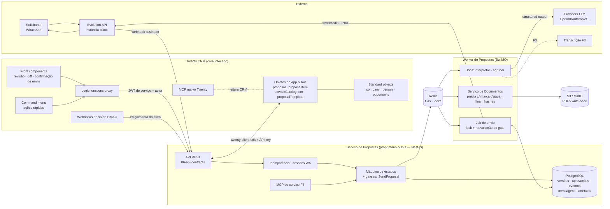
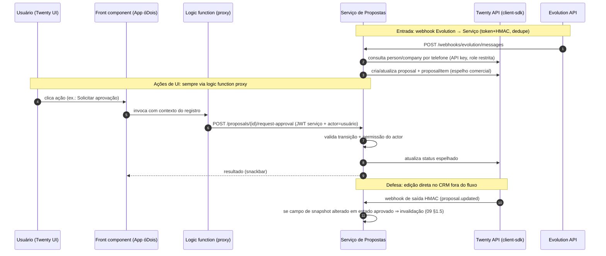

# 04 — Especificação Técnica e Arquitetura Proposta

> **Arquitetura proposta** (não implementada). Estado atual: `01-current-architecture.md`. Impacto: `02-impact-map.md`.

## 1. Decisões estruturantes

| # | Decisão | Justificativa (evidência) |
|---|---|---|
| D1 | **Core do Twenty intocado.** O módulo = App óDois + Serviço de Propostas externo + Evolution API | Plataforma de Apps cobre objetos/UI/ações (`packages/twenty-sdk/`, `packages/twenty-apps/examples/`); evita fork, custo de upgrade e exposição AGPL (`LICENSE`) |
| D2 | **Serviço de Propostas em NestJS/TypeScript**, não FastAPI | Repo 100% TypeScript; padrões prontos para replicar: filas (`engine/core-modules/message-queue/`), worker (`src/queue-worker/`), storage (`file-storage/`), HMAC (`webhook/jobs/call-webhook.job.ts`); time único de stack |
| D3 | **BullMQ + Redis** para assíncrono (sem Celery — não há Python; sem n8n — não existe no repo) | Mesmo mecanismo do Twenty; jobs idempotentes com `jobId` determinístico |
| D4 | **PostgreSQL próprio do serviço** para dados técnicos imutáveis (versões, hashes, aprovações, eventos, mensagens) | Objetos do CRM são mutáveis por design; trilha de aprovação exige append-only (`02-impact-map.md` §5) |
| D5 | **Objetos comerciais no Twenty** (proposal, proposalItem, serviceCatalogItem, proposalTemplate) via App óDois | CRM é a interface de revisão/gestão; RBAC nativo; relações com company/person/opportunity |
| D6 | **LLM só no worker**, Vercel AI SDK v6 (mesmos providers do Twenty), saída estruturada validada | `ai@6`/`@ai-sdk/*` já são o padrão do ecossistema do repo (`engine/metadata-modules/ai/ai-models/`) |
| D7 | **PDF**: HTML → PDF no worker com marca d'água condicional por `kind` | Pipeline de referência existente: DPA (`engine/core-modules/dpa/`); escolha exata do renderizador (`@react-pdf/renderer` vs headless browser) é decisão registrada em `15-open-questions.md` |
| D8 | **Storage S3/MinIO** com URLs assinadas de curta duração, artefatos write-once | Padrão espelhado de `file-storage/` + `file-url/` |
| D9 | Máquina de estados e gate de envio **exclusivamente no backend do serviço** | `07-state-machine.md`, `09-approval-and-security.md` |
| D10 | MCP próprio do serviço (F4); MCP do Twenty permanece para CRUD genérico | Gates de aprovação não podem depender do host MCP (`12-mcp-spec.md`) |

## 2. Arquitetura geral



## 3. Separação de responsabilidades

### 3.1 Twenty CRM (inalterado)
Clientes, contatos, oportunidades; objetos do módulo (dados comerciais visíveis); interface de revisão; permissões (RBAC nativo); trilha comercial (`timelineActivity`); views/kanban/relatórios. **Não** decide transições nem envia nada.

### 3.2 App óDois (Twenty App proprietário — detalhes em `10-twenty-app-spec.md`)
Objetos e campos; relações; roles `proposal-*`; views e page layouts; front components de revisão (prévia, diff, confirmação); command menu items; logic functions **proxy** (finas, sem regra de negócio) que chamam o Serviço com a identidade do usuário propagada; mudança de estado **somente** via chamadas ao Serviço (campo `status` read-only por `fieldPermission`).

### 3.3 Serviço de Propostas (NestJS)
Recebe e valida webhooks (assinatura, dedupe, replay window); idempotência; sessões de conversa WhatsApp; orquestra o fluxo e a máquina de estados (`07`); valida dados e regras de negócio (precificação determinística por catálogo, margens); cria snapshots canônicos e hashes; controla aprovação (`09`); **único ponto capaz de enviar**, e somente após o gate; publica espelho de dados no Twenty; emite `ProposalEvent` para tudo.

### 3.4 Worker de Propostas (BullMQ)
Processa mensagens; baixa anexos/mídia da Evolution; transcreve áudios (F3); chama LLM (interpretação, ajustes em linguagem natural, textos sugeridos); gera documentos (prévia/final) e hashes; executa envio com lock; retries com backoff e DLQ; tarefas longas nunca no request HTTP.

### 3.5 Evolution API
Transporte WhatsApp: recebe mensagens; envia confirmações operacionais e perguntas complementares (templates sem valores comerciais); envia a proposta aprovada (documento FINAL); reporta status (entregue/lido); fornece `messageId` registrado em `ProposalSourceMessage`/`ProposalEvent`. Detalhes: `11-evolution-api-integration.md`.

### 3.6 LLM (limites em `08-llm-spec.md`)
Somente: classificar intenção; extrair dados estruturados; apontar ausências; sugerir matching com catálogo (candidatos + score); sugerir textos; interpretar pedidos de ajuste como operações estruturadas. **Sem autoridade para**: aprovar, definir preço final, enviar, alterar margem, conceder desconto, pular aprovação, alterar versão aprovada — enforcement: saída só-dados validada por schema, sem tools de escrita.

### 3.7 Serviço de Documentos
Monta HTML a partir de template versionado + snapshot; gera PDF; DOCX opcional (F3); marca d'água obrigatória em `kind=PREVIEW`; documento final apenas a partir do snapshot aprovado (hash conferido antes de renderizar); calcula e persiste hashes; armazena write-once; garante correspondência arquivo↔snapshot aprovado.

## 4. Topologia de comunicação Twenty ↔ Serviço ↔ Evolution



Regras:
- O front component **nunca** guarda credencial privilegiada; toda escrita passa pela logic function (server-side) → Serviço.
- O Serviço acessa o Twenty com **API key de role restrita** aos objetos do módulo (menor privilégio).
- Identidade humana é propagada fim-a-fim (`actor` no JWT de serviço) e gravada em `ProposalEvent`/`ProposalApproval`.

## 5. Processamento assíncrono

```mermaid
flowchart TB
    subgraph API["Serviço de Propostas (API)"]
        WH[Webhook Evolution] --> DEDUP{dedupe\n(instanceId,messageId)}
        DEDUP -->|novo| PSM[(proposal_source_message)]
        DEDUP -->|duplicado| NOOP[no-op auditado]
        PSM --> ENQ[enqueue jobId determinístico]
    end
    subgraph Q["Redis / BullMQ (filas do serviço)"]
        Q1[[ingest-queue]]
        Q2[[interpret-queue]]
        Q3[[document-queue]]
        Q4[[send-queue]]
        Q5[[scheduled-queue<br/>janelas · expiração · retenção]]
    end
    subgraph WK["Worker"]
        GROUP[Agrupamento<br/>janela 90s] --> INT[Interpretação LLM<br/>timeout 60s · retry 2x · fallback]
        INT --> DOCP[Prévia + marca d'água + hash]
        DOCF[Final a partir do snapshot aprovado<br/>verifica hash antes] --> SEND[Envio<br/>lock + gate reavaliado]
    end
    ENQ --> Q1 --> GROUP
    GROUP --> Q2
    Q2 --> INT
    INT --> Q3 --> DOCP
    DOCF -.enfileirado na aprovação.- Q3
    Q4 --> SEND
    SEND -->|falha após retries| DLQ[(DLQ + SEND_ERROR)]
    INT -->|falha após retries| PERR[(PROCESSING_ERROR)]
```

Convenções (espelhando o padrão do Twenty):
- Jobs declarados com decorators `@Processor(queue)`/`@Process(job)` como em `packages/twenty-server/src/engine/core-modules/message-queue/decorators/`.
- `jobId` determinístico por chave natural (ex.: `interpret:{proposalId}:{collectRound}`) — retries de webhook não duplicam jobs.
- Retries: interpretação 2x (backoff exponencial), documentos 2x, envio 3x dentro de `SENDING`; depois estados de erro + intervenção humana.
- Lock distribuído por proposta no envio (padrão `engine/core-modules/cache-lock/`).
- Cron jobs: fechamento de janelas de agrupamento, expiração (`validUntil`), timeouts de `NEEDS_INFORMATION`, retenção LGPD.

## 6. Stack do Serviço de Propostas (proposta)

| Camada | Escolha | Observação |
|---|---|---|
| Runtime | Node.js LTS + NestJS + TypeScript estrito | Convenções do `CLAUDE.md` (named exports, types>interfaces, sem `any`) |
| ORM | TypeORM (paridade com o repo) ou Drizzle | Decisão de detalhe; migrations versionadas no repo do serviço |
| Fila | BullMQ + Redis | D3 |
| Validação | zod (schemas compartilhados com o front do app quando útil) | Equivalente TypeScript ao Pydantic pedido no enunciado |
| LLM | Vercel AI SDK v6, `generateObject` com schema zod | Providers: mesmos do Twenty; chaves próprias do serviço |
| Storage | S3/MinIO (SDK AWS v3) | URLs pré-assinadas; SSE em repouso |
| Observabilidade | OpenTelemetry + Sentry + logs estruturados (correlationId em tudo) | Paridade com `packages/twenty-docker/{otel-collector,grafana}/` |
| Deploy | Docker Compose próprio (api + worker + postgres + redis + minio) ao lado do compose do Twenty | Sem alterar `packages/twenty-docker/` |

Variáveis de ambiente (categorias, sem valores): `DATABASE_URL`, `REDIS_URL`, `STORAGE_*` (S3/MinIO), `TWENTY_API_URL`/`TWENTY_API_KEY`, `EVOLUTION_*` (por instância, cifradas em banco após bootstrap), `LLM_*` (provider keys, modelos default/fallback), `APP_SECRET` (JWT de serviço), `PROPOSAL_*` (janela de agrupamento, timeouts, limiares de confiança, retenção).

## 7. Fonte da verdade (anti-duplicação)

| Informação | Fonte da verdade | Espelho |
|---|---|---|
| Clientes/contatos/oportunidades | Twenty (standard objects) | — (serviço só referencia IDs) |
| Dados comerciais da proposta (título, itens, totais, termos, status exibido) | Twenty (objetos do app) | cache de leitura no serviço quando necessário |
| Catálogo de serviços e templates (cadastro) | Twenty (`serviceCatalogItem`, `proposalTemplate`) | snapshot congelado por versão no serviço |
| Versões, snapshots, hashes | **Serviço** (append-only) | número/da versão exibidos no Twenty |
| Aprovações (decisão, IP, contexto) | **Serviço** | status + resumo no Twenty |
| Mensagens WhatsApp e sessões | **Serviço** | trechos relevantes na timeline do Twenty |
| Eventos/auditoria técnica | **Serviço** (`proposal_event`) | timeline comercial no Twenty |
| Artefatos PDF | **Serviço** (storage próprio) | URL assinada exibida no Twenty |

Regra: um dado tem exatamente uma fonte; espelhos carregam `syncedAt` e são reconciliáveis a partir da fonte (job de reconciliação periódico).

## 8. Licenciamento (AGPL) e propriedade

- O Twenty é AGPL v3 com arquivos Enterprise comerciais (`LICENSE`). **Modificar o core** e operar como serviço de rede obrigaria a disponibilizar o código-fonte modificado aos usuários — evitado pela decisão D1.
- O **Serviço de Propostas** é obra separada e independente (processo, repositório e distribuição próprios; comunicação via APIs de rede) — pode permanecer proprietário da óDois.
- O **App óDois** é distribuído como pacote privado (`twenty app:publish --private`) e consome apenas APIs públicas do SDK. A qualificação jurídica precisa (app como obra derivada ou não; uso do `twenty-sdk` — verificar licença do pacote npm publicado) **exige revisão jurídica** — registrado em `15-open-questions.md`.
- Nada nesta especificação copia código do Twenty para dentro do módulo proprietário; padrões são reimplementados no serviço.

## 9. Requisitos não-funcionais

| Requisito | Alvo (MVP) |
|---|---|
| Latência webhook → ack | < 500 ms (processamento sempre assíncrono) |
| Tempo mensagem → prévia pronta | p95 < 2 min (texto, sem perguntas complementares) |
| Disponibilidade do serviço | 99,5% (fila absorve indisponibilidade do Twenty/Evolution) |
| Durabilidade de artefatos | write-once + versionamento de bucket |
| Auditoria | 100% das transições e ações com `ProposalEvent` (correlationId/causationId) |
| Segurança | ver `09-approval-and-security.md` (gate, HMAC, RBAC, LGPD) |
| Escala | 1 instância Evolution, dezenas de propostas/dia no MVP; filas dimensionáveis horizontalmente |
