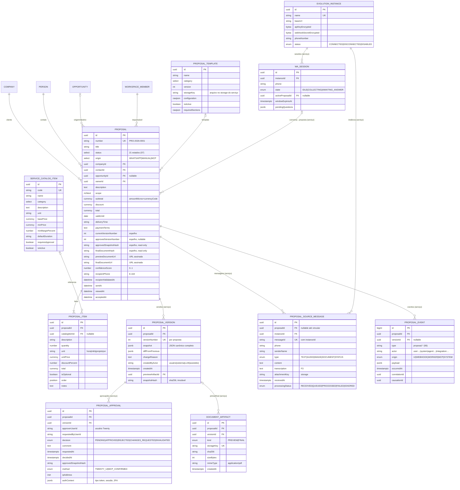

# 05 — Modelo de Dados

> **Arquitetura proposta** (não implementada). Divisão de fonte da verdade conforme `04-technical-spec.md` §7:
> **Twenty (objetos do App óDois)** = dados comerciais visíveis/editáveis sob RBAC; **PostgreSQL do Serviço de Propostas** = dados técnicos imutáveis (versões, hashes, aprovações, mensagens, eventos). Sem duplicação: espelhos carregam apenas referências (IDs/URLs) e `syncedAt`.

## 1. Diagrama ER (visão lógica unificada)



## 2. Objetos no Twenty (App óDois)

Criados via `defineObject`/`defineField` (`packages/twenty-sdk/src/sdk/define/`); tipos de campo do enum real `FieldMetadataType` (`packages/twenty-shared/src/types/FieldMetadataType.ts`). Valores monetários usam o composite `CURRENCY` (`amountMicros` + `currencyCode` — `packages/twenty-shared/src/types/composite-types/currency.composite-type.ts`), como o `opportunity.amount` padrão.

### 2.1 `proposal`
Campos conforme ER acima. Observações normativas:
- `status`: `SELECT` com os 21 estados canônicos; **read-only para usuários** via `fieldPermission` (editável apenas pela API key da integração) — a autoridade é a máquina de estados do serviço.
- `number`: sequência gerada pelo serviço (`PRO-{ano}-{seq}`), única por workspace.
- Campos espelho (`approvedSnapshotHash`, `finalDocumentHash`, `currentVersionNumber`, `approvedVersionNumber`, URLs de documentos): read-only; fonte no serviço.
- Relações: `company` (cliente), `person` (contato), `opportunity` (opcional), `workspaceMember` (responsável) — `RELATION` com `OnDeleteAction` restritiva para company/person (proposta não órfã).
- `searchVector`/timeline/attachments herdados do padrão de objetos do Twenty.

### 2.2 `proposalItem`
Relação N:1 com `proposal` (cascade delete lógico junto com a proposta) e N:1 opcional com `serviceCatalogItem`. `total` é **calculado pelo serviço** (quantidade × unitário − desconto) e gravado; a UI não recalcula com regra própria. `order` usa `POSITION` (drag-and-drop nativo das listas do Twenty).

### 2.3 `serviceCatalogItem`
Cadastro administrado (role `proposal-admin`). `minPrice`/`minMarginPercent` alimentam as validações determinísticas de precificação do serviço; `requiresApproval` marca itens que sempre exigem atenção do aprovador (destacados na revisão).

### 2.4 `proposalTemplate`
Metadados do template; o arquivo (HTML/estrutura) vive no storage do serviço (`storageKey`) e é **versionado** — cada `ProposalVersion.snapshot` referencia `templateId + templateVersion`, congelando a aparência da versão.

## 3. Tabelas no PostgreSQL do Serviço

Todas com `createdAt`/`updatedAt`; as marcadas **append-only** não recebem UPDATE/DELETE em operação normal (constraint por trigger de banco + revogação de privilégios do usuário da aplicação).

| Tabela | Append-only | Índices/constraints principais |
|---|---|---|
| `proposal_ref` (id da proposta ↔ id do registro Twenty, workspace, número) | não | UK `(workspaceId, twentyRecordId)`, UK `number` |
| `proposal_version` | **sim** | UK `(proposalId, versionNumber)`; `snapshotHash` NOT NULL; GIN em `snapshot` p/ diff |
| `proposal_approval` | **sim** (decisão gravada uma vez; invalidação = novo registro com `decision=INVALIDATED` referenciando o anterior) | IDX `(proposalId, decidedAt)`; FK `versionId` NOT NULL |
| `proposal_source_message` | sim | **UK `(instanceId, messageId)`** — deduplicação de webhook; IDX `(phone, receivedAt)` |
| `proposal_event` | **sim** | IDX `(proposalId, occurredAt)`, `(correlationId)`, `(type)`; particionamento por mês a partir de volume |
| `document_artifact` | **sim** | UK `storageKey`; IDX `(proposalId, kind)`; `kind=FINAL` único por `versionId` |
| `evolution_instance` | não | UK `name`; segredos cifrados (AES-GCM com chave de aplicação) |
| `wa_session` | não | UK `(instanceId, phone)`; TTL lógico via `windowExpiresAt` |
| `idempotency_key` | sim (expira por TTL) | UK `(scope, key)`; guarda hash do request e resposta para replay idempotente |
| `prompt_version` | sim | UK `(promptId, version)`; hash do template de prompt (ver `08-llm-spec.md`) |
| `llm_call_log` | sim | IDX `(proposalId, createdAt)`; tokens/custo/modelo/promptVersion; payloads com retenção e mascaramento |

### 3.1 Snapshot canônico (`proposal_version.snapshot`)
Conteúdo (JSON com chaves ordenadas, sem campos voláteis):

```json
{
  "proposal": { "number": "...", "title": "...", "description": "...", "scope": "...",
    "currency": "BRL", "subtotalMicros": 0, "discountMicros": 0, "totalMicros": 0,
    "validUntil": "2026-09-30", "deliveryTime": "...", "paymentTerms": "...",
    "recipientPhone": "+55...", "companyRef": "uuid", "contactRef": "uuid" },
  "items": [ { "order": 1, "catalogCode": "SRV-001", "description": "...",
    "quantity": 10, "unit": "hora", "unitPriceMicros": 0, "discountPercent": 0,
    "totalMicros": 0, "isOptional": false, "notes": "" } ],
  "commercialTerms": { "...": "..." },
  "template": { "id": "uuid", "version": 3 }
}
```

`snapshotHash = sha256(canonicalJson)`. A lista de campos do snapshot define exatamente **o que invalida aprovação** quando alterado (`07-state-machine.md` §5, `09-approval-and-security.md` §1.1-7).

## 4. Fonte da verdade por informação (normativo)

| Informação | Fonte | Justificativa |
|---|---|---|
| Cliente/contato/oportunidade | Twenty | CRM é dono do relacionamento |
| Dados comerciais correntes da proposta | Twenty | edição sob RBAC, views, kanban |
| Catálogo e templates (cadastro) | Twenty | administração pelo negócio |
| Versões + snapshots + hashes | Serviço | imutabilidade e integridade criptográfica |
| Aprovações (decisão/IP/contexto) | Serviço | trilha legal append-only |
| Mensagens WhatsApp/sessões | Serviço | dados operacionais e LGPD (retenção própria) |
| Eventos técnicos | Serviço | correlationId/causationId, particionamento |
| Artefatos PDF | Storage do serviço | write-once; Twenty só exibe URL assinada |
| Status | Serviço (máquina de estados) | espelhado no campo `status` do Twenty (read-only) |

Reconciliação: job periódico compara espelhos no Twenty com a fonte e corrige divergências (sempre da fonte para o espelho), registrando `proposal_event` `type=MIRROR_RECONCILED` quando houver correção.

## 5. Migrações

- **Twenty**: nenhuma migration manual — a instalação/atualização do App óDois gera as migrações de workspace pelo mecanismo nativo (`engine/workspace-manager/workspace-migration/`). Nenhum instance command do repositório é criado ou alterado.
- **Serviço**: migrations versionadas no repo `odois-proposal-service/` (TypeORM), com `up`/`down`, aplicadas no deploy do serviço — independentes do ciclo de upgrade do Twenty.
