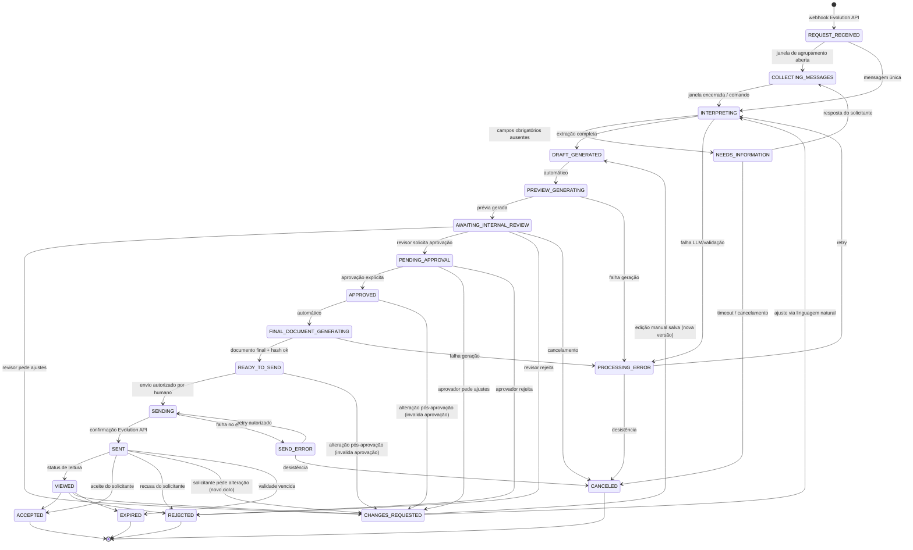
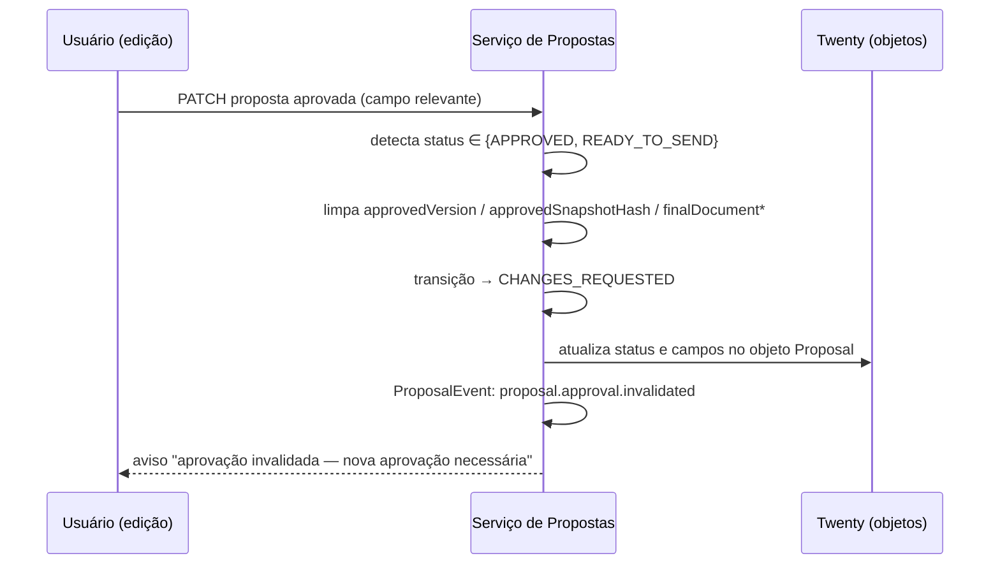

# 07 — Máquina de Estados da Proposta

> Módulo proprietário óDois — Geração de Propostas Comerciais integrado ao Twenty CRM.
> Este documento é **arquitetura proposta** (não implementada). Estado atual do repositório: ver `01-current-architecture.md`.

## 1. Princípios

1. **A máquina de estados é a autoridade única de transição.** Nenhum componente (UI, LLM, worker, MCP, integração) muda o campo `status` diretamente; toda mudança passa pelo serviço de transição do backend do Serviço de Propostas, que valida a transição contra a tabela deste documento.
2. **Transições proibidas são impossíveis por construção**, não apenas "não recomendadas": a função de transição rejeita qualquer par `(origem, destino)` fora da tabela de transições permitidas, com erro `INVALID_STATE_TRANSITION` e registro em `ProposalEvent`.
3. **Aprovação humana explícita é um gate técnico.** O caminho mínimo para envio é:
   `AWAITING_INTERNAL_REVIEW → PENDING_APPROVAL → APPROVED → FINAL_DOCUMENT_GENERATING → READY_TO_SEND → SENDING → SENT`.
   A transição direta `AWAITING_INTERNAL_REVIEW → SENT` (ou qualquer atalho que pule `APPROVED`) **não existe na tabela** e portanto é tecnicamente proibida.
4. **Toda transição gera um `ProposalEvent`** com ator, origem (UI, webhook, worker, MCP), payload, `correlationId` e `causationId` (ver `05-data-model.md`).
5. **Idempotência**: transições disparadas por eventos externos (webhooks da Evolution API, retries de fila) usam chaves de idempotência; uma transição repetida para o estado em que a proposta já se encontra é um no-op auditado, não um erro.

## 2. Diagrama

## 3. Catálogo de estados

Convenções das tabelas:
- **Entrada**: quem/o que pode levar a proposta a este estado.
- **Saída**: quem/o que pode tirar a proposta deste estado.
- **Automático**: transição executada pelo sistema sem intervenção humana.
- **Humano**: exige ação explícita de um usuário autenticado com permissão (nunca LLM, nunca agente MCP sem confirmação).

### 3.1 REQUEST_RECEIVED

| Aspecto | Definição |
|---|---|
| Descrição | Webhook da Evolution API recebido e validado; proposta-embrião criada com a(s) mensagem(ns) de origem registradas em `ProposalSourceMessage`. |
| Entrada | Sistema (handler do webhook), após validação de assinatura e deduplicação por `messageId`. |
| Saída | Sistema (scheduler de agrupamento). |
| Transições permitidas | → `COLLECTING_MESSAGES` (automático, abre janela de agrupamento); → `INTERPRETING` (automático, quando a janela é dispensada). |
| Transições proibidas | Qualquer outra — em especial qualquer caminho que não passe por `INTERPRETING`. |
| Eventos | `proposal.request.received`. |
| Ações automáticas | Criação do registro; resolução preliminar do telefone → contato; enfileiramento do job de agrupamento. |
| Ações humanas | Nenhuma. |

### 3.2 COLLECTING_MESSAGES

| Aspecto | Definição |
|---|---|
| Descrição | Janela de agrupamento aberta (default sugerido: 90s desde a última mensagem, configurável) para consolidar mensagens consecutivas do mesmo remetente. |
| Entrada | Sistema, a partir de `REQUEST_RECEIVED` ou de `NEEDS_INFORMATION` (resposta do solicitante). |
| Saída | Sistema (expiração da janela) ou atendente (comando "processar agora"). |
| Transições permitidas | → `INTERPRETING` (automático ou humano); → `CANCELED` (humano). |
| Transições proibidas | → `DRAFT_GENERATED` sem passar por `INTERPRETING`. |
| Eventos | `proposal.messages.collected` (ao fechar a janela). |
| Ações automáticas | Anexar novas mensagens/áudios/arquivos à mesma proposta; reiniciar o timer da janela a cada mensagem. |
| Ações humanas | Encerrar a janela manualmente; cancelar. |

### 3.3 INTERPRETING

| Aspecto | Definição |
|---|---|
| Descrição | Worker assíncrono processa as mensagens: transcreve áudios, baixa anexos, chama a LLM para classificar intenção e extrair dados estruturados (schema em `08-llm-spec.md`), resolve cliente/contato/catálogo. |
| Entrada | Sistema (job de fila), a partir de `REQUEST_RECEIVED`, `COLLECTING_MESSAGES`, `CHANGES_REQUESTED` (ajuste em linguagem natural) ou `PROCESSING_ERROR` (retry). |
| Saída | Sistema. |
| Transições permitidas | → `DRAFT_GENERATED` (automático, extração válida); → `NEEDS_INFORMATION` (automático, `missing_fields` não vazio ou confiança abaixo do limiar); → `PROCESSING_ERROR` (automático, falha técnica após retries). |
| Transições proibidas | → `PENDING_APPROVAL`, → `APPROVED` ou qualquer estado de envio. A LLM não transita estados diretamente; ela retorna dados e o serviço decide. |
| Eventos | `proposal.interpretation.completed` ou `proposal.information.requested`. |
| Ações automáticas | Transcrição, extração, matching de catálogo, cálculo de score de confiança, validação por JSON Schema. |
| Ações humanas | Nenhuma (pode acompanhar pelo Twenty). |

### 3.4 NEEDS_INFORMATION

| Aspecto | Definição |
|---|---|
| Descrição | Informações obrigatórias ausentes. O sistema formula perguntas complementares; o envio das perguntas ao solicitante via WhatsApp é permitido (perguntas não são a proposta — a regra central proíbe enviar a *proposta*, não mensagens operacionais de coleta). |
| Entrada | Sistema, a partir de `INTERPRETING`. |
| Saída | Sistema (resposta recebida) ou humano (cancelar / completar manualmente). |
| Transições permitidas | → `COLLECTING_MESSAGES` (automático, ao receber resposta); → `DRAFT_GENERATED` (humano, atendente completa os dados manualmente no Twenty); → `CANCELED` (humano ou timeout configurável, ex.: 72h sem resposta). |
| Transições proibidas | → `PREVIEW_GENERATING` com campos obrigatórios ausentes. |
| Eventos | `proposal.information.requested`. |
| Ações automáticas | Envio das perguntas via Evolution API (template pré-aprovado, sem valores comerciais); agendamento do timeout. |
| Ações humanas | Completar dados manualmente; cancelar. |

### 3.5 DRAFT_GENERATED

| Aspecto | Definição |
|---|---|
| Descrição | Rascunho estruturado criado/atualizado: proposta, itens, termos comerciais persistidos; `ProposalVersion` N criada com snapshot completo. |
| Entrada | Sistema (a partir de `INTERPRETING`) ou humano (edição manual salva a partir de `CHANGES_REQUESTED`). |
| Saída | Sistema. |
| Transições permitidas | → `PREVIEW_GENERATING` (automático). |
| Transições proibidas | → `AWAITING_INTERNAL_REVIEW` sem prévia gerada; qualquer caminho de envio. |
| Eventos | `proposal.draft.created`, `proposal.version.created`. |
| Ações automáticas | Sincronização dos objetos no Twenty (Proposal, ProposalItem); cálculo de subtotal/desconto/total pelas regras de precificação (nunca pela LLM); enfileiramento da geração de prévia. |
| Ações humanas | Nenhuma neste estado (edições ocorrem em `CHANGES_REQUESTED`/`AWAITING_INTERNAL_REVIEW`). |

### 3.6 PREVIEW_GENERATING

| Aspecto | Definição |
|---|---|
| Descrição | Worker gera o documento de prévia (HTML → PDF) **sempre com marca d'água "PRÉVIA — NÃO ENVIAR"**, calcula hash e armazena. |
| Entrada | Sistema. |
| Saída | Sistema. |
| Transições permitidas | → `AWAITING_INTERNAL_REVIEW` (automático); → `PROCESSING_ERROR` (automático). |
| Transições proibidas | Qualquer envio. O artefato de prévia é marcado `kind=PREVIEW` e o serviço de envio recusa artefatos desse tipo. |
| Eventos | `proposal.preview.generated`. |
| Ações automáticas | Renderização do template, marca d'água, hash SHA-256, upload ao storage, notificação do responsável interno. |
| Ações humanas | Nenhuma. |

### 3.7 AWAITING_INTERNAL_REVIEW

| Aspecto | Definição |
|---|---|
| Descrição | Estado central de revisão humana. O responsável visualiza dados + prévia no Twenty e decide o próximo passo. |
| Entrada | Sistema (prévia pronta). |
| Saída | **Somente humano** (responsável/revisor com permissão). |
| Transições permitidas | → `CHANGES_REQUESTED` (humano); → `PENDING_APPROVAL` (humano, "solicitar aprovação"); → `REJECTED` (humano); → `CANCELED` (humano). |
| Transições proibidas | **→ `SENT` (proibição explícita e central deste módulo)**; → `APPROVED` direto sem solicitação de aprovação registrada; → `SENDING`; → `READY_TO_SEND`. Nenhum ator automático (LLM, worker, MCP) sai deste estado. |
| Eventos | `proposal.review.requested` (na entrada). |
| Ações automáticas | Notificação do responsável (ver `03-functional-spec.md` §8); lembretes opcionais. |
| Ações humanas | Revisar, editar, pedir ajustes, solicitar aprovação, rejeitar, cancelar. |

### 3.8 CHANGES_REQUESTED

| Aspecto | Definição |
|---|---|
| Descrição | Ajustes solicitados (por revisor, aprovador, ou solicitante pós-envio; ou automaticamente por invalidação de aprovação). A proposta está em edição; qualquer aprovação anterior está invalidada. |
| Entrada | Humano (revisor/aprovador/atendente registrando pedido do solicitante) ou sistema (invalidação de aprovação após alteração — ver `09-approval-and-security.md`). |
| Saída | Humano (salvar edição manual) ou sistema (reinterpretação concluída). |
| Transições permitidas | → `INTERPRETING` (ajuste em linguagem natural processado pela LLM); → `DRAFT_GENERATED` (edição manual salva ⇒ nova `ProposalVersion`); → `CANCELED` (humano); → `REJECTED` (humano). |
| Transições proibidas | → `APPROVED` (a aprovação sempre referencia uma versão nova, via novo ciclo `PENDING_APPROVAL`); qualquer envio. |
| Eventos | `proposal.changes.requested`; `proposal.approval.invalidated` quando aplicável. |
| Ações automáticas | Invalidação de `approvedVersion`/`approvedSnapshotHash` se a proposta estava aprovada. |
| Ações humanas | Editar campos/itens; escrever instrução de ajuste em linguagem natural. |

### 3.9 PENDING_APPROVAL

| Aspecto | Definição |
|---|---|
| Descrição | Aprovação formalmente solicitada para uma **versão específica** (registro `ProposalApproval` com `versionId` + `snapshotHash` pendente). |
| Entrada | Humano ("solicitar aprovação" em `AWAITING_INTERNAL_REVIEW`). |
| Saída | **Somente humano com papel de aprovador** (que pode ser o próprio responsável, conforme política de papéis — ver `09-approval-and-security.md`). |
| Transições permitidas | → `APPROVED` (humano, decisão explícita); → `CHANGES_REQUESTED` (humano); → `REJECTED` (humano). |
| Transições proibidas | → `SENT`/`SENDING`/`READY_TO_SEND`; aprovação por API key de integração ou por ferramenta MCP sem confirmação humana. |
| Eventos | `proposal.approval.requested`. |
| Ações automáticas | Notificação do aprovador; bloqueio de edição concorrente (edição durante `PENDING_APPROVAL` move para `CHANGES_REQUESTED` e cancela a solicitação). |
| Ações humanas | Aprovar, rejeitar, pedir ajustes. |

### 3.10 APPROVED

| Aspecto | Definição |
|---|---|
| Descrição | Aprovação explícita registrada: `ProposalApproval.decision=APPROVED`, com aprovador, timestamp, hash do snapshot aprovado, método, IP e contexto de autenticação. `approvedVersion` e `approvedSnapshotHash` gravados na proposta. |
| Entrada | Humano (aprovador). |
| Saída | Sistema (geração do documento final) ou sistema (invalidação por alteração). |
| Transições permitidas | → `FINAL_DOCUMENT_GENERATING` (automático); → `CHANGES_REQUESTED` (sistema, se qualquer campo relevante for alterado — invalida a aprovação). |
| Transições proibidas | → `SENDING`/`SENT` sem passar por `FINAL_DOCUMENT_GENERATING` e `READY_TO_SEND` (o documento final ainda não existe). |
| Eventos | `proposal.approved`; `proposal.approval.invalidated` (na saída por alteração). |
| Ações automáticas | Enfileiramento da geração do documento final a partir do **snapshot aprovado** (não do estado atual da proposta). |
| Ações humanas | Nenhuma obrigatória; alterações voluntárias levam a `CHANGES_REQUESTED`. |

### 3.11 FINAL_DOCUMENT_GENERATING

| Aspecto | Definição |
|---|---|
| Descrição | Worker gera o documento final **sem marca d'água**, exclusivamente a partir do snapshot referenciado por `approvedSnapshotHash`. Recalcula o hash do snapshot antes de renderizar; se divergir do aprovado, aborta e invalida. |
| Entrada | Sistema. |
| Saída | Sistema. |
| Transições permitidas | → `READY_TO_SEND` (automático, hash do documento final gravado); → `PROCESSING_ERROR` (automático); → `CHANGES_REQUESTED` (sistema, divergência de hash detectada). |
| Transições proibidas | → `SENDING` direto (o gate `can_send_proposal` exige `READY_TO_SEND`). |
| Eventos | `proposal.final_document.generated`. |
| Ações automáticas | Renderização final, hash SHA-256 do PDF, armazenamento imutável (artefato `kind=FINAL`). |
| Ações humanas | Nenhuma. |

### 3.12 READY_TO_SEND

| Aspecto | Definição |
|---|---|
| Descrição | Documento final pronto e íntegro; envio aguardando **autorização humana de envio** (ação distinta da aprovação da proposta). |
| Entrada | Sistema. |
| Saída | Humano (autorizar envio) ou sistema (invalidação por alteração). |
| Transições permitidas | → `SENDING` (humano com permissão de envio, após passar em `can_send_proposal()`); → `CHANGES_REQUESTED` (sistema, alteração invalida aprovação); → `CANCELED` (humano). |
| Transições proibidas | → `SENDING` por LLM, worker autônomo, cron ou MCP sem confirmação; → `SENT` direto. |
| Eventos | `proposal.send.requested` (na saída para `SENDING`). |
| Ações automáticas | Validação contínua do gate (versão atual == aprovada, hashes presentes e coincidentes, destinatário validado). |
| Ações humanas | Confirmar o envio (com exibição do destinatário e do documento exato). |

### 3.13 SENDING

| Aspecto | Definição |
|---|---|
| Descrição | Job de envio em execução: chamada à Evolution API com o documento final, com chave de idempotência por (propostaId, versãoAprovada, tentativa). |
| Entrada | Humano (via gate). |
| Saída | Sistema. |
| Transições permitidas | → `SENT` (automático, ack da Evolution API com `messageId` registrado); → `SEND_ERROR` (automático, falha após retries limitados). |
| Transições proibidas | Reenvio concorrente (lock por proposta durante `SENDING`). |
| Eventos | `proposal.sent` ou `proposal.send.failed`. |
| Ações automáticas | Envio, registro do `messageId` retornado, atualização de `sentAt`. |
| Ações humanas | Nenhuma. |

### 3.14 SENT

| Aspecto | Definição |
|---|---|
| Descrição | Proposta entregue ao solicitante. Documento final e versão enviada são imutáveis. |
| Entrada | Sistema. |
| Saída | Sistema (status de leitura, expiração) ou humano (registrar aceite/recusa/pedido de alteração). |
| Transições permitidas | → `VIEWED` (automático, callback de status da Evolution API); → `ACCEPTED` (humano ou automático mediante mensagem de aceite confirmada por humano); → `REJECTED` (idem); → `CHANGES_REQUESTED` (novo ciclo de revisão; a nova versão exigirá nova aprovação); → `EXPIRED` (automático, `validUntil` vencida). |
| Transições proibidas | Reenvio sem passar por novo ciclo ou por `retry-send` explícito de humano (que reutiliza exatamente o mesmo documento/hash). |
| Eventos | `proposal.sent` (na entrada); demais conforme saída. |
| Ações automáticas | Processamento de callbacks de status; agendamento da expiração. |
| Ações humanas | Registrar desfechos; disparar reenvio do mesmo documento. |

### 3.15 VIEWED

Igual a `SENT` quanto a saídas (`ACCEPTED`, `REJECTED`, `CHANGES_REQUESTED`, `EXPIRED`), com `viewedAt` registrado. Evento: `proposal.viewed`. Entrada: somente sistema (callback de leitura da Evolution API). Nenhuma ação automática além do registro.

### 3.16 ACCEPTED (terminal)

| Aspecto | Definição |
|---|---|
| Descrição | Aceite do solicitante registrado (`acceptedAt`). Estado terminal do ciclo da proposta. |
| Entrada | Humano (registro manual) ou sistema com confirmação humana (mensagem de aceite interpretada pela LLM **sempre** requer confirmação do responsável antes de transitar). |
| Saída | Nenhuma (terminal). Conversão em oportunidade/contrato/projeto é uma **ação derivada**, não uma transição. |
| Eventos | `proposal.accepted`. |
| Ações automáticas | Sugerir conversão (atualizar `Opportunity` vinculada no Twenty). |

### 3.17 REJECTED (terminal)

Recusa interna (revisor/aprovador) ou externa (solicitante). Registra ator, motivo e comentário. Evento: `proposal.rejected`. Entrada: humano. Saída: nenhuma — para retomar, cria-se nova proposta vinculada (rastreabilidade preservada).

### 3.18 CANCELED (terminal)

Cancelamento operacional em qualquer estado não-terminal pré-envio (e em `SEND_ERROR`). Entrada: humano (ou timeout de `NEEDS_INFORMATION`). Evento próprio no `ProposalEvent` (`type=PROPOSAL_CANCELED`). Saída: nenhuma.

### 3.19 EXPIRED (terminal)

Validade (`validUntil`) vencida após envio sem aceite. Entrada: sistema (job agendado). Reabertura = nova proposta/nova versão com novo ciclo de aprovação. Evento: `type=PROPOSAL_EXPIRED`.

### 3.20 PROCESSING_ERROR

| Aspecto | Definição |
|---|---|
| Descrição | Falha técnica não recuperável automaticamente (LLM, transcrição, renderização) após esgotar retries da fila. |
| Entrada | Sistema. |
| Saída | Humano (retry ou cancelar). |
| Transições permitidas | → `INTERPRETING` (humano, retry de interpretação); → `PREVIEW_GENERATING` ou `FINAL_DOCUMENT_GENERATING` (humano, retry da etapa que falhou — o serviço registra `failedStep` para retomar no ponto correto); → `CANCELED` (humano). |
| Transições proibidas | Qualquer envio; qualquer aprovação. |
| Eventos | `type=PROPOSAL_PROCESSING_FAILED` com detalhe do erro. |
| Ações automáticas | Notificação do responsável com o erro. |

### 3.21 SEND_ERROR

| Aspecto | Definição |
|---|---|
| Descrição | Falha no envio via Evolution API após retries do job. O documento final permanece válido; o gate de envio permanece satisfeito. |
| Entrada | Sistema. |
| Saída | Humano. |
| Transições permitidas | → `SENDING` (humano, `retry-send`, mesma versão/hash/idempotency key nova por tentativa); → `CANCELED` (humano). |
| Transições proibidas | → `SENT` sem ack; retry automático ilimitado (retries automáticos são limitados dentro de `SENDING`; a partir daqui só humano). |
| Eventos | `proposal.send.failed`. |
| Ações automáticas | Notificação com diagnóstico (instância desconectada, número inválido etc.). |

## 4. Tabela consolidada de transições permitidas

| De \ Para | Destinos permitidos | Ator |
|---|---|---|
| `REQUEST_RECEIVED` | `COLLECTING_MESSAGES`, `INTERPRETING` | sistema |
| `COLLECTING_MESSAGES` | `INTERPRETING`, `CANCELED` | sistema / humano |
| `INTERPRETING` | `DRAFT_GENERATED`, `NEEDS_INFORMATION`, `PROCESSING_ERROR` | sistema |
| `NEEDS_INFORMATION` | `COLLECTING_MESSAGES`, `DRAFT_GENERATED`, `CANCELED` | sistema / humano |
| `DRAFT_GENERATED` | `PREVIEW_GENERATING` | sistema |
| `PREVIEW_GENERATING` | `AWAITING_INTERNAL_REVIEW`, `PROCESSING_ERROR` | sistema |
| `AWAITING_INTERNAL_REVIEW` | `CHANGES_REQUESTED`, `PENDING_APPROVAL`, `REJECTED`, `CANCELED` | **somente humano** |
| `CHANGES_REQUESTED` | `INTERPRETING`, `DRAFT_GENERATED`, `REJECTED`, `CANCELED` | humano / sistema |
| `PENDING_APPROVAL` | `APPROVED`, `CHANGES_REQUESTED`, `REJECTED` | **somente humano (aprovador)** |
| `APPROVED` | `FINAL_DOCUMENT_GENERATING`, `CHANGES_REQUESTED` | sistema |
| `FINAL_DOCUMENT_GENERATING` | `READY_TO_SEND`, `PROCESSING_ERROR`, `CHANGES_REQUESTED` | sistema |
| `READY_TO_SEND` | `SENDING`, `CHANGES_REQUESTED`, `CANCELED` | **humano (envio)** / sistema |
| `SENDING` | `SENT`, `SEND_ERROR` | sistema |
| `SEND_ERROR` | `SENDING`, `CANCELED` | humano |
| `SENT` | `VIEWED`, `ACCEPTED`, `REJECTED`, `CHANGES_REQUESTED`, `EXPIRED` | sistema / humano |
| `VIEWED` | `ACCEPTED`, `REJECTED`, `CHANGES_REQUESTED`, `EXPIRED` | sistema / humano |
| `PROCESSING_ERROR` | `INTERPRETING`, `PREVIEW_GENERATING`, `FINAL_DOCUMENT_GENERATING`, `CANCELED` | humano |
| `ACCEPTED` / `REJECTED` / `CANCELED` / `EXPIRED` | — (terminais) | — |

**Toda combinação ausente desta tabela é proibida e rejeitada pelo backend**, incluindo explicitamente:

- `AWAITING_INTERNAL_REVIEW → SENT` (proibição central);
- `AWAITING_INTERNAL_REVIEW → APPROVED` (pula a solicitação formal de aprovação);
- `DRAFT_GENERATED → SENT` / `APPROVED → SENT` / `READY_TO_SEND → SENT`;
- qualquer transição iniciada por LLM ou ferramenta MCP para `APPROVED`, `SENDING` ou `SENT` sem confirmação humana registrada (ver `12-mcp-spec.md`).

## 5. Invalidação de aprovação (resumo)

Campos cuja alteração invalida a aprovação: qualquer campo que participe do snapshot versionado (itens, preços, descontos, termos, escopo, validade, destinatário, template). Campos puramente operacionais (ex.: responsável interno, tags internas) não invalidam — a lista exata é definida pelo conjunto de campos serializados no snapshot (`05-data-model.md` §ProposalVersion).

## 6. Implementação de referência

- A tabela de transições vive no Serviço de Propostas como estrutura declarativa (`ALLOWED_TRANSITIONS: Record<Status, {to: Status; actor: 'system'|'human'; permission?: PermissionFlag}[]>`), única fonte usada por API, workers e handlers de webhook.
- O campo `status` no objeto `Proposal` do Twenty é um campo `SELECT` **somente leitura para usuários** (editável apenas pela integração técnica do serviço) — a UI do Twenty aciona as ações via Logic Functions/REST do serviço, nunca editando o status diretamente. Ver `10-twenty-app-spec.md`.
- Testes obrigatórios da máquina de estados: ver `13-test-strategy.md` §máquina de estados (cobertura de 100% das transições proibidas listadas acima).
