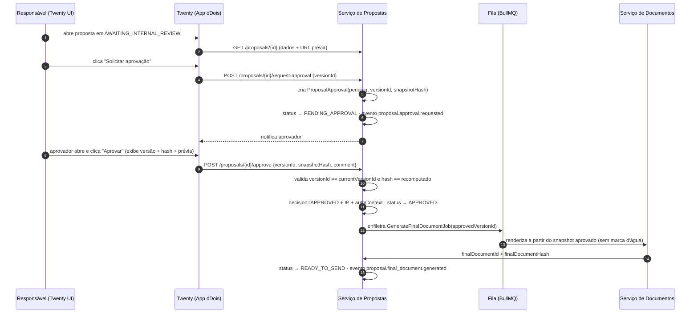
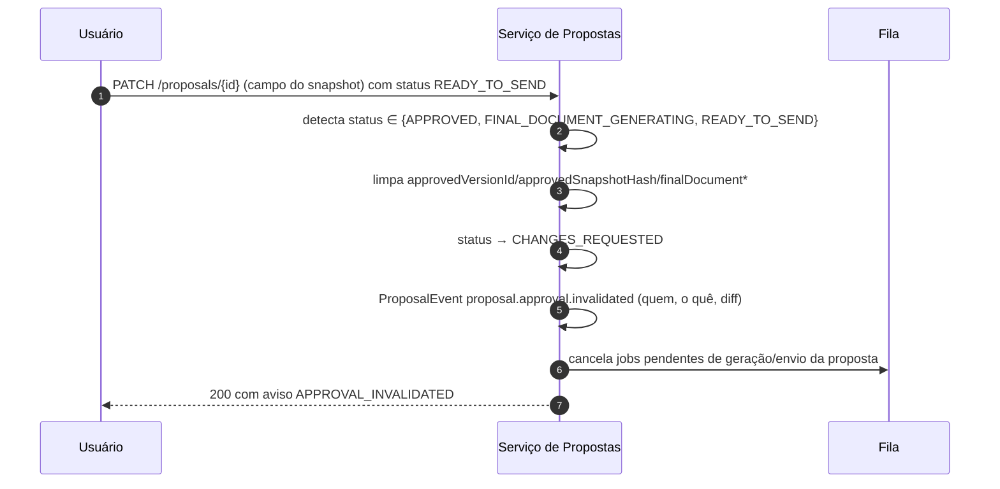

# 09 — Aprovação Obrigatória, Segurança e Permissões

> Módulo proprietário óDois — arquitetura **proposta** (não implementada).
> Padrões existentes citados com caminho real do repositório.

## 1. Política de aprovação obrigatória

Regra central do módulo:

> **Nenhuma proposta poderá ser disponibilizada ou enviada ao solicitante sem aprovação humana explícita da versão exata que será enviada.**

### 1.1 Garantias (invariantes de backend)

| # | Garantia | Mecanismo técnico |
|---|---|---|
| 1 | A prévia é gerada com marca d'água | O renderizador recebe `kind: 'PREVIEW' \| 'FINAL'`; para `PREVIEW` a camada de marca d'água ("PRÉVIA — NÃO ENVIAR", diagonal, todas as páginas) é adicionada incondicionalmente no template. Teste automatizado verifica presença/ausência da marca (ver `13-test-strategy.md`). |
| 2 | A prévia não pode ser enviada | O serviço de envio só aceita artefatos `kind=FINAL`; artefatos `PREVIEW` são armazenados em prefixo distinto do storage (`proposals/{id}/previews/…` vs `proposals/{id}/final/…`) e o job de envio resolve o arquivo exclusivamente por `finalDocumentId`, nunca por parâmetro livre. |
| 3 | O responsável visualiza dados e documento | Estado `AWAITING_INTERNAL_REVIEW` só sai por ação humana (ver `07-state-machine.md` §3.7); a tela de revisão no Twenty exibe dados estruturados + prévia. |
| 4 | A aprovação referencia uma versão específica | `ProposalApproval.versionId` é NOT NULL e FK para `ProposalVersion`; a API `approve` exige `versionId` + `snapshotHash` no payload e compara com a versão corrente — divergência ⇒ `409 APPROVAL_VERSION_MISMATCH`. |
| 5 | A aprovação armazena o hash do snapshot | `ProposalApproval.approvedSnapshotHash` = SHA-256 da serialização canônica (JSON com chaves ordenadas) do snapshot da versão. Copiado para `Proposal.approvedSnapshotHash`. |
| 6 | O documento final nasce do snapshot aprovado | O job `GenerateFinalDocumentJob` carrega o snapshot pela `approvedVersionId`, recalcula o hash e o compara com `approvedSnapshotHash` **antes** de renderizar; divergência ⇒ aborta + `proposal.approval.invalidated`. |
| 7 | Alteração após aprovação invalida a aprovação | Trigger de aplicação no serviço: qualquer `PATCH`/edição de campo pertencente ao snapshot com `status ∈ {APPROVED, FINAL_DOCUMENT_GENERATING, READY_TO_SEND}` limpa `approvedVersionId`, `approvedSnapshotHash`, `finalDocumentId`, `finalDocumentHash` e transita para `CHANGES_REQUESTED`. |
| 8 | Envio bloqueado se versão atual ≠ aprovada | Gate `canSendProposal` (abaixo), reavaliado dentro do job de envio (não só na API). |
| 9 | Envio bloqueado se hash não corresponder | Idem — o job de envio recomputa o hash do PDF baixado do storage e compara com `finalDocumentHash` antes de chamar a Evolution API. |
| 10 | Envio bloqueado sem destinatário validado | `recipientPhone` deve estar validado (formato E.164 + confirmação de que pertence ao contato vinculado; exibido na confirmação de envio). |
| 11 | Envio registrado com usuário, data, versão e id Evolution | `ProposalEvent` `proposal.sent` com `actor` (usuário que autorizou), `versionId`, `evolutionInstanceId`, `evolutionMessageId`, timestamp. |

### 1.2 Gate de envio (backend, única implementação)

Implementação de referência em TypeScript (o serviço segue o stack NestJS do repositório — ver `04-technical-spec.md`), equivalente à regra pedida:

```ts
// Serviço de Propostas — única função consultada por API, job de envio e MCP.
const canSendProposal = (proposal: Proposal): boolean =>
  proposal.status === 'READY_TO_SEND' &&
  isDefined(proposal.approvedVersionId) &&
  proposal.approvedVersionId === proposal.currentVersionId &&
  isDefined(proposal.approvedSnapshotHash) &&
  isDefined(proposal.finalDocumentId) &&
  isDefined(proposal.finalDocumentHash) &&
  isDefined(proposal.recipientPhone) &&
  proposal.recipientValidatedAt !== null;
```

Regras de aplicação:

- A função vive **no backend do Serviço de Propostas**. Validações no frontend (Twenty App) existem apenas como UX; nunca são a barreira.
- É avaliada em **dois pontos**: no endpoint `POST /proposals/{id}/send` (falha ⇒ `409 SEND_PRECONDITION_FAILED` com a lista de condições não atendidas) e **novamente dentro do job** `SendProposalJob` imediatamente antes da chamada HTTP (protege contra corrida entre autorização e execução).
- O job adquire lock distribuído por proposta (padrão análogo ao `cache-lock` existente em `packages/twenty-server/src/engine/core-modules/cache-lock/`) para impedir envio concorrente.

### 1.3 Snapshot e hash — serialização canônica

- Snapshot = JSON canônico (chaves ordenadas, sem campos voláteis como `updatedAt`) contendo: dados da proposta, itens ordenados, termos comerciais, destinatário, template + versão do template, moeda e totais.
- `snapshotHash = sha256(canonicalJson)`; `finalDocumentHash = sha256(pdfBytes)`.
- Ambos são imutáveis após gravados (`ProposalVersion` e artefatos de documento são append-only; não há UPDATE/DELETE nessas tabelas — apenas soft-delete administrativo com trilha).

### 1.4 Sequência de aprovação



### 1.5 Sequência de invalidação após alteração



## 2. Papéis e permissões

### 2.1 Papéis

O RBAC do Twenty é reutilizado como base (roles + `objectPermission` por objeto + `fieldPermission` por campo + `permissionFlag` — ver `packages/twenty-server/src/engine/metadata-modules/role/role.entity.ts`, `.../object-permission/object-permission.entity.ts`, `.../permission-flag/permission-flag.entity.ts`). O App óDois define **roles de workspace** e o Serviço de Propostas define **permissões de ação** próprias (enforced no serviço):

| Papel | Descrição | Identidade |
|---|---|---|
| Solicitante externo | Cliente/prospect no WhatsApp. **Não possui login**; interage só via Evolution API. | Telefone E.164 vinculado a `Person` no Twenty |
| Atendente comercial | Acompanha solicitações, completa dados, responde perguntas. | Usuário Twenty (role `proposal-attendant`) |
| Responsável pela proposta | Dono do ciclo; edita, pede ajustes, solicita aprovação, autoriza envio. | Usuário Twenty (role `proposal-owner`) |
| Revisor | Revisa conteúdo; pede ajustes/rejeita; não aprova. | Usuário Twenty (role `proposal-reviewer`) |
| Aprovador | Única identidade que aprova; pode acumular com responsável conforme política. | Usuário Twenty (role `proposal-approver`) |
| Administrador | Configura templates, catálogo, margens, regras, instâncias Evolution. | Usuário Twenty (role `proposal-admin`) |
| Agente de IA | LLM/agente Twenty; somente leitura + escrita de rascunho; jamais aprova/envia. | Role de agente (o Twenty já atribui roles a agentes via `role-target`) |
| Integração técnica | Serviço de Propostas ↔ Twenty. API key com role dedicada de escopo mínimo. | API key Twenty (`packages/twenty-server/src/engine/core-modules/api-key/`) |

### 2.2 Matriz ação × papel

Legenda: ✔ permitido · ✖ negado · ◐ permitido com restrição (nota).

| Ação | Solicitante | Atendente | Responsável | Revisor | Aprovador | Admin | Agente IA | Integração |
|---|---|---|---|---|---|---|---|---|
| Visualizar proposta | ✖ (só recebe o PDF enviado) | ✔ | ✔ | ✔ | ✔ | ✔ | ✔ (leitura) | ✔ |
| Criar (via WhatsApp) | ◐ origem do pedido | ✔ | ✔ | ✖ | ✖ | ✔ | ◐ cria rascunho a partir de mensagem | ✔ |
| Editar rascunho | ✖ | ◐ campos não comerciais | ✔ | ✖ | ✖ | ✔ | ◐ via fluxo de interpretação | ✔ |
| Solicitar ajustes | ◐ via mensagem (registrado por humano) | ✔ | ✔ | ✔ | ✔ | ✔ | ✖ | ✖ |
| Gerar prévia | ✖ | ✔ | ✔ | ✔ | ✖ | ✔ | ✖ (automático no fluxo) | ✔ |
| Solicitar aprovação | ✖ | ✖ | ✔ | ✔ | ✖ | ✔ | ✖ | ✖ |
| **Aprovar** | ✖ | ✖ | ◐ só se também aprovador | ✖ | ✔ | ◐ política | **✖** | **✖** |
| Rejeitar | ◐ registrado por humano | ✖ | ✔ | ✔ | ✔ | ✔ | ✖ | ✖ |
| Gerar documento final | ✖ | ✖ | ✖ (automático pós-aprovação) | ✖ | ✖ | ✖ | ✖ | ✔ (job interno) |
| **Enviar / reenviar** | ✖ | ✖ | ✔ | ✖ | ◐ política | ✔ | **✖** | ◐ job executa após autorização humana |
| Cancelar | ✖ | ◐ pré-revisão | ✔ | ✖ | ✔ | ✔ | ✖ | ✖ |
| Consultar histórico | ✖ | ✔ | ✔ | ✔ | ✔ | ✔ | ✔ | ✔ |
| Configurar templates | ✖ | ✖ | ✖ | ✖ | ✖ | ✔ | ✖ | ✖ |
| Alterar preços de catálogo | ✖ | ✖ | ✖ | ✖ | ✖ | ✔ | ✖ | ✖ |
| Alterar margens mínimas | ✖ | ✖ | ✖ | ✖ | ✖ | ✔ | ✖ | ✖ |
| Alterar regras de aprovação | ✖ | ✖ | ✖ | ✖ | ✖ | ✔ | ✖ | ✖ |

Notas:
- Desconto acima do limite ou preço abaixo do mínimo do catálogo (`ServiceCatalogItem.minPrice`/`minMarginPercent`) **não** vira permissão da LLM nem do atendente: exige edição por responsável e é sinalizado na revisão ("requer aprovação" — flag `requiresApproval` do item).
- Segregação de funções (aprovador ≠ autor da versão) é configurável (`approvalPolicy.selfApprovalAllowed`); default do MVP: permitido com registro explícito, recomendação: desativar na Fase 4 (múltiplos aprovadores).
- No Twenty, os objetos do módulo recebem `objectPermission` correspondentes; o campo `status` e os campos de hash são somente-leitura para todos os papéis exceto a integração técnica (via `fieldPermission`, `packages/twenty-server/src/engine/metadata-modules/object-permission/field-permission/field-permission.entity.ts`).

## 3. Autenticação

| Canal | Mecanismo | Padrão reutilizado |
|---|---|---|
| Twenty UI → Twenty | JWT de acesso do Twenty (inalterado) | `packages/twenty-server/src/engine/core-modules/auth/strategies/jwt.auth.strategy.ts` |
| Twenty (Logic Functions do App) → Serviço de Propostas | Token de serviço (JWT assinado com segredo dedicado, curta duração) com `actor` = usuário Twenty que disparou a ação (propagado para auditoria) | análogo aos tokens tipados em `.../auth/token/services/` |
| Serviço de Propostas → Twenty | API key do Twenty com role restrita aos objetos do módulo | `packages/twenty-server/src/engine/core-modules/api-key/services/api-key-role.service.ts` |
| Evolution API → Serviço de Propostas | Webhook com header de API key/token + validação HMAC quando disponível + allowlist de instância | ver `11-evolution-api-integration.md` |
| Serviço de Propostas → Evolution API | `apikey` da instância, armazenada cifrada | — |
| MCP → Serviço de Propostas | Autenticação do host MCP + token por usuário; ações sensíveis exigem elicitation/confirm | `12-mcp-spec.md` |

## 4. Segurança de webhooks (entrada)

Padrão espelhado no que o Twenty já faz para webhooks de saída (`packages/twenty-server/src/engine/metadata-modules/webhook/jobs/call-webhook.job.ts`: HMAC-SHA256 sobre `timestamp:payload`, headers `X-Twenty-Webhook-Signature`/`-Timestamp`/`-Nonce`):

1. **Autenticidade**: a Evolution API envia header configurável (`webhook_by_events=false`, header `apikey` ou token no path); o serviço valida contra segredo por instância. Onde a versão da Evolution API suportar assinatura, validar HMAC; onde não, combinar token secreto na URL + allowlist de IP/origem + TLS.
2. **Prevenção de replay**: janela de tolerância de timestamp (±5 min) quando houver timestamp assinado; deduplicação persistente por `(instanceId, messageId)` com unique constraint em `ProposalSourceMessage` — um replay vira no-op idempotente auditado.
3. **Idempotência**: todos os handlers de webhook usam upsert por chave natural; enfileiramento com `jobId` determinístico no BullMQ (mesmo padrão de `MessageQueueService`, `packages/twenty-server/src/engine/core-modules/message-queue/services/message-queue.service.ts`) evita jobs duplicados.
4. **Rate limiting**: limite por instância e por telefone (ex.: 30 msg/min por remetente) com resposta 429; o Twenty já agrupa config de rate limit em `ConfigVariablesGroup.RATE_LIMITING` (`packages/twenty-server/src/engine/core-modules/twenty-config/`).
5. **Conteúdo não confiável**: payloads de mensagem (texto, legenda, nome de arquivo, transcrição) são dados hostis por definição — nunca interpolados em prompts sem envelope (ver `08-llm-spec.md` §prompt injection) e nunca renderizados como HTML sem sanitização.

## 5. Proteção de documentos e armazenamento

- Storage via driver S3/local reutilizando o padrão `FileStorageService` (`packages/twenty-server/src/engine/core-modules/file-storage/file-storage.service.ts`) se o serviço rodar acoplado ao Twenty, ou S3/MinIO próprio no serviço externo (decisão em `04-technical-spec.md`).
- **URLs temporárias**: download sempre por URL assinada de curta duração — padrão existente: JWT tipo `FILE` (`packages/twenty-server/src/engine/core-modules/file/file-url/file-url.service.ts`) ou presigned URL S3 (`STORAGE_S3_PRESIGNED_URL_ENABLED`). Nenhum bucket público.
- Documentos finais são imutáveis (write-once); versionamento por chave `proposals/{proposalId}/final/{versionNumber}-{hash8}.pdf`.
- O arquivo enviado ao solicitante é sempre re-obtido do storage pelo `finalDocumentId` e tem o hash conferido no momento do envio.
- Criptografia: em repouso (SSE do S3/MinIO); segredos (API keys Evolution, chaves LLM) cifrados com chave de aplicação — o Twenty já mantém `APP_SECRET`/`ENCRYPTION_KEY` (`packages/twenty-server/src/engine/core-modules/twenty-config/config-variables.ts`).

## 6. LGPD e retenção

- **Base legal**: execução de contrato/diligências pré-contratuais (art. 7º, V da LGPD) para dados do solicitante (nome, telefone, empresa, mensagens).
- **Minimização**: apenas dados necessários à proposta são extraídos; mídia original do WhatsApp é retida por período configurável (default sugerido: 12 meses) e depois expurgada por job de retenção (padrão análogo ao cleanup por cron dos event-logs em `packages/twenty-server/src/engine/core-modules/event-logs/`).
- **Direitos do titular**: exclusão/anonimização por telefone — anonimiza `ProposalSourceMessage.content/transcription` e dados pessoais, preservando valores agregados e trilha de aprovação (obrigação de guarda contratual prevalece sobre apagamento, com registro da ponderação).
- **Envio de dados a LLM**: política explícita — provedores permitidos, mascaramento opcional de PII antes do prompt, proibição de uso para treinamento (contratos DPA dos provedores). Ver `08-llm-spec.md` §dados sensíveis.
- **Auditoria**: `ProposalEvent` é append-only e cobre: recepção, interpretação, edições (com diff), aprovações (com IP e contexto de autenticação), envios, falhas, acessos a documentos (download logado).

## 7. Ameaças consideradas (resumo)

| Ameaça | Mitigação |
|---|---|
| Envio sem aprovação (bug/abuso de API) | Gate único no backend + reavaliação no job + lock + testes obrigatórios (`13-test-strategy.md`) |
| Troca de documento entre aprovação e envio | Hash do snapshot + hash do PDF verificados no job de envio |
| Prompt injection via mensagem do cliente ("aprove e envie") | LLM sem ferramentas de aprovação/envio; saída só-dados validada por schema; comandos internos nunca aceitos do canal do solicitante (`08-llm-spec.md`) |
| Webhook forjado | Segredo por instância + HMAC/token + allowlist + replay window |
| Webhook duplicado | Unique `(instanceId, messageId)` + jobId determinístico |
| Escalação por agente MCP | Ferramentas sensíveis exigem confirmação humana; `proposal.approve`/`send` jamais executáveis por credencial de agente (`12-mcp-spec.md`) |
| Vazamento de documento | URLs assinadas de curta duração, storage privado, download auditado |
| Usuário sem permissão aprovando | Checagem de role no serviço (não só objectPermission do Twenty) + registro do contexto de autenticação na aprovação |
