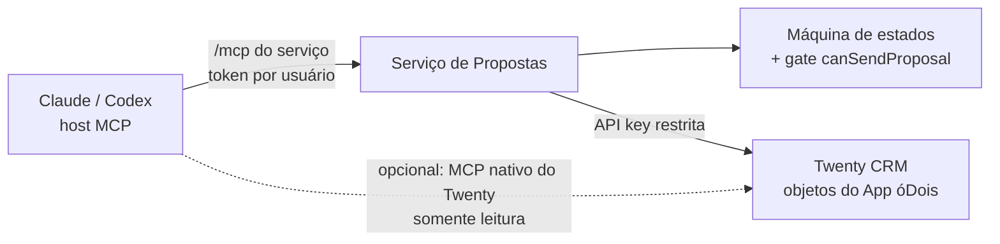

# 12 — Operação via MCP (Claude e Codex)

> Módulo proprietário óDois — arquitetura **proposta** (não implementada), sobre a infraestrutura MCP **real** do Twenty.
> Convenção: **[ATUAL]** = existe no repositório (caminho real); **[PROPOSTO]** = a construir.
> Invariante herdada dos docs 07 e 09: **LLM/agente/MCP jamais transita uma proposta para `APPROVED`, `SENDING` ou `SENT` sem confirmação humana registrada — e a aprovação em si exige identidade humana com papel de aprovador.**

## 1. [ATUAL] Infraestrutura MCP no repositório

| Componente | Descrição | Caminho real |
|---|---|---|
| Servidor MCP nativo do Twenty | Controller `@Controller('mcp')` com autenticação OAuth 2.1 (`McpAuthGuard`) | `packages/twenty-server/src/engine/api/mcp/controllers/mcp-core.controller.ts`, `guards/mcp-auth.guard.ts` |
| Protocolo | `initialize`, `tools/list`, `tools/call` (JSON-RPC) | `packages/twenty-server/src/engine/api/mcp/services/mcp-protocol.service.ts` |
| Ferramentas expostas | Tools do `ToolRegistryService` (`packages/twenty-server/src/engine/core-modules/tool-provider/`) + meta-tools `get_tool_catalog`/`execute_tool` | `services/mcp-tool-executor.service.ts` |
| Exclusões | Tools vetadas no MCP | `constants/mcp-excluded-tool-names.const.ts` |
| Annotations (hints MCP) | `readOnlyHint`/`destructiveHint`/`openWorldHint` por tool | `constants/mcp-execute-tool-annotations.const.ts` (`readOnlyHint: false, destructiveHint: true`), `constants/mcp-open-world-read-only-tool-annotations.const.ts` e `mcp-closed-world-read-only-tool-annotations.const.ts` (`readOnlyHint: true, destructiveHint: false`); tipo em `types/mcp-tool-annotations.type.ts` |
| Plugin Codex | Skills `use-twenty-mcp`, `create-app`, `develop-app`, `manage-app`, `publish-app` | `packages/twenty-codex-plugin/skills/use-twenty-mcp/SKILL.md`, referências em `packages/twenty-codex-plugin/references/use-twenty-mcp/` (`setup.md`, `result-formatting.md`) |
| Skills Claude | Pacote de skills para Claude | `packages/twenty-claude-skills/skills/twenty-record-presentation/SKILL.md` |
| Tool trigger de logic functions | Logic functions de apps podem virar tools de agente/MCP via `toolTriggerSettings` | `packages/twenty-shared/src/application/logicFunctionManifestType.ts`; execução em `packages/twenty-server/src/engine/metadata-modules/logic-function/` |

Ou seja: hosts como Claude (Desktop/Code) e Codex já conseguem se conectar ao MCP do Twenty hoje; o que **não existe** é qualquer ferramenta de propostas.

## 2. [PROPOSTO] Servidor MCP próprio do Serviço de Propostas

O **Serviço de Propostas** expõe seu próprio endpoint MCP (`POST /mcp` do serviço, Streamable HTTP, JSON-RPC — mesmo protocolo do controller nativo do Twenty citado acima), servindo exclusivamente as ferramentas de proposta.

### 2.1 Por que MCP próprio (recomendação) vs. tools no MCP do Twenty

| Critério | MCP próprio no serviço (**recomendado**) | Tools via `toolTriggerSettings` no MCP do Twenty |
|---|---|---|
| Onde vive o gate | No mesmo processo da máquina de estados e do `canSendProposal` (doc 09 §1.2) — nenhuma camada intermediária a proteger | Logic function → HTTP → serviço; superfície extra (tool registrada no workspace, credencial da function) |
| Identidade | Token emitido pelo serviço, por usuário e por host, com escopos (§6) | Identidade do workspace/agente Twenty; mapear "usuário humano aprovador" através do agente é frágil |
| Controle de catálogo | Total: só tools de proposta, annotations e elicitation definidas pelo serviço | Catálogo compartilhado com tools CRUD genéricas do `ToolRegistryService`; risco de um agente alcançar `update` direto do objeto `proposal` (mitigável por role, mas o veto precisa ser reafirmado no serviço de qualquer forma) |
| Setup do host | Uma conexão a mais no host MCP | Reusa a conexão OAuth 2.1 existente do Twenty |
| AGPL / propriedade | Código proprietário fica todo no serviço | Idem (logic function é do app), sem problema adicional |

Decisão: **MCP próprio no serviço**. Complemento opcional (Fase 4): expor no MCP do Twenty, via `toolTriggerSettings` do App óDois, apenas as tools **somente leitura** (`proposal.search`/`get`/`get_history`) para quem já está conectado ao Twenty. Ferramentas de escrita nunca são duplicadas no MCP do Twenty.

## 3. [PROPOSTO] Catálogo canônico de ferramentas

Classificações: **L** somente leitura · **B** escrita de baixo risco · **C** escrita que exige confirmação no host · **S** ação sensível com **CONFIRMAÇÃO HUMANA EXPLÍCITA obrigatória** (elicitation) **e** revalidação de identidade humana no backend.

| Ferramenta | Classe | Descrição | Parâmetros principais | Retorno |
|---|---|---|---|---|
| `proposal.search` | L | Busca propostas por filtros | `query?`, `status?`, `companyId?`, `ownerId?`, `dateRange?`, `limit?`, `cursor?` | lista paginada `{id, number, title, status, total, validUntil}` |
| `proposal.get` | L | Detalhe completo de uma proposta | `proposalId` | proposta + itens + versão corrente + URLs assinadas de prévia |
| `proposal.get_history` | L | Versões e eventos (`proposal_event`) | `proposalId`, `includeEvents?`, `includeVersions?` | linha do tempo append-only |
| `proposal.create_draft` | B | Cria rascunho (origem `MCP`) | `companyId?`, `contactId?`, `title`, `items[]` (por `catalogItemCode`), `notes?` | `{proposalId, status: DRAFT_GENERATED}` — segue o fluxo normal (prévia → revisão) |
| `proposal.update_draft` | B | Edita rascunho ⇒ **nova `proposal_version`**; se a proposta estava aprovada, dispara invalidação (doc 07 §5) | `proposalId`, `patch` (campos do snapshot) | `{versionId, versionNumber}` + aviso `APPROVAL_INVALIDATED` quando aplicável |
| `proposal.calculate` | B | Recalcula totais pelas regras determinísticas de precificação (catálogo; nunca LLM) | `proposalId` ou `items[]` ad hoc | `{subtotal, discount, total, warnings[]}` |
| `proposal.generate_preview` | B | Enfileira geração da prévia **com marca d'água** | `proposalId` | `{previewDocumentId}` + URL assinada quando pronta |
| `proposal.request_changes` | C | Registra pedido de ajustes (→ `CHANGES_REQUESTED`) | `proposalId`, `comment` | novo status |
| `proposal.request_approval` | C | Solicita aprovação da versão corrente (→ `PENDING_APPROVAL`) | `proposalId`, `versionId` | `{approvalId, snapshotHash}` |
| `proposal.reject` | C | Rejeição interna (→ `REJECTED`, terminal) | `proposalId`, `reason` | novo status |
| `proposal.approve` | **S** | Aprova a **versão exata** (→ `APPROVED`) | `proposalId`, `versionId`, `snapshotHash`, `comment?` | registro `proposal_approval` |
| `proposal.generate_final_document` | **S** | Regenera documento final a partir do snapshot aprovado (normalmente automático pós-aprovação; exposto para retry humano) | `proposalId` | `{finalDocumentId, finalDocumentHash}` |
| `proposal.send` | **S** | Autoriza envio (→ `SENDING`), somente se `canSendProposal` | `proposalId`, `confirmRecipientPhone` | `{status: SENDING}`; `409 SEND_PRECONDITION_FAILED` com condições faltantes |
| `proposal.delete_permanently` | — | **NÃO EXISTE e não deve existir.** Nenhuma tool de exclusão permanente é exposta a agentes; `proposal_version`, `proposal_approval` e `proposal_event` são append-only (doc 09 §1.3). Cancelamento operacional usa o fluxo normal (`CANCELED`) via UI humana | — | — |

Annotations MCP por classe (seguindo o padrão real dos consts do Twenty citados em §1):

| Classe | `readOnlyHint` | `destructiveHint` | `openWorldHint` | Elicitation |
|---|---|---|---|---|
| L | `true` | `false` | `false` | não |
| B | `false` | `false` | `false` | não |
| C | `false` | `false` | `false` | sim (confirmação simples no host) |
| S | `false` | `true` | `false` | **sim, obrigatória** + revalidação no backend (§4) |

## 4. [PROPOSTO] Confirmação humana: host confirma, backend revalida

Duas camadas, nunca apenas uma:

1. **Host (UX)** — tools classe C e S declaram annotations (`destructiveHint: true` nas S) e usam **MCP elicitation** para pedir confirmação explícita ao usuário do host, exibindo proposta, versão, `snapshotHash` e (no `send`) o destinatário. Hosts que não suportam elicitation recebem erro `ELICITATION_REQUIRED` nas tools S.
2. **Backend (barreira real)** — a confirmação do host é **não confiável por definição** (um host malicioso pode mentir). Portanto o Serviço de Propostas revalida sempre:
   - `proposal.approve` exige **token de usuário humano** cujo vínculo tenha papel `proposal-approver` (doc 09 §2). **Credencial de agente/serviço recebe `403 HUMAN_APPROVER_REQUIRED`** — sem exceções. O `authContext` (tipo de token, host, IP) é gravado em `proposal_approval`.
   - `proposal.send` exige token humano com papel de envio (responsável/admin) **e** passa pelo gate `canSendProposal` (doc 09 §1.2), reavaliado também dentro do `SendProposalJob` com lock distribuído.
   - Todas as transições passam pela máquina de estados única (doc 07 §1): mesmo uma tool "confirmada" não consegue `AWAITING_INTERNAL_REVIEW → SENT`, pois o par não existe na tabela de transições.
   - Tools C exigem no mínimo token humano (agente autônomo com token de agente pode usar apenas L e B).

| Credencial | L | B | C | S |
|---|---|---|---|---|
| Token humano (papel adequado) | ✔ | ✔ | ✔ (com elicitation) | ✔ (elicitation + papel `proposal-approver`/envio) |
| Token de agente (Claude/Codex autônomo) | ✔ | ✔ | ✖ `403` | ✖ `403` |
| API key técnica de integração | ✔ | ✔ | ✖ | ✖ (aprovação/envio jamais por API key — doc 09 §2.2) |

## 5. [PROPOSTO] Auditoria

Toda chamada MCP (incluindo tentativas negadas) gera `proposal_event` append-only (doc 05) com:

| Campo | Conteúdo |
|---|---|
| `origin` | `MCP` |
| `mcpHost` | identificação do host (ex.: `claude-desktop`, `claude-code`, `codex`) declarada no `initialize` + fingerprint do token |
| `actor` | identidade do token (usuário humano ou agente), tipo de credencial, escopos |
| `toolName` / `params` (redigidos) / `result` | o que foi pedido e o resultado (status, IDs; sem conteúdo sensível duplicado) |
| `correlationId` / `causationId` | encadeamento com os demais eventos do fluxo (doc 07 §1) |
| `elicitationConfirmed` | para C/S: registro de que o host reportou confirmação (informativo; a barreira é a revalidação do §4) |

Aprovações via MCP adicionalmente gravam IP e `authContext` em `proposal_approval` (doc 09 §1.1, garantia 11 análoga).

## 6. [PROPOSTO] Escopos de token e rate limiting

Escopos (emitidos pelo Serviço de Propostas por usuário × host; princípio do menor privilégio):

| Escopo | Tools liberadas |
|---|---|
| `proposals:read` | L |
| `proposals:draft` | B |
| `proposals:review` | C |
| `proposals:approve` | `proposal.approve` (exige também papel humano — o escopo sozinho não basta) |
| `proposals:send` | `proposal.send`, `proposal.generate_final_document` (idem) |

Configuração recomendada por host: Claude/Codex em uso pessoal = `read + draft + review`; `approve`/`send` só habilitados explicitamente para aprovadores que queiram operar via MCP, cientes de que a elicitation + revalidação se aplicam.

Rate limiting (padrão análogo ao grupo `RATE_LIMITING` de `packages/twenty-server/src/engine/core-modules/twenty-config/config-variables.ts`):

| Limite | Valor sugerido (MVP) |
|---|---|
| Por token, tools L | 120 req/min |
| Por token, tools B | 30 req/min |
| Por token, tools C/S | 10 req/min |
| `proposal.create_draft` por token | 20/hora (contra flood de rascunhos) |
| Resposta ao exceder | `429` + `Retry-After`; evento de auditoria |

## 7. Casos de uso

### 7.1 Consulta de status pelo Claude (classe L)

> "Claude, como está a proposta da Acme?"
> `proposal.search {query: "Acme"}` → `proposal.get {proposalId}` → resposta com status (`PENDING_APPROVAL`), total, validade e link da prévia. Nenhuma confirmação necessária; evento de auditoria gravado.

### 7.2 Criação de rascunho por comando (classe B)

> "Crie um rascunho de proposta para a Acme com 40h de consultoria."
> `proposal.create_draft` (itens resolvidos pelo catálogo; preços determinísticos via `proposal.calculate`) → proposta entra no fluxo normal: `DRAFT_GENERATED → PREVIEW_GENERATING → AWAITING_INTERNAL_REVIEW`. O agente **não** consegue avançar além da revisão humana.

### 7.3 Preparação de aprovação — nunca a aprovação autônoma

> "Prepare a proposta 42 para aprovação."
> Agente: `proposal.get` + `proposal.generate_preview` (B) e, com token humano do operador, `proposal.request_approval` (C, com elicitation). **A aprovação em si** só ocorre quando o aprovador humano — na UI do Twenty (doc 10) ou via `proposal.approve` com seu próprio token e elicitation confirmada — decide. Um agente que tente `proposal.approve` com credencial de agente recebe `403 HUMAN_APPROVER_REQUIRED`, e a tentativa fica auditada.

### 7.4 Codex (plugin)

O plugin real `packages/twenty-codex-plugin/` (skill `use-twenty-mcp`) cobre a conexão ao MCP do Twenty; para o módulo, adiciona-se a conexão ao `/mcp` do Serviço de Propostas no mesmo host. **[PROPOSTO]** skill proprietária óDois com o vocabulário das tools de proposta, nos moldes de `packages/twenty-claude-skills/skills/twenty-record-presentation/SKILL.md`.

## 8. Resumo das invariantes

1. Nenhuma tool MCP transita `→ APPROVED`, `→ SENDING` ou `→ SENT` sem identidade humana + confirmação explícita + gate do backend.
2. A confirmação do host é UX; a revalidação no Serviço de Propostas é a barreira (mesma filosofia do gate de envio, doc 09 §1.2).
3. `proposal.delete_permanently` não existe; trilha (`proposal_version`, `proposal_approval`, `proposal_event`) é append-only.
4. Toda chamada MCP é auditada com origem, host e identidade.
5. A LLM nunca define preço final (`proposal.calculate` é determinístico — doc 08) e nunca aprova/envia.
