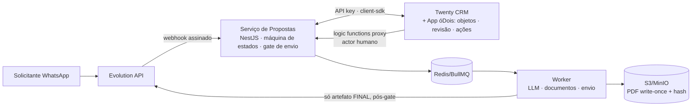

# Módulo de Propostas Comerciais óDois — Especificação Técnica e Funcional

> Especificação de um módulo **proprietário da óDois** para geração de propostas comerciais via WhatsApp, integrado ao Twenty CRM.
> **Somente documentação** — nenhum código funcional, dependência, migration ou configuração foi implementado ou alterado neste repositório.
> Análise baseada em evidências deste repositório (caminhos reais citados em cada documento).

## Visão geral

Um solicitante envia uma mensagem pelo WhatsApp pedindo uma proposta. A **Evolution API** entrega o evento ao **Serviço de Propostas** (backend proprietário), que interpreta a intenção com **LLM**, consulta clientes/contatos/serviços no **Twenty CRM**, cria um **rascunho versionado**, gera uma **prévia em PDF com marca d'água** e notifica um responsável. O responsável revisa no Twenty (via **App óDois**), edita ou pede ajustes, e só após **aprovação humana explícita de uma versão exata** o documento final é gerado e o envio pelo WhatsApp é autorizado — por um humano.

**Regra central (invariante de backend):**

> Nenhuma proposta poderá ser disponibilizada ou enviada ao solicitante sem aprovação humana explícita da versão exata que será enviada.

## Problema

Hoje a elaboração de propostas é manual: coleta de requisitos por WhatsApp, digitação, precificação, formatação e envio — lenta, sujeita a erro de preço/escopo e sem trilha de auditoria. Automação ingênua com LLM criaria o risco oposto: propostas erradas chegando a clientes sem controle.

## Objetivo

Automatizar a *preparação* (interpretação, estruturação, precificação por catálogo, documento), mantendo a *decisão* 100% humana, com versionamento, hashes de integridade, auditoria completa e envio tecnicamente impossível sem aprovação.

## Escopo

- Ingestão de pedidos via WhatsApp (Evolution API): texto (MVP), áudio e anexos (F3).
- Interpretação e extração estruturada por LLM (saída só-dados, validada por schema).
- Objetos de proposta, itens, catálogo e templates no Twenty (App óDois); revisão, ações e permissões no CRM.
- Máquina de estados com gate de aprovação; versões imutáveis com snapshot + SHA-256.
- Prévia com marca d'água; documento final gerado apenas do snapshot aprovado.
- Envio pela Evolution API somente após autorização humana, com idempotência e trilha.
- Histórico/eventos completos; MCP para operação assistida por agentes (F4, com confirmação humana nas ações sensíveis).

## Fora do escopo

- Alterações no core do Twenty (nenhum arquivo deste repositório é modificado além desta documentação).
- Pagamentos/faturamento; assinatura eletrônica (avaliada só na F4); outros canais (e-mail/SMS) de entrada.
- Envio automático de proposta em qualquer hipótese; autonomia de LLM sobre preço, margem, aprovação ou envio.

## Arquitetura resumida

Componentes: **Twenty CRM** (dados comerciais, revisão, RBAC — intocado), **App óDois** (objetos/campos/roles/views/front components/ações — instalado via `twenty app:publish --private`), **Serviço de Propostas** (webhooks, orquestração, versões/hashes/aprovação/envio), **Worker** (LLM, PDF, envio), **Evolution API** (transporte WhatsApp), **LLM** (interpretação, sem autoridade).

## Principais decisões

1. **Core do Twenty intocado** — extensão via plataforma oficial de Apps + serviço externo (mitiga custo de upgrade e exposição AGPL).
2. **Serviço em NestJS/TypeScript** — o repo é 100% TypeScript; padrões (BullMQ, storage, HMAC, worker) replicados, não copiados.
3. **Fonte da verdade dividida** — comercial no Twenty; técnica/imutável (versões, hashes, aprovações, eventos, mensagens) no Postgres do serviço.
4. **Gate de envio único no backend** (`canSendProposal`), reavaliado também dentro do job de envio, com lock; frontend nunca é barreira.
5. **LLM confinada ao worker, saída estruturada validada** — sem tools de escrita/aprovação/envio.
6. **Prévia sempre com marca d'água; final sempre do snapshot aprovado; hashes conferidos no envio.**
7. **Transição `AWAITING_INTERNAL_REVIEW → SENT` inexistente por construção** na máquina de estados.

## Riscos principais

| Risco | Mitigação |
|---|---|
| Breaking changes na plataforma de Apps do Twenty (recente) | versão fixada, workspace de homologação, apenas APIs públicas do SDK |
| Bloqueio do número WhatsApp (Evolution é gateway não-oficial) | número dedicado; plano B WhatsApp Cloud API; fluxo manual como contingência |
| Qualidade da extração LLM em pt-BR | revisão humana obrigatória; limiares de confiança; calibração no piloto |
| Burla do fluxo por edição direta no CRM | `fieldPermission` read-only em `status`/hashes + webhook de reconciliação + autoridade no serviço |
| Licenciamento AGPL | serviço como obra separada; revisão jurídica registrada (doc 15) |

## Fases

1. **F1 — MVP**: texto → webhook → LLM → rascunho no Twenty → prévia com marca d'água → revisão → aprovação → envio autorizado manualmente.
2. **F2**: perguntas complementares, catálogo/precificação/margens, templates, versionamento e comparação.
3. **F3**: áudio + transcrição, anexos, DOCX, tracking de visualização, aceite.
4. **F4**: alçadas e múltiplos aprovadores, assinatura eletrônica, contratos/projetos, MCP para Claude/Codex.

Detalhes, critérios de aceite e riscos por fase: `14-implementation-roadmap.md`.

## Índice dos documentos

| Doc | Conteúdo |
|---|---|
| [00-project-analysis.md](./00-project-analysis.md) | Análise do repositório com evidências; lacunas; componentes reutilizáveis |
| [01-current-architecture.md](./01-current-architecture.md) | Arquitetura atual do Twenty (estado do repo) |
| [02-impact-map.md](./02-impact-map.md) | Mapa de impacto: reutilizar/estender/criar; nada alterado no core |
| [03-functional-spec.md](./03-functional-spec.md) | 30 fluxos funcionais detalhados + fluxo ponta a ponta |
| [04-technical-spec.md](./04-technical-spec.md) | Arquitetura proposta, responsabilidades, diagramas, decisões |
| [05-data-model.md](./05-data-model.md) | Objetos Twenty + tabelas do serviço, ER, snapshot canônico, fontes da verdade |
| [06-api-contracts.md](./06-api-contracts.md) | Endpoints REST do serviço + catálogo de eventos internos |
| [07-state-machine.md](./07-state-machine.md) | Máquina de estados (21 estados), transições permitidas/proibidas |
| [08-llm-spec.md](./08-llm-spec.md) | Uso da LLM: schema de saída, limites, injeção, custos, LGPD |
| [09-approval-and-security.md](./09-approval-and-security.md) | Política de aprovação obrigatória, papéis, permissões, segurança |
| [10-twenty-app-spec.md](./10-twenty-app-spec.md) | App óDois: objetos, roles, front components, ações, logic functions |
| [11-evolution-api-integration.md](./11-evolution-api-integration.md) | Integração Evolution API: webhooks, envio, mídia, falhas |
| [12-mcp-spec.md](./12-mcp-spec.md) | Ferramentas MCP, classificação de risco, confirmação humana |
| [13-test-strategy.md](./13-test-strategy.md) | Estratégia de testes + cenários de prova da regra central (gate de CI) |
| [14-implementation-roadmap.md](./14-implementation-roadmap.md) | Fases, entregáveis, dependências, critérios de aceite |
| [15-open-questions.md](./15-open-questions.md) | Decisões pendentes (negócio, técnica, jurídico) e conflitos registrados |
